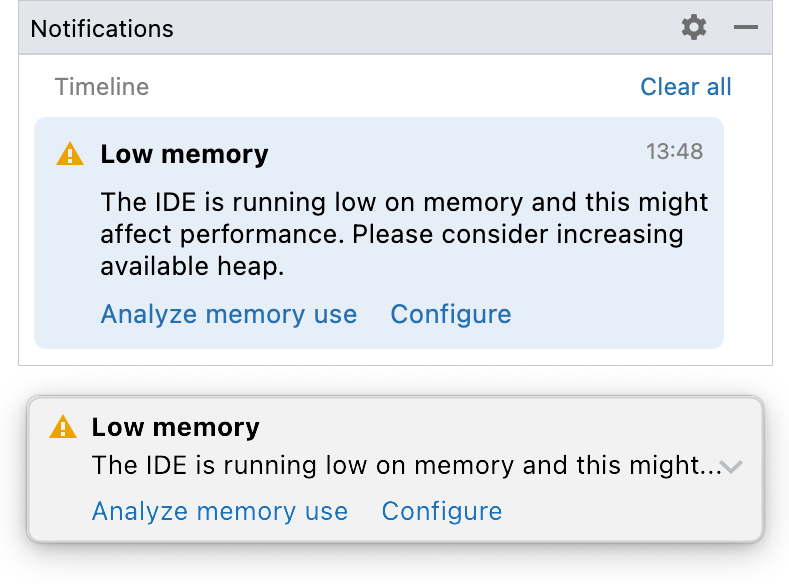
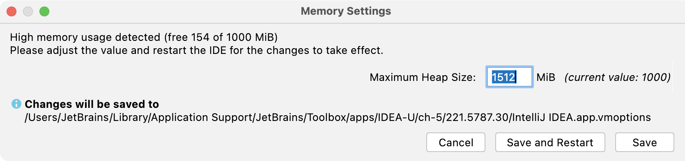
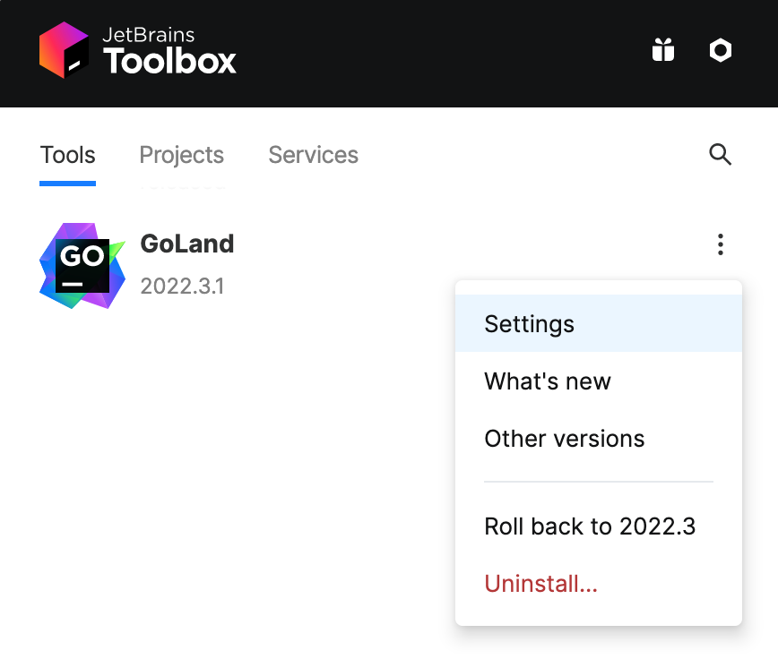

+++
title = "Notifications"
weight = 30
date = 2023-06-17T19:06:58+08:00
type = "docs"
description = ""
isCJKLanguage = true
draft = false
+++
# Increase the memory heap of the IDE -  增加IDE的内存堆

https://www.jetbrains.com/help/go/increasing-memory-heap.html

Last modified: 11 April 2023

最后修改日期：2023年4月11日

Help | Change Memory Settings

​	运行GoLand的Java虚拟机（JVM）分配了一些预定义的内存量。默认值取决于平台。如果您遇到了减速问题，您可能希望增加内存堆的大小。 

1. 从主菜单中选择 Help | Change Memory Settings。
2. 设置您想要分配的必要内存量，并点击 Save and Restart。

​	此操作将更改JVM用于运行GoLand的 `-Xmx` 选项的值。重新启动GoLand以使新的设置生效。

> ​	Change Memory Settings 操作从 GoLand 版本 2019.2 开始提供。对于之前的版本或者如果IDE崩溃，您可以手动更改 `-Xmx` 选项的值，如[JVM options](https://www.jetbrains.com/help/go/tuning-the-ide.html#configure-jvm-options)中所述。

​	如果在垃圾回收后，可用堆内存量小于最大堆大小的5%，GoLand也会发出警告：

Click Configure to increase the amount of memory allocated by the JVM. If you are not sure what would be a good value, use the one suggested by GoLand.

​	点击 Configure 来增加JVM分配的内存量。如果您不确定什么值是好的，请使用GoLand建议的值。

​	点击 Save and Restart，并等待GoLand以新的内存堆设置重新启动。

### 启用内存指示器

​	GoLand可以在[状态栏](https://www.jetbrains.com/help/go/guided-tour-around-the-user-interface.html#status-bar)中显示已使用的内存量。用它来判断要分配多少内存。 

- 右键点击状态栏，选择 Memory Indicator。

## Toolbox App

​	如果您正在使用Toolbox App，您可以在不启动IDE的情况下更改特定IDE实例的最大分配堆大小。

1. 打开Toolbox App，点击相关IDE实例旁边的设置图标，选择 Settings。

   

3. 在实例设置选项卡上，展开 Configuration，并在 Maximum heap size 字段中指定堆大小。

​	如果IDE实例当前正在运行，新的设置将在您重新启动它后生效。

​	如果您使用的是Toolbox App不管理的独立实例，并且无法启动它，则可以手动更改控制分配内存量的 `-Xmx` 选项。创建默认[JVM options](https://www.jetbrains.com/help/go/tuning-the-ide.html#configure-jvm-options)文件的副本，并在其中更改 `-Xmx` 选项的值。