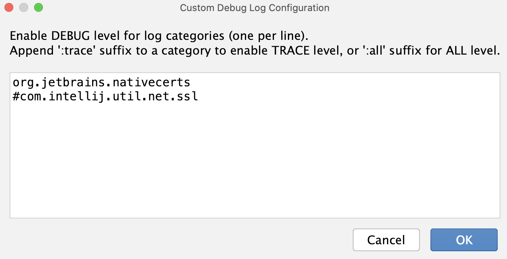

+++
title = "受信任的根证书"
weight = 40
date = 2023-06-17T19:06:58+08:00
type = "docs"
description = ""
isCJKLanguage = true
draft = false

+++
# Trusted root certificates - 受信任的根证书

https://www.jetbrains.com/help/go/ssl-certificates.html

Last modified: 08 March 2023

最后修改日期：2023年3月8日

​	受信任的证书建立了一个信任链，用于验证由受信任的根证书签名的其他证书，例如，用于与Web服务器建立安全连接。

​	GoLand从系统信任存储库获取受信任的根证书列表，并且可以通过[GoLand设置](https://www.jetbrains.com/help/go/settings-tools-server-certificates.html)进行自定义存储。

​	如果您所在的企业环境使用自定义证书，GoLand默认信任这些证书，无需进行额外配置。

​	在验证证书时，GoLand还会检查Windows、macOS和Linux的系统信任存储库。

## 工作原理





​	在Windows下，该代码调用系统函数来获取系统范围、用户特定或组策略分发的受信任证书。

​	有关更多信息，请参阅[JetBrains Windows Trusted Certificates库](https://github.com/JetBrains/jvm-native-trusted-roots/blob/trunk/src/main/java/org/jetbrains/nativecerts/win32/Crypt32Ext.java)。





​	在macOS X下，该代码调用系统函数来获取系统范围和用户特定的自定义受信任证书。

​	有关更多信息，请参阅[JetBrains macOS Trusted Certificates库](https://github.com/JetBrains/jvm-native-trusted-roots/blob/trunk/src/main/java/org/jetbrains/nativecerts/mac/SecurityFrameworkUtil.java)。





​	在Linux下，导入以下位置的.crt（PEM）格式的所有证书：

- `/etc/ssl/certs/*`
- `/etc/pki/tls/certs/*`
- `/system/etc/security/cacerts/*`
- `/etc/ssl/certs/ca-certificates.crt`
- `/etc/pki/tls/certs/ca-bundle.crt`
- `/etc/ssl/ca-bundle.pem`
- `/etc/pki/tls/cacert.pem`
- `/etc/pki/ca-trust/extracted/pem/tls-ca-bundle.pem`
- `/etc/ssl/cert.pem`

​	有关更多信息，请查看[JetBrains Linux Trusted Certificates](https://github.com/JetBrains/jvm-native-trusted-roots/blob/trunk/src/main/java/org/jetbrains/nativecerts/linux/LinuxTrustedCertificatesUtil.java)库。



	

## 日志和诊断

​	如果遇到证书问题，您可以通过启用以下调试类别快速进行故障排除： 

- `org.jetbrains.nativecerts`
- `#com.intellij.util.net.ssl`

### 在GoLand中收集附加日志 

1. 从主菜单中选择 Help | Diagnostic Tools | Debug Log Settings。

2. 在打开的对话框中，添加[调试类别](https://www.jetbrains.com/help/go/ssl-certificates.html#debug_categories)，然后单击确定以保存更改。

   

   

6. 复现问题（Reproduce the issue）。

4. 从主菜单中选择 Help | Collect Logs and Diagnostic Data 以收集日志。

   将日志与问题的详细描述和重现场景发送给我们的[支持团队](https://www.jetbrains.com/support/)。

   > ​	注意，日志可能包含私人用户信息。

### 查找IDE日志文件 

- 从主菜单中选择 Help | Show logs in Finder。该菜单项取决于您使用的操作系统。例如，对于Windows，它将是 Show logs in Explorer。

  日志文件名为**idea.log**，并根据文件大小进行轮转。在附加日志到问题报告时，建议您将最新的几个日志文件（`idea.log`、`idea.log.1`、`idea.log.2`、`idea.log.3`）进行压缩（.zip）并发送。

  您还可以使用Collect Logs and Diagnostic Data选项生成包含所有日志文件（包括构建日志和自动线程转储）的`.zip` 文件。

## 证书手动安装

​	如果您使用像`mitmproxy`或`fiddler`这样解密所有TLS流量的代理服务器，您可以将其自签名证书导入到系统中，这样本地机器上的所有应用程序（包括GoLand）都将信任它。但是，这可能存在潜在的不安全性，因为您可以使用该证书的私钥冒充任何网站。

> ​	您还可以根据[服务器证书](https://www.jetbrains.com/help/go/settings-tools-server-certificates.html)部分的说明添加证书。但是，请注意，它仅适用于特定的IDE，不适用于其他IDE或整个操作系统。

​	生成证书后，请使用以下其中一种方法将其添加到信任存储库中：





> ​	需要具备管理员权限才能完成此过程。如果您不是计算机的管理员，请联系系统管理员。

安装根证书 

1. 点击开始，点击开始搜索，键入mmc，然后按Enter键。
2. 如果出现用户账户控制屏幕并提示您对计算机进行更改，请点击是。
3. 在文件菜单中，选择添加/删除控制台。
4. 在可用控制台中，点击证书，然后点击添加。
5. 在此控制台将始终管理证书的选项中，点击计算机帐户，然后点击下一步。
6. 点击本地计算机，然后点击完成。
7. 如果您没有要添加到控制台的其他控制台，请点击确定返回到控制台根屏幕。
8. 在控制台树中，双击证书。
9. 右键点击受信任的根证书颁发机构存储。
10. 点击导入以导入证书，并按照证书导入向导中的步骤进行操作。





安装根证书 

1. 通过在Spotlight上搜索并打开Keychain Access（点击位于右上角的放大镜），打开Keychain Access。
3. 选择File | Import Items，并导航到下载的文件。
5. 在Destination Keychain字段中，选择System 并点击Open。
7. 在Keychain Access中右键点击证书，然后选择Get Info。
9. 展开Trust 部分，在使用此证书时下选择始终信任。





安装根证书

1. 以`.crt`（PEM）格式生成证书。

3. 将证书添加到[列出的目录](https://www.jetbrains.com/help/go/ssl-certificates.html#linux_directories)之一。

   例如，您可以使用`/etc/ssl/certs/`或`/etc/pki/tls/certs/`目录。





​	