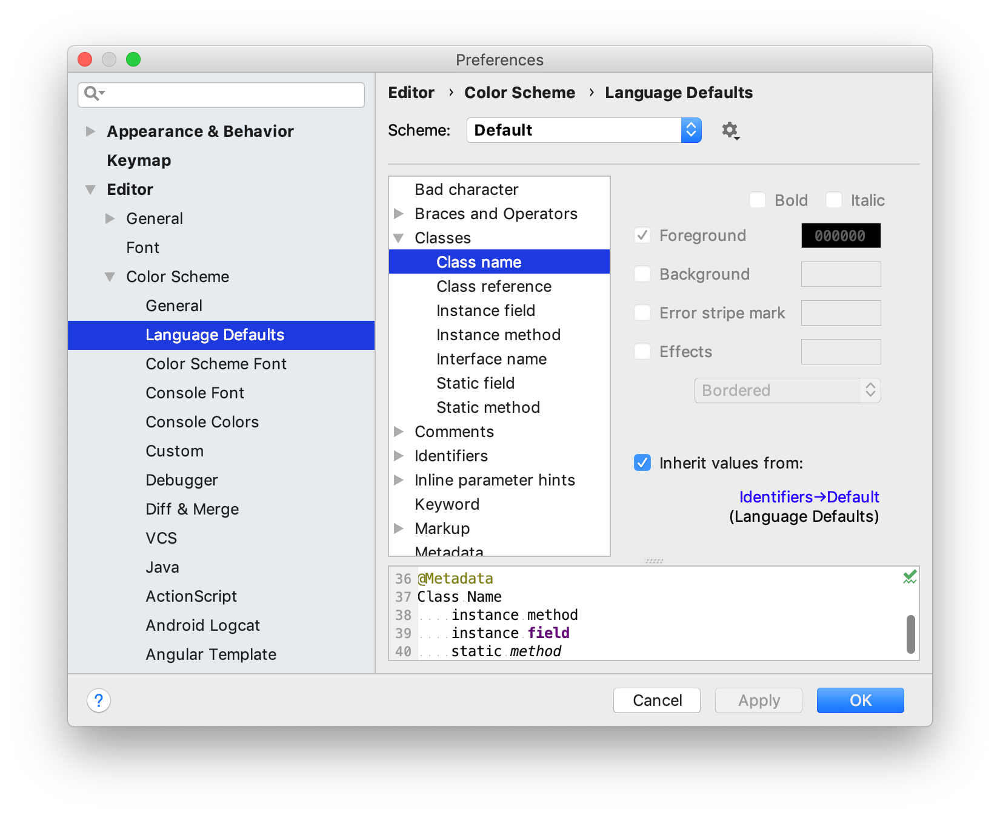

+++
title = "颜色和字体"
weight = 20
date = 2023-06-17T19:06:58+08:00
type = "docs"
description = ""
isCJKLanguage = true
draft = false
+++
# Colors and fonts - 颜色和字体

https://www.jetbrains.com/help/go/configuring-colors-and-fonts.html

Last modified: 17 March 2023

最后修改日期：2023年3月17日

​	作为开发人员，您会使用许多文本资源：编辑器中的源代码、搜索结果、调试器信息、控制台输入和输出等。颜色和字体样式用于格式化这些文本，并帮助您一目了然地理解它们。

​	GoLand允许您选择可配置的颜色方案，定义IDE文本中使用的颜色和字体。

​	您可以使用预定义的颜色方案或根据自己的喜好进行自定义。还可以共享方案。

### 选择颜色方案

1. 按Ctrl+Alt+S打开IDE设置，然后选择Editor | Color Scheme。

3. 使用方案列表选择一个颜色方案。

3. 

默认情况下，有以下预定义的颜色方案： 

- 经典亮色：为macOS亮色和Windows 10亮色界面主题设计
- Darcula：为Darcula界面主题设计
- 高对比度：为高对比度界面主题设计（推荐给视力有缺陷的用户）
- IntelliJ亮色：为IntelliJ亮色界面主题设计

> ​	如果安装了带有颜色方案的插件，该方案将添加到预定义方案列表中。有关更多信息，请参阅[共享颜色方案](https://www.jetbrains.com/help/go/configuring-colors-and-fonts.html#share-color-scheme)。

## 自定义颜色方案

​	您可以自定义预定义的颜色方案，但建议为您的自定义颜色和字体设置创建副本：

### 复制颜色方案

1. 按Ctrl+Alt+S打开IDE设置，然后选择Editor | Color Scheme。
3. 选择一个颜色方案，点击，然后点击Duplicate。
4. （可选）要重命名自定义方案，点击 ，然后选择Rename。

> ​	预定义颜色方案以粗体字显示。如果您自定义了预定义的颜色方案，它将以蓝色显示。要将预定义颜色方案恢复为默认设置，请点击，然后选择Restore Defaults。您无法删除预定义颜色方案。
>

​	要定义颜色和字体设置，请打开IDE设置的Editor | Color Scheme页面，按Ctrl+Alt+S。Editor | Color Scheme下的设置被分为多个部分。例如，General部分定义基本的编辑器颜色，如沟槽、行号、错误、警告、弹出窗口、提示等等。Language Defaults部分包含常见的语法高亮设置，默认应用于所有支持的编程语言。在大多数情况下，只需配置Language Defaults并根据需要对特定语言进行调整即可。要更改元素的继承颜色设置，清除Inherit values from复选框。

## 语义高亮

​	默认情况下，颜色方案为源代码中的保留字和其他符号定义语法高亮显示：运算符、关键字、建议、字符串字面量等等。如果您有一个带有许多参数和局部变量的函数或方法，在一瞥之间很难区分它们。您可以使用语义高亮将不同的颜色分配给每个参数和局部变量。

### 启用语义高亮

1. 按Ctrl+Alt+S打开IDE设置，然后选择Editor | Color Scheme | Language Defaults | Semantic highlighting。
3. 选择语义高亮复选框，并在需要时自定义颜色范围。

## 共享颜色方案

​	如果您习惯使用特定的颜色方案，可以将其导出到另一个安装程序中进行导入。您还可以与其他开发人员共享颜色方案。

### 将颜色方案导出为XML 

​	GoLand可以将您的颜色方案设置保存为具有**.icls**扩展名的XML文件。然后，您可以将该文件导入到另一个安装程序中。 

1. 按Ctrl+Alt+S打开IDE设置，然后选择Editor | Color Scheme。
3. 从方案列表中选择一个颜色方案，点击，然后点击Export，选择IntelliJ IDEA color scheme (.icls)。
4. 指定文件的名称和位置，然后保存。

### 将颜色方案导出为插件

​	该插件可以上传到[插件仓库](https://www.jetbrains.com/help/go/managing-plugins.html#install_plugin_from_repo)，供其他人安装使用。与XML文件相比，此格式具有几个优点，包括元数据、反馈、下载统计信息和版本控制（当您上传插件的新版本时，用户将收到通知）。

1. 按Ctrl+Alt+S打开IDE设置，然后选择Editor | Color Scheme。
3. 从方案列表中选择一个颜色方案，点击，然后点击Export，选择Color scheme plugin .jar。
4. 在创建Color Scheme Plugin对话框中，指定版本详细信息和供应商信息，然后点击OK。

> ​	安装带有颜色方案的插件后，该方案将添加到预定义方案列表中。

### 导入颜色方案

1. 按Ctrl+Alt+S打开IDE设置，然后选择Editor | Color Scheme。
3. 从方案列表中选择一个颜色方案，点击，然后点击Import Scheme。

## 字体

​	要自定义编辑器中使用的默认字体，请按Ctrl+Alt+S打开IDE设置，然后选择Editor | Font。默认情况下，此字体在所有颜色方案中使用和继承。有关更多信息，请参阅[Font](https://www.jetbrains.com/help/go/settings-editor-font.html)。

> ​	要配置GoLand界面（工具窗口、工具栏、菜单等）使用的字体，请打开IDE设置Ctrl+Alt+S，然后转到Appearance & Behavior | Appearance。从“Use custom font”列表中选择字体，并在“Size”字段中指定字体大小。

### 自定义颜色方案字体

​	您可以为当前方案设置不同的字体。

> ​	如果您打算共享您的方案或在可能不支持所选字体的其他平台上使用它，不建议这样做。在这种情况下，请使用默认的全局字体设置。 

1. 按Ctrl+Alt+S打开IDE设置，然后选择Editor | Color Scheme | Color Scheme Font。
3. 选择“Use color scheme font instead of the default”复选框。

### 自定义控制台字体

​	默认情况下，控制台中的文本使用与颜色方案相同的字体。要在控制台中使用不同的字体： 

1. 按Ctrl+Alt+S打开IDE设置，然后选择Editor | Color Scheme | Console Font。
3. 选择“Use console font instead of the default”复选框。

### 安装新的自定义字体

​	GoLand可以使用操作系统或用于运行GoLand的[Java运行时](https://www.jetbrains.com/help/go/switching-boot-jdk.html)中可用的任何字体。如果您想添加其他字体，需要在操作系统中安装它，并在重新启动后，GoLand将会发现它。

1. 下载所需的TTF字体包并解压缩以提取字体文件（**.ttf**）。为了使字体正常工作，它应该至少有4个文件：Normal、Bold、Italic和Bold Italic。

   

   

   

   

   

   Install

   

   

   Install Font

   

   

   ~/.local/share/fonts/usr/share/fonts`fc-cache -f -v`

   

   

3. 重新启动GoLand，然后在IDE设置Ctrl+Alt+S的Editor | Font页面上选择已安装的字体。

## 提高效率的提示

### 查看当前符号的颜色方案设置

- 将插入符号放置在必要的符号上，按Ctrl+Shift+A，在Jump to Colors and Fonts操作中搜索并执行它。

​	这将打开与插入符号下的相关颜色方案设置。

### 查看编辑器当前使用的字体

- 按Ctrl+Shift+A，在Show Fonts Used by Editor操作中搜索并执行它。

​	这将打开“编辑器字体”对话框，显示当前在编辑器中使用的字体。

### 使用快速切换器

1. 按下Ctrl+`键，或从菜单中选择View | Quick Switch Scheme。
3. 在切换弹出窗口中，选择Editor Color Scheme，然后选择所需的颜色方案。

> ​	Jump to Colors and Fonts和Show Fonts Used by Editor这两个操作都没有默认的快捷键。要为一个操作分配快捷键，选择它在查找操作弹出窗口中，然后按Alt+Enter键。