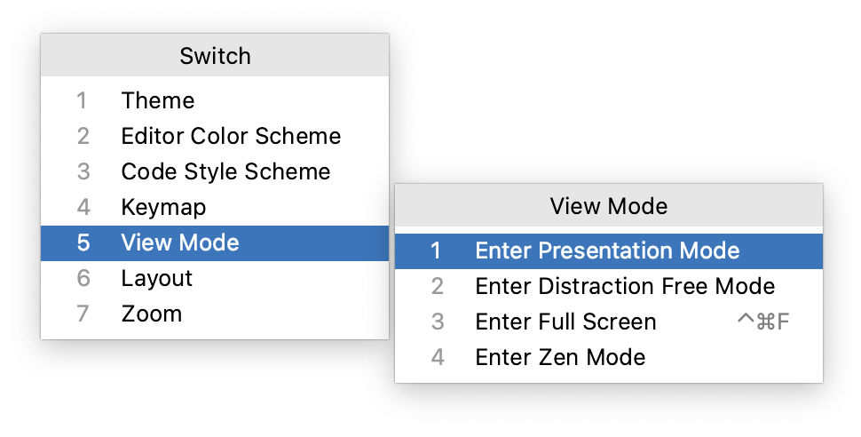

+++
title = "IDE viewing modes"
weight = 50
date = 2023-06-17T19:06:58+08:00
type = "docs"
description = ""
isCJKLanguage = true
draft = false
+++
# IDE viewing modes

https://www.jetbrains.com/help/go/ide-viewing-modes.html

Last modified: 21 March 2023

GoLand lets you switch between several viewing modes for different usage styles and scenarios. For example, when you need to focus on the code or present to an audience.

By default, the editor text in the Distraction-free and Zen viewing modes is centered vertically and the text column width corresponds to the Hard wrap at option on the Editor | Code Style page of the IDE settings Ctrl+Alt+S. This means that if your code will be centered when formatted properly, but if there are long unwrapped lines, the text might go beyond the viewport while there is a large margin on the left. In such cases, you may want to decrease the left margin using the Left margin in distraction free mode option on the Advanced Settings page of the IDE settings Ctrl+Alt+S.

### Toggle viewing modes on and off

- Go to View | Appearance and select Enter <viewing mode> or Exit <viewing mode>.

- Use the quick switcher:

  1. Go to View | Quick Switch Scheme (or press Ctrl+`).
  2. In the Switch popup, select View Mode and then select Enter <viewing mode> or Exit <viewing mode>.

  

- Use [Find Action](https://www.jetbrains.com/help/go/searching-everywhere.html): press Ctrl+Shift+A, and start typing the name of the viewing mode. Then select Enter <viewing mode> or Exit <viewing mode> from the list and press Enter.

- Map actions that toggle viewing modes on and off to your [preferred key combinations](https://www.jetbrains.com/help/go/configuring-keyboard-and-mouse-shortcuts.html).