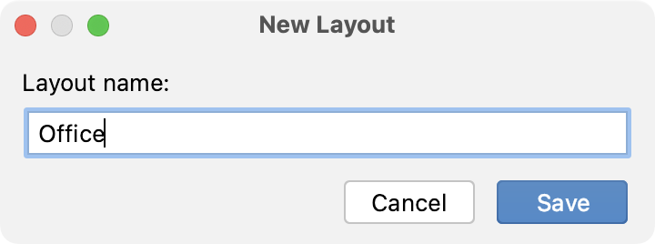

+++
title = "布局"
weight = 40
date = 2023-06-17T19:06:58+08:00
type = "docs"
description = ""
isCJKLanguage = true
draft = false

+++
# Layouts 布局

https://www.jetbrains.com/help/go/tool-window-layouts.html#restore

Last modified: 18 April 2023

最后修改：2023年4月18日

Window | Layouts

​	GoLand允许您[移动工具窗口](https://www.jetbrains.com/help/go/manipulating-the-tool-windows.html#move-tool-windows)，[更改其视图模式](https://www.jetbrains.com/help/go/viewing-modes.html)，[调整其大小](https://www.jetbrains.com/help/go/manipulating-the-tool-windows.html#resize-tool-windows)并将这些设置保存为布局。您可以拥有多个工具窗口布局，并在需要时进行切换。

​	当您开始使用IDE时，有一个名为`Custom`的现有布局具有出厂设置。您可以修改它或为您偏好的工具窗口排列创建新的布局。

### 保存工具窗口的排列

​	一旦您[移动](https://www.jetbrains.com/help/go/manipulating-the-tool-windows.html#move-tool-windows)、[调整大小](https://www.jetbrains.com/help/go/manipulating-the-tool-windows.html#resize-tool-windows)工具窗口或[更改其视图模式](https://www.jetbrains.com/help/go/viewing-modes.html)，您可以更新当前使用的设置，或将这些更改保存为新的布局。

1. 从主菜单中选择Window | Layouts。

2. 选择以下选项之一：

   - 在当前布局中保存更改：更新当前布局。
   - 将当前布局另存为新布局：将排列保存为新布局。在打开的对话框中为新布局命名。

   

### 在布局之间切换

- 从主菜单中选择Window | Layouts，指向所需布局，然后选择 Apply。

  当前选定的布局将标有`(Current)`。

  

- 使用快速切换器：按下Ctrl+`（View | Quick Switch Scheme），单击"Layout"，然后选择要应用的布局的名称。

### 恢复工具窗口的排列

​	您可以重置当前布局中的更改。 

- 从主菜单中选择Window | Layouts | Restore Current Layout 或按下Shift+F12。

​	所有最近的更改将被重置为上次保存的布局状态。

### 编辑布局

- 从主菜单中选择Window | Layouts，指向所需布局，然后选择"重命名"或"删除"。

  您不能删除当前布局。
