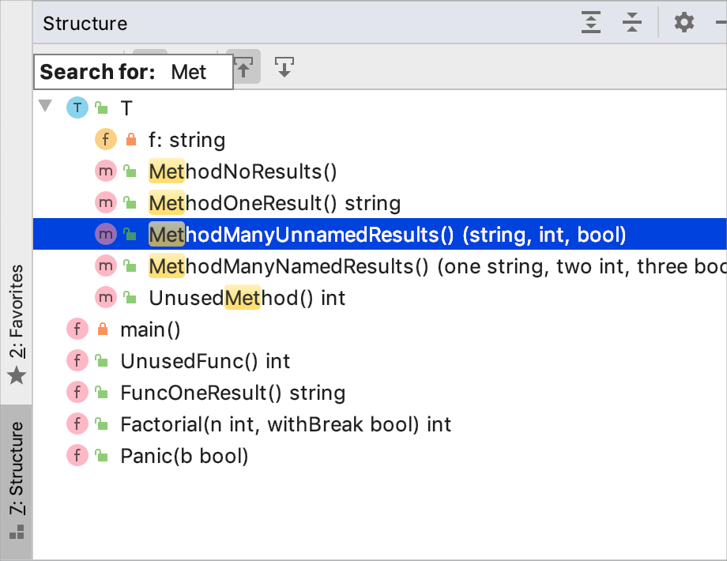

+++
title = "工具窗口中的快速搜索"
weight = 50
date = 2023-06-17T19:06:58+08:00
type = "docs"
description = ""
isCJKLanguage = true
draft = false

+++
# Speed search in tool windows - 工具窗口中的快速搜索

https://www.jetbrains.com/help/go/speed-search-in-the-tool-windows.html

Last modified: 03 May 2023

最后修改：2023年5月3日

​	快速搜索帮助您快速在工具窗口中查找项目：在项目工具窗口中查找文件或文件夹，在结构工具窗口中查找成员，在提交工具窗口中查找变更列表（Alt+0），在TODO列表中查找项目等等。

3. 选择一个工具窗口、树形结构、列表或弹出窗口。

4. 开始输入项目名称，例如文件、类或字段的名称。当您输入时，工具窗口上方会显示一个字段，显示已输入的字符，并且选择将移动到与指定字符串匹配的第一项。字符串的匹配部分会被突出显示。

   

5. 如果有多个项与模式匹配，请使用向上和向下箭头键在它们之间移动。按Enter键打开所选项。按Esc键隐藏搜索字段。

> ​	快速搜索仅适用于展开的节点。它不会突出显示折叠节点中的匹配项。