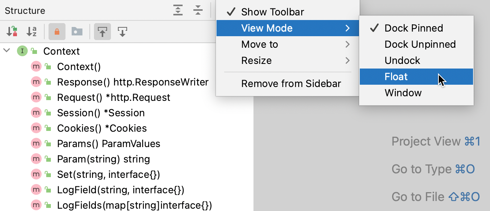

+++
title = "Tool window view modes"
weight = 30
date = 2023-06-17T19:06:58+08:00
type = "docs"
description = ""
isCJKLanguage = true
draft = false
+++
# Tool window view modes - 工具窗口视图模式

https://www.jetbrains.com/help/go/viewing-modes.html

Last modified: 11 January 2023

最后修改：2023年1月11日

Window | Active Tool Window | View Mode

​	默认情况下，工具窗口附加在主窗口的边缘，并始终可见。您可以更改特定工具窗口的视图模式，例如，使其仅在活动时可见，或将其从工具窗口栏中分离出来。

### 更改工具窗口的视图模式

- 从主菜单中选择Window | Active Tool Window | View Mode，然后选择视图模式。

- 或者，在工具窗口的[标题栏](https://www.jetbrains.com/help/go/tool-windows.html#general-tool-windows-layout)上，单击，选择"视图模式"，然后选择视图模式。

  

​	以下工具窗口视图模式可用：

- 固定停靠：当工具窗口附加到工具窗口栏时，默认视图模式，始终与编辑器和其他固定的工具窗口一起可见。

  

  

  

  

  

  

- 非固定停靠：工具窗口附加到工具窗口栏，但仅在活动时可见。当失去焦点时，它不会遮挡编辑器或其他工具窗口。

  

  

  

  

  

- 取消停靠：工具窗口附加到工具窗口栏，当活动时会覆盖部分编辑器或其他工具窗口。当另一个工具窗口处于活动状态时，它不可见。

  

  

  

  

  

- 浮动：工具窗口从工具窗口栏中分离，浮动在主窗口之上。它仅与主项目窗口一起可见。如果需要，您可以将其移动到不同的监视器或桌面。

  

  

  

  

- 窗口：工具窗口充当独立的应用程序窗口。您可以独立于主项目窗口查看它，并将其移动到不同的监视器或桌面。

  

  

  

