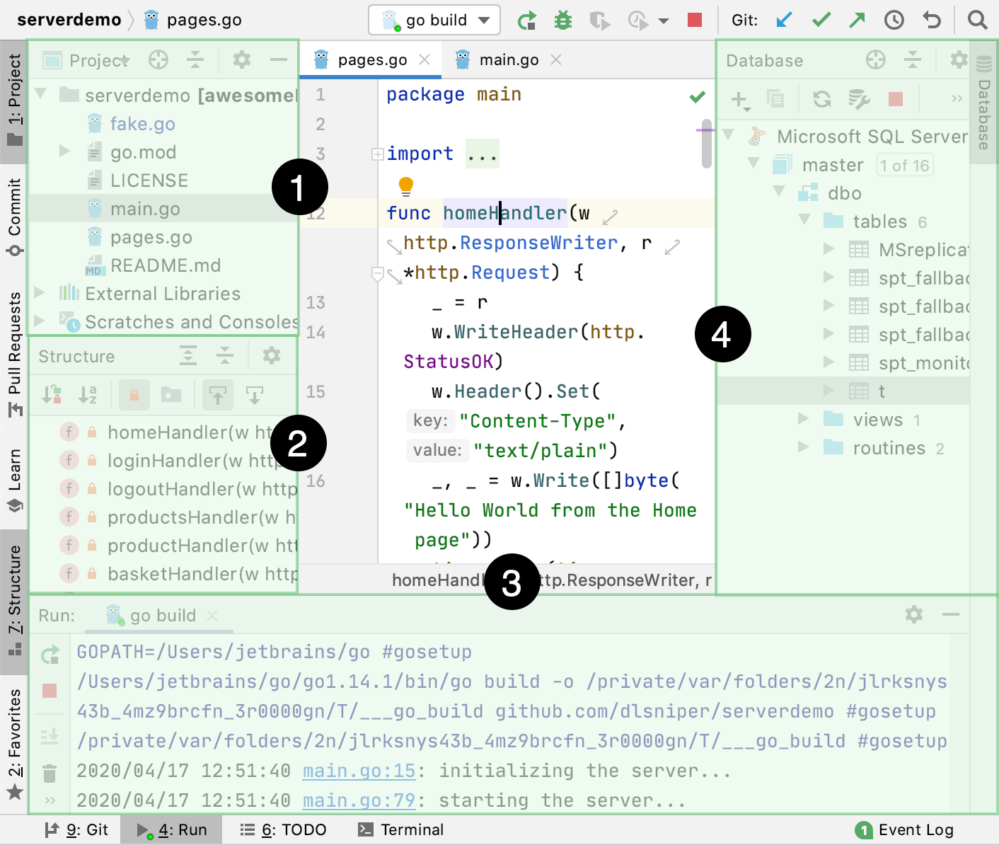
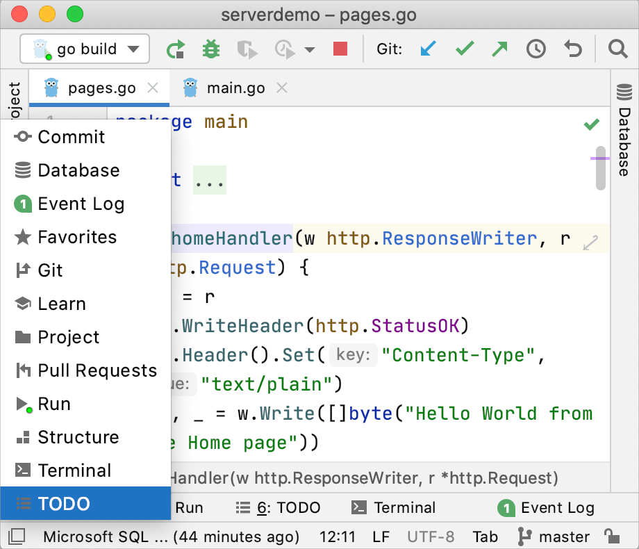
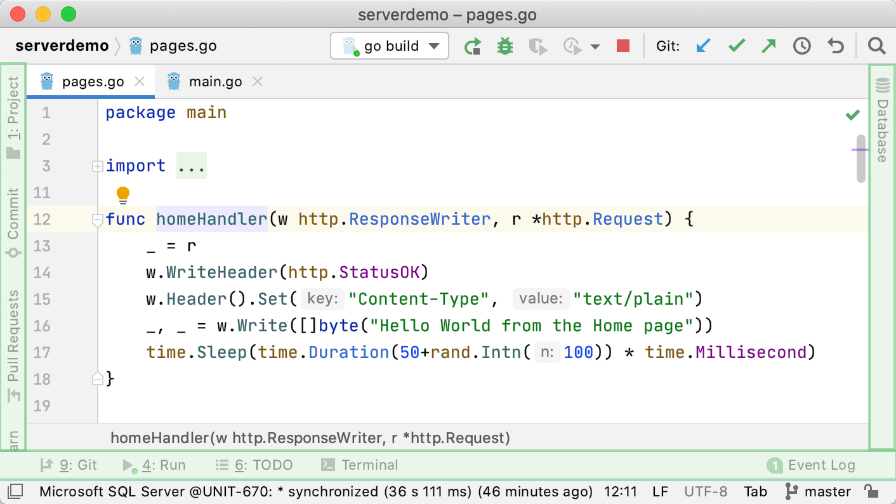
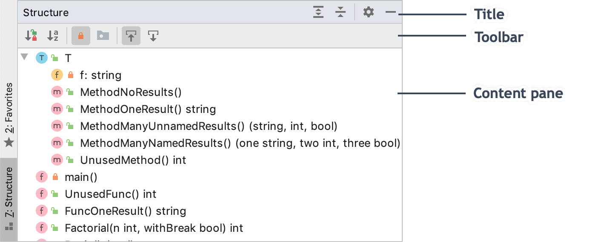

+++
title = "Tool windows"
weight = 20
date = 2023-06-17T19:06:58+08:00
type = "docs"
description = ""
isCJKLanguage = true
draft = false
+++
# Tool windows - 工具窗口

https://www.jetbrains.com/help/go/tool-windows.html#general-tool-windows-layout

Last modified: 15 November 2022

最后修改日期：2022年11月15日

View | Tool Windows

​	工具窗口提供对开发任务的访问：查看项目结构、运行和调试应用程序、与版本控制系统和其他外部工具集成、代码分析、搜索、导航等等。默认情况下，工具窗口附加在主窗口的底部和侧边。但是，您可以重新排列甚至将其分离为独立的窗口，例如在另一个监视器上使用。

1. 项目工具窗口
6. 结构工具窗口
7. 运行工具窗口
8. 数据库工具窗口

​	某些工具窗口始终可用，某些在特定插件启用时激活，某些仅在执行特定操作时出现（例如运行、调试和查找）。

### 打开工具窗口

​	要显示或隐藏工具窗口，请执行以下操作之一：

- 从主菜单中，选择View | Tool Windows下的工具窗口。

- 使用相应的快捷键，例如Alt+1打开项目工具窗口。如果没有工具窗口的快捷键，您可以按照[键盘快捷键](https://www.jetbrains.com/help/go/configuring-keyboard-and-mouse-shortcuts.html)中的说明分配快捷键。

- 单击[工具窗口栏](https://www.jetbrains.com/help/go/tool-windows.html#bars_and_buttons)上的相应工具窗口按钮。

  

- 将鼠标指针悬停在主窗口左下角的快速访问按钮 / 上，并选择一个工具窗口。

  

### 隐藏当前活动的工具窗口

- 按下Shift+Escape或从主菜单中选择Window | Active Tool Window | Hide Active Tool Window。

  要显示隐藏的工具窗口，请使用分配给它的快捷键（转到View | Tool Windows以查看带有快捷键的工具窗口的完整列表）。

​	为了将注意力集中在编辑器上，您可以隐藏所有工具窗口，然后在需要时快速恢复所有已隐藏的窗口。

### 隐藏或恢复所有工具窗口

- 按下Ctrl+Shift+F12。
- 双击要最大化的编辑器选项卡。只有在IDE设置（Ctrl+Alt+S）的"高级设置"页面上启用了使用双击编辑器选项卡执行'隐藏所有工具窗口'/'恢复窗口'选项时，此功能才可用。
- 从主菜单中选择Window | Active Tool Window | Hide All Windows/Restore Windows。

### 在编辑器和工具窗口之间导航 

- 要从工具窗口切换焦点到编辑器中的上一个光标位置，请按Escape。
- 如果在工具窗口中选择了一个代码项，例如搜索结果、[代码问题](https://www.jetbrains.com/help/go/problems-tool-window.html)或[书签](https://www.jetbrains.com/help/go/bookmarks.html)，请按F4打开对应的文件并在编辑器中定位该项。
- 要从编辑器切换焦点回到上一个活动的工具窗口，请按F12或从主菜单中选择"窗口 | 当前工具窗口 | 跳转到上一个工具窗口"。

## 工具窗口栏和按钮

​	主窗口边缘的工具窗口栏包含显示和隐藏工具窗口的按钮。右键单击工具窗口按钮可打开其上下文菜单，您可以在其中更改查看模式和移动工具窗口。您还可以拖动工具窗口按钮以重新排列工具窗口在栏中的位置。

### 显示或隐藏工具窗口栏

- 单击主窗口左下角的快速访问按钮以隐藏工具窗口栏。按钮会变为，您可以单击它以显示工具窗口栏。
- 或者，从主菜单中选择View | Appearance下的"工具窗口栏"选项。

​	当工具窗口栏被隐藏时，您可以双击并按住Alt键以显示隐藏的工具窗口栏。

## 工具窗口组件

​	通常，所有工具窗口都有标题栏、工具栏和内容窗格。

​	某些工具窗口还使用选项卡或标题栏中的下拉选择器进行分隔，根据其涵盖的功能。选择Window | Active Tool Window | Group Tabs以显示选项卡。取消此选项以显示下拉菜单。

​	标题栏包含工具窗口选项菜单，用于更改查看模式和工具窗口的位置。您还可以通过右键单击标题栏或工具窗口按钮来访问这些选项。某些工具窗口的此菜单中可能还有其他选项，具体取决于功能（例如，对于在工具窗口中列出的项进行排序、筛选和分组)。

​	单击：以隐藏工具窗口，并使用标题栏上可能存在的其他按钮，例如：

 

- 和用于展开和折叠工具窗口的内容
-  以在工具窗口中查找和选择编辑器中的文件

​	工具窗口工具栏上的操作通常也可以在主菜单和上下文菜单中使用。其中一些操作也可以使用默认快捷键执行。您可以根据[键盘快捷键](https://www.jetbrains.com/help/go/configuring-keyboard-and-mouse-shortcuts.html)中的说明为操作分配快捷键。

​	对于显示树形结构的所有工具窗口（例如，项目工具窗口），您可以显示标记树视图中缩进级别的垂直线，以更好地了解项目中组件的层次结构。要显示这些线条，请在IDE设置（Ctrl+Alt+S）的"外观和行为 | 外观"页面上启用"显示树缩进指南"选项。

​	您可以使用以下快捷键管理GoLand的工具窗口：

|                                                              |                      |
| ------------------------------------------------------------ | -------------------- |
| 隐藏当前工具窗口                                             | Shift+Escape         |
| 隐藏所有工具窗口                                             | Ctrl+Shift+F12       |
| 跳转到上一个工具窗口                                         | F12                  |
| [向左拉伸](https://www.jetbrains.com/help/go/manipulating-the-tool-windows.html) | Ctrl+Alt+Shift+Left  |
| [向右拉伸](https://www.jetbrains.com/help/go/manipulating-the-tool-windows.html) | Ctrl+Alt+Shift+Right |
| [向上拉伸](https://www.jetbrains.com/help/go/manipulating-the-tool-windows.html) | Ctrl+Alt+Shift+Up    |
| [向下拉伸](https://www.jetbrains.com/help/go/manipulating-the-tool-windows.html) | Ctrl+Alt+Shift+Down  |
| [显示项目窗口](https://www.jetbrains.com/help/go/project-tool-window.html) | Alt+1                |
| [显示书签窗口](https://www.jetbrains.com/help/go/bookmarks.html) | Alt+2                |
| [显示查找窗口](https://www.jetbrains.com/help/go/find-tool-window.html) | Alt+3                |
| [显示运行窗口](https://www.jetbrains.com/help/go/run-tool-window.html) | Alt+4                |
| [显示调试窗口](https://www.jetbrains.com/help/go/debug-tool-window.html) | Alt+5                |
| [显示版本控制窗口](https://www.jetbrains.com/help/go/version-control-tool-window.html) | Alt+9                |
| [显示终端窗口](https://www.jetbrains.com/help/go/terminal-tool-window.html) | Alt+F12              |

​	这些快捷键适用于Windows和Linux操作系统。在macOS上，将所有Alt键组合替换为Option键。