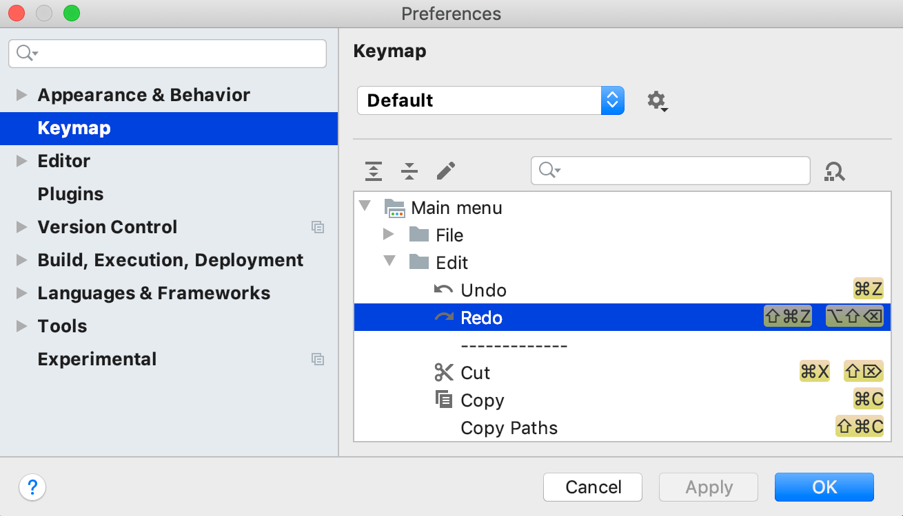
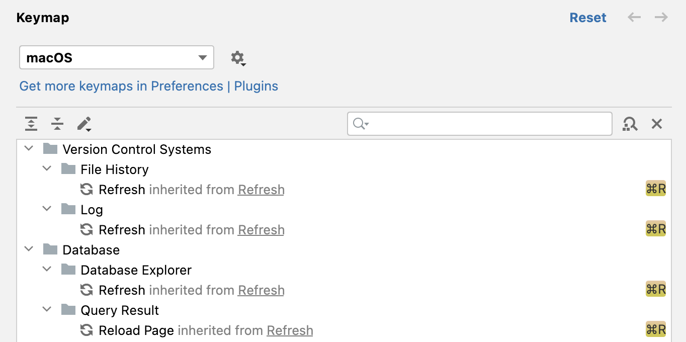
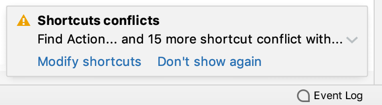
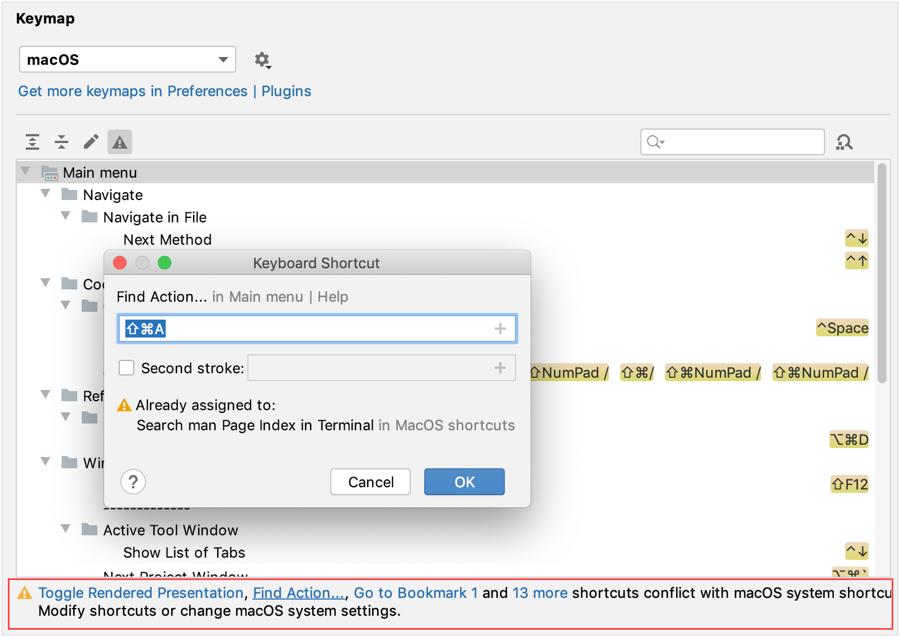

+++
title = "Keyboard shortcuts"
weight = 10
date = 2023-06-17T19:06:58+08:00
type = "docs"
description = ""
isCJKLanguage = true
draft = false
+++
# Keyboard shortcuts

https://www.jetbrains.com/help/go/configuring-keyboard-and-mouse-shortcuts.html#conflicts

Last modified: 18 January 2023

File | Settings | Keymap for Windows and Linux

GoLand | Settings | Keymap for macOS

Ctrl+Alt+S 

GoLand includes several predefined keymaps and lets you customize frequently used shortcuts.

To view the keymap configuration, open the Settings dialog Ctrl+Alt+S and select Keymap.

GoLand automatically suggests a predefined keymap based on your environment. Make sure that it matches the OS you are using or select the one that matches shortcuts from another IDE or editor you are used to (for example, Emacs or Sublime).

> ### 
>
> 
>
> On macOS, the default keymap is macOS. There is also IntelliJ IDEA Classic, which is a legacy keymap that resembles the default keymap for Windows. Another keymap specific to macOS is macOS System Shortcuts that follows the [Default Mac OS X System Key Bindings](http://www.hcs.harvard.edu/~jrus/Site/System Bindings.html) conventions.

A keymap is a list of actions with corresponding keyboard and mouse shortcuts and abbreviations. You cannot change predefined keymaps. Instead, when you modify any shortcut of a predefined keymap, GoLand creates a copy of that keymap, which you can configure. Click  to duplicate the selected keymap, rename, remove, or restore it to default values. For information about keymap files, see [Location of user-defined keymaps](https://www.jetbrains.com/help/go/configuring-keyboard-and-mouse-shortcuts.html#custom_keymap_location).

Some actions inherit their keyboard shortcuts or mouse shortcuts from other actions. On the Keymap page, you can navigate to the parent action using the inherited from link. When you change a shortcut of a parent action, all shortcuts of its child actions change accordingly. When you change a shortcut of a child action, it does not affect the shortcuts of its parent action, but the inheritance link is removed making both actions independent.

To find an action by name, type it in the search field of the Keymap page. If you know the shortcut of an action, click  and press the key combination in the Find Shortcut dialog.

When consulting this page and other pages in GoLand documentation, you can see keyboard shortcuts for the keymap that you use in the IDE — choose it using the selector at the top of a page.

> ### 
>
> 
>
> To view the keymap reference as PDF, select Help | Keyboard Shortcuts PDF from the main menu.

### Add a keyboard shortcut

1. On the Keymap page of the Settings dialog Ctrl+Alt+S, right-click an action and select Add Keyboard Shortcut.

2. In the Keyboard Shortcut dialog, press the necessary key combination.

   > ### 
   >
   > 
   >
   > Pressing some keys or key combinations, such as Enter or Escape, will result in the actual action, such as closing the dialog. If you want to use them as shortcuts, click  in the Keyboard Shortcut dialog and select the necessary key or combination.

3. If necessary, select the Second stroke checkbox to define a complex shortcut with two sequential key combinations.

4. Click OK to save the shortcut.

The key combination that you press is displayed in the Keyboard Shortcut dialog, as well as a warning if it conflicts with existing shortcuts.

### Add a mouse shortcut

1. On the Keymap page of the Settings dialog Ctrl+Alt+S, right-click an action and select Add Mouse Shortcut.
2. In the Mouse Shortcut dialog, move the mouse pointer to the central area and click or scroll as necessary.
3. Click OK to save the shortcut.

The performed mouse manipulations are displayed in the Mouse Shortcut dialog, as well as a warning if it conflicts with existing shortcuts.

### Add an abbreviation

An abbreviation can be used to quickly find an action without a shortcut. For example, you can press Ctrl+Shift+A and type the name of the Jump to Colors and Fonts action to quickly modify the color and font settings of the element under the current caret position. If you assign an abbreviation for this action (like JCF), you can then type it instead of the full action name.

1. On the Keymap page of the Settings dialog Ctrl+Alt+S, right-click an action and select Add Abbreviation.
2. In the Abbreviation dialog, type the desired abbreviation and click OK.

### Reset action shortcuts to default

If you changed, added, or removed a shortcut for an action, you can reset it to the initial configuration.

- On the Keymap page of the Settings dialog Ctrl+Alt+S, right-click an action and select Reset Shortcuts.

## Location of user-defined keymaps

When you modify one of the default keymaps, GoLand creates a custom keymap file in the **keymaps** directory under the GoLand [IDE configuration directory](https://www.jetbrains.com/help/go/directories-used-by-the-ide-to-store-settings-caches-plugins-and-logs.html#config-directory):

Windows

macOS

Linux

A custom keymap file contains only the differences relative to its parent keymap. For example, if you modify the default Windows keymap, your custom keymap will be its child. The file will contain only the shortcuts that you added or modified, while all other shortcuts of your custom keymap will be the same as the default Windows keymap.

You can share your custom keymaps with team members or between your IDE instances. Copy the corresponding keymap file and put it in the **keymaps** directory on another GoLand installation. Then select the copied keymap on the Keymap settings page.

## Conflicts with global OS shortcuts

Predefined keymaps do not cover every possible platform, version, and configuration. Some shortcuts can conflict with global system actions and shortcuts for third-party software. To fix these conflicts, you can reassign or disable the conflicting shortcut.

GoLand detects conflicts with system shortcuts and notifies you with a popup message:

Click Modify shortcuts to open the Keymap settings dialog where you can make the necessary adjustments:

Here are a few examples of possible system shortcut conflicts with the default keymap in GoLand. Make sure that function keys are enabled on your system.

macOS

Ubuntu

| Shortcut | System action                     | GoLand action         |
| -------- | --------------------------------- | --------------------- |
| ⌃Space   | Select the previous input source  | Basic code completion |
| ⇧⌘A      | Search man Page Index in Terminal | Find Action           |