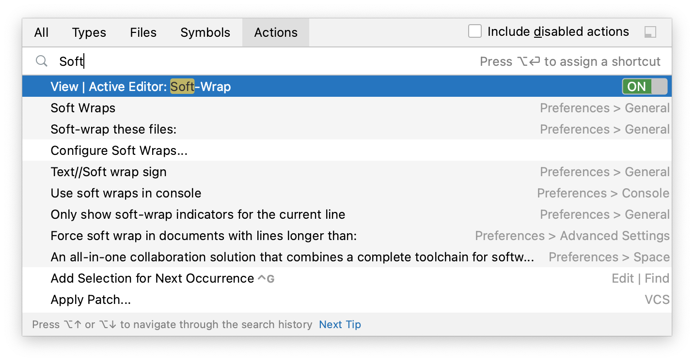

+++
title = "键盘快捷键"
weight = 30
date = 2023-06-17T19:06:58+08:00
type = "docs"
description = ""
isCJKLanguage = true
draft = false

+++
# Keyboard shortcuts - 键盘快捷键

https://www.jetbrains.com/help/go/mastering-keyboard-shortcuts.html

Last modified: 27 April 2023

最后修改日期：2023年4月27日

Printable version of shortcuts in PDF: [default keymap reference card (57 KB)](https://resources.jetbrains.com/storage/products/goland/docs/GoLand_ReferenceCard.pdf)

Keymap configuration: open the Settings dialog Ctrl+Alt+S and select Keymap

按键映射配置：打开设置对话框 Ctrl+Alt+S，选择按键映射

GoLand has keyboard shortcuts for most of its commands related to editing, navigation, refactoring, debugging, and other tasks. Memorizing these hotkeys can help you stay more productive by keeping your hands on the keyboard. All default shortcuts are [configurable](https://www.jetbrains.com/help/go/configuring-keyboard-and-mouse-shortcuts.html) and you can also assign shortcuts to any action that does not have them by default.

​	GoLand 对于大多数与编辑、导航、重构、调试和其他任务相关的命令都有快捷键。熟记这些热键可以让您通过保持双手在键盘上更高效地工作。所有默认的快捷键都是[可配置的](https://www.jetbrains.com/help/go/configuring-keyboard-and-mouse-shortcuts.html)，您还可以为没有默认快捷键的任何操作分配快捷键。

> If your keyboard does not have an English layout, GoLand may not detect all the shortcuts correctly.
>
> ​	如果您的键盘不是英文布局，GoLand 可能无法正确检测到所有的快捷键。

The following table lists some of the most useful shortcuts to learn:

​	下表列出了一些最有用的快捷键：

| 快捷键             | 操作                                                         |
| ------------------ | ------------------------------------------------------------ |
| Double Shift       | [搜索全部](https://www.jetbrains.com/help/go/searching-everywhere.html)快速查找 GoLand 中的任何文件、操作、类型、符号、工具窗口或设置，以及您的项目和当前 Git 仓库中的内容。 |
| Ctrl+Shift+A       | [查找操作](https://www.jetbrains.com/help/go/searching-everywhere.html#find_action)查找命令并执行它、打开工具窗口或搜索设置。 |
| Alt+Enter          | [显示上下文操作](https://www.jetbrains.com/help/go/intention-actions.html)修复突出显示的错误和警告，改进和优化代码的意图操作。 |
| F2Shift+F2         | [在代码问题之间导航](https://www.jetbrains.com/help/go/navigating-through-the-source-code.html#navigate-errors-warnings)跳转到下一个或上一个突出显示的错误。 |
| Ctrl+E             | [查看最近文件](https://www.jetbrains.com/help/go/navigating-through-the-source-code.html#recent_files)从列表中选择最近打开的文件。 |
| Ctrl+WCtrl+Shift+W | [扩展或缩小选择范围](https://www.jetbrains.com/help/go/working-with-source-code.html)根据特定的代码结构增加或减少选择范围。 |
| Ctrl+/Ctrl+Shift+/ | [添加/删除行或块注释](https://www.jetbrains.com/help/go/working-with-source-code.html#editor_lines_code_blocks)注释掉一行或一段代码。 |
| Alt+F7             | [查找用法](https://www.jetbrains.com/help/go/find-highlight-usages.html#find-usages)显示使用代码元素的所有位置。按下（Alt+F7）时，GoLand 会查找接口方法的用法。要查找当前方法的用法，请按 Ctrl+Alt+Shift+F7。 |

## Choose the right keymap 选择适合的按键映射

To view the keymap configuration, open the Settings dialog Ctrl+Alt+S and select Keymap.

​	要查看按键映射配置，请打开设置对话框 Ctrl+Alt+S，然后选择按键映射。

> Enable function keys and check for [possible conflicts](https://www.jetbrains.com/help/go/configuring-keyboard-and-mouse-shortcuts.html#conflicts) with global OS shortcuts.
>
> ​	启用功能键并检查与全局操作系统快捷键的[可能冲突](https://www.jetbrains.com/help/go/configuring-keyboard-and-mouse-shortcuts.html#conflicts)。

### Use a predefined keymap 使用预定义的按键映射

GoLand automatically suggests a predefined keymap based on your environment. Make sure that it matches the OS you are using or select the one that matches shortcuts from another IDE or editor you are used to (for example, Emacs or Sublime).

​	GoLand 根据您的环境自动提供预定义的按键映射建议。确保它与您使用的操作系统匹配，或选择与您熟悉的其他 IDE 或编辑器的快捷键相匹配的按键映射（例如 Emacs 或 Sublime）。

When consulting this page and other pages in GoLand documentation, you can see keyboard shortcuts for the keymap that you use in the IDE — choose it using the selector at the top of a page.

​	在查看此页面和其他 GoLand 文档页面时，您可以看到使用 IDE 中使用的按键映射的快捷键 —— 使用页面顶部的选择器选择它。

### Install a keymap from a plugin 安装来自插件的按键映射

Besides the default set of keymaps, you can install keymaps from plugins (such as, keymaps for GNOME and KDE): open the Settings dialog Ctrl+Alt+S, select Plugins, switch to the Marketplace tab and search for keymap.

​	除了默认的按键映射集，您还可以安装来自插件的按键映射（例如 GNOME 和 KDE 的按键映射）：打开设置对话框 Ctrl+Alt+S，选择插件，切换到“市场”选项卡，然后搜索按键映射。

### Tune your keymap 自定义您的按键映射

You can modify a copy of any predefined keymap to [assign your own shortcuts](https://www.jetbrains.com/help/go/configuring-keyboard-and-mouse-shortcuts.html#add-keyboard-shortcut) for commands that you use frequently.

​	您可以修改任何预定义按键映射的副本，为您经常使用的命令[分配自己的快捷键](https://www.jetbrains.com/help/go/configuring-keyboard-and-mouse-shortcuts.html#add-keyboard-shortcut)。

### Import custom keymap 导入自定义按键映射

If you have a customized keymap that you are used to, you can [transfer it to your installation](https://www.jetbrains.com/help/go/configuring-keyboard-and-mouse-shortcuts.html#custom_keymap_location).

​	如果您有自己习惯使用的自定义按键映射，可以[将其转移](https://www.jetbrains.com/help/go/configuring-keyboard-and-mouse-shortcuts.html#custom_keymap_location)到您的安装中。

> If your keymap stopped working after an update, it is likely that the keymap is not available by default in the new version of GoLand. Find this keymap as a plugin and install it on the [Plugins page](https://www.jetbrains.com/help/go/plugins-settings.html) as described in[Plugins](https://www.jetbrains.com/help/go/managing-plugins.html).
>
> ​	如果在更新后您的按键映射停止工作，可能是因为在 GoLand 的新版本中，默认情况下不可用该按键映射。在[插件页面](https://www.jetbrains.com/help/go/plugins-settings.html)上找到此按键映射，并按照[插件管理](https://www.jetbrains.com/help/go/managing-plugins.html)中的说明安装它。

## Learn shortcuts as you work 边工作边学习快捷键

GoLand provides several possibilities to learn shortcuts:

​	GoLand 提供了几种学习快捷键的可能性：

- [Find Action](https://www.jetbrains.com/help/go/searching-everywhere.html) lets you search for commands and settings across all menus and tools.

- [查找操作](https://www.jetbrains.com/help/go/searching-everywhere.html)可让您在所有菜单和工具中搜索命令和设置。

  Press Ctrl+Shift+A and start typing to get a list of suggested actions. Then select the necessary action and press Enter to execute it.

  按下 Ctrl+Shift+A 并开始输入，以获取建议操作的列表。然后选择所需的操作并按 Enter 执行。

  

  > To add or change the shortcut for any action, press Alt+Enter when it is selected in the list.
  >
  > ​	要添加或更改任何操作的快捷键，请在列表中选择它时按下 Alt+Enter。

- [Key Promoter X](https://plugins.jetbrains.com/plugin/9792-key-promoter-x) is a plugin that shows a popup notification with the corresponding keyboard shortcut whenever a command is executed using the mouse. It also suggests creating a shortcut for commands that are executed frequently.

- [Key Promoter X](https://plugins.jetbrains.com/plugin/9792-key-promoter-x) 是一个插件，每当使用鼠标执行命令时，它会显示带有相应键盘快捷键的弹出通知。它还建议为频繁执行的命令创建快捷键。

- If you are using one of the predefined keymaps, you can print the [default keymap reference card](https://resources.jetbrains.com/storage/products/goland/docs/GoLand_ReferenceCard.pdf) and keep it on your desk to consult it if necessary. This cheat sheet is also available under Help | Keyboard Shortcuts PDF.

- 如果您使用的是预定义的按键映射之一，您可以打印[默认按键映射参考卡片](https://resources.jetbrains.com/storage/products/goland/docs/GoLand_ReferenceCard.pdf)，并将其放在桌子上以在需要时查阅。此快捷键备忘单也可在“帮助”|“键盘快捷键 PDF”下获得。

- To print a non-default or customized keymap, use the [Keymap exporter plugin](https://plugins.jetbrains.com/plugin/7066-keymap-exporter).

- 要打印非默认或自定义的按键映射，请使用[Keymap exporter](https://plugins.jetbrains.com/plugin/7066-keymap-exporter) 插件。

## Use advanced features 使用高级功能

You can further improve your productivity with the following useful features:

​	您可以通过以下有用的功能进一步提高工作效率：

| 功能             | 描述                                                         |
| ---------------- | ------------------------------------------------------------ |
| 快速列表         | 如果有一组您经常使用的操作，请创建[快速列表](https://www.jetbrains.com/help/go/customize-actions-menus-and-toolbars.html#configure_quick_lists)，使用自定义快捷键访问它们。例如，您可以尝试使用以下预定义的快速列表： Refactor this  `Ctrl+Alt+Shift+T`  VCS Operations  `Alt+\`` |
| 智能键           | GoLand 提供许多打字辅助功能，例如自动添加配对标记和引号，以及检测 CamelHump 字词。 |
| 快速搜索         | 当焦点在带有树、列表或表格的工具窗口上时，开始键入以查看匹配项。 |
| 双击操作         | 在 GoLand 中的某些操作在多次执行时提供更多结果。例如，当您在字段、参数或变量声明的某部分上使用 Ctrl+Space 调用基本代码完成时，它会根据当前范围内的项目类型建议名称。如果再次调用它，它将包括通过模块依赖项可用的类型。连续第三次调用时，建议列表将包括整个项目。 |
| 调整工具窗口大小 | 您可以在没有鼠标的情况下调整工具窗口的大小： 要调整垂直工具窗口的大小，请按 Ctrl+Alt+Shift+Left 和 Ctrl+Alt+Shift+Right； 要调整水平工具窗口的大小，请按 Ctrl+Alt+Shift+Up 和 Ctrl+Alt+Shift+Down。 |

| features    | describe                                                     |
| ----------- | ------------------------------------------------------------ |
| Quick Lists | If there is a group of actions that you often use, create a [quick list](https://www.jetbrains.com/help/go/customize-actions-menus-and-toolbars.html#configure_quick_lists) to access them using a custom shortcut. For example, you can try using the following predefined quick lists: Refactor this Ctrl+Alt+Shift+T VCS Operations Alt+` |
|       Smart Keys      |    GoLand provides a lot of typing assistance features, such as automatically adding paired tags and quotes, and detecting CamelHump words.      |
|     Speed search        |        When the focus is on a tool window with a tree, list, or table, start typing to see matching items.                                         |
|  Press twice | Some actions in GoLand provide more results when you execute them multiple times. For example, when you invoke basic code completion with Ctrl+Space on a part of a field, parameter, or variable declaration, it suggests names depending on the item type within the current scope. If you invoke it again, it will include types available through module dependencies. When invoked for the third time in a row, the list of suggestions will include the whole project. | 
|     Resize tool windows        | You can adjust the size of tool windows without a mouse:To resize a vertical tool window, press Ctrl+Alt+Shift+Left and Ctrl+Alt+Shift+RightTo resize a horizontal tool window, press Ctrl+Alt+Shift+Up and Ctrl+Alt+Shift+Down |

