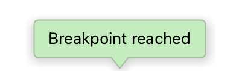
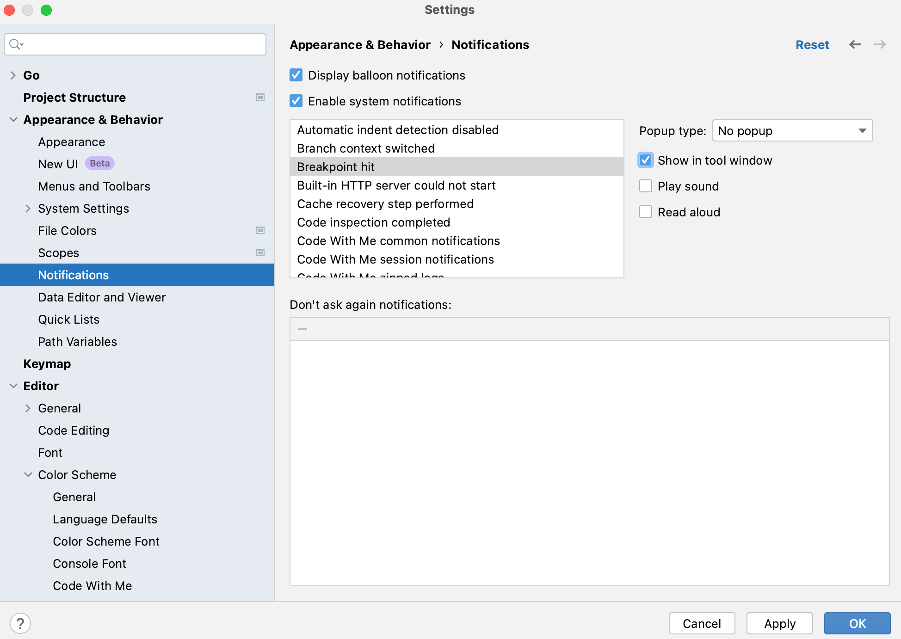
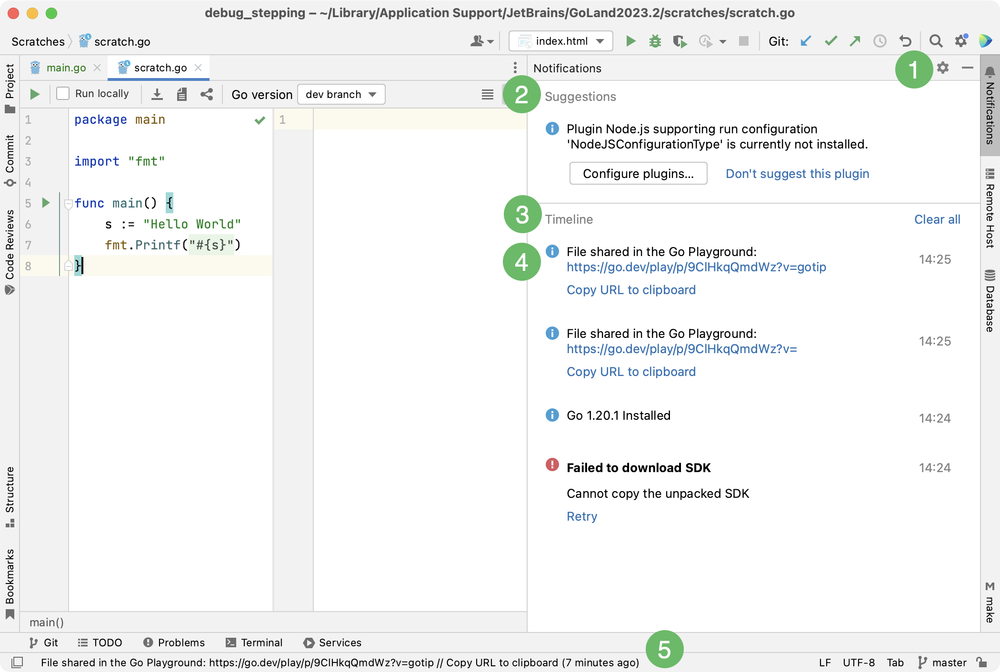
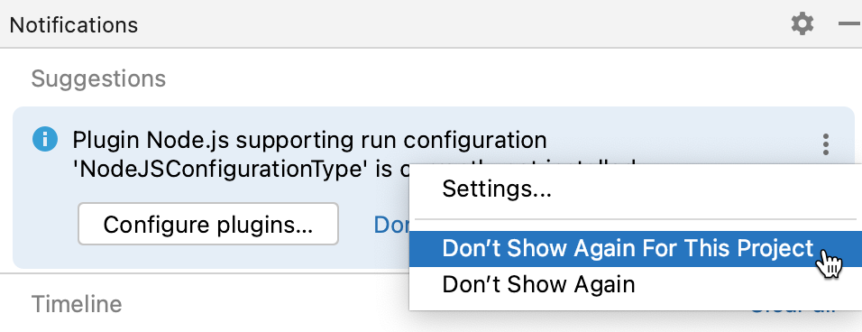
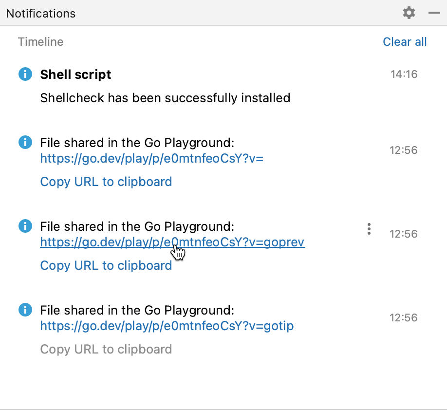

+++
title = "通知"
weight = 30
date = 2023-06-17T19:06:58+08:00
type = "docs"
description = ""
isCJKLanguage = true
draft = false

+++
# Notifications - 通知

https://www.jetbrains.com/help/go/notifications.html

Last modified: 23 February 2023

最后修改日期：2023年2月23日

View | Tool Windows | Notifications

​	每当在IDE中出现重要事件或建议时，您将在GoLand的右下角看到一个弹出通知气球。您还可以在[通知](https://www.jetbrains.com/help/go/notifications.html#notifications_tool_window)工具窗口中查看所有通知和事件。

​	GoLand允许您针对每个事件组单独配置通知设置。例如，您可以禁用所有版本控制系统（VCS）通知，或启用声音通知以告知您的应用程序已构建完成。

### 配置每个事件组的通知

1. 按下Ctrl+Alt+S打开IDE设置，选择Appearance & Behavior | Notifications。

   要从通知中快速导航到设置，请点击 或点击图标，然后选择设置。

3. 选择要配置通知设置的事件组。

3. 在弹出类型列表中，为气球通知选择以下选项之一：

   - 气球：通知气球会在屏幕上短暂显示，然后自动消失。

   - 工具窗口气球：通知以弹出窗口的形式显示。这种类型的通知仅适用于具有相应工具窗口的事件组。

     例如，达到断点的通知与调试工具窗口相关联。

     

   - 固定气球：通知气球会一直停留在屏幕上，直到您关闭它们。

   - 不弹出：不显示气球通知。

7. 启用“在工具窗口中显示”选项，以在[通知工具窗口](https://www.jetbrains.com/help/go/notifications.html#notifications_tool_window)中显示所选事件组的通知。

9. 选择“播放声音”以启用声音通知，或选择“朗读”（仅适用于macOS）以从通知文本生成语音通知。

   

## 通知气球

​	通知气球出现在IDE的右下角，通知您重要事件和建议。

​	如果您希望无干扰地工作，可以一次性禁用所有通知气球。

### 禁用所有通知气球

1. 按下Ctrl+Alt+S打开IDE设置，选择Appearance & Behavior | Notifications。
3. 禁用“显示通知气球”选项。

​	您还可以使用[弹出类型](https://www.jetbrains.com/help/go/notifications.html#popup_type)列表为特定事件组配置或完全禁用通知气球。

## 通知工具窗口

> ​	通知工具窗口已取代先前版本的IDE中存在的事件日志。

​	您可以通过点击相应的[工具窗口栏](https://www.jetbrains.com/help/go/notifications.html#bar)或选择View | Tool Windows | Notifications来打开工具窗口。

​	该工具窗口还可以打开您在[状态栏](https://www.jetbrains.com/help/go/guided-tour-around-the-user-interface.html#status-bar)中看到的消息：点击消息以在工具窗口中查看。

1. 通知工具窗口栏。点击它可以快速打开工具窗口。

   工具窗口标题旁边的指示器标记了新通知及其重要性：蓝色圆点标记普通事件和不重要的建议。红色圆点标记错误和重要建议。

3. 重要建议区域。有关详细信息，请参阅[建议](https://www.jetbrains.com/help/go/notifications.html#suggestions)。

5. 普通事件和通知。有关详细信息，请参阅[时间线](https://www.jetbrains.com/help/go/notifications.html#timeline)。

7. 新通知。在工具窗口中以蓝色背景显示。

9. 状态栏消息。点击消息以在工具窗口中查看。

​	通知会一直显示在工具窗口中，直到您手动清除它们或重新打开项目。

> ​	您可以为特定事件组[禁用和启用工具窗口通知](https://www.jetbrains.com/help/go/notifications.html#show_in_tool_window_step)。

### 建议

​	建议帮助您优化与IDE的工作。它们通知您有关缺少的组件、插件和禁用的选项，并提示您相应更改配置。

### 不显示建议

​	如果一个建议不相关，您可以隐藏它：

- 点击要隐藏的建议中的 然后选择“不再显示”或“不再针对此项目显示”。

  

### 恢复隐藏的建议

​	如果改变主意，您可以在设置中恢复禁用的建议： 

1. 按下Ctrl+Alt+S打开IDE设置，选择Appearance & Behavior | Notifications。
3. 在“不再询问的通知”表中，找到需要的建议，然后点击。

### 时间线

​	时间线区域按顺序列出了在GoLand中发生的通知和事件。

​	当出现错误时，提供其描述并提供一个链接，点击链接可以打开另一个对话框或工具窗口，您可以在其中详细查看问题。

