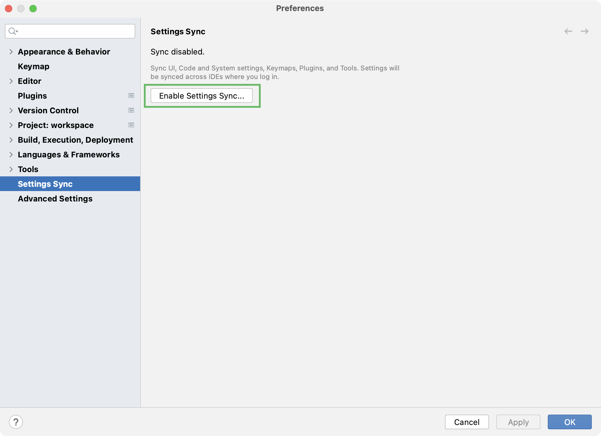
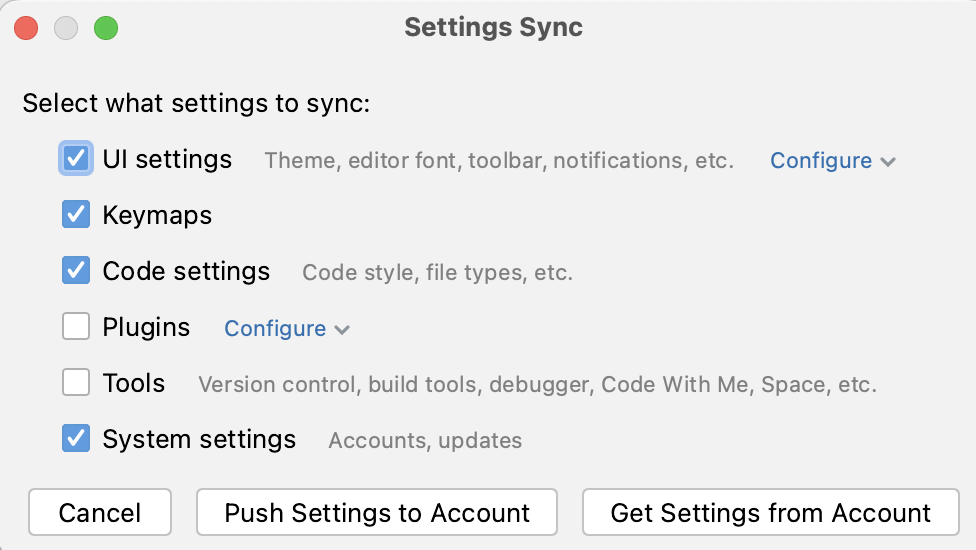
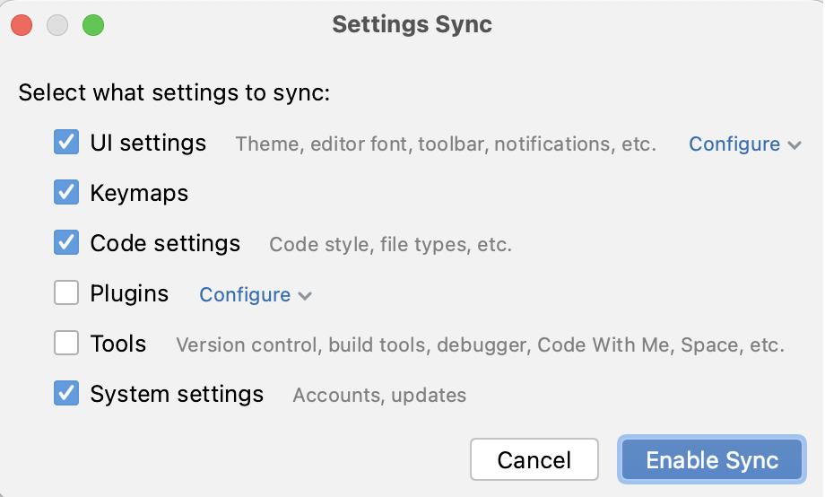
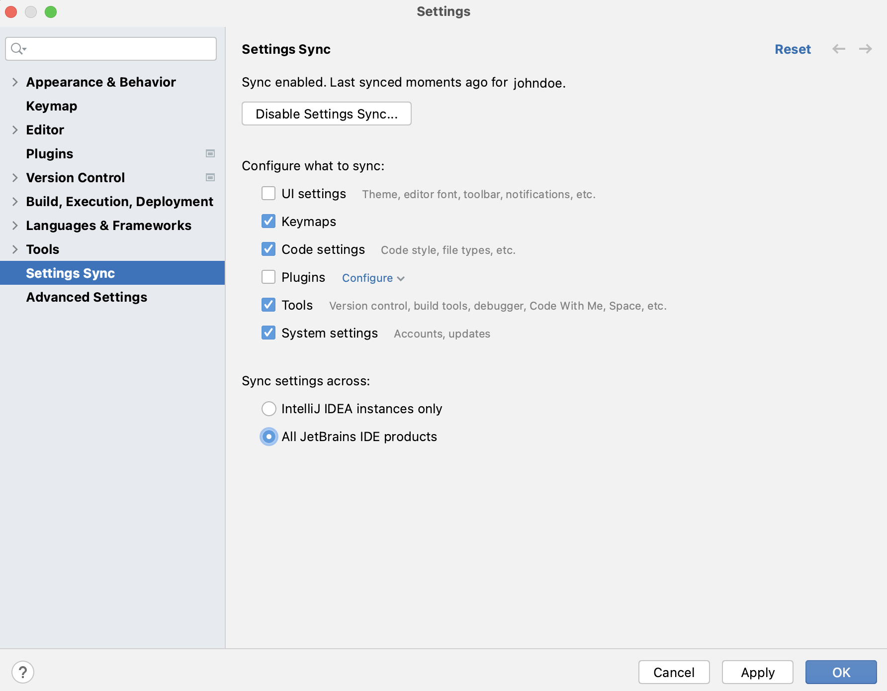
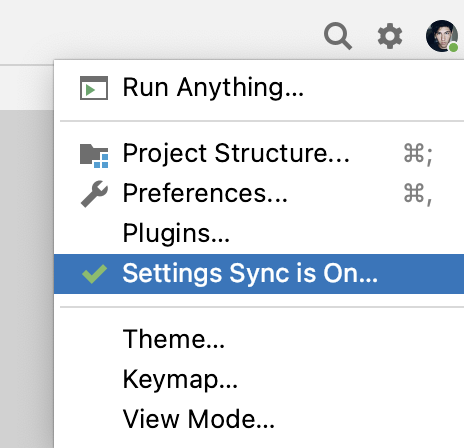

+++
title = "分享IDE设置"
weight = 50
date = 2023-06-17T19:06:58+08:00
type = "docs"
description = ""
isCJKLanguage = true
draft = false
+++
# Share IDE settings - 分享IDE设置

https://www.jetbrains.com/help/go/sharing-your-ide-settings.html#faq

Last modified: 25 April 2023

​	GoLand允许您在产品的不同实例之间或团队成员之间共享IDE设置。这可以帮助您在使用不同计算机工作时重新创建舒适的工作环境，并避免出现外观或行为与您习惯不同的问题，或者在整个团队中强制执行相同的标准。

> ​	有关如何通过版本控制系统共享与特定项目相关的设置的信息，请参见[通过VCS共享项目设置](https://www.jetbrains.com/help/go/creating-and-managing-projects.html#share-project-through-vcs)。

​	您可以使用以下方法之一来共享您的IDE设置：

- [Settings Sync（设置同步）](https://www.jetbrains.com/help/go/sharing-your-ide-settings.html#IDE_settings_sync)：它利用JetBrains服务器，因此不需要额外的配置。同步的设置与您的[JetBrains帐户](https://sales.jetbrains.com/hc/en-gb/articles/208459005-What-is-JetBrains-Account-)相关联，并在使用此帐户登录的所有IDE中可用。

  您可以同步的设置包括：IDE主题、按键映射、颜色方案、系统设置、UI设置、菜单和工具栏设置、项目视图设置、编辑器设置、代码完成设置、参数名称提示、代码模板、代码样式以及已启用和已禁用的插件列表。

- 设置存储库：它允许您同步任何可配置组件（除了已启用和已禁用的插件列表），但需要设置一个带有要共享的设置的Git存储库。

  如果您想在团队成员之间实现相同的设置，或者使用自定义的设置存储，这个选项很有用。

  > ​	从2022.3版本开始，Settings Repository（设置存储库）插件不再与GoLand捆绑在一起。它仍然可以在JetBrains Marketplace中安装。有关如何设置Settings Repository的信息，请参阅[GoLand 2022.2文档](https://www.jetbrains.com/help/go/2022.2/sharing-your-ide-settings.html#settings-repository)。

- [导出](https://www.jetbrains.com/help/go/sharing-your-ide-settings.html#import-export-settings)要共享的设置为ZIP存档，然后将其导入到不同的IDE安装中。您可以导出代码样式设置、Git设置（包括注册的GitHub帐户）、调试器设置、注册表键、外观等。

## 通过Settings Sync共享设置

​	GoLand 2022.3中已弃用IDE Settings Sync插件。相反，一个名为Settings Sync的新插件可用，并且已捆绑在GoLand 2022.3中。最显着的变化包括：

- 新插件支持所有JetBrains IDE的同步。
- Settings Sync同步插件的设置，包括第三方插件的设置（如果插件开发者希望其插件的设置被Settings Sync同步，则需要[启用它](https://plugins.jetbrains.com/docs/intellij/persisting-state-of-components.html#settings-sync-plugin)）。

> ​	如果您已启用Settings Repository，则无法通过[Settings Sync](https://www.jetbrains.com/help/go/sharing-your-ide-settings.html#IDE_settings_sync)共享您的设置。

### 在IDE实例之间同步设置

1. 在包含要共享设置的IDE实例的计算机上，登录以下任一选项：

   - 您的IDE：从主菜单选择Help | Register，选择使用[JetBrains帐户](https://sales.jetbrains.com/hc/en-gb/articles/208459005-What-is-JetBrains-Account-)激活您的许可证，并输入您的凭据。
   - [Toolbox App](https://www.jetbrains.com/toolbox/app/)：单击应用程序右上角的齿轮图标，选择Settings，然后点击Log in。请注意，通过登录到Toolbox App，您自动登录到所有运行的JetBrains产品。
   - 如果您使用激活码或许可证服务器[激活GoLand](https://www.jetbrains.com/help/go/register.html#activate-license)，而不是JetBrains帐户，请按Ctrl+Alt+S打开IDE设置，然后选择Settings Sync | Log in with JetBrains account以登录到您的JetBrains帐户。

2. 按Ctrl+Alt+S打开设置，转到Settings Sync，然后点击Enable Settings Sync。

   

   > ​	您还可以通过右键单击GoLand窗口右上角的齿轮图标来启用或禁用Settings Sync，或访问其设置。

3. 在打开的Settings Sync窗口中，选择要共享的设置类别。

   > ​	您可以通过单击设置旁边的Configure来排除某些设置的同步。例如，如果您不希望同步特定插件，可以排除它们。或者，如果您的IDE安装在不同操作系统上，某些字体可能会丢失，您可能希望保留本地字体以供编辑器使用，而不进行同步。

4. 下一步取决于是否有与您的[JetBrains帐户](https://sales.jetbrains.com/hc/en-gb/articles/208459005-What-is-JetBrains-Account-)关联的同步设置。

   

   

   

   

   

   

   

   

   

   

   点击Push Settings to Account以使用本地设置覆盖JetBrains服务器上存储的设置，并将其用作共享设置。

9. 在要应用这些设置的另一个IDE实例中，单击齿轮按钮，然后选择Settings Sync is Off。在打开的Settings Sync页面上，点击Enable Settings Sync。

10. 在打开的Settings Sync窗口中，选择Get Settings from Account。

​	每次修改设置或JetBrains服务器从另一个IDE接收设置更新时，您的本地设置将自动与JetBrains服务器上存储的设置同步。

### 在不同的IDE产品之间启用设置同步

​	默认情况下，您的设置仅在相同IDE产品的实例之间同步，例如，在您的GoLand实例之间同步。您可以启用跨任何启用了Settings Sync插件并使用相同JetBrains帐户登录的基于IntelliJ的IDE产品的设置同步。

1. 打开设置对话框（Ctrl+Alt+S），然后转到Settings Sync。

2. 在Sync settings across列表中选择All JetBrains IDE products。

   

### 禁用设置同步

​	您可以为单个IDE禁用设置同步，或完全从JetBrains云服务器中删除所有设置，并禁用与您的JetBrains帐户连接的所有IDE的同步。

1. 在GoLand窗口右上角点击齿轮图标，然后选择Settings Sync is On。

   

2. 在打开的Settings Sync页面上，点击Disable Settings Sync。

4. 确认禁用设置同步。要在所有IDE上禁用同步，选择Remove data from JB account and disable for all IDEs。

## 导出您的设置

### 将设置导出为ZIP存档

1. 从主菜单中选择File | Manage IDE Settings | Export Settings。
3. 选择要导出的设置，并指定目标存档的路径。

### 从ZIP存档中导入设置

1. 从主菜单中选择File | Manage IDE Settings | Import Settings。
3. 在打开的对话框中选择包含设置的ZIP存档。
5. 在打开的Select Components to Import对话框中选择要应用的设置，然后点击OK。

## 常见问题

​	本节试图回答在从GoLand 2022.2（或更早版本）升级到GoLand 2022.3后使用设置同步时可能遇到的问题。

我曾在 2022.2 版本（或更早版本）中使用 IDE Settings Sync。我的设置会发生什么变化？

​	在将 IDE 升级到 2022.3 版本后，这些设置将迁移到新的 Settings Sync 插件中。

如果我没有将其中一个 IDE 实例升级到 2022.3 版本，那它的设置是否会与我升级到 2022.3 版本的 IDE 的设置同步？

​	不会。新的 Settings Sync 插件仅在 2022.3 版本及更高版本的 IDE 之间同步设置。

Settings Repository 是否会在 2022.3 版本中可用？

​	是的。Settings Repository 插件不会在 2022.3 版本中捆绑，但你仍然可以[手动安装](https://www.jetbrains.com/help/go/managing-plugins.html)。

我使用 Settings Repository。在升级到 2022.3 版本后有哪些选择？

​	与之前一样，你不能同时使用 Settings Repository 和 Settings Sync。因此，在你升级到 2022.3 版本后，我们不会自动启用新的 Settings Sync。相反，我们会让你选择首选的设置同步方式：你可以手动安装 Settings Repository 或启用新的 Settings Sync。

我必须使用自定义存储来存储设置。有哪些选择？

​	Settings Sync 将设置存储在 JetBrains 云服务器上，目前没有提供自定义存储的方法。如果你绝对需要自定义服务器来存储设置，你可以手动安装 Settings Repository 并在 2022.3 版本中继续使用它。

Settings Sync 默认启用吗？

​	不是。但是，如果你在 2022.2 版本的 IDE 中启用了旧版的 IDE Settings Sync，并将其升级到 2022.3 版本，Settings Sync 将自动启用。

Settings Sync 是否支持插件设置的同步？

​	是的，但这也需要插件本身支持。有关更多信息，请参考[IntelliJ 平台 SDK 文档](https://plugins.jetbrains.com/docs/intellij/persisting-state-of-components.html#sharing-settings-between-ide-installations)。

我有两个 IDE 实例，每个实例都连接到一个独立的 JetBrains 帐户。我能在它们之间同步设置吗？

​	在 Settings Sync 中，你的设置与你用于登录 IDE 的 JetBrains 帐户相关联。你可以[将多个电子邮件地址链接](https://account.jetbrains.com/profile-details/linked-emails)到你的帐户。这将允许你使用同一帐户登录两个 IDE，并在所有 IDE 之间共享设置。
