+++
title = "使用调试器附加到正在运行的Go进程"
weight = 90
date = 2023-06-20T10:40:58+08:00
type = "docs"
description = ""
isCJKLanguage = true
draft = false

+++
# Attach to running Go processes with the debugger - 使用调试器附加到正在运行的Go进程

https://www.jetbrains.com/help/go/attach-to-running-go-processes-with-debugger.html

Last modified: 16 January 2023

最近修改：2023年1月16日

​	在GoLand中，您可以将调试器附加到正在运行的Go进程[在本地机器上](https://www.jetbrains.com/help/go/attach-to-running-go-processes-with-debugger.html#attach-to-a-process-on-a-local-machine)、[在远程机器上](https://www.jetbrains.com/help/go/attach-to-running-go-processes-with-debugger.html#attach-to-a-process-on-a-remote-machine)或[在Docker容器中](https://www.jetbrains.com/help/go/attach-to-running-go-processes-with-debugger.html#attach-to-a-process-in-the-docker-container)。

## 在本地机器上附加到进程

​	您可以调试从命令行启动的应用程序。在这种情况下，应用程序在IDE之外但在同一台本地机器上运行。要调试应用程序，您需要在IDE中打开项目，并将调试器附加到正在运行的进程上。

​	例如，您可以使用[github.com上的以下Go代码](https://github.com/apronichev/documentation-code-examples/blob/master/debuggingTutorial/main.go)进行示例。

### 第1步：安装gops包

- 打开终端工具窗口（View | Tool Windows | Terminal），运行以下命令：

  ```bash
  go get -t github.com/google/gops/
  ```

  

- 单击Run | Attach to Process（Ctrl+Alt+F5）。在通知窗口中，单击Invoke 'go get gops'链接。

  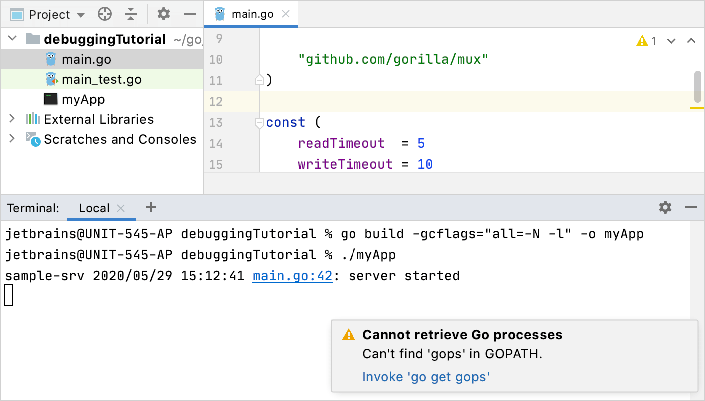


### 第2步：构建和运行应用程序

1. 打开终端工具窗口（View | Tool Windows | Terminal），根据您的Go版本运行以下命令：

   - Go 1.10及更高版本：

     ```bash
     go build -gcflags="all=-N -l" -o myApp
     ```

     

   - Go 1.9及更早版本：

     ```bash
     go build -gcflags="-N -l" -o myApp
     ```

     


   此命令编译`myApp`可执行文件并禁用编译器优化和内联。

2. 运行编译后的可执行文件（例如，`./myApp`）。

   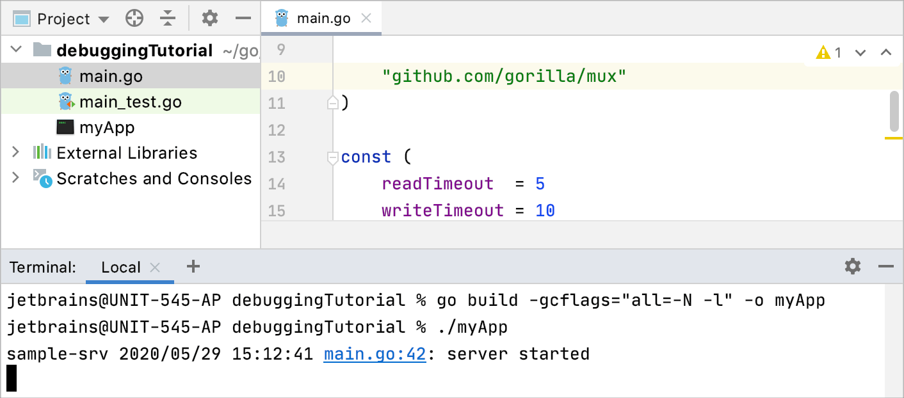


> ​	不要使用`-ldflags="all=-w"`或`-ldflags="-w"`标志，因为它们与调试应用程序不兼容，会删除Delve所需的DWARF信息。


> ​	由于Go工具链、Delve和GoLand之间的不兼容性，符号链接（symbolic links或symlinks）与调试不兼容。

### 第3步：附加并调试正在运行的进程

1. 单击代码行附近的gutter以设置断点。例如，在[提供的代码示例](https://github.com/apronichev/documentation-code-examples/blob/master/debuggingTutorial/main.go)中，将断点放在第23行（`message := fmt.Sprintf("Hello %s!", r.UserAgent())`）。了解有关断点的更多信息，请参阅[断点](https://www.jetbrains.com/help/go/using-breakpoints.html)。

3. 单击Run | Attach to Process（Ctrl+Alt+F5）。

5. 在Attach with Debugger窗口中，选择您的应用程序进程并按Enter键。

4. 在应用程序的断点处触发事件。如果您使用了[提供的代码示例](https://github.com/apronichev/documentation-code-examples/blob/master/debuggingTutorial/main.go)，在浏览器中打开`http://localhost:8080/`链接。

   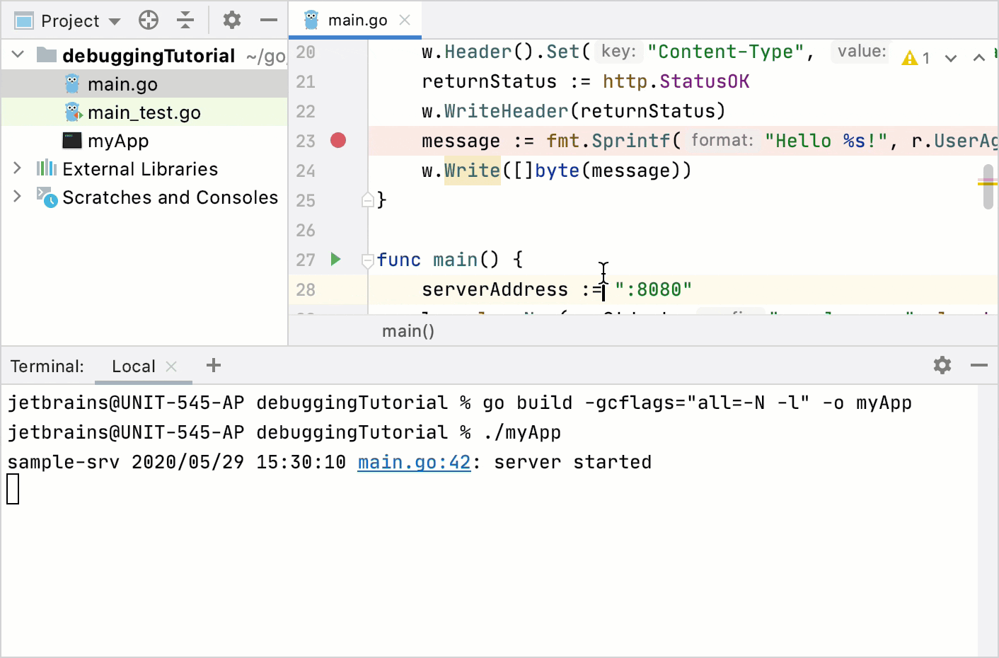


## 在远程机器上附加到进程

​	您可以连接到远程计算机（主机）并将调试器附加到在主机上运行的Go进程。远程调试器（Delve）必须在远程计算机上运行。


> ​	使用与应用程序相同的Go版本、主机和目标编译Delve，因为不同操作系统之间可能存在细微差异，可能导致调试会话无法正常工作

### 第1步：在主机上构建应用程序

1. 如果您使用`$GOPATH`方法，请确保项目在主机和客户端机器上与`$GOPATH`的相对路径相同。例如，如果您在主机上的应用程序代码位于`$GOPATH/src/debuggingTutorial/`，则客户端上的代码必须位于相同的目录（`$GOPATH/src/debuggingTutorial/`）。

2. 打开终端工具窗口（View | Tool Windows | Terminal），根据您的Go版本运行以下命令：

   - Go 1.10 and 1.10及更高版本：

     ```bash
     go build -gcflags="all=-N -l" -o myApp
     ```

     

   - Go 1.9及更早版本：

     ```bash
     go build -gcflags="-N -l" -o myApp
     ```

     


   此命令编译`myApp`可执行文件并禁用编译器优化和内联。

   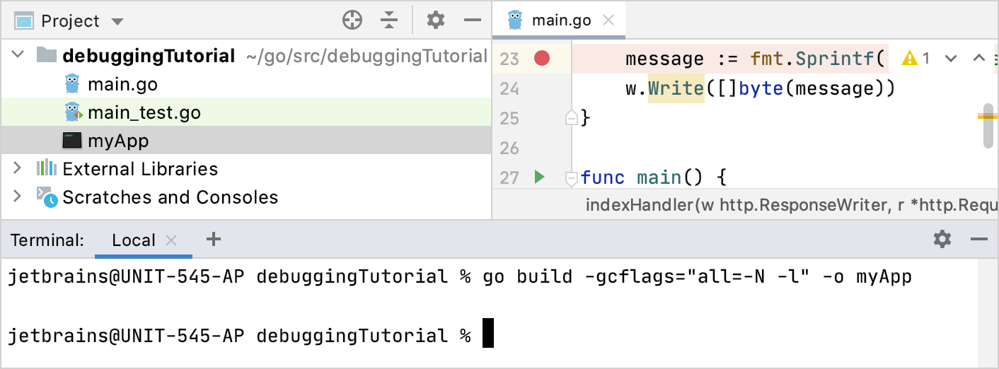


### 第2步：在主机上运行Delve

- 两种选项来在主机机器上启动调试器：

  - 调试器为您运行进程。如果使用了防火墙，请暴露在配置中使用的端口（例如，`2345`）。您可以使用任何未被占用的端口号。`myApp`是在[第1步](https://www.jetbrains.com/help/go/attach-to-running-go-processes-with-debugger.html#step-1-build-the-application)中构建的可执行文件的名称。

    ```bash
    dlv --listen=:2345 --headless=true --api-version=2 exec ./myApp
    ```

    

    如果需要将参数原样传递给二进制文件，请在前面的命令中添加双破折号（`--`），然后添加必要的选项（例如，`-- --config=/path/to/config/file`）。

  - 您运行进程，然后调试器附加到正在运行的进程。`<PID>`是您的应用程序的进程标识符。您可以使用[附加到进程命令](https://www.jetbrains.com/help/go/attach-to-running-go-processes-with-debugger.html#attach-to-a-process-on-a-local-machine)获取进程标识符。

    ```bash
    dlv --listen=:2345 --headless=true --api-version=2 attach <PID>
    ```

    


  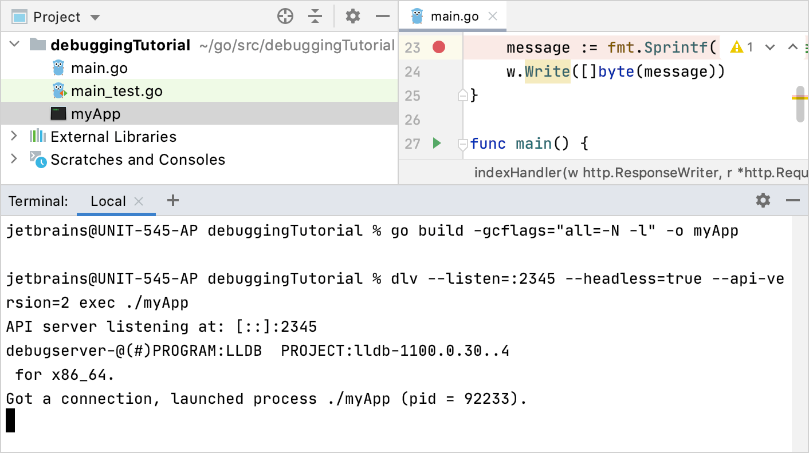


### 第3步：在客户端机器上创建Go Remote运行/调试配置

1. 单击Edit | Run Configurations。或者，单击工具栏上的运行/调试配置列表，然后选择Edit Configurations。

3. 在Run/Debug Configurations对话框中，单击“添加”按钮（)，然后选择“Go Remote”。

4. 在“主机”字段中，输入主机的IP地址（例如，`192.168.1.33`）。

6. 在“端口”字段中，输入您在[第2步](https://www.jetbrains.com/help/go/attach-to-running-go-processes-with-debugger.html#step-2-run-delve-on-the-host-machine)中配置的调试器端口（例如，`2345`）。

8. 单击OK.

   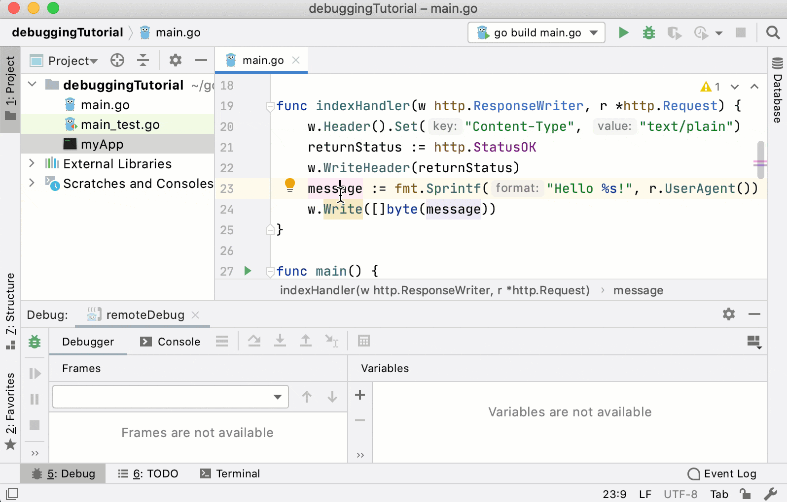

### 第4步：在客户端机器上开始调试过程

1. 单击代码行附近的gutter以设置断点。例如，在[提供的代码示例](https://github.com/apronichev/documentation-code-examples/blob/master/debuggingTutorial/main.go)中，将断点放在第23行（`message := fmt.Sprintf("Hello %s!", r.UserAgent())`）。了解有关断点的更多信息，请参阅[断点](https://www.jetbrains.com/help/go/using-breakpoints.html)。

3. 在工具栏上的运行/调试配置列表中，选择[创建的Go Remote配置](https://www.jetbrains.com/help/go/attach-to-running-go-processes-with-debugger.html#step-3-create-the-remote-run-debug-configuration-on-the-client-computer)，然后单击Debug <configuration_name>按钮（)。或者，按下Alt+Shift+F9，然后选择创建的Go Remote配置。

3. 触发应用程序中的断点处的事件。如果使用了[提供的代码示例](https://github.com/apronichev/documentation-code-examples/blob/master/debuggingTutorial/main.go)，请在浏览器中打开`http://<host_address>:8080/`链接。

   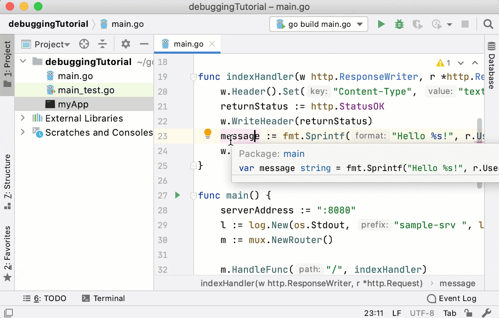


## 附加到Docker容器中的进程

​	您可以将调试器附加到在Docker容器中运行的Go进程。有关Docker的更多信息，请参阅[Docker](https://www.jetbrains.com/help/go/docker.html)。

​	为了示例目的，您可以使用以下Dockerfile配置用于[此Go应用程序](https://github.com/apronichev/documentation-code-examples/blob/master/debuggingTutorial/main.go)。将**Dockerfile**和**main.go**保存在**$GOPATH/src/debuggingTutorial**中。请注意，\**Dockerfile\**使用**debuggingTutorial**目录。如果您在项目中使用了不同的目录，请在Dockerfile中更改目录名。

### 第1步：创建Dockerfile配置

1. 单击Edit | Run Configurations。或者，单击工具栏上的运行/调试配置列表，然后选择Edit Configurations。

3. 在Run/Debug Configurations对话框中，单击“添加”按钮（)，然后选择“Docker”|“Dockerfile”。

4. 在Dockerfile 字段中，单击Browse 图标（），然后在文件浏览器中导航到**Dockerfile**。如果您使用了本节中的示例，请导航到[此Dockerfile](https://github.com/apronichev/documentation-code-examples/blob/master/debuggingTutorial/Dockerfile)。

4. In the Bind ports field, click the Browse icon (在Bind ports字段中，单击Browse 图标（）。单击“添加”按钮（)。在Host port列中，键入`8080`。在Container port列中，键入`8080`。还要为端口`40000`添加相同的绑定。

   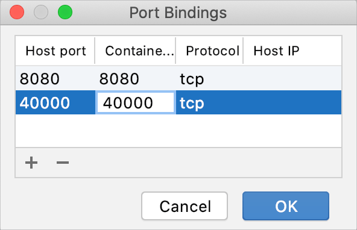

5. 在Run options字段中，为Docker指定命令行选项。对于Dockerfile中提供的示例，请禁用[安全配置文件](https://docs.docker.com/engine/security/apparmor/)并添加`SYS_PTRACE` [Linux功能](https://www.man7.org/linux/man-pages/man7/capabilities.7.html)。

   ```dockerfile
   --security-opt="apparmor=unconfined" --cap-add=SYS_PTRACE
   ```

   

10. 单击OK.

   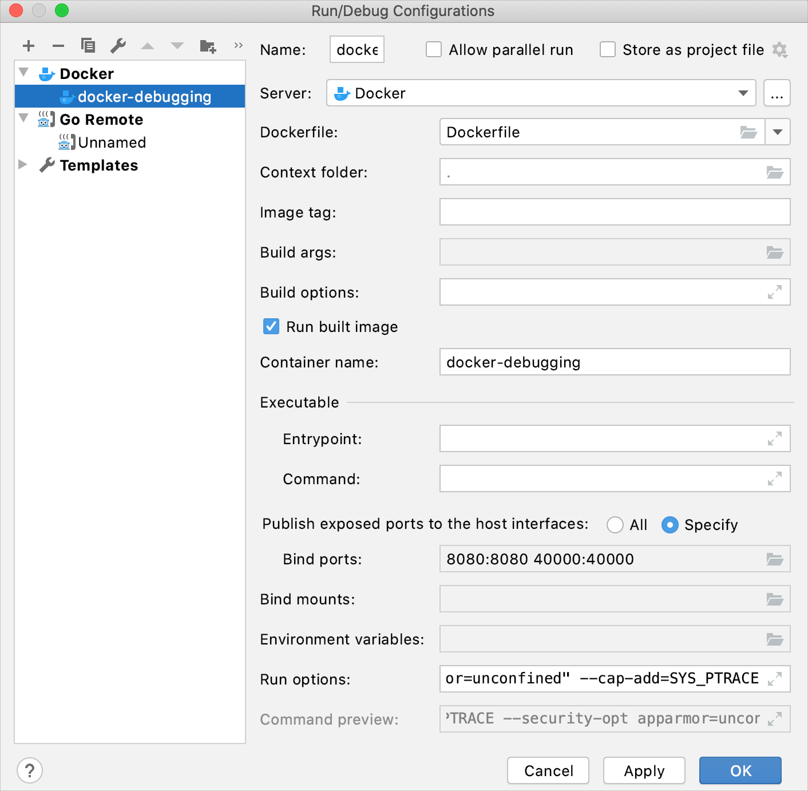

### 第2步：运行Dockerfile配置

- 从工具栏上的运行/调试配置列表中，选择[创建的Dockerfile配置](https://www.jetbrains.com/help/go/attach-to-running-go-processes-with-debugger.html#step-1-create-a-dockerfile-configuration)，然后单击“运行<configuration_name>”按钮（)。

  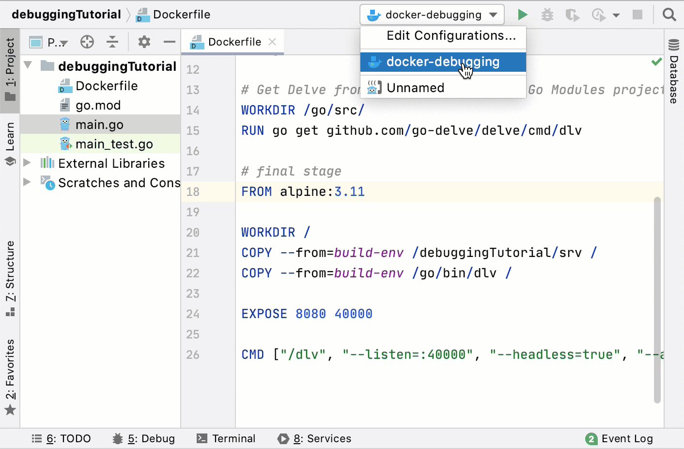

### 第3步：创建Go Remote运行/调试配置

1. 单击Edit | Run Configurations。或者，单击工具栏上的运行/调试配置列表，然后选择Edit Configurations。

3. 在Run/Debug Configurations对话框中，单击Add 按钮（)，然后选择Go Remote。

4. 在Host 字段中，键入主机IP地址（例如，`localhost`）。

7. 在Port 字段中，键入您配置的调试器端口。在提供的示例中，它是`40000`。

9. 单击 OK.

   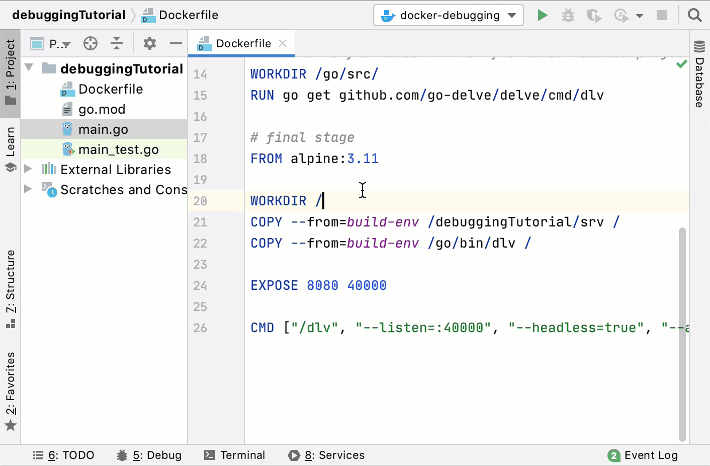

### 第4步：开始调试过程 

1. 在Services 工具窗口（View | Tool Windows | Services）中，展开Docker | Containers。确保创建的容器正在运行并侦听预配置的调试器端口。

3. 单击代码行附近的gutter，将断点放置在其中。例如，在[提供的代码示例](https://github.com/apronichev/documentation-code-examples/blob/master/debuggingTutorial/main.go)中，在第23行（`message := fmt.Sprintf("Hello %s!", r.UserAgent())`）上设置断点。有关断点的更多信息，请参阅[断点](https://www.jetbrains.com/help/go/using-breakpoints.html)。

5. 从工具栏上的运行/调试配置列表中，选择[创建的Go Remote配置](https://www.jetbrains.com/help/go/attach-to-running-go-processes-with-debugger.html#step-3-create-the-go-remote-run-debug-configuration)，然后单击Debug <configuration_name>按钮（)。或者，按下Alt+Shift+F9，选择创建的Go Remote配置。

4. 触发应用程序中设置的断点处的事件。如果使用了[提供的代码示例](https://github.com/apronichev/documentation-code-examples/blob/master/debuggingTutorial/main.go)，请在浏览器中打开`http://localhost:8080/`链接。

   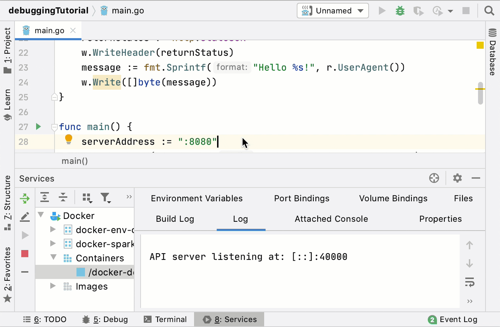


## 提高生产力的技巧

### 终止远程进程

- 在远程调试会话期间，您可以按Ctrl+F2键终止远程进程。请注意，终止进程后将无法重新附加到该进程。

  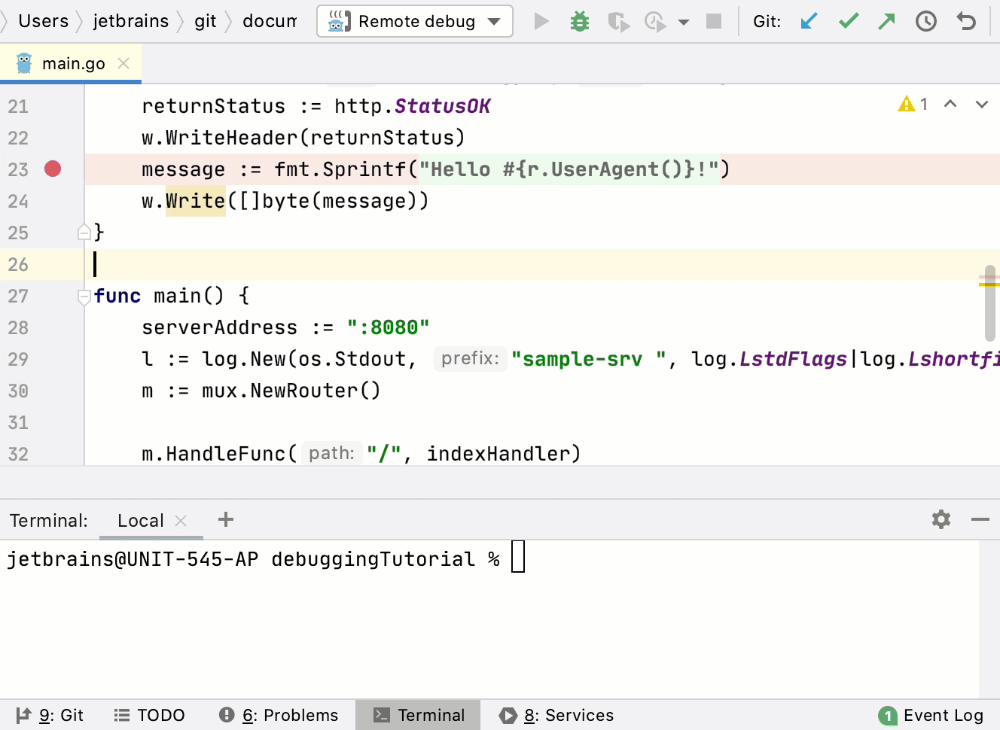
