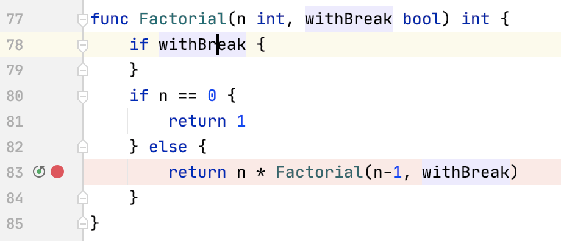
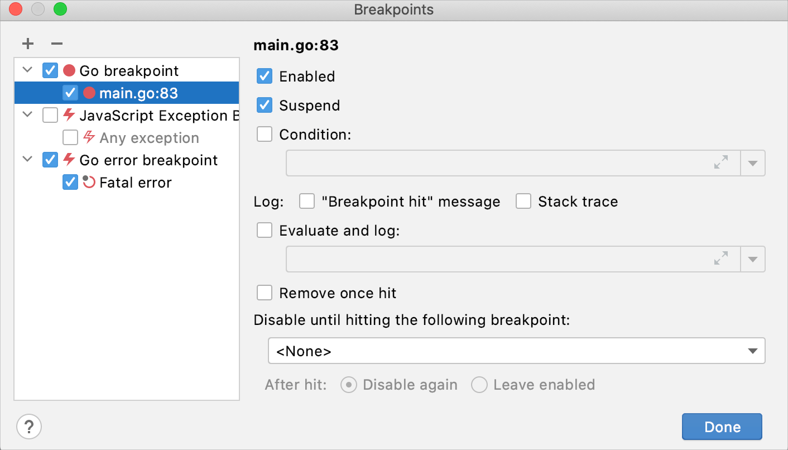
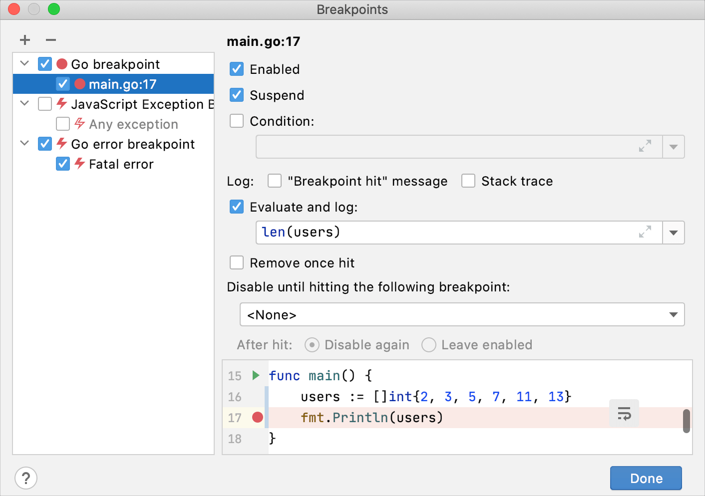

+++
title = "断点"
weight = 10
date = 2023-06-20T10:40:58+08:00
type = "docs"
description = ""
isCJKLanguage = true
draft = false

+++
# Breakpoints 断点

https://www.jetbrains.com/help/go/using-breakpoints.html

Last modified: 03 May 2023

最后修改日期：2023年5月3日

​	断点是在特定点暂停程序执行的特殊标记。这使您可以检查程序的状态和行为。断点可以是简单的（例如，在达到某行代码时暂停程序），也可以涉及更复杂的逻辑（检查[附加条件](https://www.jetbrains.com/help/go/using-breakpoints.html#breakpoint_condition)，编写[日志消息](https://www.jetbrains.com/help/go/using-breakpoints.html#log)等）。

​	一旦设置了断点，在您明确删除之前，它将一直存在于您的项目中，除非是[临时断点](https://www.jetbrains.com/help/go/using-breakpoints.html#remove_once_hit)。

> ​	如果带有断点的文件在外部被修改，例如通过版本控制系统（VCS）进行更新或在外部编辑器中更改，并且行号已更改，则断点将相应移动。请注意，在进行此类更改时，GoLand 必须正在运行，否则将不会注意到这些更改。

## 断点的类型

​	在 GoLand 中提供了以下类型的断点： 

- 行断点：在达到设置断点的代码行时暂停程序。可以在任何可执行的代码行上设置此类型的断点。
- 异常断点：在 `panic()` 抛出时暂停程序。

## 设置断点

### 设置行断点

- 在您想设置断点的可执行代码行的沟槽处单击。或者，将光标放在该行上，然后按 Ctrl+F8。

  

### 设置异常断点

1. 在调试工具窗口的左侧部分单击View Breakpoints按钮，或按 Ctrl+Shift+F8。

2. 在Breakpoints 对话框中，选择Go error breakpoint或 JavaScript Exception Breakpoint。

   

## 管理断点

### 删除断点

- 对于非异常断点：在沟槽上单击断点。
- 对于所有断点：从主菜单中选择Run | View Breakpoints(Ctrl+Shift+F8)，选择断点，然后单击Remove Delete。

​	为了避免意外删除断点并丢失其参数，您可以选择通过将其拖到编辑器或单击鼠标中键来删除断点。要执行此操作，转到Settings | Build, Execution, Deployment | Debugger并选择Drag to the editor or click with middle mouse button。然后，单击断点将会[启用或禁用](https://www.jetbrains.com/help/go/using-breakpoints.html#disable)它。

### 静音断点

​	如果您在一段时间内不需要在断点处停下来，您可以将其静音（mute ）。这样可以在不离开调试器会话的情况下恢复正常的程序操作。之后，您可以取消静音断点并继续调试。 

- 单击调试工具窗口工具栏中的Mute Breakpoints按钮 。

### 启用/禁用断点

​	当您删除断点时，会丢失其[内部配置](https://www.jetbrains.com/help/go/using-breakpoints.html#breakpoint-properties)。要在不丢失其参数的情况下暂时关闭单个断点，可以禁用它： 

- 对于非异常断点：右键单击断点，根据需要设置“启用”选项。如果鼠标中键未[分配](https://www.jetbrains.com/help/go/using-breakpoints.html#remove)删除断点，则还可以使用鼠标中键切换断点的启用状态。
- 对于所有断点：单击View Breakpoints(Ctrl+Shift+F8)，在列表上选中或取消选中断点。

### 移动/复制断点

- 要移动断点，将其拖动到另一行。
- 要复制断点，按住 Ctrl 键并将断点拖动到另一行。这会在目标位置创建具有相同参数的断点。

## 配置断点属性

​	根据断点类型，您可以配置其他属性，以满足特定需求。最常用的选项可通过[意图](https://www.jetbrains.com/help/go/using-breakpoints.html#intentions)访问。 

- 要访问断点意图，请将插入符号放置在带有断点的行上，然后按 Alt+Enter。当您需要快速配置基本断点属性时，可以使用此选项。
- 要访问完整的属性列表，请右键单击断点，然后单击“更多”或按 Ctrl+Shift+F8。使用此选项可以全面查看所有断点并完全控制其配置。

### 意图参考

| 意图     | 描述                                                         |
| -------- | ------------------------------------------------------------ |
| 移除断点 | [移除](https://www.jetbrains.com/help/go/using-breakpoints.html#remove)所选行上的断点。 |
| 禁用断点 | [禁用](https://www.jetbrains.com/help/go/using-breakpoints.html#disable)所选行上的断点。 |
| 编辑断点 | 打开具有最常用的[属性](https://www.jetbrains.com/help/go/using-breakpoints.html#properties)的对话框。要查看更多属性，请单击“更多”或按 Ctrl+Shift+F8。 |

### 断点属性

#### 启用

​	清除复选框以临时禁用项目中的断点，而无需将其删除。禁用的断点在[步进](https://www.jetbrains.com/help/go/stepping-through-the-program.html)过程中会被跳过。

​	您可以配置 GoLand，使其在点击时启用/禁用断点，而不是完全删除它们。要这样做，转到Settings | Build, Execution, Deployment | Debugger，并将Remove breakpoint选项设置为Drag to the editor or click with middle mouse button。

#### 暂停 Suspend

​	指定是否在命中断点时暂停程序执行。

​	当您需要记录某些表达式而不暂停程序时（例如，当您需要知道某个方法被调用的次数）或者当您需要创建一个在命中时启用[依赖断点](https://www.jetbrains.com/help/go/using-breakpoints.html#disable-until-hit)的主断点时，非暂停断点非常有用。

#### 条件

​	此选项用于指定每次命中断点时检查的条件。如果条件评估为 `true`，则执行所选操作。否则，忽略断点。

> ​	条件必须在设置断点的行上有效。

​	表达式的结果取自返回语句。当没有返回语句时，结果取自代码的最后一行。

​	在评估表达式时，请确保您了解其可能的副作用，因为它们可能会影响程序的行为和/或结果。

#### 日志选项

​	当命中断点时，以下内容可以记录到控制台：

- "Breakpoint hit"消息：类似于 `Breakpoint reached` 的日志消息。

- 栈跟踪：当前帧的栈跟踪。如果您想要检查导致此点的路径而不中断程序执行，这将非常有用。

- 评估和记录：任意表达式的结果，例如 `"Initializing"` 或 `len(users)`。

  

  表达式的结果取自返回语句。当没有返回语句时，结果取自代码的最后一行，该行甚至不必是一个表达式：文字也可以。这可用于生成自定义消息或在程序执行时跟踪某些值。

  在评估表达式时，请确保您了解其可能的副作用，因为它们可能会影响程序的行为和/或结果。

#### 命中后移除

​	指定是否在命中断点后从项目中删除断点。

#### 命中特定断点前禁用

​	在Disable until hitting the following breakpoint框中选择断点时，它将充当当前断点的触发器。这会在命中指定的断点之前[禁用](https://www.jetbrains.com/help/go/using-breakpoints.html#enabled)当前断点。

​	您还可以选择在此发生后再次禁用它，或者保持其启用状态。

​	此选项在仅需要在特定条件或操作后暂停程序时非常有用。在这种情况下，通常不需要触发断点来停止程序执行，并且将其设置为[非暂停](https://www.jetbrains.com/help/go/using-breakpoints.html#suspend_policy)。

## 断点状态

​	断点可以具有以下状态：

| 状态   | 描述                                                         |
| ------ | ------------------------------------------------------------ |
| 无效   | 如果在断点行上没有可执行代码，调试器会将其标记为无效。这是最常见的原因是断点所在行上没有可执行的代码。 |
| 静音   | 所有断点都处于临时非活动状态，因为它们已被[静音](https://www.jetbrains.com/help/go/using-breakpoints.html#mute)。 |
| 禁用   | 此断点处于临时非活动状态，因为它已被[禁用](https://www.jetbrains.com/help/go/using-breakpoints.html#disable)。 |
| 非暂停 | 为该断点设置了[暂停策略](https://www.jetbrains.com/help/go/using-breakpoints.html#suspend_policy)，因此在命中时不会暂停执行。 |

## 断点图标

​	根据其[类型](https://www.jetbrains.com/help/go/using-breakpoints.html#breakpoint-types)和[状态](https://www.jetbrains.com/help/go/using-breakpoints.html#breakpoint-statuses)，断点的图标有以下标记：

|                              | 行                                                           | 异常                                                         |
| ---------------------------- | ------------------------------------------------------------ | ------------------------------------------------------------ |
| Regular 常规                 |  |  |
| Disabled 已禁用              |  |  |
| Muted  静音                  |  |                                                              |
| Muted disabled  已静音已禁用 |  |                                                              |
| Non-suspending  非暂停       |  |                                                              |
| Invalid  无效                |  |                                                              |

## 提高效率的提示

### 使用断点进行调试打印

​	使用[非暂停](https://www.jetbrains.com/help/go/using-breakpoints.html#suspend_policy)的[日志记录](https://www.jetbrains.com/help/go/using-breakpoints.html#log)断点（在其他调试器中有时称为 watchpoints）代替在代码中插入打印语句。这提供了一种更灵活和集中处理调试日志消息的方式。

### 更快地设置日志记录断点

​	要设置[非暂停](https://www.jetbrains.com/help/go/using-breakpoints.html#suspend_policy)的[日志记录](https://www.jetbrains.com/help/go/using-breakpoints.html#log)断点，按住 Shift 键并单击沟槽（gutter）。这不会暂停程序执行，而是记录一条消息，如`Breakpoint reached`。如果您想记录编辑器中当前的某个表达式，请在按住 Shift 键并单击沟槽之前先选择该表达式。

### 添加断点描述

​	如果您的项目中有很多断点，您可以为断点添加描述以便于搜索。要做到这一点，右键单击断点对话框中的断点（Ctrl+Shift+F8），然后从菜单中选择Edit description。现在，当您开始输入断点名称时，它将获得焦点。

### 分组断点 

​	您可以将断点分组，例如，如果您需要为特定问题标记出断点。要做到这一点，在断点对话框（Ctrl+Shift+F8）中选择要放置在分组中的断点，然后从菜单中选择Move to group。
