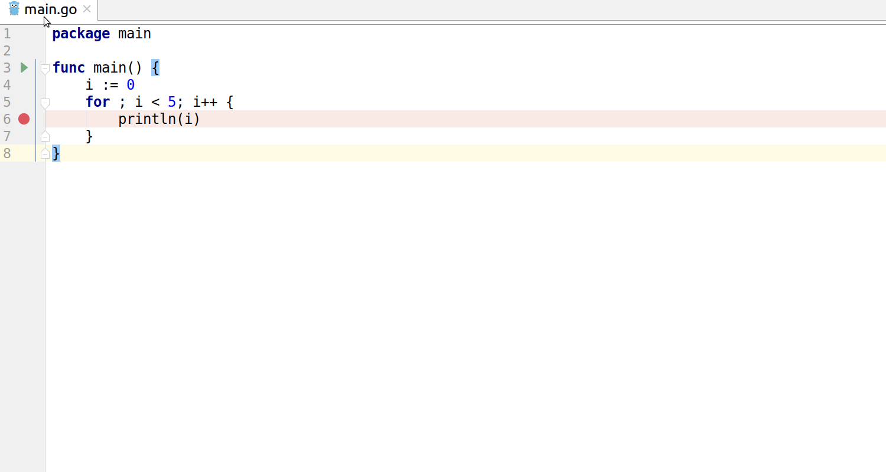
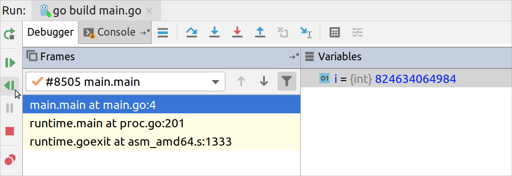
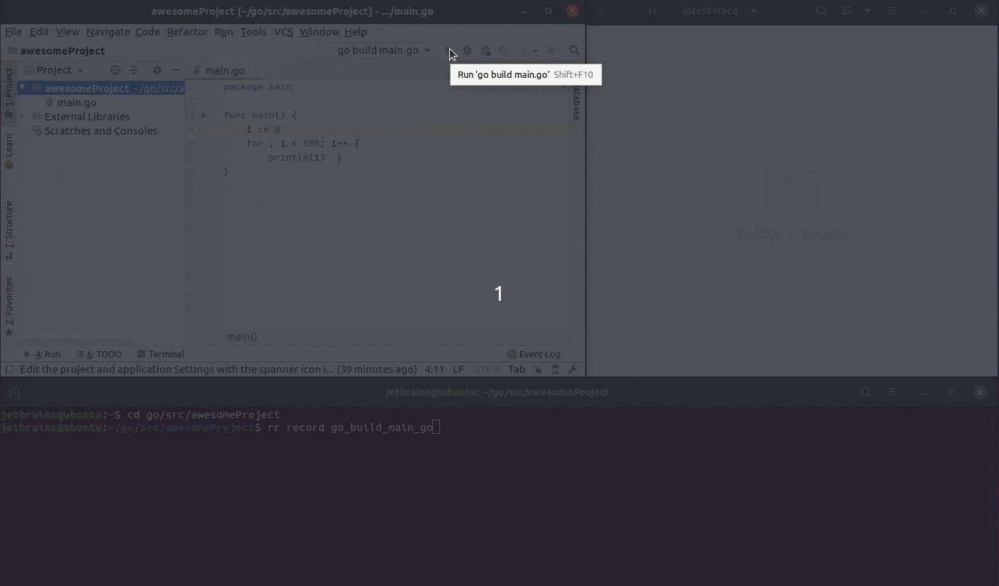
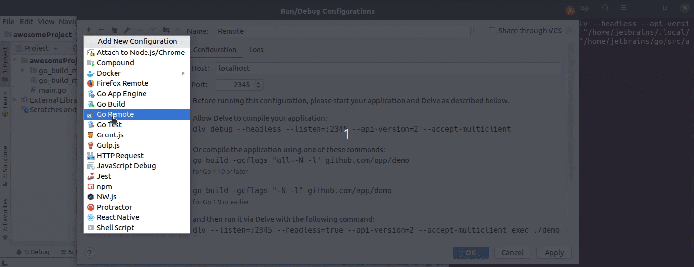

+++
title = "使用Mozilla rr进行调试"
weight = 70
date = 2023-06-20T10:40:58+08:00
type = "docs"
description = ""
isCJKLanguage = true
draft = false

+++
# Debugging with Mozilla rr 使用Mozilla rr进行调试

https://www.jetbrains.com/help/go/debugging-with-mozilla-rr.html

Last modified: 16 January 2023

最近修改：2023年1月16日

Mozilla rr and its features are available only on Linux machines.

​	Mozilla rr及其功能仅适用于Linux机器。

Ensure that your CPU is compatible with Mozilla rr. See the list of limitations at [the official Mozilla rr site](https://rr-project.org/) in the Limitations section.

​	请确保您的CPU与Mozilla rr兼容。在Mozilla rr的官方网站的限制部分查看限制列表：[官方Mozilla rr网站](https://rr-project.org/)。

Mozilla rr is a tool that you can use to record, replay, and debug applications. The main idea of Mozilla rr is to help you catch non-trivial bugs.

​	Mozilla rr是一个工具，您可以使用它来记录、重放和调试应用程序。Mozilla rr的主要思想是帮助您捕获非平凡的错误。

Mozilla rr records the whole program execution. It means that you can debug the recorded trace only when the program ends its execution. For servers and other long-running applications, you must terminate the running application (for example, by sending the SIGTERM signal from the console). After the recording, you can replay the execution in the debugger as many times as you need. Read more about Mozilla rr on the [official Mozilla rr site](https://rr-project.org/).

​	Mozilla rr记录了整个程序执行过程。这意味着您只能在程序结束执行时调试记录的跟踪。对于服务器和其他长时间运行的应用程序，您必须终止正在运行的应用程序（例如通过控制台发送SIGTERM信号）。记录完成后，您可以在调试器中重放执行过程，按需多次进行。详细了解Mozilla rr，请访问[官方Mozilla rr网站](https://rr-project.org/)。

### 使用Mozilla rr调试代码 Debug code with Mozilla rr

1. Install Mozilla rr. For installation instructions, see the [Building And Installing](https://github.com/mozilla/rr/wiki/Building-And-Installing).
2. 安装Mozilla rr。有关安装说明，请参阅[构建和安装](https://github.com/mozilla/rr/wiki/Building-And-Installing)。
3. In GoLand, set a breakpoint. To set a breakpoint, click the gutter near the code line where you want the debugger to stop code execution. For more information about breakpoints, see [Debugging](https://www.jetbrains.com/help/go/debugging-code.html) and [Breakpoints](https://www.jetbrains.com/help/go/using-breakpoints.html).
4. 在GoLand中设置断点。要设置断点，请单击希望调试器停止代码执行的代码行旁边的装订线。有关断点的更多信息，请参阅[调试](https://www.jetbrains.com/help/go/debugging-code.html)和[断点](https://www.jetbrains.com/help/go/using-breakpoints.html)。
5. Click the Run icon (在装订线上单击运行图标（) in the gutter and select Record and Debug <configuration_name>. In the Debugger tool window, you can see a status of variables, processes, and threads on different stages of code execution.)，然后选择“Record and Debug <configuration_name>”。在调试器工具窗口中，您可以查看不同代码执行阶段的变量、进程和线程的状态。

### 导航浏览记录的跟踪  Navigate through the recorded trace

1. 转到 Run | Debug Saved Trace.
2. In the Trace directory field, specify a path to the trace directory.
3. 在“跟踪目录”字段中，指定跟踪目录的路径。
4. Click OK.
5. 单击OK。
6. In the Debugger tool window, click the Resume Program icon 在调试器工具窗口中，单击“继续执行程序”图标 to continue program execution, or click the Rewind icon below to run the debug session backwards until the previous breakpoint.，以继续程序的执行，或单击下方的“倒带”图标，以向后运行调试会话，直到前一个断点。

### 收集Mozilla rr跟踪  Collecting Mozilla rr traces

1. Build an executable by using the Go build run/debug configuration. To easily find the executable, specify the current project directory in the Output directory field of the Go build configuration. For more information about creating run/debug configurations, see [Create a run/debug configuration](https://www.jetbrains.com/help/go/run-debug-configuration.html#createExplicitly).

2. 使用Go构建运行/调试配置来构建一个可执行文件。为了方便找到可执行文件，请在Go构建配置的“输出目录”字段中指定当前项目目录。有关创建运行/调试配置的更多信息，请参阅[创建运行/调试配置](https://www.jetbrains.com/help/go/run-debug-configuration.html#createExplicitly)。

3. Open the terminal and run the following Mozilla rr command: `rr record <path_to_the_application_executable>`

4. 打开终端并运行以下Mozilla rr命令：`rr record <path_to_the_application_executable>`

   As a result, the Mozilla rr trace files appear in the following folder: **~/.local/share/rr/<executable_name>**

   结果，Mozilla rr跟踪文件将出现在以下文件夹中：**~/.local/share/rr/<executable_name>**

   

### 使用Mozilla rr进行远程调试  Remote debugging with Mozilla rr

1. On the remote machine, [collect the Mozilla rr trace](https://www.jetbrains.com/help/go/debugging-with-mozilla-rr.html#collecting-mozilla-rr-traces).

2. 在远程机器上[收集Mozilla rr跟踪](https://www.jetbrains.com/help/go/debugging-with-mozilla-rr.html#collecting-mozilla-rr-traces)。

3. On the remote machine, start the debugger by opening the terminal and running the following command: `dlv --headless --api-version=2 -l localhost:2345 replay /path/to/trace/dir /path/to/binary`

4. 在远程机器上，通过打开终端并运行以下命令启动调试器：`dlv --headless --api-version=2 -l localhost:2345 replay /path/to/trace/dir /path/to/binary`。

5. On the local machine, create the Go Remote run/debug configuration. In the Go Remote configuration, specify the remote machine IP address and port. For more information about creating run/debug configurations, see [Create a run/debug configuration](https://www.jetbrains.com/help/go/run-debug-configuration.html#createExplicitly).

6. 在本地机器上，创建Go远程运行/调试配置。在Go远程配置中，指定远程机器的IP地址和端口。有关创建运行/调试配置的更多信息，请参阅[创建运行/调试配置](https://www.jetbrains.com/help/go/run-debug-configuration.html#createExplicitly)。

7. On the local machine, ensure that the Go Remote run/debug configuration is selected in the configurations list.

8. 在本地机器上，确保在配置列表中选择了Go远程运行/调试配置。

9. On the local machine, click Run | Debug <remote_configuration_name>. Alternatively, press Shift+F9.

10. 在本地机器上，单击“运行” | “调试<remote_configuration_name>”。或者按下Shift+F9。

   

