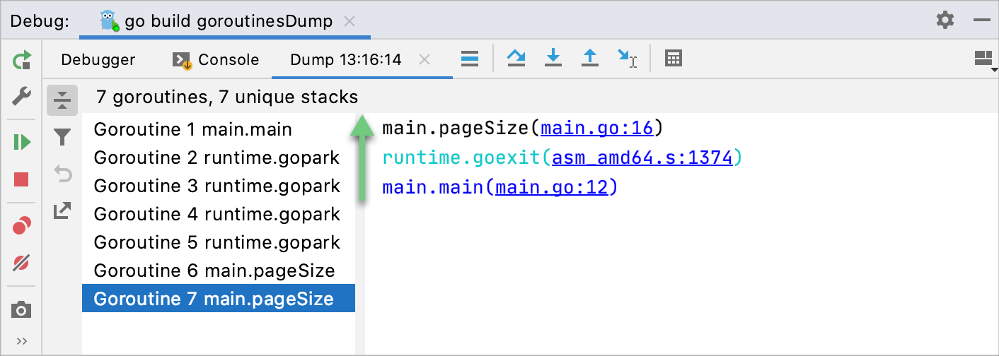

+++
title = "检查挂起的程序"
weight = 30
date = 2023-06-20T10:40:58+08:00
type = "docs"
description = ""
isCJKLanguage = true
draft = false

+++
# Examine suspended program 检查挂起的程序

https://www.jetbrains.com/help/go/examining-suspended-program.html

Last modified: 12 April 2023

最后修改日期：2023年4月12日

After the debugger session has [started](https://www.jetbrains.com/help/go/starting-the-debugger-session.html), the [Debug](https://www.jetbrains.com/help/go/debug-tool-window.html) tool window will appear, and the program will run normally until one of the following happens:

​	调试器会话启动后，[调试](https://www.jetbrains.com/help/go/debug-tool-window.html)工具窗口将出现，程序将正常运行，直到发生以下情况之一： 

- a [breakpoint](https://www.jetbrains.com/help/go/using-breakpoints.html) is hit
- you manually pause the program
- 触发了一个[断点](https://www.jetbrains.com/help/go/using-breakpoints.html)
- 手动暂停了程序

After that, the program is suspended, allowing you to examine its current state, control its further execution, and test various scenarios at runtime.

​	之后，程序被暂停，允许您检查其当前状态，控制其进一步执行，并在运行时测试各种场景。

> If you accidentally closed the Debug tool window, select View | Tool Windows | Debug from the main menu or press Alt+5 to reopen it.
>
> ​	如果意外关闭了调试工具窗口，请从主菜单中选择"View | Tool Windows | Debug"或按下Alt+5重新打开它

## Examine frames 检查帧

The state of the program is represented by frames. When the program is suspended, the current frame stack is displayed on the Frames tab of the Debug tool window.

​	程序的状态由帧表示。当程序被暂停时，当前帧堆栈会显示在调试工具窗口的"Frames"选项卡中。

A frame corresponds to the active method or function call. It stores the local variables of the called method or function, its arguments, and the code context that enables expression evaluation.

​	每个帧对应于活动的方法或函数调用。它存储被调用方法或函数的局部变量、参数以及启用表达式求值的代码上下文。

To better understand the concept of frames, let's look into what happens when a program is run. The execution of the program starts from the `main` method, which in turn calls other methods. Each of these methods may do more method calls. The set of local variables and parameters for each method call is represented by a frame. Each time a method is called, a new frame is added to the top of the stack. When the execution of a method is complete, the corresponding frame is removed from the stack (in the last in, first out fashion).

​	为了更好地理解帧的概念，让我们来看看程序运行时发生了什么。程序的执行从`main`方法开始，然后调用其他方法。这些方法中的每一个可能会进行更多的方法调用。每个方法调用的局部变量和参数集由一个帧表示。每次调用方法时，一个新的帧会添加到堆栈的顶部。当方法的执行完成时，对应的帧会从堆栈中移除（采用先进后出的方式）。

Examining frames helps you understand why particular parameters were passed to a method and what the state of the caller was at the time of calling.

​	检查帧可以帮助您理解为什么会将特定参数传递给方法，以及在调用时调用者的状态如何。

### 将堆栈复制到剪贴板  Copy stack to clipboard

- To copy the call stack for the current thread, right-click anywhere on the Frames tab and select Copy Stack.
- 要复制当前线程的调用堆栈，请在"Frames"选项卡的任意位置右键单击，然后选择"Copy Stack"。

### 依次在一个选项卡中预览帧 Preview frames in one tab successively

The preview tab allows you to open files successively in one tab. This way you avoid cluttering the editor with multiple open files in separate tabs.

​	预览选项卡允许您在一个选项卡中依次打开文件，这样可以避免在单独的选项卡中打开多个文件时导致编辑器混乱。

- To enable the preview mode for files that are opened during debugging, open settings by pressing Ctrl+Alt+S, navigate to Editor | General | Editor Tabs and select the Enable preview tab checkbox.

- 要为在调试过程中打开的文件启用预览模式，请按下Ctrl+Alt+S打开设置，然后导航到"Editor | General | Editor Tabs"，选择"Enable preview tab"复选框。

  

  Gif

### 隐藏对象类型 Hide object types

- If object types take up too much space in the Debug tool window, right-click a variable and clear the Show Types option in the list that appears.

- 如果对象类型在调试工具窗口中占用太多空间，请右键单击变量，然后在显示的列表中清除"Show Types"选项。

  

## 在转储选项卡中筛选 Goroutine 列表 Filter a list of goroutines in the dump tab

You can create a dump of all the goroutines that your program uses, apply a filter that searches for a specific goroutine, and study the filtered results. This procedure can help you to better understand how your program or its part works.

​	您可以创建一个包含程序使用的所有 Goroutine 的转储，应用筛选器来搜索特定的 Goroutine，并研究筛选结果。这个过程可以帮助您更好地理解程序或其部分的工作原理。

For example, the following screenshot shows the execution stack of the `Goroutine 7 main.pageSize`. A goroutine name in the goroutines list is 'Goroutine <ID> <last_non-runtime_function_on_the_stack>. Non-runtime means that the function is not in the runtime package.

​	例如，下面的截图显示了`Goroutine 7 main.pageSize`的执行堆栈。Goroutine 列表中的 Goroutine 名称为"Goroutine <ID> <last_non-runtime_function_on_the_stack>"。非运行时意味着该函数不在运行时包中。

### 转储 Goroutine Dump goroutines

- During the debuging session, click the Dump Goroutines button ( 在调试会话期间，单击"Dump Goroutines"按钮 ().)。

  A dump of available goroutines and their stacks opens in a separate tab.

  打开一个包含可用 Goroutine 及其堆栈的转储的新选项卡。
  
  

### 筛选转储结果 Filter the dump results

- Click the Filter icon ( 单击筛选器图标 (). In the Filter field, type a string that you want to search for.)。在筛选字段中输入要搜索的字符串。

  

- Right-click a goroutine that you want to exclude from the list and select Hide goroutine. To hide all the goroutines that have the same stack as the selected goroutine, select Hide goroutines with the same stack from the context menu.

- 右键单击要从列表中排除的 Goroutine，并选择"Hide goroutine"。要隐藏与所选 Goroutine 具有相同堆栈的所有 Goroutine，请选择上下文菜单中的"Hide goroutines with the same stack"。

  You can view hidden goroutines under the Hidden list.

  您可以在"Hidden"列表下查看隐藏的 Goroutine。

  To reset the state of the list and make all the hidden goroutines in the visible list again, click the Reset Hidden Goroutines button (要重置列表的状态并将所有隐藏的 Goroutine 再次显示在可见列表中，请单击"Reset Hidden Goroutines"按钮 ().)。
  
  

### 将转储结果导出为文本文件 Export dump results into a text file

1. Click the Export to Text File icon (单击"Export to Text File"图标 ().)。
2. In the Export to file field, select a storage path and click Save.在"Export to file"字段中选择存储路径，然后单击"Save"。

## 检查/更新变量 Examine/update variables

The Variables tab shows the list of the variables in the selected [frame/thread](https://www.jetbrains.com/help/go/examining-suspended-program.html#examine-frames). The examination of variables is instrumental to understanding why the program operates in a certain way.

​	"Variables"选项卡显示所选[帧/线程](https://www.jetbrains.com/help/go/examining-suspended-program.html#examine-frames)中的变量列表。检查变量有助于理解程序为什么以某种方式运行。

> Be mindful of variable scope and lifetime. If a variable is not present on the list, this means the variable is out of scope for the current [frame](https://www.jetbrains.com/help/go/examining-suspended-program.html#examine-frames) at the current execution point.
>
> ​	请注意变量的范围和生存周期。如果变量不在列表中，这意味着变量对于当前[帧](https://www.jetbrains.com/help/go/examining-suspended-program.html#examine-frames)在当前执行点不可见。

The icon on the left of each variable indicates its type.

​	每个变量左侧的图标表示其类型。

### 变量类型 Variable types

| 图标Icon                                                     | 描述 Description                                             |
| ------------------------------------------------------------ | ------------------------------------------------------------ |
|  | Static members of the enclosing type 封闭类型的静态成员      |
|   | Fields of an object (both static and nonstatic) 对象的字段（包括静态和非静态字段） |
|  | Fields containing a self-referencing object (for example, `cause` in `Throwable` before the field gets initialized) 包含自引用对象的字段（例如，在字段初始化之前的 `Throwable` 中的 `cause`） |
|  | Final fields 终态字段                                        |
|  | Static fields 静态字段                                       |
|  | A thrown exception (only displayed when an [exception breakpoint](https://www.jetbrains.com/help/go/using-breakpoints.html) was hit) 抛出的异常（仅当命中[异常断点](https://www.jetbrains.com/help/go/using-breakpoints.html)时显示） |
|  | A method return value (only displayed when the Show Method Return Values option is enabled) 方法返回值（仅在启用"Show Method Return Values"选项时显示） |
|  | Method parameters 方法参数                                   |
|  | Enum constants 枚举常量                                      |
|  | Local arrays 本地数组                                        |
|  | Local primitive types 本地基本类型                           |
|  | [Watches](https://www.jetbrains.com/help/go/examining-suspended-program.html#watches) and auto-variables. [观察表达式](https://www.jetbrains.com/help/go/examining-suspended-program.html#watches)和自动变量 |
|  | Local reference variables 本地引用变量                       |

### 复制变量 Copy variables

When examining variables, you may need to copy a variable name or value to paste it somewhere else or to [compare](https://www.jetbrains.com/help/go/examining-suspended-program.html#compare) it with another variable.

​	在检查变量时，您可能需要复制变量名称或值，以便将其粘贴到其他地方或与另一个变量进行[比较](https://www.jetbrains.com/help/go/examining-suspended-program.html#compare)。 

- To copy the value that a variable holds, right-click the variable and select Copy Value Ctrl+C.
- To copy the name of a variable, right-click the variable and select Copy Name.
- 要复制变量持有的值，请右键单击变量，然后选择"Copy Value" Ctrl+C。
- 要复制变量的名称，请右键单击变量，然后选择"Copy Name"。

### 与剪贴板比较变量 Compare variables with clipboard

When you need to compare a variable value with some other value, use the Compare Value with Clipboard option. This is helpful, for example, when a variable holds a long string, and you need to compare it with another long string.

​	当您需要将变量值与其他值进行比较时，请使用“使用剪贴板比较值”选项。例如，当一个变量保存一个较长的字符串，并且您需要将其与另一个较长的字符串进行比较时，这将非常有帮助。

1. Copy the content you are going to compare (for example, from a text file).

2. 复制您要比较的内容（例如，从文本文件中）。

   

3. In the Variables tab, right-click the variable which you are going to compare with and select Compare Value with Clipboard.

4. 在“Variables”选项卡中，右键单击要与之进行比较的变量，并选择“使用剪贴板比较值”。

5. Examine the differences in the Diff Viewer that opens. For additional information on how to efficiently use the Diff Viewer, refer to the [Comparing Files and Folders](https://www.jetbrains.com/help/go/comparing-files-and-folders.html) topic.

6. 检查打开的“Diff Viewer”中的差异。有关如何有效使用“Diff Viewer”的更多信息，请参阅[比较文件和文件夹](https://www.jetbrains.com/help/go/comparing-files-and-folders.html)主题。

   

### 在专用对话框中查看变量 View variables in a dedicated dialog

GoLand allows you to inspect variables in a dedicated dialog. This is useful when you need to keep track of some variable (or the object whose reference it holds) and at the same time be able to navigate between frames and goroutines.

​	GoLand允许您在专用对话框中检查变量。当您需要跟踪某个变量（或其引用的对象）并能够在帧和goroutine之间导航时，这将非常有用。

- Right-click a variable on the Variables tab and select Inspect.

- 在“Variables”选项卡上右键单击一个变量，然后选择“Inspect”。

  

### 设置变量值 Set variable values

If there is a need to test how the program would behave in certain conditions or fix its current behavior at runtime, you can do that by setting/changing the variable values.

​	如果需要在运行时测试程序在特定条件下的行为或修复其当前行为，您可以通过设置/更改变量值来实现。 

1. Right-click a variable on the Variables tab and select Set Value, or select the variable and press F2.
2. Enter the value for the variable and press Enter.
3. 在“Variables”选项卡上右键单击一个变量，然后选择“Set Value”，或者选择该变量并按下F2键。
4. 输入变量的值，然后按Enter键。

### 导航到源代码 Navigate to source code

If you need to look into the source code where some variable or type is declared, you can move there right from the Variables tab.

​	如果您需要查看某个变量或类型的源代码声明位置，可以直接从“Variables”选项卡跳转到那里。

- To navigate to the code where the variable is declared, right-click a variable and select Jump to Source F4.

- 要导航到变量声明的代码位置，请右键单击变量，然后选择“Jump to Source F4”。

  

- To navigate to the type declaration of the variable type, right-click a variable and select Jump to Type Source F4.

- 要导航到变量类型的声明位置，请右键单击变量，然后选择“Jump to Type Source F4”。

  

## 评估表达式 Evaluate expressions

GoLand lets you evaluate expressions during a debugging session to obtain additional details about the program state or test various scenarios at runtime.

​	在调试会话期间，GoLand允许您评估表达式，以获取有关程序状态的其他详细信息或在运行时测试各种场景。

> When evaluating expressions, be mindful of variable scope and lifetime. All expressions are evaluated in the context of the current execution point.
>
> ​	在评估表达式时，请注意变量的作用域和生命周期。所有表达式都在当前执行点的上下文中进行评估。

### 在编辑器中评估简单表达式 Evaluate a simple expression in the editor

The simplest way to evaluate an expression is to point at it in the code. Although this is the quickest way, it cannot be used for evaluating method calls. This is done for safety as they may produce side effects.

​	评估表达式的最简单方法是在代码中指向它。尽管这是最快捷的方法，但不能用于评估方法调用。这是出于安全考虑，因为它们可能产生副作用。

Use this option when you need to quickly evaluate an expression from the editor.

​	当您需要快速评估编辑器中的表达式时，请使用此选项。

1. Point at the expression which you are going to evaluate. The result of the expression appears in a tooltip.

2. 指向您要评估的表达式。表达式的结果将显示在工具提示中。

   

3. If you need to view child elements of the resulting object, click 如果您需要查看结果对象的子元素，请单击  or press Ctrl+F1.  或按下 Ctrl+F1。

   

If you find value tooltips distracting, you can increase the delay or disable them altogether. To do this, in the Settings dialog (Ctrl+Alt+S), go to Build, Execution, Deployment | Debugger | Data Views and set the Show value tooltip and Value tooltip delay options as required.

​	如果您觉得值工具提示干扰，您可以增加延迟时间或完全禁用它们。要执行此操作，请在设置对话框（Ctrl+Alt+S）中转到构建、执行、部署 | 调试器 | 数据视图，并根据需要设置“显示值工具提示”和“值工具提示延迟”选项。

### 在编辑器中评估复杂表达式 Evaluate a complex expression in the editor

If you want to evaluate an expression in the code that involves a method call, or you want to be specific about which portion of expression to evaluate, use the Quick Evaluate Expression option.

​	如果您想在涉及方法调用的代码中评估表达式，或者您想具体指定要评估的表达式部分，请使用“快速评估表达式”选项。

This option is available only if the program was suspended after hitting a breakpoint (not paused manually).

​	此选项仅在程序在命中断点后挂起时可用（而非手动暂停）。

1. Place the caret at the expression (to evaluate the closest matching expression) or select a portion of it (if you want to be specific about which part of a complex expression to evaluate).

2. 将光标放在表达式上（以评估最接近的匹配表达式），或者选择其一部分（如果您想具体指定要评估的复杂表达式的哪个部分）。

3. Click Run | Debugging Actions | Quick Evaluate Expression Ctrl+Alt+F8. Alternatively, hold Alt and click the selection.

4. 单击“运行” | “调试操作” | “快速评估表达式”（Ctrl+Alt+F8）。或者，按住 Alt 键单击所选内容。

   

> If there are breakpoints inside the method called from the expression, they will be ignored.
>
> 如果表达式调用的方法内部有断点，则将忽略这些断点。

> When calling methods, make sure you are aware of their possible side effects (for example, changes to an outside variable), as they may alter the program flow or result.
>
> ​	在调用方法时，请确保您了解其可能的副作用（例如，对外部变量的更改），因为它们可能会改变程序的流程或结果。

You can configure Quick Evaluate to work for a piece of code on just selecting it (without using the menu/shortcut). Use this option carefully, as you can accidentally call methods when it is enabled.

​	您可以配置快速评估，使其在仅选择代码片段时工作（而无需使用菜单/快捷键）。请谨慎使用此选项，因为在启用时可能会意外调用方法。

To configure Quick Evaluate on code selection, go to Settings | Build, Execution, Deployment | Debugger | Data Views and set the Show value tooltip on code selection option as preferred.

​	要在代码选择中配置快速评估，请转到设置 | 构建、执行、部署 | 调试器 | 数据视图，并设置“在代码选择时显示值工具提示”选项。

### 评估任意表达式 Evaluate arbitrary expressions

Evaluating arbitrary expressions is the most flexible evaluating option. It lets you evaluate any code as long as it is in the context of the current frame. Using it, you can evaluate declarations, method calls, anonymous types, lambdas, loops, and so on.

​	评估任意表达式是最灵活的评估选项。它允许您评估任何代码，只要它处于当前帧的上下文中。使用它，您可以评估声明、方法调用、匿名类型、Lambda 表达式、循环等等。

Use this feature to get additional information about the current state of the program and test various scenarios all within the same debugging session. This saves a lot of time by reducing the number of sessions you have to run.

​	使用此功能可以获取有关程序当前状态的其他信息，并在同一调试会话中测试各种情况，从而节省了运行会话的次数。

> This option is available only if the program was suspended after hitting a breakpoint (not paused manually).
>
> ​	此选项仅在程序在命中断点后挂起时可用（而非手动暂停）。

1. If you want to start with some expression or a variable, which is currently in front of you (for example, in the editor or on the Variables tab, select it.

2. 如果您想从一些表达式或变量开始，这些表达式或变量目前在您面前（例如，在编辑器中或变量选项卡上），请将其选择。

3. Click Run | Debugging Actions | Evaluate Expression Alt+F8. The shortcut may not work on Ubuntu (for correct operation, [adjust the shortcut configuration](https://www.jetbrains.com/help/go/configuring-keyboard-and-mouse-shortcuts.html)).

4. 单击“运行” | “调试操作” | “评估表达式”（Alt+F8）。在 Ubuntu 上，快捷键可能无法正常工作（要正确操作，请[调整快捷键配置](https://www.jetbrains.com/help/go/configuring-keyboard-and-mouse-shortcuts.html)）。

5. In the Evaluate dialog, modify the selected expression or enter a new one in the Expression field. If you are going to evaluate a code fragment, click Expand Shift+Enter.

6. 在“评估”对话框中，修改所选表达式，或在“表达式”字段中输入新表达式。如果要评估代码片段，请单击“展开”（Shift+Enter）。

   > Keep in mind that any variables declared in the body of the expression go out of scope after the expression has been evaluated.
   >
   > ​	请注意，在表达式被评估后，任何在表达式主体中声明的变量都会超出范围。

7. Click Evaluate (Ctrl+Enter for multiline mode). The expression result appears in the Result field.

8. 单击“评估”（多行模式下按下 Ctrl+Enter）。表达式的结果将显示在“结果”字段中。

   The result of the expression is taken from the return statement. When there is no return statement, the result is taken from the last line of code (it does not even have to be an expression: a literal works too). When there is no valid line to take value from, the result is `undefined`. If the specified expression cannot be evaluated, the Result field indicates the reason.

   表达式的结果来自 return 语句。当没有 return 语句时，结果来自代码的最后一行（甚至不必是表达式：字面量也可以）。当没有有效的行可提取值时，结果为“undefined”。如果无法评估指定的表达式，结果字段会显示原因。

   

> If there are breakpoints inside the method called from the expression, they will be ignored.
>
> 如果表达式调用的方法内部有断点，则将忽略这些断点。

> When calling methods, make sure you are aware of their possible side effects (for example, changes to an outside variable), as they may alter the program flow or result.
>
> 在调用方法时，请确保您了解其可能的副作用（例如，对外部变量的更改），因为它们可能会改变程序的流程或结果。

The Evaluate dialog is non-modal, so you can switch the focus back to the editor to copy other variables and expressions. You can also open multiple Evaluate dialogs if necessary.

​	“评估”对话框是非模态的，因此您可以将焦点切回到编辑器中以复制其他变量和表达式。如果需要，您还可以打开多个“评估”对话框。

## 内联查看值 View values inline

GoLand facilitates the debugging process by showing you the values of the variables right next to their usage.

​	GoLand 通过在变量的使用位置旁边显示变量的值来简化调试过程。

Once the variable value has changed, the inline view is updated with the new value and changes its color.

​	一旦变量的值发生变化，内联视图将使用新值更新并改变其颜色。

Inline values view is enabled by default. To turn it off, in the Settings dialog (Ctrl+Alt+S), go to Build, Execution, Deployment | Debugger | Data Views and disable the Show values inline option.

​	默认情况下，启用了内联值视图。要关闭它，请在“设置”对话框（Ctrl+Alt+S）中转到“构建、执行、部署” | “调试器” | “数据视图”，然后禁用“内联显示值”选项。

### 添加内联监视 Add an Inline Watch

If you want the result of some expression to appear on a particular line, you can set up an inline [watch](https://www.jetbrains.com/help/go/examining-suspended-program.html#watches) for that. Inline watches are persistent and remain active after session restart.

​	如果要在特定行上显示某个表达式的结果，可以为该行设置内联[监视](https://www.jetbrains.com/help/go/examining-suspended-program.html#监视)。内联监视是持久的，并在会话重新启动后保持活动状态。

1. Click the inline hint referring to the object whose field you want to track.
2. 单击指向要跟踪字段的内联提示。
3. In the popup, select the field and click Add as Inline Watch.
4. 在弹出窗口中，选择字段，然后单击“添加为内联监视”。
5. Fine-tune the watch if needed. You can use any valid expression as a watch.
6. 如有需要，对监视进行微调。您可以使用任何有效的表达式作为监视。

To remove an inline watch, hover over the watch and click the cross near it.

​	要删除内联监视，请将鼠标悬停在监视上，然后单击旁边的“x”。

Gif

## 监视 Watches

> If you are looking for information on field watchpoints, refer to the [Breakpoints](https://www.jetbrains.com/help/go/using-breakpoints.html) topic.
>
> 如果您要了解有关字段观察点的信息，请参阅[断点](https://www.jetbrains.com/help/go/using-breakpoints.html)主题。

If you want to keep track of some variable or the result of a more complex expression, set up a watch for this variable or expression. This is useful when you need to add something that is not regularly displayed on the list of variables , or to pin some instance variable thus eliminating the need to expand the tree after each [step](https://www.jetbrains.com/help/go/stepping-through-the-program.html).

​	如果您想跟踪某个变量或更复杂的表达式的结果，请为该变量或表达式设置监视。当您需要添加不经常显示在变量列表上的内容，或者固定一些实例变量以消除在每个[步骤](https://www.jetbrains.com/help/go/stepping-through-the-program.html)之后展开树的需要时，这很有用。

This option is available only if the program was suspended after hitting a breakpoint (not paused manually).

​	此选项仅在程序在命中断点后挂起时可用（而非手动暂停）。

> When calling methods, make sure you are aware of their possible side effects (for example, changes to an outside variable), as they may alter the program flow or result.
>
> ​	在调用方法时，请确保您了解其可能的副作用（例如，对外部变量的更改），因为它们可能会改变程序的流程或结果。

Watches are evaluated in the context of the selected frame. Watches cannot be evaluated when they are out of context or when they fail to compile. If this is the case, the watch is marked with the error icon 监视在所选帧的上下文中进行评估。当监视超出上下文或无法编译时，无法对监视进行评估。此时，监视会显示错误图标.

By default, watches are shown together with variables in the Variables tab. To hide/reveal the Watches tab, use the Separate watches button 默认情况下，监视与变量一起显示在“变量”选项卡中。要隐藏/显示“监视”选项卡，使用布局设置菜单中的“单独显示监视”按钮 in the Layout Settings menu.

### 添加监视 Add a watch

1. Click New Watch 在“变量”选项卡上单击“新建监视”按钮  on the Variables tab.。

2. Enter the variable or expression to be evaluated. In expressions, you can evaluate method calls, function literals declare variables, and so on, as long as this is in the local context.

3. 输入要评估的变量或表达式。在表达式中，您可以评估方法调用、函数字面量、变量声明等，只要这些在局部上下文中。

   

> If the variable or expression that you are going to track is already in front of you (for example, in the code editor) you can just select and drag it to the Variables tab. For the variables in the current context, you can also right-click them in the Variables tab and select Add to Watches.
>
> ​	如果您要跟踪的变量或表达式已经在您面前（例如，在代码编辑器中），您可以直接选择并将其拖到“变量”选项卡上。对于当前上下文中的变量，您还可以在“变量”选项卡上右键单击它们，然后选择“添加到监视”

After you have added a variable/expression to Watches, it stays there and is evaluated for each [step](https://www.jetbrains.com/help/go/stepping-through-the-program.html), providing you with the result in the current context.

​	添加变量/表达式到监视后，它将保留在那里，并在每个[步骤](https://www.jetbrains.com/help/go/stepping-through-the-program.html)中进行评估，为您提供当前上下文中的结果。

### 编辑监视 Edit a watch

- Right-click the desired watch and select Edit.
- 右键单击所需的监视，并选择“编辑”。

### 复制监视 Copy a watch

1. Select the watch you are going to copy.
2. 选择要复制的监视。
3. Click Duplicate Watch 在“变量”/“监视”选项卡上单击“复制监视”按钮  on the Variables/ Watches tab or press Ctrl+D.，或按下Ctrl+D。

### 更改监视顺序 Change the order of watches

For convenience, you can change the order in which the watches appear on the Variables/ Watches tab.

​	为方便起见，您可以更改“变量”/“监视”选项卡上监视出现的顺序。 

- Use the Move Watch Up/Move Watch Down buttons on the Variables/ Watches tab or Ctrl+Up and Ctrl+Down keyboard shortcuts.
- 使用“向上移动监视”/“向下移动监视”按钮或Ctrl+上箭头和Ctrl+下箭头键进行操作。

### 删除监视  Delete a watch

- To remove a single watch, right-click it and select Remove Watch. Alternatively, select the watch and press Delete on the Variables/ Watches tab.
- To remove all watches, right-click anywhere on the Variables/ Watches tab and select Remove All Watches.
- 要删除单个监视，右键单击它并选择“移除监视”。或者，在“变量”/“监视”选项卡上选择监视并按下Delete键。
- 要删除所有监视，右键单击“变量”/“监视”选项卡的任意位置，然后选择“移除所有监视”。

Watches allow for the same actions as variables do. For example, you can [view them in a dedicated dialog](https://www.jetbrains.com/help/go/examining-suspended-program.html#view-in-a-dialog) or use them to [navigate to the source code](https://www.jetbrains.com/help/go/examining-suspended-program.html#navigate-to-source).

​	监视可以执行与变量相同的操作。例如，您可以[在专用对话框中查看它们](https://www.jetbrains.com/help/go/examining-suspended-program.html#view-in-a-dialog)，或使用它们来[导航到源代码](https://www.jetbrains.com/help/go/examining-suspended-program.html#navigate-to-source)。

Watches are a part of your project. This means you can stop and rerun the debugging session without risk of losing them.

​	监视是您项目的一部分。这意味着您可以停止和重新运行调试会话，而不会丢失它们。

## 返回当前执行点 Return to the current execution point

Examining the program state involves navigating in code, and you often need to return to the place where your program is suspended.

​	检查程序状态涉及在代码中导航，您经常需要返回到程序暂停的位置。

Do one of the following:

​	请执行以下操作之一： 

- From the main menu, select Run | Debugging Actions | Show Execution Point.
- 在主菜单中，选择“运行” | “调试操作” | “显示执行点”。
- Press Alt+F10.
- 按下Alt+F10。
- Click 在调试工具窗口的步进工具栏上单击“显示执行点”按钮  on the stepping toolbar of the Debug tool window.

The current execution point is indicated with a blue line. The code at this line has not been executed yet.

​	当前执行点将以蓝色线条表示。此行代码尚未执行。

