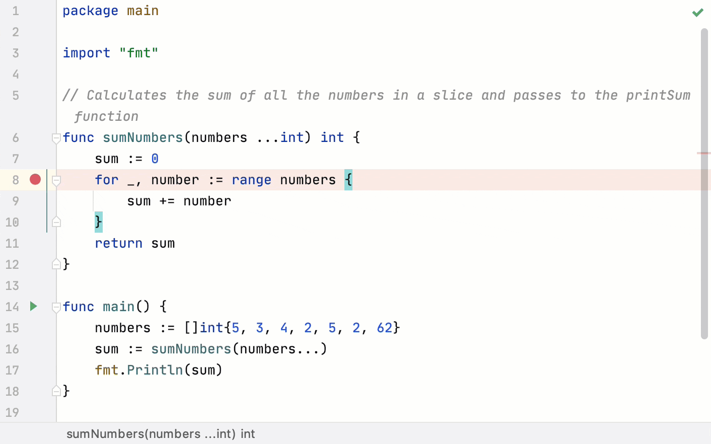

+++
title = "检查挂起的程序"
weight = 30
date = 2023-06-20T10:40:58+08:00
type = "docs"
description = ""
isCJKLanguage = true
draft = false

+++
# Examine suspended program - 检查挂起的程序

https://www.jetbrains.com/help/go/examining-suspended-program.html

Last modified: 12 April 2023

最后修改日期：2023年4月12日

​	调试器会话启动后，[调试](https://www.jetbrains.com/help/go/debug-tool-window.html)工具窗口将出现，程序将正常运行，直到发生以下情况之一： 

- 触发了一个[断点](https://www.jetbrains.com/help/go/using-breakpoints.html)
- 手动暂停了程序

​	之后，程序被暂停，允许您检查其当前状态，控制其进一步执行，并在运行时测试各种场景。

> ​	如果意外关闭了调试工具窗口，请从主菜单中选择View | Tool Windows | Debug或按下Alt+5重新打开它

## 检查帧

​	程序的状态由帧表示。当程序被暂停时，当前帧堆栈会显示在调试工具窗口的Frames 选项卡中。

​	每个帧对应于活动的方法或函数调用。它存储被调用方法或函数的局部变量、参数以及启用表达式求值的代码上下文。

​	为了更好地理解帧的概念，让我们来看看程序运行时发生了什么。程序的执行从`main`方法开始，然后调用其他方法。这些方法中的每一个可能会进行更多的方法调用。每个方法调用的局部变量和参数集由一个帧表示。每次调用方法时，一个新的帧会添加到堆栈的顶部。当方法的执行完成时，对应的帧会从堆栈中移除（采用先进后出的方式）。

​	检查帧可以帮助您理解为什么会将特定参数传递给方法，以及在调用时调用者的状态如何。

### 将堆栈复制到剪贴板

- 要复制当前线程的调用栈，请在Frames 选项卡的任意位置右键单击，然后选择Copy Stack。

### 依次在一个选项卡中预览帧

​	预览选项卡允许您在一个选项卡中依次打开文件，这样可以避免在单独的选项卡中打开多个文件时导致编辑器混乱。

- 要为在调试过程中打开的文件启用预览模式，请按下Ctrl+Alt+S打开设置，然后导航到Editor | General | Editor Tabs，选择Enable preview tab复选框。

  

  

### 隐藏对象类型

- 如果对象类型在调试工具窗口中占用太多空间，请右键单击变量，然后在显示的列表中清除Show Types选项。

  

## 在转储选项卡中筛选 Goroutine 列表

​	您可以创建一个包含程序使用的所有 Goroutine 的转储，应用筛选器来搜索特定的 Goroutine，并研究筛选结果。这个过程可以帮助您更好地理解程序或其部分的工作原理。

​	例如，下面的截图显示了`Goroutine 7 main.pageSize`的执行堆栈。Goroutine 列表中的 Goroutine 名称为Goroutine <ID> <last_non-runtime_function_on_the_stack>。非运行时意味着该函数不在运行时包中。

### 转储 Goroutine Dump goroutines

- 在调试会话期间，单击Dump Goroutines按钮 ()。

  打开一个包含可用 Goroutine 及其栈的转储的新选项卡。

  

### 筛选转储结果

- 单击筛选器图标 ()。在筛选字段中输入要搜索的字符串。

  

- 右键单击要从列表中排除的 Goroutine，并选择Hide goroutine。要隐藏与所选 Goroutine 具有相同堆栈的所有 Goroutine，请选择上下文菜单中的Hide goroutines with the same stack。

  您可以在Hidden 列表下查看隐藏的 Goroutine。

  要重置列表的状态并将所有隐藏的 Goroutine 再次显示在可见列表中，请单击Reset Hidden Goroutines按钮 ()。

  

### 将转储结果导出为文本文件into a text file

1. 单击Export to Text File图标 ()。
2. 在Export to file字段中选择存储路径，然后单击Save。

## 检查/更新变量

​	Variables选项卡显示所选[帧/线程](https://www.jetbrains.com/help/go/examining-suspended-program.html#examine-frames)中的变量列表。检查变量有助于理解程序为什么以某种方式运行。

> ​	请注意变量的范围和生存周期。如果变量不在列表中，这意味着变量对于当前[帧](https://www.jetbrains.com/help/go/examining-suspended-program.html#examine-frames)在当前执行点不可见。

​	每个变量左侧的图标表示其类型。

### 变量类型

| 图标                                                         | 描述                                                         |
| ------------------------------------------------------------ | ------------------------------------------------------------ |
|  | 封闭类型的静态成员                                           |
|   | 对象的字段（包括静态和非静态字段）                           |
|  | 包含自引用对象的字段（例如，在字段初始化之前的 `Throwable` 中的 `cause`） |
|  | Final fields 终态字段                                        |
|  | Static fields 静态字段                                       |
|  | 抛出的异常（仅当命中[异常断点](https://www.jetbrains.com/help/go/using-breakpoints.html)时显示） |
|  | 方法返回值（仅在启用Show Method Return Values选项时显示）    |
|  | 方法参数                                                     |
|  | 枚举常量                                                     |
|  | 本地数组                                                     |
|  | 地基本类型                                                   |
|  | [Watches](https://www.jetbrains.com/help/go/examining-suspended-program.html#watches) and auto-variables. [观察表达式](https://www.jetbrains.com/help/go/examining-suspended-program.html#watches)和自动变量 |
|  | 本地引用变量                                                 |

### 复制变量

​	在检查变量时，您可能需要复制变量名称或值，以便将其粘贴到其他地方或与另一个变量进行[比较](https://www.jetbrains.com/help/go/examining-suspended-program.html#compare)。 

- 要复制变量持有的值，请右键单击变量，然后选择Copy Value Ctrl+C。
- 要复制变量的名称，请右键单击变量，然后选择Copy Name。

### 与剪贴板比较变量

​	当您需要将变量值与其他值进行比较时，请使用Compare Value with Clipboard选项。例如，当一个变量保存一个较长的字符串，并且您需要将其与另一个较长的字符串进行比较时，这将非常有帮助。

1. 复制您要比较的内容（例如，从文本文件中）。

   

3. 在Variables选项卡中，右键单击要与之进行比较的变量，并选择使用剪贴板比较值。

3. 检查打开的Diff Viewer中的差异。有关如何有效使用Diff Viewer的更多信息，请参阅[比较文件和文件夹](https://www.jetbrains.com/help/go/comparing-files-and-folders.html)主题。

   

### 在专用对话框中查看变量

​	GoLand允许您在专用对话框中检查变量。当您需要跟踪某个变量（或其引用的对象）并能够在帧和goroutine之间导航时，这将非常有用。

- 在Variables选项卡上右键单击一个变量，然后选择Inspect。

  

### 设置变量值

​	如果需要在运行时测试程序在特定条件下的行为或修复其当前行为，您可以通过设置/更改变量值来实现。 

1. 在Variables选项卡上右键单击一个变量，然后选择Set Value，或者选择该变量并按下F2键。
4. 输入变量的值，然后按Enter键。

### 导航到源代码

​	如果您需要查看某个变量或类型的源代码声明位置，可以直接从Variables选项卡跳转到那里。

- 要导航到变量声明的代码位置，请右键单击变量，然后选择Jump to Source F4。

  

- 要导航到变量类型的声明位置，请右键单击变量，然后选择Jump to Type Source F4。

  

## 评估表达式

​	在调试会话期间，GoLand允许您评估表达式，以获取有关程序状态的其他详细信息或在运行时测试各种场景。

> ​	在评估表达式时，请注意变量的作用域和生命周期。所有表达式都在当前执行点的上下文中进行评估。

### 在编辑器中评估简单表达式

​	评估表达式的最简单方法是在代码中指向它。尽管这是最快捷的方法，但不能用于评估方法调用。这是出于安全考虑，因为它们可能产生副作用。

​	当您需要快速评估编辑器中的表达式时，请使用此选项。

1. 指向您要评估的表达式。表达式的结果将显示在工具提示中。

   

3. 如果您需要查看结果对象的子元素，请单击  或按下 Ctrl+F1。

   

​	如果您觉得值工具提示干扰，您可以增加延迟时间或完全禁用它们。要执行此操作，请在设置对话框（Ctrl+Alt+S）中转到Build, Execution, Deployment | Debugger | Data Views，并根据需要设置显示值工具提示和值工具提示延迟选项。

### 在编辑器中评估复杂表达式

​	如果您想在涉及方法调用的代码中评估表达式，或者您想具体指定要评估的表达式部分，请使用快速评估表达式选项。

​	此选项仅在程序在命中断点后挂起时可用（而非手动暂停）。

1. 将光标放在表达式上（以评估最接近的匹配表达式），或者选择其一部分（如果您想具体指定要评估的复杂表达式的哪个部分）。

2. 单击Run | Debugging Actions | Quick Evaluate Expression（Ctrl+Alt+F8）。或者，按住 Alt 键单击所选内容。

   

> ​	如果表达式调用的方法内部有断点，则将忽略这些断点。

> ​	在调用方法时，请确保您了解其可能的副作用（例如，对外部变量的更改），因为它们可能会改变程序的流程或结果。

​	您可以配置快速评估，使其在仅选择代码片段时工作（而无需使用菜单/快捷键）。请谨慎使用此选项，因为在启用时可能会意外调用方法。

​	要在代码选择中配置快速评估，请转到Settings | Build, Execution, Deployment | Debugger | Data Views，并设置在代码选择时显示值工具提示选项。

### 评估任意表达式

​	评估任意表达式是最灵活的评估选项。它允许您评估任何代码，只要它处于当前帧的上下文中。使用它，您可以评估声明、方法调用、匿名类型、Lambda 表达式、循环等等。

​	使用此功能可以获取有关程序当前状态的其他信息，并在同一调试会话中测试各种情况，从而节省了运行会话的次数。

> ​	此选项仅在程序在命中断点后挂起时可用（而非手动暂停）。

1. 如果您想从一些表达式或变量开始，这些表达式或变量目前在您面前（例如，在编辑器中或变量选项卡上），请将其选择。

3. 单击Run | Debugging Actions | Evaluate Expression（Alt+F8）。在 Ubuntu 上，快捷键可能无法正常工作（要正确操作，请[调整快捷键配置](https://www.jetbrains.com/help/go/configuring-keyboard-and-mouse-shortcuts.html)）。

3. 在评估对话框中，修改所选表达式，或在表达式字段中输入新表达式。如果要评估代码片段，请单击展开（Shift+Enter）。

   > ​	请注意，在表达式被评估后，任何在表达式主体中声明的变量都会超出范围。

4. 单击评估（多行模式下按下 Ctrl+Enter）。表达式的结果将显示在结果字段中。

   表达式的结果来自 return 语句。当没有 return 语句时，结果来自代码的最后一行（甚至不必是表达式：字面量也可以）。当没有有效的行可提取值时，结果为`undefined`。如果无法评估指定的表达式，结果字段会显示原因。

   

> 如果表达式调用的方法内部有断点，则将忽略这些断点。

> ​	在调用方法时，请确保您了解其可能的副作用（例如，对外部变量的更改），因为它们可能会改变程序的流程或结果。

​	评估对话框是非模态的，因此您可以将焦点切回到编辑器中以复制其他变量和表达式。如果需要，您还可以打开多个评估对话框。

## 内联查看值

​	GoLand 通过在变量的使用位置旁边显示变量的值来简化调试过程。

​	一旦变量的值发生变化，内联视图将使用新值更新并改变其颜色。

​	默认情况下，启用了内联值视图。要关闭它，请在设置对话框（Ctrl+Alt+S）中转到Build, Execution, Deployment | Debugger | Data Views，然后禁用内联显示值选项。

### 添加内联监视

​	如果要在特定行上显示某个表达式的结果，可以为该行设置内联[监视](https://www.jetbrains.com/help/go/examining-suspended-program.html#监视)。内联监视是持久的，并在会话重新启动后保持活动状态。

1. 单击指向要跟踪字段的内联提示。
3. 在弹出窗口中，选择字段，然后单击添加为内联监视。
5. 如有需要，对监视进行微调。您可以使用任何有效的表达式作为监视。

​	要删除内联监视，请将鼠标悬停在监视上，然后单击旁边的x。

## 监视

> 如果您要了解有关字段观察点的信息，请参阅[断点](https://www.jetbrains.com/help/go/using-breakpoints.html)主题。

​	如果您想跟踪某个变量或更复杂的表达式的结果，请为该变量或表达式设置监视。当您需要添加不经常显示在变量列表上的内容，或者固定一些实例变量以消除在每个[步骤](https://www.jetbrains.com/help/go/stepping-through-the-program.html)之后展开树的需要时，这很有用。

​	此选项仅在程序在命中断点后挂起时可用（而非手动暂停）。

> ​	在调用方法时，请确保您了解其可能的副作用（例如，对外部变量的更改），因为它们可能会改变程序的流程或结果。

​	监视在所选帧的上下文中进行评估。当监视超出上下文或无法编译时，无法对监视进行评估。此时，监视会显示错误图标。

​	默认情况下，监视与变量一起显示在变量选项卡中。要隐藏/显示监视选项卡，使用布局设置菜单中的单独显示监视按钮。

### 添加监视

1. 在变量选项卡上单击新建监视按钮 。

2. 输入要评估的变量或表达式。在表达式中，您可以评估方法调用、函数字面量、变量声明等，只要这些在局部上下文中。

   

> ​	如果您要跟踪的变量或表达式已经在您面前（例如，在代码编辑器中），您可以直接选择并将其拖到变量选项卡上。对于当前上下文中的变量，您还可以在变量选项卡上右键单击它们，然后选择添加到监视

​	添加变量/表达式到监视后，它将保留在那里，并在每个[步骤](https://www.jetbrains.com/help/go/stepping-through-the-program.html)中进行评估，为您提供当前上下文中的结果。

### 编辑监视

- 右键单击所需的监视，并选择编辑。

### 复制监视

1. 选择要复制的监视。
3. 在变量/监视选项卡上单击复制监视按钮  ，或按下Ctrl+D。

### 更改监视顺序

​	为方便起见，您可以更改变量/监视选项卡上监视出现的顺序。 

- 使用向上移动监视/向下移动监视按钮或Ctrl+上箭头和Ctrl+下箭头键进行操作。

### 删除监视

- 要删除单个监视，右键单击它并选择移除监视。或者，在变量/监视选项卡上选择监视并按下Delete键。
- 要删除所有监视，右键单击变量/监视选项卡的任意位置，然后选择移除所有监视。

​	监视可以执行与变量相同的操作。例如，您可以[在专用对话框中查看它们](https://www.jetbrains.com/help/go/examining-suspended-program.html#view-in-a-dialog)，或使用它们来[导航到源代码](https://www.jetbrains.com/help/go/examining-suspended-program.html#navigate-to-source)。

​	监视是您项目的一部分。这意味着您可以停止和重新运行调试会话，而不会丢失它们。

## 返回当前执行点

​	检查程序状态涉及在代码中导航，您经常需要返回到程序暂停的位置。

​	请执行以下操作之一： 

- 在主菜单中，选择Run | Debugging Actions | Show Execution Point。
- 按下Alt+F10。
- 在调试工具窗口的步进工具栏上单击显示执行点按钮 。

​	当前执行点将以蓝色线条表示。此行代码尚未执行。

