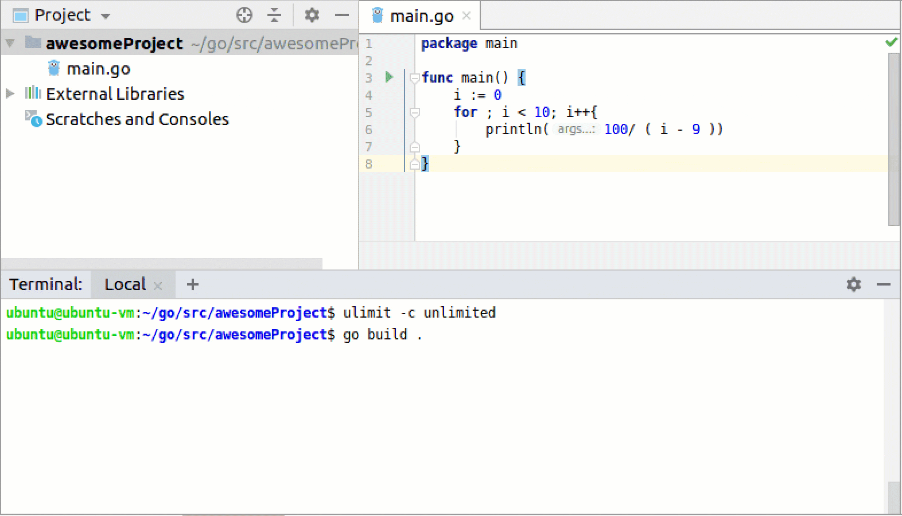
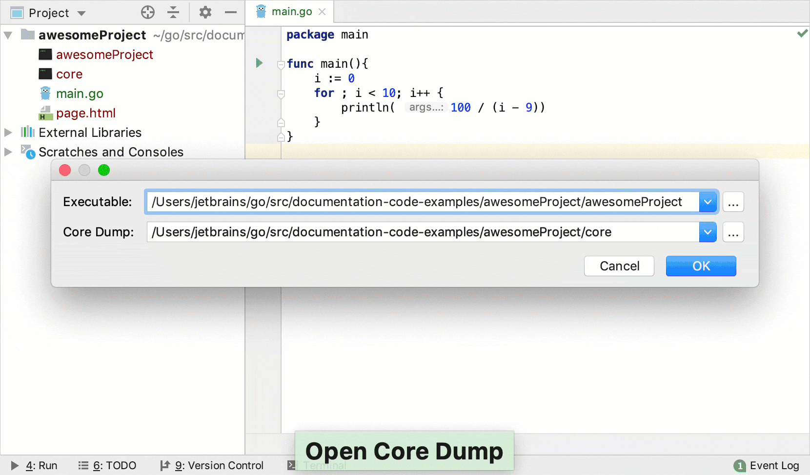

+++
title = "探索Go核心转储文件"
weight = 50
date = 2023-06-20T10:40:58+08:00
type = "docs"
description = ""
isCJKLanguage = true
draft = false

+++
# Exploring Go core dumps - 探索Go核心转储文件

https://www.jetbrains.com/help/go/exploring-go-core-dumps.html

Last modified: 16 January 2023

最近修改：2023年1月16日

​	有时在调试程序时，您需要检查代码的执行流程并了解程序的当前状态。Go核心转储文件是一个包含正在运行的进程的内存转储和它们在程序生命周期中的状态的文件。您可以在程序执行完成后或仍在运行时调试核心转储文件。

> ​	您只能在Linux机器上创建Go核心转储文件。但您可以在任何支持GoLand的操作系统上查看转储文件。

### 在Linux上创建Go核心转储文件 Create a Go core dump file on Linux

1. 在文件所在的目录中打开终端。

3. 将`ulimit`参数设置为`unlimited`: `ulimit -c unlimited`。

5. 在终端中运行`go build .`来构建程序。`build`命令会在当前项目文件夹（例如**awesomeProject**）中创建一个二进制文件。

4. 要创建核心转储文件，请运行`GOTRACEBACK=crash ./<binary_file_name>`（例如`GOTRACEBACK=crash ./awesomeProject`）。此命令会在当前项目文件夹中创建一个**core**文件。

   

### 查看转储日志

1. 转到 Run | Open Core Dump.

2. 在Executable 字段中，指定二进制文件的路径（例如**awesomeProject**）。

4. 在Core Dump字段中，指定`core`文件的路径（例如**core**）。

4. 单击OK。在调试工具窗口中，选择要检查的帧。

   

### 在GoLand中查看Go核心转储文件

1. 打开或创建Go文件的Go构建配置。

3. 在Environment 字段中，单击文件夹图标（)。

4. 在Environment Variables对话框中，单击添加图标（)。

5. 单击Name 字段，输入`GOTRACEBACK`。

7. 单击Value 字段，输入`crash`。

9. 保存所有更改，单击OK。

7. 运行程序（按下Shift+F10）。程序的输出将显示在调试器窗口中。

   
