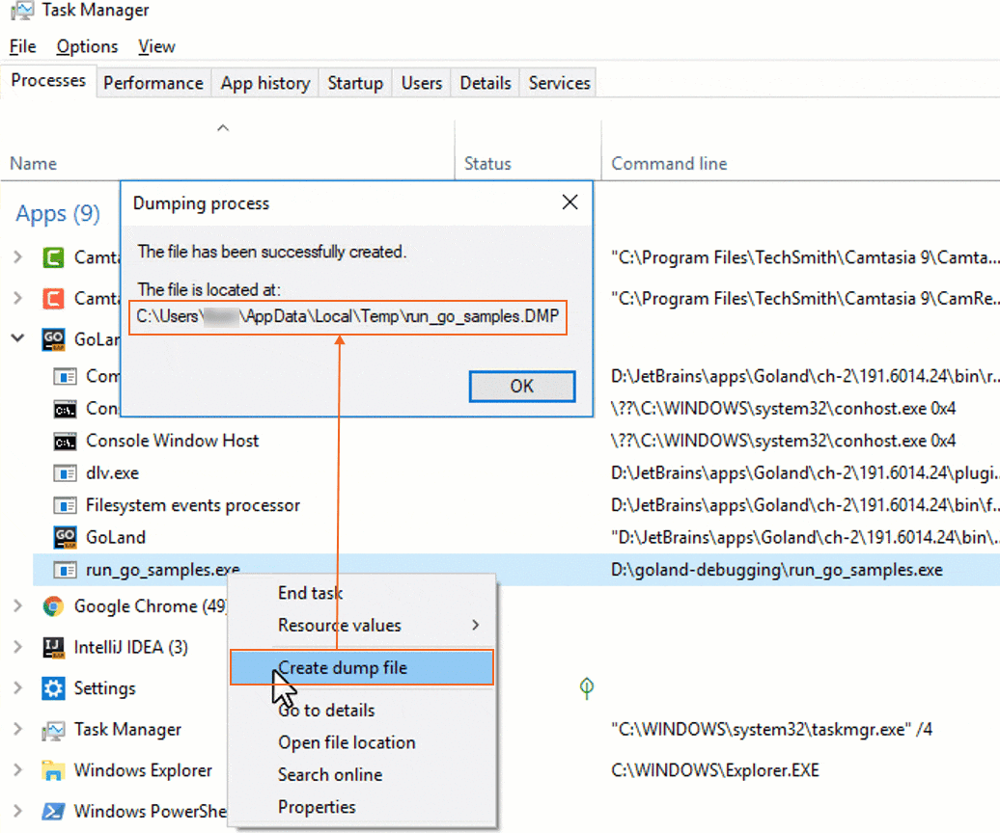
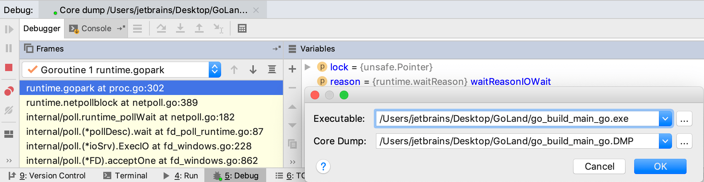

+++
title = "浏览 Windows minidump 文件"
weight = 60
date = 2023-06-20T10:40:58+08:00
type = "docs"
description = ""
isCJKLanguage = true
draft = false

+++
# Exploring Windows minidumps - 浏览 Windows minidump 文件

https://www.jetbrains.com/help/go/exploring-windows-minidumps.html#90d9f7f4

Last modified: 16 January 2023

上次修改日期：2023年1月16日

> ​	您只能在 Microsoft Windows 操作系统上创建 Windows minidump 文件。但是您可以在所有支持的操作系统上分析和调试应用程序。

​	Windows minidump 文件记录程序在运行时或崩溃时的状态。要读取 minidump 文件，您必须拥有应用程序的二进制文件和转储文件。

### 创建应用程序的二进制文件

1. 以以下方式之一打开Run/Debug Configuration对话框： 

   - 从主菜单中选择Run | Edit Configurations。
   - With the [Navigation bar](https://www.jetbrains.com/help/go/guided-tour-around-the-user-interface.html#navigation-bar) visible (View | Appearance | Navigation Bar), choose Edit Configurations from the run/debug configuration selector.
   - 在可见的[导航栏](https://www.jetbrains.com/help/go/guided-tour-around-the-user-interface.html#navigation-bar)下（View | Appearance | Navigation Bar），从运行/调试配置选择器中选择Edit Configurations。
   - 按下 Alt+Shift+F10，然后按 0。

2. 在[Run/Debug Configuration](https://www.jetbrains.com/help/go/run-debug-configurations-dialog.html)对话框中，单击工具栏上的Add New Configuration图标）或按下 Alt+Insert。列表显示默认的运行/调试配置。选择所需的配置类型（例如，Go 构建)。

   在右侧窗格中显示所选配置类型的默认设置字段。

3. 在Name 字段中，键入配置名称。

4. 在Files 字段中，添加要运行的文件的名称（例如，**main.go**）。

5. 在Output Directory字段中，指定要存储创建的二进制文件的路径。

6. 应用更改并关闭对话框。

### 在 Windows 上创建 minidump 文件

1. 启动应用程序并像往常一样使用它。

   您可以运行生成的 EXE 文件或在 GoLand 中运行应用程序。要在 GoLand 中运行应用程序，请单击主函数附近的沟槽中的运行图标，然后选择Run 'go build <configuration_name>'。

2. 打开 Windows 任务管理器 Ctrl+Alt+Delete，单击Processes 选项卡。

3. 右键单击应用程序，并选择Create dump file。

### 在 GoLand 中打开 minidump 文件 

1. 
2. 导航到Run | Open Core Dump。
3. 在Executable 字段中，指定**EXE**文件的路径。
4. 在 Core Dump字段中，指定转储文件的路径。
5. 单击OK。

