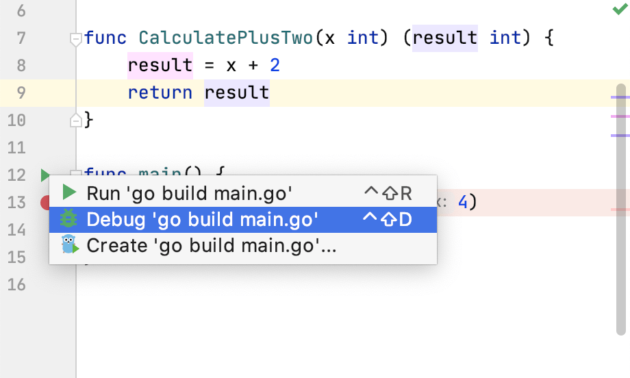

+++
title = "启动调试器会话"
weight = 20
date = 2023-06-20T10:40:58+08:00
type = "docs"
description = ""
isCJKLanguage = true
draft = false

+++
# Start the debugger session 启动调试器会话

https://www.jetbrains.com/help/go/starting-the-debugger-session.html

Last modified: 05 March 2023

最后修改日期：2023年3月5日

Starting a debugger session is very similar to running the program in normal mode. The debugger is attached behind the scenes, so you don't have to configure anything specific to start a debugger session. If you are able to run your program from GoLand, you will also be able to debug it using the same configuration.

​	启动调试器会话与以正常模式运行程序非常相似。调试器会在后台附加，因此您无需配置任何特定内容即可启动调试器会话。如果您能够从 GoLand 运行程序，您也可以使用相同的配置进行调试。

> This topic relies on your understanding of run/debug configurations. While GoLand provides a way to debug simple applications without any extra setup, understanding run/debug configurations is essential to efficient use of the debugger. More on them [here](https://www.jetbrains.com/help/go/run-debug-configuration.html).
>
> ​	此主题依赖于您对运行/调试配置的理解。虽然 GoLand 提供了一种在没有任何额外设置的情况下调试简单应用程序的方法，但了解运行/调试配置对于有效使用调试器至关重要。有关更多信息，请参阅[此处](https://www.jetbrains.com/help/go/run-debug-configuration.html)。

Each time you debug a program, the debugger session is based on a [run/debug configuration](https://www.jetbrains.com/help/go/run-debug-configuration.html). Thus, you can configure GoLand to use any parameters and perform any actions before the program is launched. For example, the configuration can build the application every time you start a debugger session or use the previously compiled code.

​	每次调试程序时，调试器会话都基于一个[运行/调试配置](https://www.jetbrains.com/help/go/run-debug-configuration.html)。因此，您可以配置 GoLand 在启动程序之前使用任何参数并执行任何操作。例如，配置可以在每次启动调试器会话时构建应用程序，或者使用先前编译的代码。

- If you don't have a run/debug configuration, and your program doesn't require you to have one, click the Run 如果您没有运行/调试配置，并且您的程序不要求您拥有一个，单击类中`main()`方法旁边的运行图标  icon in the gutter near the class with the `main()` method and select Debug. This will create a temporary run/debug configuration for you. After that, you can customize and save this temporary configuration if needed. This is the quickest way to debug your program from an entry point that has not been defined yet.，然后选择“Debug”。这将为您创建一个临时的运行/调试配置。之后，如果需要，您可以自定义和保存此临时配置。这是从尚未定义入口点调试程序的最快方式。

  

- If you already have a run/debug configuration, and it is currently selected in the run/debug configurations list, press Shift+F9.

- 如果您已经有一个运行/调试配置，并且当前在运行/调试配置列表中选择了该配置，请按Shift+F9。

  

- If you already have a run/debug configuration, and it is not selected, or you want to adjust some configuration before debugging, press Alt+Shift+F9. After that, select the desired configuration or proceed with Edit Configurations.

- 如果您已经有一个运行/调试配置，但没有选择它，或者您希望在调试之前调整一些配置，请按Alt+Shift+F9。之后，选择所需的配置或进行编辑配置。

### 暂停和恢复调试器会话 Pause and resume a debugger session

When the debugger session is running, you can pause/resume it as required using the buttons on the toolbar of the Debug tool window:

​	当调试器会话正在运行时，您可以根据需要使用调试工具窗口工具栏上的按钮来暂停/恢复调试器会话： 

- To pause a debugger session, click 要暂停调试器会话，请单击 .
- To resume a debugger session, click 要恢复调试器会话，请单击  F9.  或按下 F9。

> Pausing the program manually is not an alternative to using [breakpoints](https://www.jetbrains.com/help/go/using-breakpoints.html) as this method doesn't let you use the full range of debugger functionality. For example, you cannot evaluate expressions after pausing the program.
>
> ​	手动暂停程序不是使用[断点](https://www.jetbrains.com/help/go/using-breakpoints.html)的替代方法，因为这种方法不允许您使用完整的调试器功能。例如，在暂停程序后，您无法评估表达式。

### 终止调试器会话  Terminate a debugger session

- Click the Stop button in the Debug tool window. Alternatively, press Ctrl+F2 and select the process to terminate (if there are two or more of them).
- 在调试工具窗口中单击停止按钮。或者，按下 Ctrl+F2 并选择要终止的进程（如果有两个或更多进程）。

## 提高效率的提示 Productivity tips

### 调试无响应的应用程序 Debug non-responding applications

In case your application hung, pause the session to let the debugger get the information about its current state. You can then examine the program state and locate the cause of the problem.

​	如果您的应用程序挂起，可以暂停会话以让调试器获取有关其当前状态的信息。然后，您可以检查程序状态并找出问题的原因。

### 在暂停状态下进行更多操作 Do more with pause

When you need to evaluate an expression, and GoLand doesn't let you do that because you didn't stop at a breakpoint, you can advance your program a line further by [stepping](https://www.jetbrains.com/help/go/stepping-through-the-program.html#step-into). After this, you will be able to use the debugger as if you had stopped at a breakpoint. While in some cases this may not be a valid solution, it may sometimes help you out.

​	当您需要评估一个表达式，但由于您没有在断点处停下来，GoLand 不允许您这样做时，您可以通过[步进](https://www.jetbrains.com/help/go/stepping-through-the-program.html#step-into)将程序推进一行。这样，您就能够像在断点处停止一样使用调试器。虽然在某些情况下这可能不是有效的解决方案，但有时它可能会帮助您解决问题。

### 在启动之前运行任务 Run before-launch tasks

Configure running external tools or performing other actions before every debugging session. This before-launch task can be running a Gulp or Grunt task or an [NPM script](https://www.jetbrains.com/help/go/installing-and-removing-external-software-using-node-package-manager.html#ws_npm_run_as_before_launch_task), compiling your [TypeScript code into JavaScript](https://www.jetbrains.com/help/go/compiling-typescript-to-javascript.html) or running all the currently active [File Watchers](https://www.jetbrains.com/help/go/using-file-watchers.html) to compile or compress your code, [uploading your sources](https://www.jetbrains.com/help/go/uploading-and-downloading-files.html) to a remote server, and many more, depending on the language and frameworks you are using.

​	配置在每次调试会话之前运行外部工具或执行其他操作。这个启动前任务可以是运行 Gulp 或 Grunt 任务，或者运行一个[NPM 脚本](https://www.jetbrains.com/help/go/installing-and-removing-external-software-using-node-package-manager.html#ws_npm_run_as_before_launch_task)，将您的[TypeScript 代码编译为 JavaScript](https://www.jetbrains.com/help/go/compiling-typescript-to-javascript.html)，或运行当前活动的[文件监视器](https://www.jetbrains.com/help/go/using-file-watchers.html)来编译或压缩代码，[将源代码上传](https://www.jetbrains.com/help/go/uploading-and-downloading-files.html)到远程服务器等等，具体取决于您使用的语言和框架。

### 在调试之前  Before debugging

1. [Set breakpoints](https://www.jetbrains.com/help/go/using-breakpoints.html#set-line-breakpoint) in the source code.
2. 在源代码中[设置断点](https://www.jetbrains.com/help/go/using-breakpoints.html#set-line-breakpoint)。
3. If necessary, create or modify the corresponding [Run/Debug configuration](https://www.jetbrains.com/help/go/run-debug-configuration.html).
4. 如有需要，请创建或修改相应的[运行/调试配置](https://www.jetbrains.com/help/go/run-debug-configuration.html)。

The debug session starts with the selected run/debug configuration. Note that several debug processes can be launched simultaneously.

​	调试会话始于所选的运行/调试配置。请注意，可以同时启动多个调试进程。

> Alternatively, press Alt+Shift+F9, select the configuration from the list, and press Enter.
>
> ​	或者，按下 Alt+Shift+F9，从列表中选择配置，然后按 Enter 键。