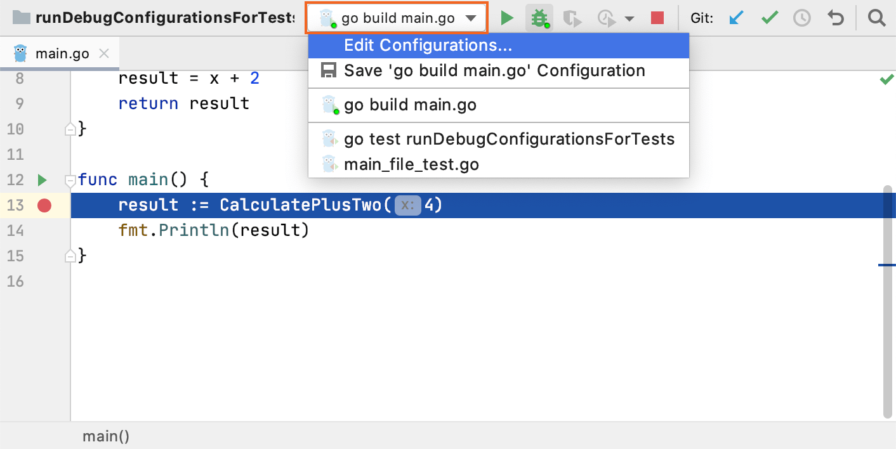

+++
title = "启动调试器会话"
weight = 20
date = 2023-06-20T10:40:58+08:00
type = "docs"
description = ""
isCJKLanguage = true
draft = false

+++
# Start the debugger session 启动调试器会话

https://www.jetbrains.com/help/go/starting-the-debugger-session.html

Last modified: 05 March 2023

最后修改日期：2023年3月5日

​	启动调试器会话与以正常模式运行程序非常相似。调试器会在后台附加，因此您无需配置任何特定内容即可启动调试器会话。如果您能够从 GoLand 运行程序，您也可以使用相同的配置进行调试。

> ​	此主题依赖于您对运行/调试配置的理解。虽然 GoLand 提供了一种在没有任何额外设置的情况下调试简单应用程序的方法，但了解运行/调试配置对于有效使用调试器至关重要。有关更多信息，请参阅[此处](https://www.jetbrains.com/help/go/run-debug-configuration.html)。

​	每次调试程序时，调试器会话都基于一个[运行/调试配置](https://www.jetbrains.com/help/go/run-debug-configuration.html)。因此，您可以配置 GoLand 在启动程序之前使用任何参数并执行任何操作。例如，配置可以在每次启动调试器会话时构建应用程序，或者使用先前编译的代码。

- 如果您没有运行/调试配置，并且您的程序不要求您拥有一个，单击类中`main()`方法旁边的运行图标 ，然后选择Debug。这将为您创建一个临时的运行/调试配置。之后，如果需要，您可以自定义和保存此临时配置。这是从尚未定义入口点调试程序的最快方式。

  

- 如果您已经有一个运行/调试配置，并且当前在运行/调试配置列表中选择了该配置，请按Shift+F9。

  

- 如果您已经有一个运行/调试配置，但没有选择它，或者您希望在调试之前调整一些配置，请按Alt+Shift+F9。之后，选择所需的配置或进行编辑配置。

### 暂停和恢复调试器会话

​	当调试器会话正在运行时，您可以根据需要使用调试工具窗口工具栏上的按钮来暂停/恢复调试器会话： 

- 要暂停调试器会话，请单击 .
- 要恢复调试器会话，请单击 或按下 F9。

> ​	手动暂停程序不是使用[断点](https://www.jetbrains.com/help/go/using-breakpoints.html)的替代方法，因为这种方法不允许您使用完整的调试器功能。例如，在暂停程序后，您无法评估表达式。

### 终止调试器会话

- 在调试工具窗口中单击停止按钮。或者，按下 Ctrl+F2 并选择要终止的进程（如果有两个或更多进程）。

## 提高效率的提示

### 调试无响应的应用程序

​	如果您的应用程序挂起，可以暂停会话以让调试器获取有关其当前状态的信息。然后，您可以检查程序状态并找出问题的原因。

### 在暂停状态下进行更多操作

​	当您需要评估一个表达式，但由于您没有在断点处停下来，GoLand 不允许您这样做时，您可以通过[步进](https://www.jetbrains.com/help/go/stepping-through-the-program.html#step-into)将程序推进一行。这样，您就能够像在断点处停止一样使用调试器。虽然在某些情况下这可能不是有效的解决方案，但有时它可能会帮助您解决问题。

### 在启动之前运行任务

​	配置在每次调试会话之前运行外部工具或执行其他操作。这个启动前任务可以是运行 Gulp 或 Grunt 任务，或者运行一个[NPM 脚本](https://www.jetbrains.com/help/go/installing-and-removing-external-software-using-node-package-manager.html#ws_npm_run_as_before_launch_task)，将您的[TypeScript 代码编译为 JavaScript](https://www.jetbrains.com/help/go/compiling-typescript-to-javascript.html)，或运行当前活动的[文件监视器](https://www.jetbrains.com/help/go/using-file-watchers.html)来编译或压缩代码，[将源代码上传](https://www.jetbrains.com/help/go/uploading-and-downloading-files.html)到远程服务器等等，具体取决于您使用的语言和框架。

### 在调试之前

1. 在源代码中[设置断点](https://www.jetbrains.com/help/go/using-breakpoints.html#set-line-breakpoint)。
3. 如有需要，请创建或修改相应的[运行/调试配置](https://www.jetbrains.com/help/go/run-debug-configuration.html)。

​	调试会话始于所选的运行/调试配置。请注意，可以同时启动多个调试进程。

> ​	或者，按下 Alt+Shift+F9，从列表中选择配置，然后按 Enter 键。