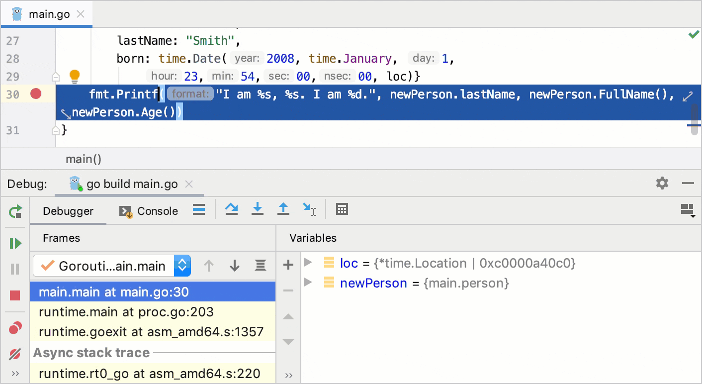

+++
title = "逐步执行程序"
weight = 40
date = 2023-06-20T10:40:58+08:00
type = "docs"
description = ""
isCJKLanguage = true
draft = false

+++
# Step through the program 逐步执行程序

https://www.jetbrains.com/help/go/stepping-through-the-program.html

Last modified: 03 February 2023

最后修改日期：2023年2月3日

​	逐步执行是控制程序逐步执行的过程。

​	GoLand提供了一组逐步执行操作，这些操作根据您的策略使用（例如，是否需要直接进入下一行或进入调用的方法）。

​	逐步执行按钮位于调试窗口的工具栏上。

## 逐过当前行 Step over

​	跳过当前代码行并进入下一行，即使高亮显示的行中有方法调用。方法的实现将被跳过，您将直接进入调用者方法的下一行。

 

- 单击逐过按（Step Over）钮 或按下F8。

​	在下面的示例中，即将执行第29行。如果您选择逐过，调试器将直接跳转到第30行，而不进入New()函数。

​	如果跳过的方法内部存在断点，调试器将在这些断点处停止。要跳过途中的任何断点，请使用[强制逐过](https://www.jetbrains.com/help/go/stepping-through-the-program.html#force-step-over)。

## 逐入方法 Step into

​	进入方法以查看其内部发生的情况。当您不确定方法是否返回正确结果时，请使用此选项。 

- 单击逐入（Step Into）按钮  or press F7. 或按下F7。

​	在下面的示例中，即将执行第29行。如果您选择逐入，调试器将进入`New`函数的实现，允许您详细检查其结果是如何产生的。

​	如果一行代码中有多个方法调用，GoLand会询问您要进入哪个方法。这个功能被称为[智能逐入](https://www.jetbrains.com/help/go/stepping-through-the-program.html#smart-step-into)。

## 智能逐入

​	当一行代码中有多个方法调用时，智能逐入非常有用，您可以明确指定要进入的方法调用。这个功能允许您选择感兴趣的方法调用。

1. 从主菜单中选择Run | Debugging Actions | Smart Step Into或按下Shift+F7。

2. 单击方法调用。您还可以使用箭头键或制表符进行选择，然后按Enter/F7。

   

## 逐出方法 Step out

​	退出当前方法并返回到调用者方法。

 

- 单击逐出（Step Out）按钮 或按下Shift+F8。

​	在示例中，逐出会跳过循环的所有迭代，并直接返回到`main`方法（调用者）。

## 运行到光标位置

​	继续执行，直到达到光标所在的位置。 

1. 将光标放在要程序暂停的行上。
3. 单击运行到光标位置按钮 或按下Alt+F9。

​	另外，您还可以通过单击沟槽中的行号来运行到光标位置。

​	您可以在Settings | Build, Execution, Deployment | Debugger中配置是否希望在单击行号时启用运行到光标位置。

​	在示例中，运行到光标位置将继续执行并在第7行停止，就像有一个断点一样。如果在`count()`方法中有断点，程序将在那里暂停。

​	要跳过途中的任何断点，请使用[强制运行到光标位置](https://www.jetbrains.com/help/go/stepping-through-the-program.html#force-run-to-cursor)。

## 强制运行到光标位置

​	继续执行，直到达到光标所在的位置。忽略途中的所有断点。 

1. 将光标放在要程序暂停的行上。
4. 从主菜单中选择Run | Debugging Actions | Force Run to Cursor或按下Ctrl+Alt+F9。

​	在示例中，强制运行到光标位置将继续执行并在第7行停止，就像有一个断点一样。`count()`方法内部的断点将不会起作用。

## 强制逐过 Force step over

​	跳过当前代码行并进入下一行，即使高亮显示的行中有方法调用。如果调用的方法中有断点，它们将被忽略。 

- 从主菜单中选择Run | Debugging Actions | Force Step Over或按下Alt+Shift+F8。

​	当达到断点时，[调试](https://www.jetbrains.com/help/go/debug-tool-window.html)工具窗口将变为活动状态，并使您能够控制程序的执行。为此，您可以使用运行菜单命令或调试工具窗口中的[逐步执行工具栏](https://www.jetbrains.com/help/go/debug-tool-window.html#steptoolbar)上的图标。

​	每个逐步执行操作都会根据您选择的操作将执行点移动到下一个执行位置。