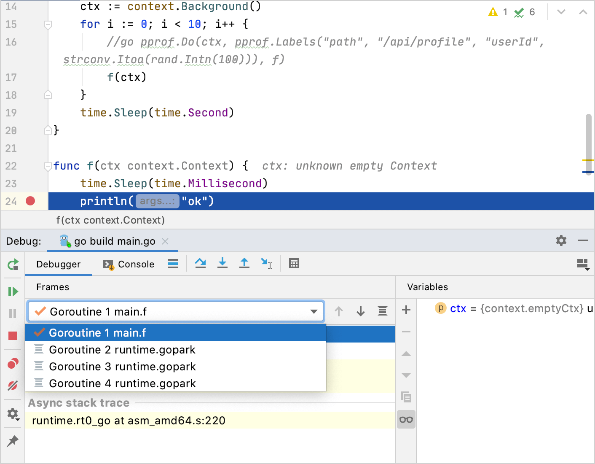
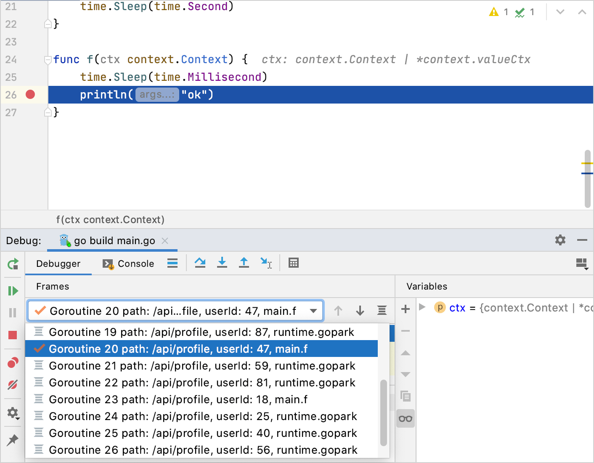

+++
title = "使用分析器标签"
weight = 80
date = 2023-06-20T10:40:58+08:00
type = "docs"
description = ""
isCJKLanguage = true
draft = false

+++
# Using profiler labels 使用分析器标签

https://www.jetbrains.com/help/go/using-profiler-labels.html

Last modified: 17 March 2022

最近修改：2022年3月17日

Goroutines are functions or methods that run concurrently with other functions or methods. To create a goroutine, use the `go` keyword followed by a function invocation (for example, `go func(p string, rid int64)`). But using lots of goroutines makes a program harder to debug. To differentiate between goroutines, you can label goroutines with custom data.

​	Goroutines是与其他函数或方法同时运行的函数或方法。要创建一个Goroutine，使用`go`关键字后跟一个函数调用（例如，`go func(p string, rid int64)`）。但是使用大量的Goroutine会使程序更难调试。为了区分Goroutine，您可以使用自定义数据对Goroutine进行标记。

Since Go 1.9, you can record additional information to provide more context about the execution path. You can record any set of labels as a part of the profiling data and use these labels later to examine the profiler output.

​	自Go 1.9以来，您可以记录额外的信息，以提供有关执行路径的更多上下文信息。您可以将任何一组标签记录为配置文件数据的一部分，并稍后使用这些标签来检查配置文件输出。

For example, you have a queue handler that processes events created somewhere. The handler can set labels to identify where these events were created.

​	例如，您有一个队列处理程序，用于处理在某个地方创建的事件。处理程序可以设置标签以标识这些事件的创建位置。

During debugging and core dump analysis, the context information might be helpful. For example, you can use this information to find a particular goroutine more easily.

​	在调试和核心转储分析过程中，上下文信息可能会很有帮助。例如，您可以使用此信息更轻松地找到特定的Goroutine。

## 添加标签 Adding labels

The `runtime/pprof` package has several new functions that you can use to add labels. The most popular is the `Do` function. The `Do` function takes context, adds labels to this context, and passes new context to the f function.

​	`runtime/pprof`包提供了几个新函数，您可以使用这些函数来添加标签。最常用的是`Do`函数。`Do`函数接受上下文，向该上下文添加标签，并将新的上下文传递给f函数。

The `Do` function writes labels only for the current goroutine. If you create new goroutines in the f function, you can pass the context as an argument.

​	`Do`函数仅为当前Goroutine编写标签。如果您在f函数中创建新的Goroutine，可以将上下文作为参数传递。

```go
func main() {
    ctx := context.Background()
    for i := 0; i < 10; i++ {
        labels := pprof.Labels("path", "/api/profile", "userId", strconv.Itoa(rand.Intn(100)))
        go pprof.Do(ctx, labels, f)
    }
    time.Sleep(time.Second)
}
```


## 在GoLand中查看标签 Viewing labels in GoLand

For illustrative purposes, copy the following [code example from GitHub](https://github.com/apronichev/documentation-code-examples/blob/master/debuggerProfilerLabels/main.go).

为了说明的目的，从GitHub上复制以下[代码示例](https://github.com/apronichev/documentation-code-examples/blob/master/debuggerProfilerLabels/main.go)。

Put a breakpoint where the `println("ok")` is called. To put the breakpoint, click the gutter at line 21. Run the debug for the `main` function. To start debugging, click the Run icon (在调用`println("ok")`的地方设置断点。要设置断点，请在第21行的装订线上单击。运行`main`函数的调试。要开始调试，请在`main`函数附近的装订线上单击运行图标（) in the gutter near the `main` function and select Debug <run_debug_configuration_name>. From the Goroutines list, observe available goroutines.)，然后选择“Debug <run_debug_configuration_name>”。从Goroutines列表中，观察可用的Goroutine。



Press Ctrl+F2 to stop debugging. Delete the `f(ctx)` call and uncomment the `Do` function. Rerun the debugging process by pressing N/A. Explore the Goroutines list. Goroutine names include the following information: `/api/profile, userId: <some number>`. You can use this information to find a particular goroutine during debugging or core dump analysis.

​	按下Ctrl+F2停止调试。删除`f(ctx)`调用并取消注释`Do`函数。通过按N/A重新运行调试过程。探索Goroutine列表。Goroutine名称包括以下信息：“/api/profile，userId：<一些数字>”。您可以使用此信息在调试或核心转储分析



## 有用的链接 Useful links

- [How to Find Goroutines During Debugging](https://blog.jetbrains.com/go/2020/03/03/how-to-find-goroutines-during-debugging/): read the tutorial on how to use profiler tags in GoLand.
- [Profiler labels in Go at rakyll.org](https://rakyll.org/profiler-labels/): read more about profiler labels.
- [在调试过程中如何查找Goroutine](https://blog.jetbrains.com/go/2020/03/03/how-to-find-goroutines-during-debugging/)：阅读有关在GoLand中使用分析器标签的教程。
- [Go中的分析器标签](https://rakyll.org/profiler-labels/)：阅读有关分析器标签的更多信息。