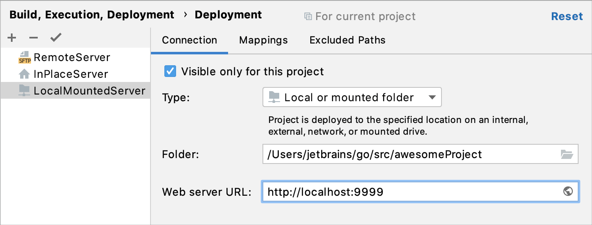
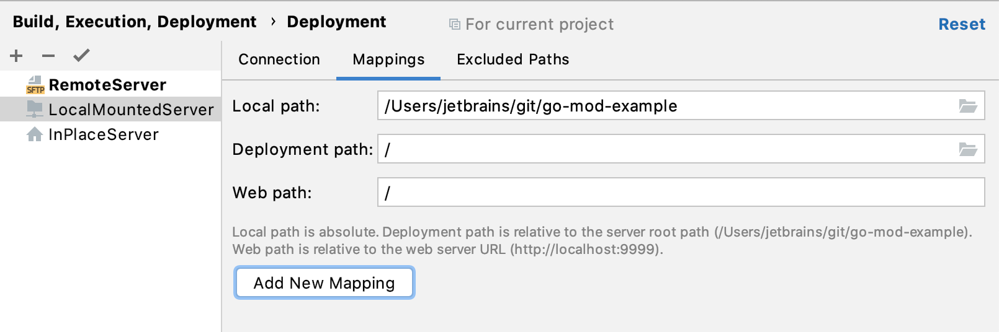

+++
title = "创建本地服务器配置"
weight = 20
date = 2023-06-21T13:50:58+08:00
type = "docs"
description = ""
isCJKLanguage = true
draft = false

+++
# Create a local server configuration 创建本地服务器配置

https://www.jetbrains.com/help/go/creating-local-server-configuration.html

Last modified: 11 January 2023

最后修改日期：2023年1月11日

File | Settings | Build, Execution, Deployment | Deployment for Windows and Linux

文件 | 设置 | 构建、执行、部署 | Windows和Linux 的部署

GoLand | Settings | Build, Execution, Deployment | Deployment for macOS

GoLand | 设置 | 构建、执行、部署 | macOS 的部署

In the local server configuration, you do your development, then copy the sources to the server.

在本地服务器配置中，您进行开发，然后将源代码复制到服务器上。

A local server is a server that is running in a local or a mounted folder and whose document root is NOT the parent of the project root.

​	本地服务器是在本地或挂载文件夹中运行的服务器，其文档根目录不是项目根目录的父目录。

To configure access to the server in this set-up, you need to specify the following:

​	要在此设置中配置对服务器的访问，您需要指定以下内容： 

1. The server configuration root folder and the URL address to access it.
2. Correspondence between the project root folder, the folder on the server to copy the data from the project root folder to, and the URL address to access the copied data on the server. This correspondence is called mapping.
3. 服务器配置根目录和访问它的URL地址。
4. 项目根目录、要将数据从项目根目录复制到的服务器上的文件夹，以及访问服务器上复制数据的URL地址之间的对应关系。这个对应关系称为映射。

### 指定服务器配置的名称、类型和可见性 Specify the name, type, and visibility of a server configuration

1. Press Ctrl+Alt+S to open the IDE settings and select Build, Execution, Deployment | Deployment.

2. 按下Ctrl+Alt+S打开IDE设置，选择“构建、执行、部署 | 部署”。

   Alternatively, from the main menu, select Tools | Deployment | Configuration....

   或者，从主菜单中选择“工具 | 部署 | 配置...”。

3. In the left-hand pane that lists all the existing server configurations, click Add 在列出所有现有服务器配置的左侧窗格中，单击“添加” and select Local or mounted folder in the popup menu.，在弹出菜单中选择“本地或挂载文件夹”。

4. In the Create new server dialog that opens, type the name of the server to create and click OK. The Create new server dialog closes and you return to the [Connection](https://www.jetbrains.com/help/go/deployment-connection-tab.html) tab of the [Deployment](https://www.jetbrains.com/help/go/settings-deployment.html) node.

5. 在打开的“创建新服务器”对话框中，输入要创建的服务器的名称，然后单击“确定”。创建新服务器对话框将关闭，您将返回到“部署”节点的“连接”选项卡。

6. Click 单击工具栏上的 on the toolbar to have GoLand silently apply the current configuration in the following cases:按钮，让GoLand在以下情况下默默应用当前配置：

   - [Automatic upload of changed files](https://www.jetbrains.com/help/go/uploading-and-downloading-files.html#automaticUploadOnUpdate).
   - Manual [upload](https://www.jetbrains.com/help/go/uploading-and-downloading-files.html#manually) and [download](https://www.jetbrains.com/help/go/uploading-and-downloading-files.html#download_file_folder) of files without choosing the target host.
   - [Comparing local files and folders](https://www.jetbrains.com/help/go/comparing-deployed-files-and-folders-with-their-local-versions.html) with their remote versions.
   - [Editing individual files on remote hosts](https://www.jetbrains.com/help/go/editing-individual-files-on-remote-hosts.html).
   - [自动上传更改的文件](https://www.jetbrains.com/help/go/uploading-and-downloading-files.html#automaticUploadOnUpdate)。
   - 手动[上传](https://www.jetbrains.com/help/go/uploading-and-downloading-files.html#manually)和[下载](https://www.jetbrains.com/help/go/uploading-and-downloading-files.html#download_file_folder)文件时，不选择目标主机。

   - [比较本地文件和文件夹](https://www.jetbrains.com/help/go/comparing-deployed-files-and-folders-with-their-local-versions.html)与其远程版本。

   - [编辑远程主机上的单个文件](https://www.jetbrains.com/help/go/editing-individual-files-on-remote-hosts.html)。

     > You can also click the Default Deployment Server widget in the GoLand status bar and select the desired server or server group from the popup menu.
     >
     > 您还可以单击GoLand状态栏中的默认部署服务器小部件，从弹出菜单中选择所需的服务器或服务器组。

7. Use the Visible only for this project checkbox to configure the visibility of the server access configuration.

8. 使用“仅对当前项目可见”复选框来配置服务器访问配置的可见性。

   - Select the checkbox to restrict the use of the configuration to the current project. Such configuration cannot be reused outside the current project. It does not appear in the list of available configurations in other projects.

   - 选择复选框以将配置的使用限制在当前项目中。此类配置不能在当前项目之外重用。它不会出现在其他项目中可用配置的列表中。

     

     The server records are stored in the **.idea** directory together with the project, which allows sharing them between team members [through a VCS](https://www.jetbrains.com/help/go/version-control-integration.html).

     服务器记录存储在与项目一起的 **.idea** 目录中，这允许通过版本控制系统在团队成员之间共享它们。

     

     In the server access configurations list in the left-hand pane, the configurations visible only in the current project are marked with the 在左侧窗格的服务器访问配置列表中，当前项目中可见的配置使用  icon. 图标标记。

   - When the checkbox is cleared, the configuration is visible in all GoLand projects. Its settings can be reused across several projects.

   - 当取消选中复选框时，配置在所有GoLand项目中可见。其设置可以在多个项目中重复使用。

### 指定服务器配置根目录和访问它的URL地址 Specify the server configuration root and the URL address to access it

1. Press Ctrl+Alt+S to open the IDE settings and select Build, Execution, Deployment | Deployment.

2. 按下Ctrl+Alt+S打开IDE设置，选择“构建、执行、部署 | 部署”。

   Alternatively, from the main menu, select Tools | Deployment | Configuration....

   或者，从主菜单中选择“工具 | 部署 | 配置...”。

3. Click the Connection tab.

4. 单击“连接”选项卡。

5. In the Folder field, specify the server configuration root.

6. 在“文件夹”字段中，指定服务器配置的根目录。

   The server configuration root is the highest folder in the file tree on the server that can be accessed through the server configuration. The easiest way is to use the document root of your server as defined in the server configuration file. However, you can appoint any other existing folder under the document root.

   服务器配置根目录是通过服务器配置可以访问的服务器上文件树中的最高文件夹。最简单的方法是使用服务器配置文件中定义的服务器的文档根目录。但是，您也可以指定文档根目录下的任何其他现有文件夹。

   

7. In the Web server URL field, specify the URL address of the server configuration root. This URL address will be the starting point for building the URL address of your application. Depending on your choice of the server configuration root, do one of the following:

8. 在“Web服务器URL”字段中，指定服务器配置根目录的URL地址。该URL地址将成为构建应用程序的URL地址的起始点。根据您选择的服务器配置根目录，执行以下操作之一：

   - Type the URL address associated with the document root of your server as defined in the server configuration file.

   - 在服务器配置文件中定义的服务器的文档根目录关联的URL地址。

   - Type the URL address in the following format:

   - 以以下格式输入URL地址：

     **<Server document root URL>/<path to the folder relative to the server document root>**

   

   Both the HTTP and the HTTPS protocols are supported.

   支持HTTP和HTTPS协议。

### 将项目文件夹映射到服务器上的文件夹，并指定访问它们的URL地址 Map project folders to folders on the server and the URL addresses to access them

Configure mappings, that is, set correspondence between the project folders, the folders on the server to copy project files to, and the URL addresses to access the copied data on the server. The easiest way is to map the entire project root folder to a folder on the server. The project folder structure in this case will be repeated on the server, provided that you have selected the Create Empty directories checkbox in the [Options dialog](https://www.jetbrains.com/help/go/settings-deployment-options.html).

​	配置映射，即设置项目文件夹、要将项目文件复制到的服务器上的文件夹以及访问服务器上复制数据的URL地址之间的对应关系。最简单的方法是将整个项目根目录映射到服务器上的一个文件夹。在这种情况下，项目文件夹结构将在服务器上重复，前提是您在[选项对话框](https://www.jetbrains.com/help/go/settings-deployment-options.html)中选择了“创建空文件夹”复选框。

1. Press Ctrl+Alt+S to open the IDE settings and select Build, Execution, Deployment | Deployment.

2. 按下Ctrl+Alt+S打开IDE设置，选择“构建、执行、部署 | 部署”。

   Alternatively, from the main menu, select Tools | Deployment | Configuration....

   或者，从主菜单中选择“工具 | 部署 | 配置...”。

3. Click the Mappings tab.

4. 单击“映射”选项卡。

5. In the Local Path field, specify the full path to the desired local folder. In the simplest case it is the project root.

6. 在“本地路径”字段中，指定所需本地文件夹的完整路径。在最简单的情况下，它是项目根目录。

7. In the Deployment Path field, specify the folder on the server where GoLand will upload the data from the folder specified in the Local Path field. Type the path to the folder relative to the server configuration root.

8. 在“部署路径”字段中，指定GoLand将从“本地路径”字段中指定的文件夹上传数据到的服务器上的文件夹。根据服务器配置根目录的路径进行相对路径指定。

   If the folder with the specified name does not exist yet, GoLand will create it, provided that you have selected the Create Empty directories checkbox in the [Options dialog](https://www.jetbrains.com/help/go/settings-deployment-options.html).

   如果具有指定名称的文件夹尚不存在，GoLand将创建它，前提是您在[选项对话框](https://www.jetbrains.com/help/go/settings-deployment-options.html)中选择了“创建空文件夹”复选框。

   

9. In the Web Path field, type the path to the folder on the server relative to the server configuration root. Actually, type the relative path you typed in the Deployment Path field.

10. 在“Web路径”字段中，输入相对于服务器配置根目录的服务器上的文件夹的路径。实际上，输入在“部署路径”字段中输入的相对路径。

