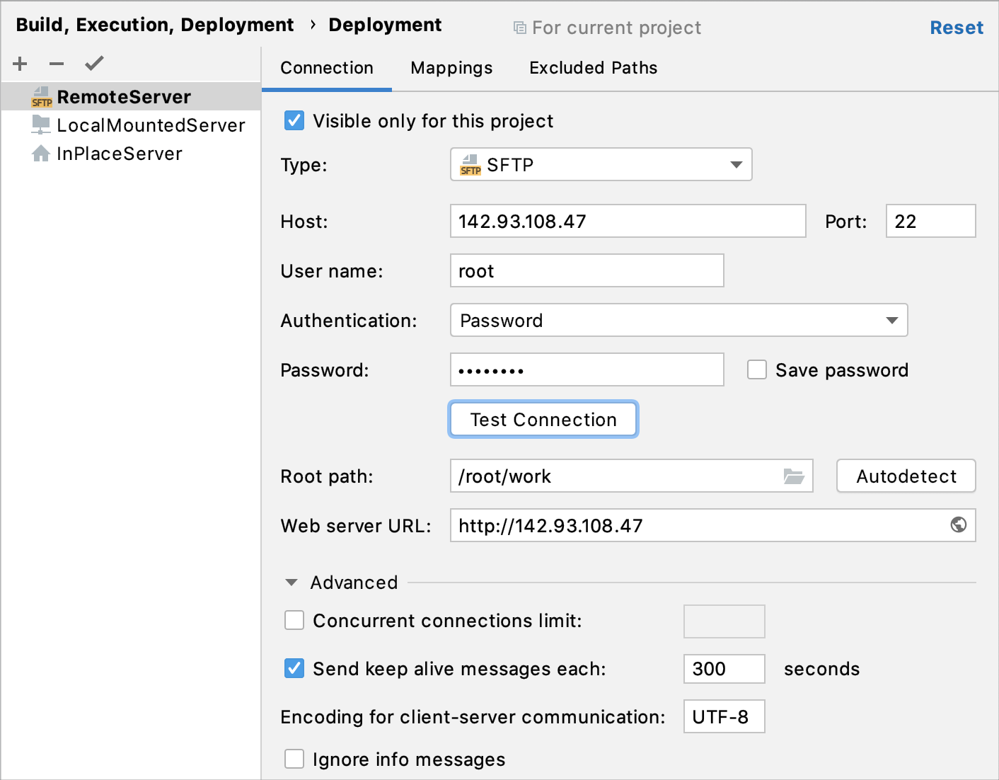
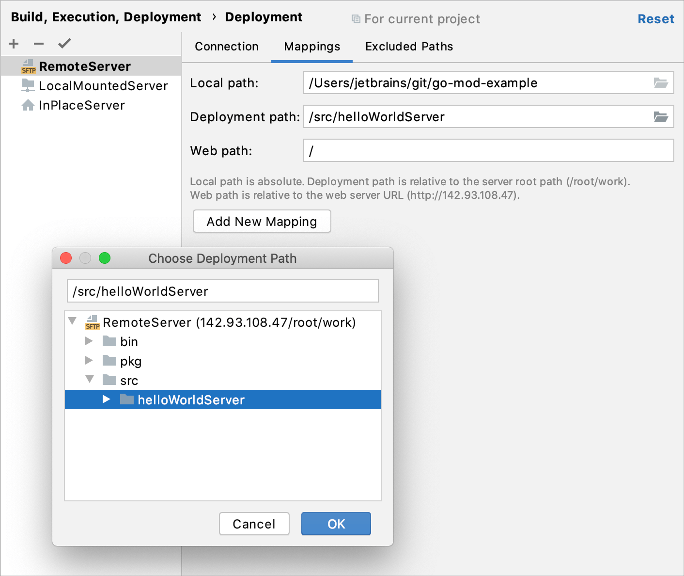

+++
title = "创建远程服务器配置"
weight = 30
date = 2023-06-21T13:50:58+08:00
type = "docs"
description = ""
isCJKLanguage = true
draft = false

+++
# Create a remote server configuration 创建远程服务器配置

https://www.jetbrains.com/help/go/creating-a-remote-server-configuration.html

Last modified: 11 January 2023

最后修改日期：2023年1月11日

File | Settings | Build, Execution, Deployment | Deployment for Windows and Linux

文件 | 设置 | 构建、执行、部署 | 适用于Windows和Linux的部署

GoLand | Settings | Build, Execution, Deployment | Deployment for macOS

GoLand | 设置 | 构建、执行、部署 | 适用于macOS的部署

In the remote server configuration, a server runs on another computer (a remote host). To access files on the server, use FTP/SFTP/FTPS/WebDAV protocols.

​	在远程服务器配置中，服务器在另一台计算机上（远程主机）上运行。要访问服务器上的文件，请使用FTP/SFTP/FTPS/WebDAV协议。

To configure access to the server in this setup, you need to specify the following:

​	要在此设置中配置对服务器的访问，您需要指定以下内容： 

1. Connection settings: server host, port, and user credentials.
2. The server configuration root folder and the URL address to access it.
3. Correspondence between the project root folder, the folder on the server to copy the data from the project root folder to, and the URL address to access the copied data on the server. This correspondence is called mapping.
4. 连接设置：服务器主机、端口和用户凭据。
5. 服务器配置的根文件夹和访问它的URL地址。
6. 项目根文件夹、从项目根文件夹复制数据到服务器上的文件夹以及访问在服务器上复制的数据的URL地址之间的对应关系。这种对应关系称为映射。

### 指定服务器配置的名称、类型和可见性Specify the name, type, and visibility of a server configuration

1. Press Ctrl+Alt+S to open the IDE settings and select Build, Execution, Deployment | Deployment.

2. 按下Ctrl+Alt+S打开IDE设置，选择“构建、执行、部署 | 部署”。

   Alternatively, from the main menu, select Tools | Deployment | Configuration....

   或者，从主菜单中选择“工具 | 部署 | 配置...”。

3. In the left-hand pane that lists all the existing server configurations, click 在列出所有现有服务器配置的左侧窗格中，单击  and select the server configuration type depending on the protocol you are going to use to exchange the data with the server. 并根据您将用于与服务器交换数据的协议选择服务器配置类型。

   - FTP: choose this option to have GoLand access the server via the FTP [file transfer protocol](https://en.wikipedia.org/wiki/File_Transfer_Protocol).
   - SFTP: choose this option to have GoLand access the server via the [SFTP](https://en.wikipedia.org/wiki/SFTP) file transfer protocol.
   - FTPS: choose this option to have GoLand access the server via the FTP file transfer protocol over SSL (the [FTPS](https://en.wikipedia.org/wiki/FTPS) extension).
   - WebDAV: choose this option to have GoLand access the server via the WebDAV file transfer protocol (the [WebDAV](https://en.wikipedia.org/wiki/WebDAV) extension).
   - FTP：选择此选项以使GoLand通过FTP [文件传输协议](https://en.wikipedia.org/wiki/File_Transfer_Protocol)访问服务器。
   - SFTP：选择此选项以使GoLand通过[SFTP](https://en.wikipedia.org/wiki/SFTP)文件传输协议访问服务器。
   - FTPS：选择此选项以使GoLand通过FTP文件传输协议通过SSL访问服务器（[FTPS](https://en.wikipedia.org/wiki/FTPS)扩展）。
   - WebDAV：选择此选项以使GoLand通过WebDAV文件传输协议访问服务器（[WebDAV](https://en.wikipedia.org/wiki/WebDAV)扩展）。

4. In the Create New Server dialog that opens, type the name of the connection to the server and click OK.

5. 在打开的“创建新服务器”对话框中，输入与服务器的连接的名称，然后单击“确定”。

6. Click 单击工具栏上的  on the toolbar to have GoLand silently apply the current configuration in the following cases: 按钮，以使GoLand在以下情况下静默应用当前配置：

   - [Automatic upload of changed files](https://www.jetbrains.com/help/go/uploading-and-downloading-files.html#automaticUploadOnUpdate).
   - Manual [upload](https://www.jetbrains.com/help/go/uploading-and-downloading-files.html#manually) and [download](https://www.jetbrains.com/help/go/uploading-and-downloading-files.html#download_file_folder) of files without choosing the target host.
   - [Comparing local files and folders](https://www.jetbrains.com/help/go/comparing-deployed-files-and-folders-with-their-local-versions.html) with their remote versions.
   - [Editing individual files on remote hosts](https://www.jetbrains.com/help/go/editing-individual-files-on-remote-hosts.html).
   - [自动上传更改的文件](https://www.jetbrains.com/help/go/uploading-and-downloading-files.html#automaticUploadOnUpdate)。
   - 手动[上传](https://www.jetbrains.com/help/go/uploading-and-downloading-files.html#manually)和[下载](https://www.jetbrains.com/help/go/uploading-and-downloading-files.html#download_file_folder)文件而不选择目标主机。
   - [将本地文件和文件夹与其远程版本进行比较](https://www.jetbrains.com/help/go/comparing-deployed-files-and-folders-with-their-local-versions.html)。
   - [在远程主机上编辑单个文件](https://www.jetbrains.com/help/go/editing-individual-files-on-remote-hosts.html)。

   > You can also click the Default Deployment Server widget in the GoLand status bar and select the desired server or server group from the popup menu.
   >
   > 您还可以单击GoLand状态栏中的“默认部署服务器”小部件，然后从弹出菜单中选择所需的服务器或服务器组。

7. Use the Visible only for this project checkbox to configure the visibility of the server access configuration.

8. 使用“仅对此项目可见”复选框来配置服务器访问配置的可见性。

   - Select the checkbox to restrict the use of the configuration to the current project. Such configuration cannot be reused outside the current project. It does not appear in the list of available configurations in other projects.
   - 选择复选框以限制配置的使用范围仅限于当前项目。这样的配置无法在当前项目之外重用，它不会出现在其他项目中可用配置的列表中。
   - When the checkbox is cleared, the configuration is visible in all GoLand projects. Its settings can be reused across several projects.
   - 清除复选框时，配置在所有GoLand项目中可见。其设置可以在多个项目中重复使用。

### 指定在主机注册期间定义的用户凭据 Specify user credentials defined during registration on the host

1. For FTP and FTPS servers, specify the registration mode:

2. 对于FTP和FTPS服务器，请指定注册模式：

   - To login in a regular mode, specify the login in the User name field.
   - 若要以常规模式登录，请在“用户名”字段中指定登录名。
   - To enable [anonymous access](https://www.businessdictionary.com/definition/anonymous-FTP.html) to the server with your email address as password, select the Login as anonymous checkbox.
   - 要使用您的电子邮件地址作为密码启用匿名访问，请选择“以匿名身份登录”复选框。

3. Specify the way to authenticate to the server:

4. 指定与服务器进行身份验证的方式：

   - For FTP and WebDAV servers, type your password and select the Save password checkbox to have GoLand remember it.

   - 对于FTP和WebDAV服务器，请输入您的密码，并选择“保存密码”复选框以让GoLand记住它。

   - For SFTP server, choose one of the created SSH configurations, or click 对于SFTP服务器，请选择已创建的SSH配置之一，或单击  and create a new configuration as described in [Create SSH configurations](https://www.jetbrains.com/help/go/create-ssh-configurations.html). 并根据[创建SSH配置](https://www.jetbrains.com/help/go/create-ssh-configurations.html)中的说明创建新配置。

   - For FTPS server, specify your username and password. In the [Advanced](https://www.jetbrains.com/help/go/deployment-connection-tab.html#advanced-settings-area) settings area, choose the security mechanism to apply.

   - 对于FTPS服务器，请指定您的用户名和密码。在[高级](https://www.jetbrains.com/help/go/deployment-connection-tab.html#advanced-settings-area)设置区域中，选择要应用的安全机制。

     - Choose Explicit to have the [explicit (active) security](https://www.smartftp.com/support/kb/what-is-the-difference-between-implicit-ssl-and-explicit-ssl-f189.html) applied. Immediately after establishing connection, the FTP client on your machine sends a command to the server to establish secure control connection through the default FTP port.

     - 选择“显式”以应用[显式（主动）安全](https://www.smartftp.com/support/kb/what-is-the-difference-between-implicit-ssl-and-explicit-ssl-f189.html)。在建立连接后立即，您的计算机上的FTP客户端发送一个命令给服务器，通过默认的FTP端口建立安全的控制连接。

       This method is selected by default.

       默认情况下选择此方法。
     
     - Choose Implicit to have the [implicit (passive) security](https://www.smartftp.com/support/kb/what-is-the-difference-between-implicit-ssl-and-explicit-ssl-f189.html) applied. In this case, security is provided automatically upon establishing connection to the server, which appoints a separate port for secure connections.
     
     - 选择“隐式”以应用[隐式（被动）安全](https://www.smartftp.com/support/kb/what-is-the-difference-between-implicit-ssl-and-explicit-ssl-f189.html)。在这种情况下，建立与服务器的连接时会自动提供安全性，服务器为安全连接指定一个单独的端口。
     
       Note that this method is considered deprecated, and using it is discouraged.
       
       请注意，此方法已被视为已弃用，不建议使用。

### 启用对服务器的连接并指定服务器配置根目录 Enable connection to the server and specify the server configuration root

1. For FTP/FTPS/WebDAV servers, specify the host name of the server to exchange data with and the port at which this server listens. The FTP/FTPS, the default value for the port is 21. For WebDAV, the default value is 6180.

2. 对于FTP/FTPS/WebDAV服务器，请指定要与之交换数据的服务器的主机名和监听的端口。FTP/FTPS的默认端口值为21。对于WebDAV，默认值为6180。

   For SFTP servers, the values specified in the selected [SSH configuration](https://www.jetbrains.com/help/go/create-ssh-configurations.html) are used.

   对于SFTP服务器，使用所选的[SSH配置](https://www.jetbrains.com/help/go/create-ssh-configurations.html)中指定的值。

3. In the Root path field, specify the server configuration root relative to the root folder on the server. This folder will be the highest one in the folder structure accessible through the current server configuration.

4. 在“根路径”字段中，指定相对于服务器上的根文件夹的服务器配置根。此文件夹将是通过当前服务器配置访问的文件夹结构中的最高级文件夹。

   Do one of the following:

   执行以下操作之一： 

   - Accept the default **/** path, which points at the root folder on the server.
   - 接受默认的 **/** 路径，指向服务器上的根文件夹。
   - Type the path manually or click 手动输入路径，或单击  and select the desired folder in the Choose Root Path dialog that opens. 并在打开的“选择根路径”对话框中选择所需的文件夹。
   - Click Autodetect. GoLand detects the user home folder settings on the FTP/SFTP server and sets up the root path according to them. The button is only enabled when you have specified your credentials.
   - 单击“自动检测”。GoLand会检测FTP/SFTP服务器上的用户主文件夹设置，并根据它们设置根路径。只有在您指定了凭据时，该按钮才处于启用状态。

   

5. In the Web server URL field, type the URL address to access the server configuration root. The server configuration root is the highest folder in the file tree on the local or remote server accessible through the server configuration. For in-place servers, it is the project root.

6. 在“Web服务器URL”字段中，输入访问服务器配置根目录的URL地址。服务器配置根是本地或远程服务器上的文件树中的最高级文件夹，通过服务器配置可以访问它。对于就地服务器，它是项目根目录。

   Both the HTTP and the HTTPS protocols are supported.

   HTTP和HTTPS协议都受支持。

7. Click 单击字段中的  in the field to make sure that the specified server root URL address is accessible and points at the correct Web page. ，确保指定的服务器根URL地址可访问且指向正确的Web页面。

8. (Optional) For SFTP servers, select Use Rsync for download/upload/sync to have GoLand use [Rsync](https://rsync.samba.org/) for uploading and downloading files, which can increase file transfer speeds.

9. （可选）对于SFTP服务器，请选择“使用Rsync进行下载/上传/同步”，以便GoLand使用[Rsync](https://rsync.samba.org/)进行文件上传和下载，这可以提高文件传输速度。

   Click the Rsync Settings link and configure Rsync settings in the dialog that opens:

   单击“Rsync设置”链接，并在打开的对话框中配置Rsync设置：

   - Provide the paths to the `rsync` and `ssh` executables.

   - 提供 `rsync` 和 `ssh` 可执行文件的路径。

     - On macOS and Linux, the `rsync` and `ssh` tools are preinstalled and their paths are filled automatically.
     - 在macOS和Linux上，`rsync` 和 `ssh` 工具已预安装，并且其路径会自动填充。
     - On Windows, you need to manually install [Cygwin](https://www.cygwin.com/) with the `rsync` and `openssh` packages first. The tools' executables are commonly located in the **<Cygwin installation>\bin** folder.
     - 在Windows上，您需要首先手动安装 [Cygwin](https://www.cygwin.com/) 并安装 `rsync` 和 `openssh` 包。这些工具的可执行文件通常位于 **<Cygwin安装路径>\bin** 文件夹中。

   - If necessary, override the Rsync command-line parameters in the Rsync options field.

   - 如果需要，在“Rsync选项”字段中覆盖Rsync命令行参数。

     By default, the `-zar` options are used, so that Rsync will compress the transferred data (`z`), preserve permissions, ownership, and timestamps of transferred files and folders (`a`), and recurse into subdirectories (`r`).

     默认情况下，使用 `-zar` 选项，因此Rsync会压缩传输的数据 (`z`)，保留传输的文件和文件夹的权限、所有权和时间戳 (`a`)，并递归传输所有文件和子文件夹 (`r`)。
     
     For the complete list of available options, refer to the [Rsync documentation](https://linux.die.net/man/1/rsync).
     
     例如，要在每次同步期间删除远程服务器上不存在的文件，请添加 `--delete` 参数。

   > Rsync is used for [upload and download](https://www.jetbrains.com/help/go/uploading-and-downloading-files.html) operations. All other deployment-related operations, including [accessing files on a remote host](https://www.jetbrains.com/help/go/accessing-files-on-remote-hosts.html), [comparing deployed files and folders with their local versions](https://www.jetbrains.com/help/go/comparing-deployed-files-and-folders-with-their-local-versions.html), and so on, are performed via SFTP.
   >
   > Rsync用于[上传和下载](https://www.jetbrains.com/help/go/uploading-and-downloading-files.html)操作。所有其他与部署相关的操作，包括[访问远程主机上的文件](https://www.jetbrains.com/help/go/accessing-files-on-remote-hosts.html)、[将部署的文件和文件夹与本地版本进行比较](https://www.jetbrains.com/help/go/comparing-deployed-files-and-folders-with-their-local-versions.html)等，都通过SFTP执行。

### 将本地文件夹映射到服务器文件夹和访问它们的URL地址 Map local folders to folders on the server and the URL addresses to access them

Configure mappings, that is, set correspondence between the project folders, the folders on the server to copy project files to, and the URL addresses to access the copied data on the server. The easiest way is to map the entire project root folder to a folder on the server. The project folder structure in this case will be repeated on the server, provided that you have selected the Create Empty directories checkbox in the [Options dialog](https://www.jetbrains.com/help/go/settings-deployment-options.html).

​	配置映射，即设置项目文件夹、将项目文件复制到的服务器文件夹以及访问服务器上复制数据的URL地址之间的对应关系。最简单的方式是将整个项目根文件夹映射到服务器上的一个文件夹。在这种情况下，只要您在[选项对话框](https://www.jetbrains.com/help/go/settings-deployment-options.html)中选中了"创建空文件夹"复选框，项目文件夹结构将在服务器上重复。

1. Press Ctrl+Alt+S to open the IDE settings and select Build, Execution, Deployment | Deployment.

2. 按下Ctrl+Alt+S打开IDE设置，并选择"构建、执行、部署 | 部署"。

   Alternatively, from the main menu, select Tools | Deployment | Configuration....

   或者，从主菜单中选择"工具 | 部署 | 配置..."。

3. Click the Mappings tab.

4. 点击"映射"选项卡。

5. In the Local Path field, specify the full path to the desired local folder. In the simplest case it is the project root.

6. 在"本地路径"字段中，指定所需本地文件夹的完整路径。在最简单的情况下，它就是项目的根目录。

7. In the Deployment Path field, specify the folder on the server where GoLand will upload the data from the folder specified in the Local Path field. Type the path to the folder relative to the server configuration root.

8. 在"部署路径"字段中，指定GoLand将从"本地路径"字段指定的文件夹上传数据到服务器上的文件夹。输入相对于服务器配置根目录的文件夹路径。

   If the folder with the specified name does not exist yet, GoLand will create it, provided that you have selected the Create Empty directories checkbox in the [Options dialog](https://www.jetbrains.com/help/go/settings-deployment-options.html).

   如果指定名称的文件夹尚不存在，只要您在[选项对话框](https://www.jetbrains.com/help/go/settings-deployment-options.html)中选中了"创建空文件夹"复选框，GoLand将创建该文件夹。

   

9. In the Web Path field, type the path to the folder on the server relative to the server configuration root. Actually, type the relative path you typed in the Deployment Path field.

10. 在"Web路径"字段中，输入相对于服务器配置根目录的服务器上的文件夹路径。实际上，输入您在"部署路径"字段中输入的相对路径即可。

