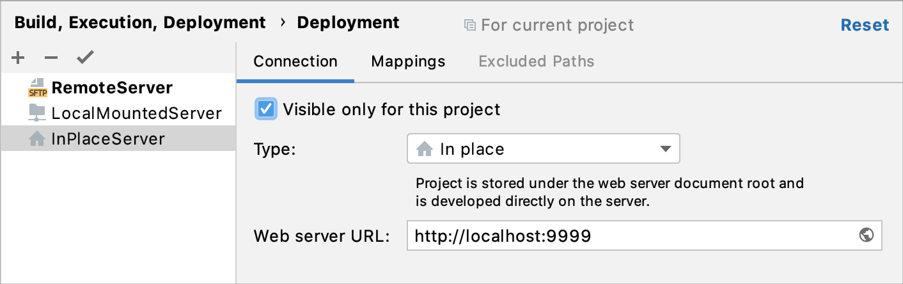
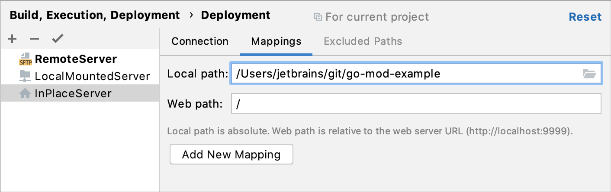

+++
title = "创建就地服务器配置"
weight = 10
date = 2023-06-21T13:50:58+08:00
type = "docs"
description = ""
isCJKLanguage = true
draft = false

+++
# Create an in-place server configuration 创建就地服务器配置

https://www.jetbrains.com/help/go/creating-in-place-server-configuration.html

Last modified: 21 April 2023

File | Settings | Build, Execution, Deployment | Deployment for Windows and Linux

GoLand | Settings | Build, Execution, Deployment | Deployment for macOS

In the in-place server configuration, the server is running on your computer and you do your development directly on the server.

​	在就地服务器配置中，服务器在您的计算机上运行，您可以直接在服务器上进行开发。

The document root of an in-place server is the parent of the project root, either immediate or not. The document root is the server root or website root directory. Usually, it is the publicly-accessible base folder for a website.

​	就地服务器的文档根目录是项目根目录的父目录，可以是直接的父目录或非直接的父目录。文档根目录是服务器根目录或网站根目录。通常，它是网站的公共可访问基本文件夹。

To configure access to the server in this set-up, you only need to specify the URL address of the server document root, appoint the project root folder, and specify the URL address to access it.

​	要在此设置中配置对服务器的访问，您只需要指定服务器文档根目录的URL地址、指定项目根文件夹，并指定访问它的URL地址。

### 指定服务器配置的名称、类型和可见性Specify the name, type, and visibility of a server configuration

1. Press Ctrl+Alt+S to open the IDE settings and select Build, Execution, Deployment | Deployment.

2. 按下Ctrl+Alt+S打开IDE设置，选择“构建、执行、部署 | 部署”。

   Alternatively, from the main menu, select Tools | Deployment | Configuration....

   或者，从主菜单中选择“工具 | 部署 | 配置...”。

3. In the left-hand pane that lists all the existing server configurations, click Add 在左侧窗格中列出所有现有服务器配置的地方，单击“添加”  and select In-place from the list. 并从列表中选择“就地”。

4. In the Create new server dialog that opens, type the name of the server to be created and click OK. The Create new server dialog closes and you return to the [Connection](https://www.jetbrains.com/help/go/deployment-connection-tab.html) tab of the [Deployment](https://www.jetbrains.com/help/go/settings-deployment.html) node.

5. 在打开的“创建新服务器”对话框中，键入要创建的服务器的名称，然后单击“确定”。创建新服务器对话框关闭，并返回到[连接](https://www.jetbrains.com/help/go/deployment-connection-tab.html)选项卡下的[部署](https://www.jetbrains.com/help/go/settings-deployment.html)节点。

6. Click 单击工具栏上的  on the toolbar to have GoLand silently apply the current configuration in the following cases: 按钮，让GoLand在以下情况下静默应用当前配置：

   - [Automatic upload of changed files](https://www.jetbrains.com/help/go/uploading-and-downloading-files.html#automaticUploadOnUpdate).
   - Manual [upload](https://www.jetbrains.com/help/go/uploading-and-downloading-files.html#manually) and [download](https://www.jetbrains.com/help/go/uploading-and-downloading-files.html#download_file_folder) of files without choosing the target host.
   - [Comparing local files and folders](https://www.jetbrains.com/help/go/comparing-deployed-files-and-folders-with-their-local-versions.html) with their remote versions.
   - [Editing individual files on remote hosts](https://www.jetbrains.com/help/go/editing-individual-files-on-remote-hosts.html).
   - [自动上传已更改的文件](https://www.jetbrains.com/help/go/uploading-and-downloading-files.html#automaticUploadOnUpdate)。
   - 手动[上传](https://www.jetbrains.com/help/go/uploading-and-downloading-files.html#manually)和[下载](https://www.jetbrains.com/help/go/uploading-and-downloading-files.html#download_file_folder)文件，而不选择目标主机。
   - 将本地文件和文件夹与其远程版本进行比较。
   - [在远程主机上编辑单个文件](https://www.jetbrains.com/help/go/editing-individual-files-on-remote-hosts.html)。

   > You can also click the Default Deployment Server widget in the GoLand status bar and select the desired server or server group from the popup menu.
   >
   > 您还可以单击GoLand状态栏中的默认部署服务器小部件，并从弹出菜单中选择所需的服务器或服务器组。

7. Use the Visible only for this project checkbox to configure the visibility of the server access configuration.

8. 使用“仅对此项目可见”复选框来配置服务器访问配置的可见性。

   - Select the checkbox to restrict the use of the configuration to the current project. Such configuration cannot be reused outside the current project. It does not appear in the list of available configurations in other projects.

   - 选中复选框以限制配置的使用范围仅限于当前项目。此类配置不能在当前项目之外重用。它不会出现在其他项目中可用配置的列表中。

     The server records are stored in the **.idea** directory together with the project, which allows sharing them between team members [through a VCS](https://www.jetbrains.com/help/go/version-control-integration.html).

     服务器记录存储在与项目一起的 **.idea** 目录中，这允许通过版本控制系统在团队成员之间共享它们。

     

     In the server access configurations list in the left-hand pane, the configurations visible only in the current project are marked with the 在左侧窗格中的服务器访问配置列表中，当前项目中可见的配置会用  icon. 图标进行标记。

   - When the checkbox is cleared, the configuration is visible in all GoLand projects. Its settings can be reused across several projects.

   - 清除复选框时，配置在所有GoLand项目中可见。其设置可以在多个项目中重用。

### 指定服务器文档根目录的URL地址Specify the URL address of the server document root

1. Press Ctrl+Alt+S to open the IDE settings and select Build, Execution, Deployment | Deployment.

2. 按下Ctrl+Alt+S打开IDE设置，选择“构建、执行、部署 | 部署”。

   Alternatively, from the main menu, select Tools | Deployment | Configuration....

   或者，从主菜单中选择“工具 | 部署 | 配置...”。

3. In the Web server URL field, type the URL address associated with the document root of your server as defined in the server configuration file. This URL address will be the starting point for building the URL address of your application.

4. 在“Web服务器URL”字段中，键入与服务器配置文件中定义的服务器文档根目录相关联的URL地址。该URL地址将成为构建应用程序的URL地址的起点。

   Both the HTTP and the HTTPS protocols are supported.

   支持HTTP和HTTPS协议。

For example, the default document root is set to the **htdocs** folder, and the default URL address to access the data in it is **http://localhost**. If you have changed the default port **80**, you have to specify the port explicitly: **http://localhost:<port>**.

​	例如，默认的文档根目录设置为 **htdocs** 文件夹，访问其中数据的默认URL地址为 `http://localhost`。如果您更改了默认端口`80`，则必须明确指定端口：`http://localhost:<port>`。

### 指定项目根文件夹和访问它的URL地址Specify the project root folder and the URL address to access it

1. Press Ctrl+Alt+S to open the IDE settings and select Build, Execution, Deployment | Deployment.

2. 按下Ctrl+Alt+S打开IDE设置，选择“构建、执行、部署 | 部署”。

   Alternatively, from the main menu, select Tools | Deployment | Configuration....

   或者，从主菜单中选择“工具 | 部署 | 配置...”。

3. Click the [Mappings](https://www.jetbrains.com/help/go/deployment-mappings-tab.html) tab.

4. 单击“映射”选项卡。

5. In the Local path field, specify the full path to your project root folder. Type the path manually, or click 在“本地路径”字段中，指定项目根文件夹的完整路径。可以手动输入路径，也可以单击  and choose the folder in the dialog, that opens. 并在打开的对话框中选择文件夹。

6. In the Web path field, type the path to the project root folder relative to the server document root specified in the server configuration file.

7. 在“Web路径”字段中，输入相对于服务器配置文件中指定的服务器文档根目录的项目根文件夹的路径。

