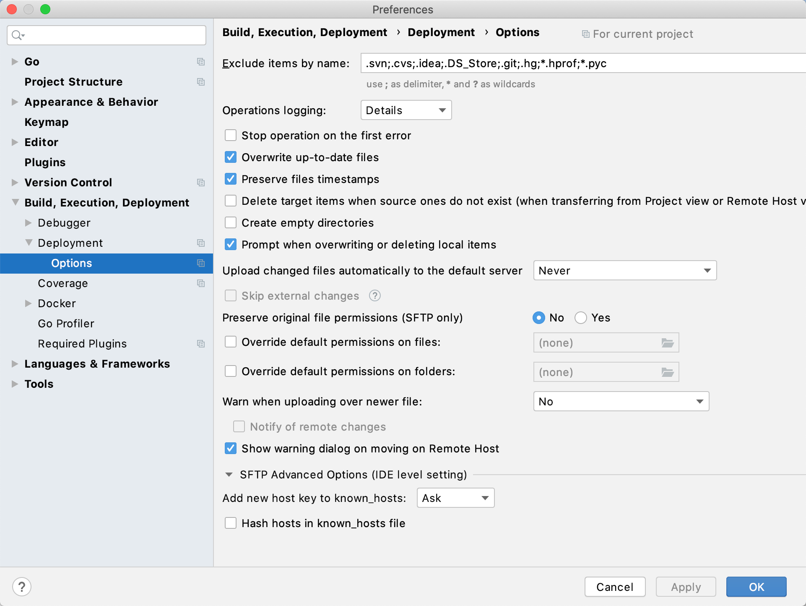
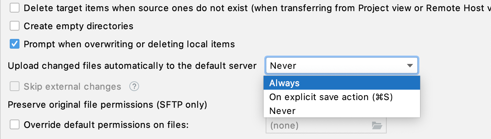
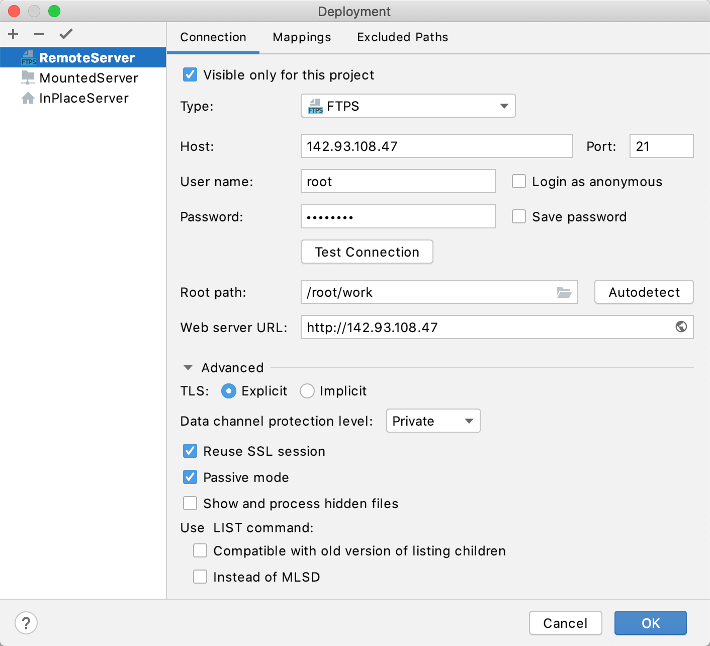

+++
title = "自定义上传和下载"
weight = 40
date = 2023-06-21T13:50:58+08:00
type = "docs"
description = ""
isCJKLanguage = true
draft = false

+++
# Customize upload and download

https://www.jetbrains.com/help/go/customizing-upload.html

Last modified: 11 January 2023

最近修改日期：2023年1月11日

File | Settings | Build, Execution, Deployment | Deployment for Windows and Linux

GoLand | Settings | Build, Execution, Deployment | Deployment for macOS

​	除了确保在各种项目-服务器设置中成功上传和下载的必要设置外，您还可以配置其他选项来自定义与服务器的交互。其中大部分选项适用于所有服务器访问配置类型。对于FTP、FTPS和SFTP服务器配置，您可以指定其他特定于协议的选项。



### 设置常见的上传和下载选项

1. 按下Ctrl+Alt+S打开IDE设置，选择Build, Execution, Deployment | Deployment | Options。

   或者，从主菜单中选择Tools | Deployment | Options...。

2. 指定额外的设置：

   - 若要在上传和下载过程中跳过特定文件或整个文件夹，请在Exclude items by name字段中指定定义这些文件和文件夹名称的模式。

     使用分号`;`作为分隔符，使用星号`*`匹配零个或多个字符，使用问号`?`匹配单个字符。

     例如，如果您有一个名为**stylesheets**的文件夹，其中包含三个文件**style.css**、**style1.css**和**style2.scss**，那么`style*`会排除整个文件夹，`style?.css`会排除**style.css**，`style?.*`会排除**style1.css**和**style2.scss**。

     了解更多信息，请参阅[Regular-Expressions.info](https://www.regular-expressions.info/quickstart.html)。

     排除项会递归应用。这意味着如果匹配的文件夹有子文件夹，这些子文件夹的内容也不会被部署。

     有关更多信息，请参阅[排除上传和下载的文件和文件夹](https://www.jetbrains.com/help/go/excluding-files-and-folders-from-deployment.html)。

   - 通过选中或取消选中相应的复选框来指定上传和下载过程的详细信息。


   


### 指定其他特定于协议的自定义选项 Specify additional protocol-specific customization options

1. 按下Ctrl+Alt+S打开IDE设置，选择Build, Execution, Deployment | Deployment。

   Alternatively, from the main menu, select Tools | Deployment | Configuration....

   或者，从主菜单中选择Tools | Deployment | Configuration...。

2. 选择配置的服务器，并在连接选项卡上展开[高级](https://www.jetbrains.com/help/go/deployment-connection-tab.html#advanced-settings-area)组以指定依赖于协议的其他上传设置：

   

   

   


   - 在Number of connections字段中，指定同时支持的最大连接数。
   - 在Send keep alive messages each字段中，指定GoLand发送命令以重置超时并保持连接的频率。
   - 在Encoding for client-server communication字段中，指定与服务器使用的编码匹配的编码。如果不确定服务器是否支持UTF-8编码，请接受默认值。

   

   

   

   - 要将客户端设置为[被动模式](https://slacksite.com/other/ftp.html#passive)，选择“被动模式”复选框。在此模式下，您的计算机上的客户端连接到服务器以通知其处于被动模式，并接收要监听的端口号，并通过该端口建立数据连接。当您的计算机位于防火墙后面时，此模式非常有用。
   - 要在[服务器浏览器工具窗口](https://www.jetbrains.com/help/go/remote-host-tool-window.html)中显示以点号（**.**）开头的隐藏文件和目录，选择Show and process hidden files。

   - 在Use LIST command area中选择Compatible with old version of listing children，以确保与您的FTP服务器[在子文件命名方面的兼容性](https://issues.apache.org/jira/browse/VFS-310)。如果远程FTP服务器报告以下错误，则此选项很有帮助：

     ```bash
   Invalid descendant file name <file name>
     ```

     
     
     选择此选项可能会减慢与服务器的同步速度。

   - 在Use LIST command area中选择Instead of MLSD，以使用标准的`LIST`命令进行列表，而不是`MLSD`命令。这样可以避免问题，例如，如果FTP服务器支持`MLSD`并返回`cdir`，则在上传过程中出现Invalid descendent file name异常。

   - 在Number of connections字段中，指定同时支持的最大连接数。

   - 在Send keep alive messages each字段中，指定GoLand向服务器发送命令以重置超时并保持连接的频率。

   - 从Keep alive command列表中选择要发送到服务器以重置超时并保持连接的命令。


   

   

   

   

   - TLS：传输层安全性的方法。选择Explicit 以使用与明文（非安全）模式相同的端口，或选择Implicit 以使用专用端口。
   - 数据通道保护级别：选择Clear 以进行非安全连接，或选择Private 以进行安全连接。

   - 重用SSL会话：选择以重用在SSL连接期间建立的安全契约，包括密钥和算法协议信息。

   - 禁用TLS 1.3：选择以禁用TLS 1.3功能，并使GoLand回退到通过TLS 1.2进行连接。如果在连接到服务器或上传某些文件时遇到问题，请使用此选项。

     > ​	GoLand支持通过TLS 1.2和更高版本连接到服务器。不支持使用TLS 1.0和TLS 1.1，因为这些协议已[废弃](https://datatracker.ietf.org/doc/rfc8996/)且被认为不安全。

   - 要将客户端设置为[被动模式](https://slacksite.com/other/ftp.html#passive)，请选择被动模式（Passive mode）复选框。在此模式下，您的计算机上的客户端连接到服务器以通知其处于被动模式，并接收要监听的端口号，并通过该端口建立数据连接。当您的计算机位于防火墙后面时，此模式非常有用。

   - 要在[服务器浏览器工具窗口](https://www.jetbrains.com/help/go/remote-host-tool-window.html)中显示以点号（**.**）开头的隐藏文件和目录，请选择Show and process hidden files。

   - 在Use LIST command area中选择Compatible with old version of listing children，以确保与您的FTP服务器[在子文件命名方面的兼容性](https://issues.apache.org/jira/browse/VFS-310)。如果远程FTP服务器报告以下错误，则此选项很有帮助：

     ```bash
   Invalid descendant file name <file name>
     ```

     
     
     选择此选项可能会减慢与服务器的同步速度。

   - 在Use LIST command area中选择Instead of MLSD，以使用标准的`LIST`命令进行列表，而不是`MLSD`命令。这样可以避免问题，例如，如果FTP服务器支持`MLSD`并返回`cdir`，则在上传过程中出现Invalid descendent file name异常。


   

   

   

   

   

   

   
