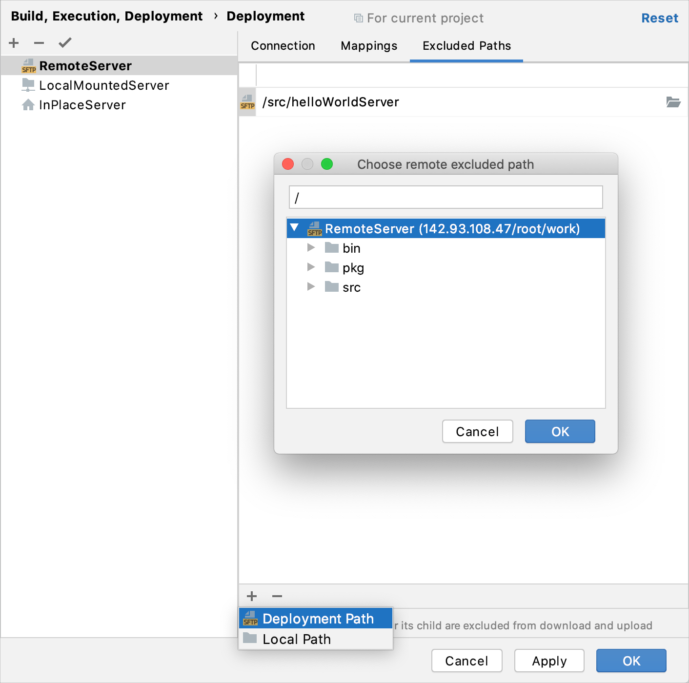
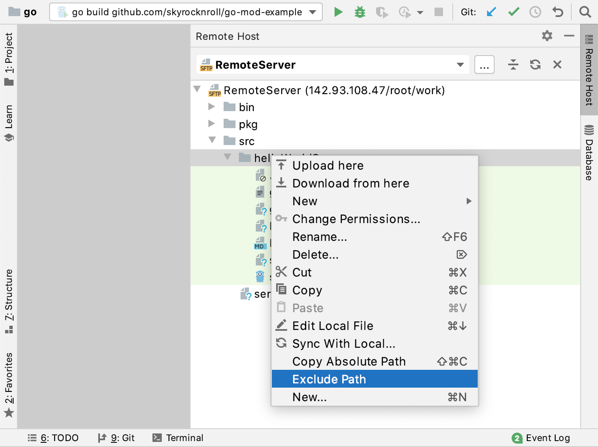
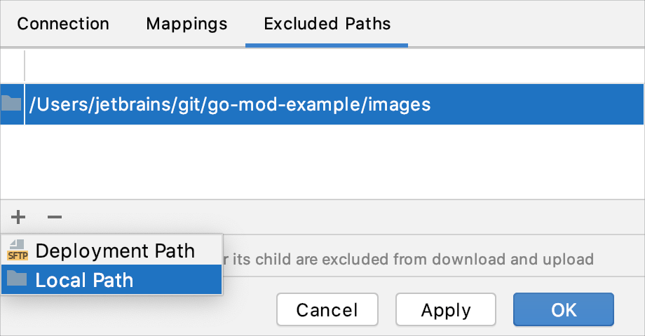
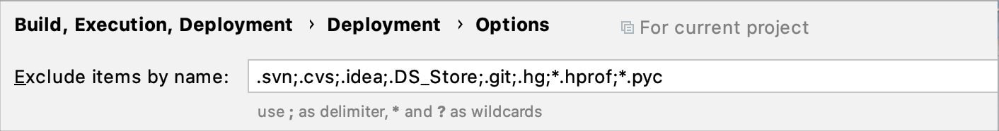

+++
title = "从上传和下载中排除文件和文件夹"
weight = 50
date = 2023-06-21T13:50:58+08:00
type = "docs"
description = ""
isCJKLanguage = true
draft = false

+++
# Exclude files and folders from uploading and downloading 从上传和下载中排除文件和文件夹

https://www.jetbrains.com/help/go/excluding-files-and-folders-from-deployment.html

Last modified: 17 March 2022

最后修改日期：2022年3月17日

Suppressing uploading, downloading, and synchronization for files or folders with sources ensures that the sources are protected against accidental update. When applied to non-sources, it can save system resources because media, caches, or temporary files are no longer copied unnecessarily.

​	抑制对源代码以外的文件或文件夹进行上传、下载和同步，可以确保源代码不会被意外更新。对于非源代码文件，这样做可以节省系统资源，因为不再无谓地复制媒体、缓存或临时文件。

You may need to suppress upload/download in the following cases:

​	在以下情况下，您可能需要抑制上传/下载：

1. You are going to work with externally created and uploaded source code. To process these remote sources in GoLand, you have to download them and arrange them in a project. However, there are some sources that you should not update at all. On the other hand, the folders on the remote host also may contain huge amounts of media, caches, temporal files, that you actually do not need in your work.
2. 您将要使用外部创建并上传的源代码。要在GoLand中处理这些远程源代码，您需要将它们下载并整理到项目中。但是，有些源代码是您根本不应该更新的。另一方面，远程主机上的文件夹也可能包含大量您在工作中实际上不需要的媒体、缓存、临时文件等。
3. You have already downloaded the data from the server and arranged them in a GoLand project. However, for this or that reason, you need to have some files or folders on the server protected against upload/download, for example, to prevent accidental overwriting.
4. 您已经从服务器下载了数据并将其整理到GoLand项目中。然而，出于这样或那样的原因，您需要保护服务器上的某些文件或文件夹免受上传/下载的影响，例如防止意外覆盖。
5. The local copy of an application contains both source code and other data that you do not need to upload. Besides, you want to protect some sources against overwriting by mistake. In this case, you can suppress upload/download for all files and folders that should not be uploaded.
6. 应用程序的本地副本包含源代码和其他您不需要上传的数据。此外，您希望防止某些源代码被错误地覆盖。在这种情况下，您可以抑制所有不应该上传的文件和文件夹的上传/下载。

> In any case, exclusion is applied recursively. If the path to a folder is explicitly marked as excluded or the folder name matches the pattern, the contents of all its subfolders, if any, are also protected against upload/download.
>
> ​	无论哪种情况，排除都会递归应用。如果文件夹的路径被明确标记为已排除或文件夹名称与模式匹配，那么它的所有子文件夹（如果有的话）的内容也将受到保护，不会被上传/下载。
>
> Also note that separate files can be protected against upload/download only through [excluding them by name](https://www.jetbrains.com/help/go/excluding-files-and-folders-from-deployment.html#exclude_by_name).
>
> ​	还要注意，单独的文件只能通过[按名称排除它们](https://www.jetbrains.com/help/go/excluding-files-and-folders-from-deployment.html#exclude_by_name)来保护免受上传/下载的影响。

## 排除服务器上的文件夹在项目创建后不进行上传/下载 Exclude a folder on server from upload/download after project creation

### 将文件夹添加到已排除路径列表 Add a folder to the list of excluded paths

1. Open the [Deployment](https://www.jetbrains.com/help/go/settings-deployment.html) dialog by doing one of the following:

2. 打开[部署](https://www.jetbrains.com/help/go/settings-deployment.html)对话框，方法如下：

   - Choose Tools | Deployment | Configuration from the main menu.
   - In the Settings dialog (Ctrl+Alt+S), select Deployment under Build, Execution, Deployment.
   - 从主菜单选择 "工具" | "部署" | "配置"。
   - 在设置对话框 (Ctrl+Alt+S) 中，选择 "构建、执行、部署" 下的 "部署"。

3. In the [Deployment](https://www.jetbrains.com/help/go/settings-deployment.html) dialog, click the [Excluded Paths](https://www.jetbrains.com/help/go/deployment-excluded-paths-tab.html) tab. The tab shows the list of the previously excluded local and remote folders.

4. 在[部署](https://www.jetbrains.com/help/go/settings-deployment.html)对话框中，单击 [已排除的路径](https://www.jetbrains.com/help/go/deployment-excluded-paths-tab.html) 选项卡。该选项卡显示之前排除的本地和远程文件夹的列表。

5. Click the Add button 单击 "添加" 按钮  and select Deployment path.，并选择 "部署路径"。

6. Double-click the empty line that is added to the list.

7. 双击添加到列表中的空行。

8. At the end of the added line, click the Browse button 在添加的行的末尾，单击 "浏览" 按钮 .

9. In the Choose remote excluded path dialog, navigate to the folder that you want to exclude.

10. 在 "选择要排除的远程路径" 对话框中，导航到要排除的文件夹。

   You can also type the path manually, but note that only absolute paths are accepted.

   您也可以手动输入路径，但请注意，只接受绝对路径。

   

### 在“远程主机”工具窗口中将文件夹添加到已排除路径列表 Add a folder to the list of excluded paths in the Remote Host tool window

1. From the main menu, choose Tools | Deployment | Browse Remote Host or View | Tool Windows | Remote Host.

2. In the [Remote Host](https://www.jetbrains.com/help/go/remote-host-tool-window.html) tool window that opens, select the relevant [server configuration](https://www.jetbrains.com/help/go/creating-in-place-server-configuration.html) from the list.

3. Select the folder to exclude and choose Exclude Path from the context menu of the selection.

4. 从主菜单选择 "工具" | "部署" | "浏览远程主机" 或 "查看" | "工具窗口" | "远程主机"。

5. 在打开的[远程主机](https://www.jetbrains.com/help/go/remote-host-tool-window.html)工具窗口中，从列表中选择相应的[服务器配置](https://www.jetbrains.com/help/go/creating-in-place-server-configuration.html)。

6. 选择要排除的文件夹，然后在选择的项目上下文菜单中选择 "排除路径"。

   

## 排除本地文件夹的上传/下载Exclude a local folder from upload/download

1. Open the [Deployment](https://www.jetbrains.com/help/go/settings-deployment.html) dialog by doing one of the following:

2. 打开[部署](https://www.jetbrains.com/help/go/settings-deployment.html)对话框，方法如下：

   - Choose Tools | Deployment | Configuration from the main menu.
   - In the Settings dialog (Ctrl+Alt+S), select Deployment under Build, Execution, Deployment.
   - 从主菜单选择 "工具" | "部署" | "配置"。
   - 在设置对话框 (Ctrl+Alt+S) 中，选择 "构建、执行、部署" 下的 "部署"。

3. In the [Deployment](https://www.jetbrains.com/help/go/settings-deployment.html) dialog, click the [Excluded Paths](https://www.jetbrains.com/help/go/deployment-excluded-paths-tab.html) tab.

4. 在[部署](https://www.jetbrains.com/help/go/settings-deployment.html)对话框中，单击 [已排除的路径](https://www.jetbrains.com/help/go/deployment-excluded-paths-tab.html) 选项卡。

5. Click the Add button 单击 "添加" 按钮  and select Local path.，并选择 "本地路径"。

6. At the end of the added line, click the Browse button 在添加的行的末尾，单击 "浏览" 按钮  and navigate to the folder that you want to exclude.，然后导航到要排除的文件夹。

   You can also type the path manually, but note that only absolute paths are accepted.

   您也可以手动输入路径，但请注意，只接受绝对路径。

   

## 按名称排除文件和文件夹的上传/下载 Exclude files and folders from upload/download by name

1. Open the [Options](https://www.jetbrains.com/help/go/settings-deployment-options.html) dialog by doing one of the following:

2. 打开[选项](https://www.jetbrains.com/help/go/settings-deployment-options.html)对话框，方法如下：

   - From the main menu, choose Tools | Deployment | Options.
   - In the Settings dialog (Ctrl+Alt+S), go to Build, Execution, Deployment | Deployment | Options.
   - 从主菜单选择 "工具" | "部署" | "选项"。
   - 在设置对话框 (Ctrl+Alt+S) 中，转到 "构建、执行、部署" | "部署" | "选项"。

3. In the [Options](https://www.jetbrains.com/help/go/settings-deployment-options.html) dialog that opens, specify the patterns that define the names of these files and folders in the Exclude items by name field.

4. 在打开的[选项](https://www.jetbrains.com/help/go/settings-deployment-options.html)对话框中，将定义这些文件和文件夹名称的模式指定为 "按名称排除的项目" 字段。

   Use semicolons `;` as delimiters, asterisks `*` to match zero or more characters, and question marks `?` to match a single character.

   使用分号 `;` 作为分隔符，星号 `*` 匹配零个或多个字符，问号 `?` 匹配单个字符。

   For example, if you have a folder **stylesheets** with three files **style.css**, **style1.css**, and **style2.scss**, then `style*` excludes the entire folder, `style?.css` excludes **style.css**, and `style?.*` excludes **style1.css** and **style2.scss**.

   例如，如果您有一个名为 **stylesheets** 的文件夹，其中包含三个文件 **style.css**、**style1.css** 和 **style2.scss**，那么 `style*` 将排除整个文件夹，`style?.css` 将排除 **style.css**，`style?.*` 将排除 **style1.css** 和 **style2.scss**。

   Learn more from [Regular-Expressions.info](https://www.regular-expressions.info/quickstart.html).

   从[正则表达式.info](https://www.regular-expressions.info/quickstart.html)了解更多信息。

   The exclusion is applied recursively. This means that if a matching folder has subfolders, the contents of these subfolders are not deployed either.

   排除操作递归应用。这意味着如果匹配的文件夹有子文件夹，则这些子文件夹的内容也不会被部署。

   

## 取消排除标记 Remove the exclusion mark

- Select a file or folder to upload/download and choose Remove Path from Excluded from the context menu.

- 选择要上传/下载的文件或文件夹，然后从上下文菜单中选择 "从排除路径中删除"。

  Returning a folder to upload/download affects all its subfolders and files.
  
  将文件夹恢复到上传/下载会影响其所有子文件夹和文件。