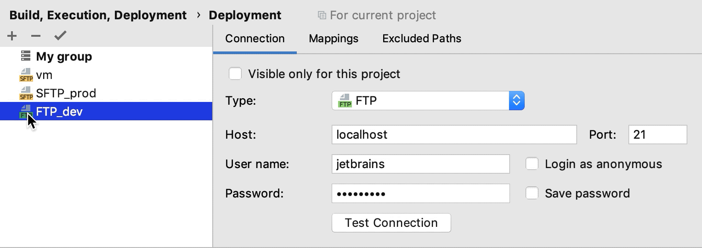

+++
title = "将服务器组织成组"
weight = 60
date = 2023-06-21T13:50:58+08:00
type = "docs"
description = ""
isCJKLanguage = true
draft = false

+++
# Organize servers into groups 将服务器组织成组

https://www.jetbrains.com/help/go/server-groups.html

Last modified: 17 March 2022

最后修改日期：2022年3月17日

​	服务器组允许您将服务器配置分组并将它们作为单个实体进行操作。如果您需要将代码部署到多个服务器，您可以使用服务器组，避免逐个服务器进行部署。

### 创建服务器组 

1. 按下 Ctrl+Alt+S 打开IDE设置，选择Build, Execution, Deployment | Deployment。

   或者，从主菜单选择Tools | Deployment | Configuration...。

3. 在左侧列出所有现有服务器配置的窗格中，点击Add  ，然后在弹出菜单中选择 Server group。

4. 在打开的Create new group 对话框中，输入要创建的组的名称，然后点击OK。创建新组对话框关闭，您回到[连接](https://www.jetbrains.com/help/go/deployment-connection-tab.html)选项卡下的[部署](https://www.jetbrains.com/help/go/settings-deployment.html)节点。

6. 要在组内创建一个新的服务器配置，选择左侧窗格中的组，然后在右侧窗格中单击Add new server链接或者工具栏上的 按钮。然后根据其类型配置新创建的服务器，如[配置与服务器的同步](https://www.jetbrains.com/help/go/configuring-synchronization-with-a-remote-host.html)中所述。

   要将现有的服务器配置添加到组中，将其拖入组中。要删除服务器配置，将其拖出组。

   

7. 单击工具栏上的 按钮，使GoLand在以下情况下默默应用当前服务器组：

   - [自动上传更改的文件](https://www.jetbrains.com/help/go/uploading-and-downloading-files.html#automaticUploadOnUpdate)。
   - 手动[上传](https://www.jetbrains.com/help/go/uploading-and-downloading-files.html#manually)和[下载](https://www.jetbrains.com/help/go/uploading-and-downloading-files.html#download_file_folder)文件，而无需选择目标主机。
   - [在远程主机上编辑单个文件](https://www.jetbrains.com/help/go/editing-individual-files-on-remote-hosts.html)。
   
   > 您还可以在GoLand状态栏中单击默认部署服务器小部件，并从弹出菜单中选择所需的服务器或服务器组。
   
6. 使用For current project 复选框配置服务器组的可见性，该设置也适用于组中包含的所有服务器。

   - 选中复选框以将组的使用限制为当前项目。这样的组不能在当前项目之外重用。它不会出现在其他项目中可用配置的列表中。
   - 清除复选框时，该组在所有GoLand项目中可见。其设置可以在多个项目之间重用。

​	现在可以使用创建的服务器组进行[上传和下载文件](https://www.jetbrains.com/help/go/uploading-and-downloading-files.html)到包含的服务器。