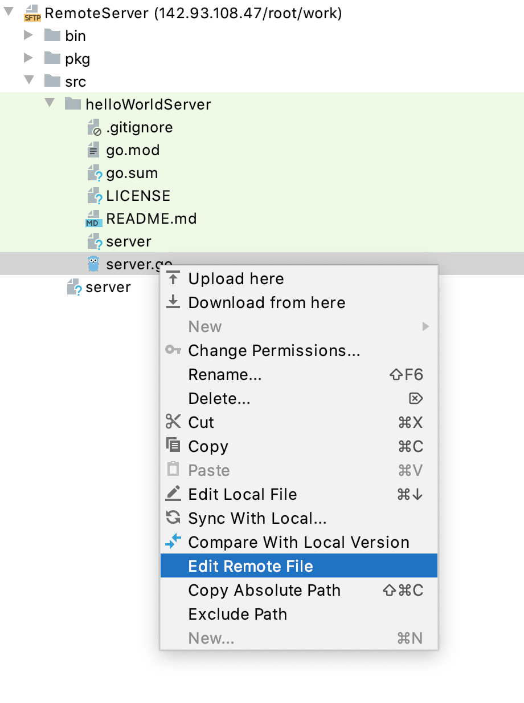
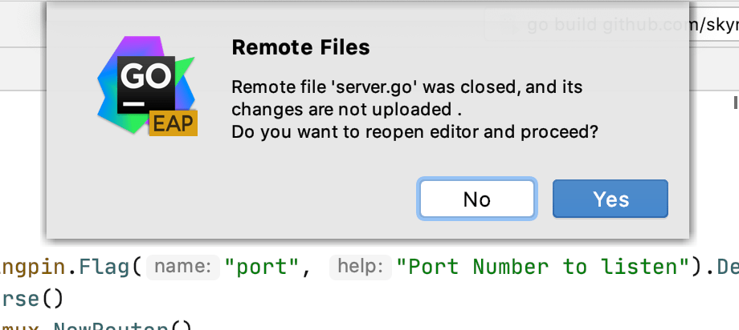

+++
title = "在远程主机上编辑单个文件"
weight = 50
date = 2023-06-21T13:50:58+08:00
type = "docs"
description = ""
isCJKLanguage = true
draft = false

+++
# Edit individual files on remote hosts 在远程主机上编辑单个文件

https://www.jetbrains.com/help/go/editing-individual-files-on-remote-hosts.html

Last modified: 21 April 2023

最后修改日期：2023年4月21日

​	一旦您已经[设置了与远程主机的同步](https://www.jetbrains.com/help/go/configuring-synchronization-with-a-remote-host.html)，您可以直接从远程主机打开单个文件并在GoLand中进行编辑，而无需将它们添加/下载到本地项目中。

​	对于此类文件，不支持调试、重构和其他一些GoLand功能。要利用GoLand的高级功能，请考虑将文件包含到项目中，详细信息请参阅[访问远程主机上的文件](https://www.jetbrains.com/help/go/accessing-files-on-remote-hosts.html)。

### 在远程主机上编辑文件

1. 如果您已经设置了[默认的远程主机](https://www.jetbrains.com/help/go/configuring-synchronization-with-a-remote-host.html#default_server)，在[项目工具窗口](https://www.jetbrains.com/help/go/project-tool-window.html)、提交工具窗口Alt+0或代码编辑器中，从上下文菜单中选择Deployment | Edit Remote远程文件。

   否则，请执行以下操作：

   1. 通过选择Tools | Deployment | Browse Remote Host or View | Tool Windows | Remote Host来打开[远程主机工具窗口](https://www.jetbrains.com/help/go/remote-host-tool-window.html)。

   3. 从列表中选择所需的部署服务器。该工具窗口显示服务器根目录下的文件和文件夹的树形视图。如果列表中没有相关的服务器可用，请单击，并在打开的部署对话框中[配置对所需服务器的访问](https://www.jetbrains.com/help/go/configuring-synchronization-with-a-remote-host.html)。

   3. 双击所需的文件或在上下文菜单中选择编辑远程文件。

      

2. 文件将在GoLand编辑器中打开，而无需添加或下载到本地项目中。

   当您使用远程文件时，编辑器顶部会出现一个特殊的工具栏，显示编辑状态（文件与远程文件相同或文件已修改。上传？）。

   通过注释，远程文件可以与本地文件区分开来（在我们的例子中是`<MyServer>`）。

3. 当您完成对文件的编辑后，请执行以下操作之一：

   - 要将文件上传到远程主机，点击或按Alt+Shift+Q。
   - 要将当前打开的文件与上次上传的版本进行比较，点击。文件将在GoLand的[文件差异查看器](https://www.jetbrains.com/help/go/differences-viewer.html)中打开。
   - 要放弃上次上传后对文件所做的更改，点击。

​	请注意，除非这些更改已经上传，否则在关闭编辑的文件或当前打开的项目时，将放弃对单个文件的任何更改。为了避免丢失数据，当您尝试关闭编辑的文件或整个项目时，GoLand会显示以下对话框。

