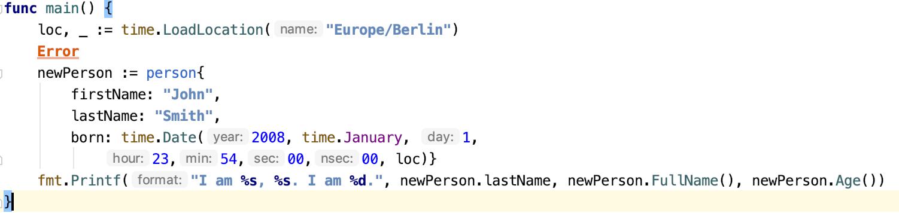

+++
title = "可访问性"
weight = 10
date = 2023-06-14T17:20:58+08:00
description = ""
isCJKLanguage = true
draft = false

+++

# Accessibility - 可访问性

https://www.jetbrains.com/help/go/accessibility.html

Last modified: 07 March 2023

最后修改日期：2023年3月7日

​	GoLand允许您启用各种可访问性功能，以满足您的需求。您可以使用屏幕阅读器或调整字体大小、颜色和某些UI元素的行为，以便更轻松地使用GoLand。

## 设置屏幕阅读器

​	GoLand完全支持Windows和macOS上的屏幕阅读器。

### 启用屏幕阅读器

1. 下载并启用您首选的屏幕阅读器：

   

   

   - [NVDA](https://www.nvaccess.org/)：使用NVDA 2019.3或更高版本以与64位Java应用程序（例如GoLand）兼容。

     Download, install, and enable NVDA.

     下载、安装和启用NVDA。

   - [JAWS](https://www.freedomscientific.com/Products/Blindness/JAWS)： 使用JAWS 12.0.1158 64位或更高版本以与64位Java应用程序（例如GoLand）兼容。

     下载您需要的版本，并重新启动计算机以启用JAWS屏幕阅读器。

   

   

   [VoiceOver](https://www.apple.com/voiceover/info/guide/_1124.html)

   

   

   

2. 确保您已安装[Java Access Bridge](https://docs.oracle.com/javase/7/docs/technotes/guides/access/enable_and_test.html)和适合屏幕阅读器的正确Java版本，具体操作如下：

   - 要启用[Java Access Bridge](https://docs.oracle.com/javase/7/docs/technotes/guides/access/enable_and_test.html)，打开命令提示符并键入**[JRE_HOME]\bin\jabswitch -enable**，其中**[JRE_HOME]**是您计算机上JRE的目录。对于Java版本1.8，Java Access Bridge是JDK的一部分，您不需要单独下载它。使用控制面板启用Java Access Bridge。
   - 如果您的屏幕阅读器是32位的，请安装32位JRE版本1.7或更高版本。如果您的屏幕阅读器是64位的，请安装64位JRE版本1.7或更高版本。

   ​	您的计算机上可能安装有一些重要组件的多个版本，这些版本可能在不同版本之间不兼容。您需要验证您的Java Access Bridge配置是否正确。

   ​	如果您的屏幕阅读器是32位的，请确保**C:\Windows\SysWOW64\WindowsAccessBridge-32.DLL**文件存在，并且版本号为7.x.x.x或更高。文件的描述应为"Java(TM) Platform SE 7"。

3. 如果检测到GoLand的安装，GoLand会自动显示一个提示，建议启用屏幕阅读器支持。

   在打开的对话框中，首次启动GoLand时，单击"Enable"进行启用。

   屏幕阅读器支持也可以在已安装和配置的GoLand版本上以后手动激活或启用。

### 安装和设置GoLand - Install and set up GoLand

1. [下载并安装](https://www.jetbrains.com/help/go/installation-guide.html) GoLand。

   > ​	对于Windows和macOS，在第一次启动GoLand时，如果检测到屏幕阅读器，它会显示一个对话框，您可以在其中为GoLand启用屏幕阅读器。

2. 在首次启动GoLand之前启用屏幕阅读器支持，请执行以下操作：

   a. 打开包含个人设置（例如键盘映射（keymaps）、颜色方案（color schemes）等）的**configuration**目录。

   

   

   Syntax

   **%APPDATA%\JetBrains\<product><version>**

   Example

   **C:\Users\JohnS\AppData\Roaming\JetBrains\GoLand2023.1**

   

   

   Syntax

   **~/Library/Application Support/JetBrains/<product><version>**

   Example

   **~/Library/Application Support/JetBrains/GoLand2023.1**

   

   

   

   

   

   b. 创建一个名为**idea.properties**的文件。

   c. 将`ide.support.screenreaders.enabled=true`属性添加到您创建的文件中。

3. 启动GoLand。在"Settings | Appearance & Behavior | Appearance"中，"Support screen readers"选项将被启用。

   > ​	启用"Support screen readers"选项后，GoLand会禁用主工具栏中图标的工具提示，将控件切换为键盘，并适应屏幕阅读器的一些控件。

## 自定义IDE

​	您可以根据自己的可访问性需求自定义IDE。

### 调整红绿色视觉缺陷的颜色

​	如果您有红绿色视觉缺陷，您可以调整IDE和编辑器的颜色。在这种情况下，通常以红色突出显示的错误代码或通常为绿色的字符串将显示为中性颜色。测试运行器中进度条的颜色也将进行调整，以便更容易识别。

1. 按下Ctrl+Alt+S打开IDE设置，并选择"Appearance & Behavior | Appearance"。

2. 选择"Adjust colors for red-green vision deficiency"，并保存您的更改。

   

   

   

   

   

   

   

   

   

   

### 为滚动条添加对比度颜色

​	您可以使编辑器中的滚动条更加可见。

1. 按下Ctrl+Alt+S打开IDE设置，并选择"Appearance & Behavior | Appearance"。

2. 在右侧的选项中，在"Accessibility"部分下，选择"Use contrast scrollbars"。

   > ​	要配置编辑器的垂直滚动条颜色和不透明度，请使用[颜色方案设置](https://www.jetbrains.com/help/go/accessibility.html#color_config)。

### 配置代码元素、编辑器、滚动条、超链接等的颜色 

​	您可以调整代码元素、错误、编辑器元素和工具窗口的颜色。您还可以为编辑器中的垂直滚动条配置一个颜色。

1. 按下Ctrl+Alt+S打开IDE设置，并选择"Editor | Color Scheme | General"。
3. 在右侧的选项列表中，选择要调整颜色的元素。例如，您可以选择"Code"并调整注入语言片段或匹配括号的颜色等。点击"OK"保存更改。

​	您还可以调整调试器、控制台和IDE的其他部分的颜色：在"Settings | Editor | Color Scheme"中选择相应的节点。

### 覆盖默认的UI字体 Override the default UI fonts

​	您可以覆盖UI元素的默认字体。

1. 按下Ctrl+Alt+S打开IDE设置，并选择"Appearance & Behavior | Appearance"。
3. 在右侧的选项中，从"Use custom font"列表中选择一个字体，并在"Size"字段中指定字体大小。
5. 点击"OK"保存更改。

​	结果，UI中的图标和文本的大小将被调整。

### 调整工具窗口的大小

​	您可以使用快捷键垂直或水平调整实际工具窗口的大小。

1. 要垂直调整大小，请按下Ctrl+Alt+Shift+上箭头或Ctrl+Alt+Shift+下箭头。
3. 要水平调整大小，请按下Ctrl+Alt+Shift+左箭头或Ctrl+Alt+Shift+右箭头。

### 调整编辑器中的文本大小

​	您可以更改编辑器中文本的字体和大小。

1. 按下Ctrl+Alt+S打开IDE设置，并选择"Editor | General"。
3. 在右侧的选项中，选择"Change font size (Zoom) with Ctrl+Mouse Wheel"选项，以便在编辑器中工作时可以通过鼠标滚轮快速更改文本大小。
5. 如果需要指定精确的字体大小，请选择"Editor | Font"。
7. 在右侧的选项中，指定字体、字号、行间距和其他可用选项。点击"OK"保存更改。

### 自定义快捷键

​	您可以为经常使用的操作配置自定义快捷键。

1. 按下Ctrl+Alt+S打开IDE设置，并选择"Keymap"。

3. 从右侧的选项列表中，如菜单、操作和工具，选择您需要的操作。

5. 右键单击所选项，从上下文菜单中选择要执行的操作，例如"Add keyboard shortcut"、"Add mouse shortcut"或"Add abbreviation"。

4. 在打开的对话框中，指定一个快捷键。如果需要，选择"Second stroke"选项，并为快捷键指定一个附加的键。点击"OK"保存更改。

   使用鼠标点击"OK"。如果按Enter键，GoLand将把其视为快捷键。

   > ​	您可以忽略冲突并将快捷键分配给多个操作。然而，强烈建议您避免将两个操作绑定到相同的快捷键，因为这些操作的优先级可能会在不同的上下文中发生变化。
   >
   > 

### 自定义智能键行为

​	您可以配置智能键的行为。

1. 按下Ctrl+Alt+S打开IDE设置，选择"Editor | General | Smart keys"。
3. 在右侧的选项中，选择或取消选择智能键选项。例如，您可以取消选择"Insert paired brackets"或"Insert paired quotes"选项，这样在使用屏幕阅读器时自动插入闭合括号或引号可能不太有用。点击"OK"保存更改。

### 禁用自动代码完成

​	您可以禁用自动代码完成，以避免在使用屏幕阅读器时自动插入代码元素。

1. 按下Ctrl+Alt+S打开IDE设置，选择"Editor | General | Code completion"。
3. 取消选择"Type-Matching Completion"选项。如果需要，还可以取消选择"Basic Completion"以禁用基本代码完成。

### 自定义代码折叠

​	您可以控制代码折叠的行为，并指定应该折叠还是不折叠的内容。

1. 按下Ctrl+Alt+S打开IDE设置，选择"Editor | General | Code folding"。
3. 在右侧的选项中，选择默认情况下应该折叠的内容。

### 自定义代码样式

​	您可以配置空格、制表符和缩进。

1. 按下Ctrl+Alt+S打开IDE设置，选择"Editor | Code Style | [Language]"。
3. 在右侧的选项中，点击"Tabs and Indents"配置制表符，或点击"Spaces"配置空格的使用位置和方式。
5. 点击"OK"保存更改。

### 在编辑器中读取沟槽图标和行号

​	您可以配置屏幕阅读器来读取编辑器左边沟槽中的行号、版本控制系统注释、调试器和其他图标。

> ​	确保在"Settings | Appearance & Behavior | Appearance"中选择了"Support screen readers (requires restart)"选项。

1. 在编辑器中打开您的文件。

3. 按下 Alt+Shift+6, F 将焦点聚焦在沟槽上。GoLand将从光标当前所在的行开始阅读。

3. 使用上下箭头键在行之间移动。如果需要在一行中移动到下一个或上一个沟槽元素，分别使用右箭头和左箭头键。

   当焦点在沟槽上时，屏幕阅读器可以读取沟槽图标的工具提示（如果有的话）。

   要访问工具提示，请按双重快捷键Alt+Shift+6, T。使用右箭头和左箭头键浏览工具提示的内容（逐个符号）。

7. 按Escape键将焦点切换回编辑器。

### 设置高对比度主题

​	您可以设置高对比度的界面主题以在GoLand中工作。界面主题定义窗口、对话框和控件的外观。 

1. 按下Ctrl+Alt+S打开IDE设置，选择"Appearance & Behavior | Appearance"。
3. 在"UI Options"区域，从"Theme"列表中选择"High Contrast"，然后点击"OK"应用更改。

### 设置高对比度颜色方案

​	您可以为编辑器设置高对比度的颜色方案。GoLand使用颜色方案来帮助您定义编辑器中首选的颜色和字体。 

1. 按下Ctrl+Alt+S打开IDE设置，选择"Editor | Color Scheme"。
3. 在"Color Scheme"页面，从"Scheme"列表中选择"High Contrast"。
5. 点击"OK"应用更改。

​	您可以查看[编辑器基础知识](https://www.jetbrains.com/help/go/using-code-editor.html)、[键盘快捷键](https://www.jetbrains.com/help/go/mastering-keyboard-shortcuts.html)和[快速入门指南](https://www.jetbrains.com/help/go/quick-start-guide-goland.html)来熟悉其他有用的快捷键。