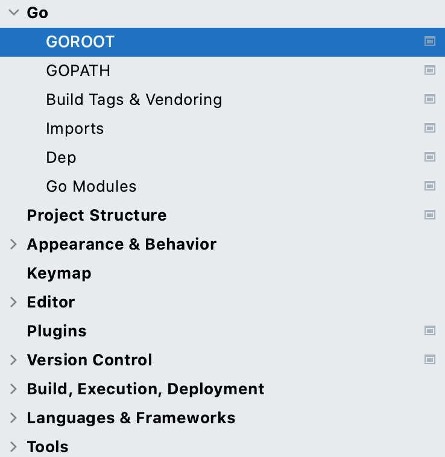
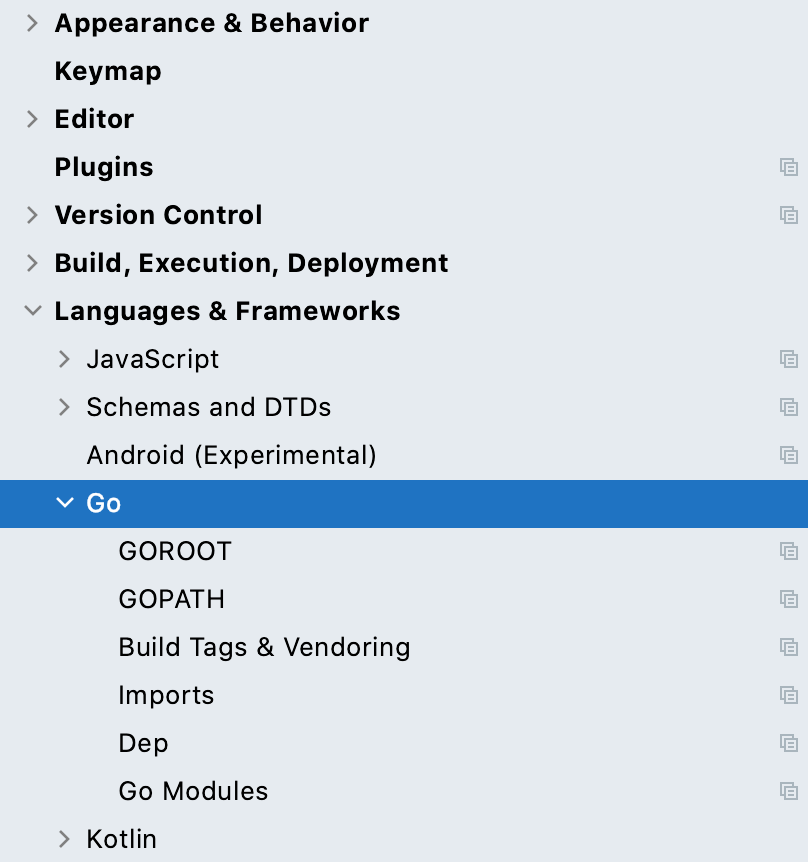
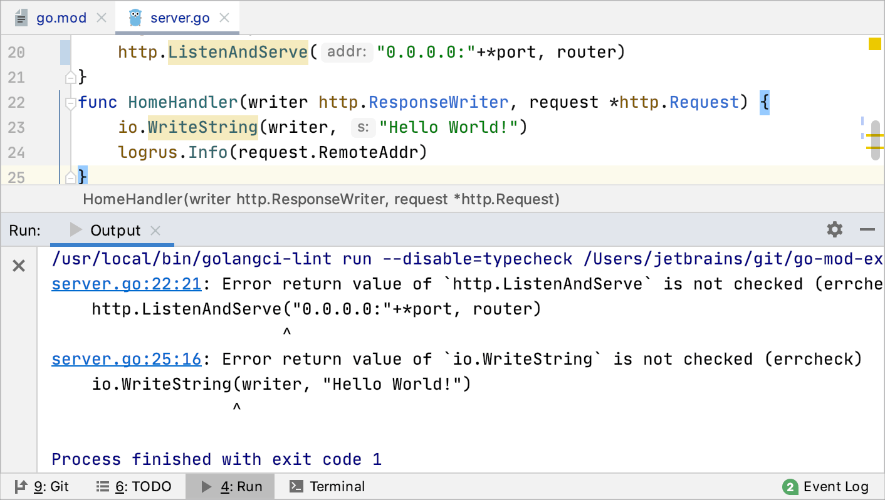
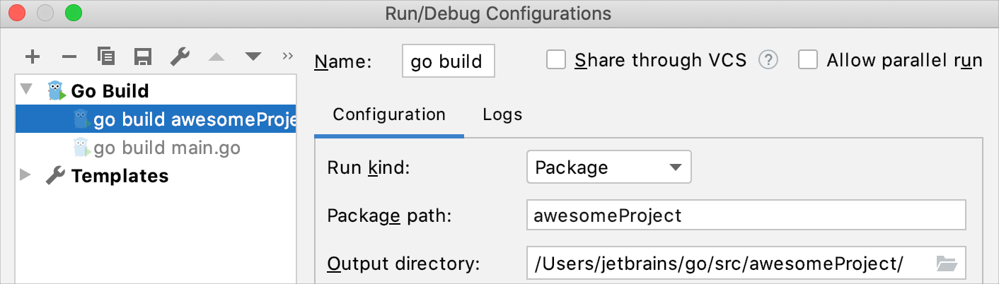
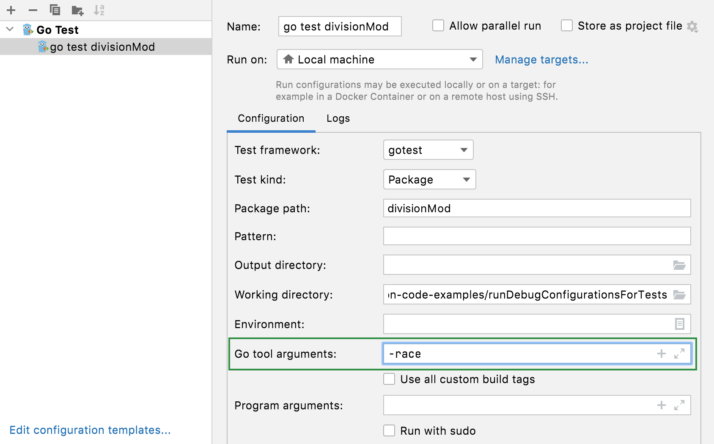
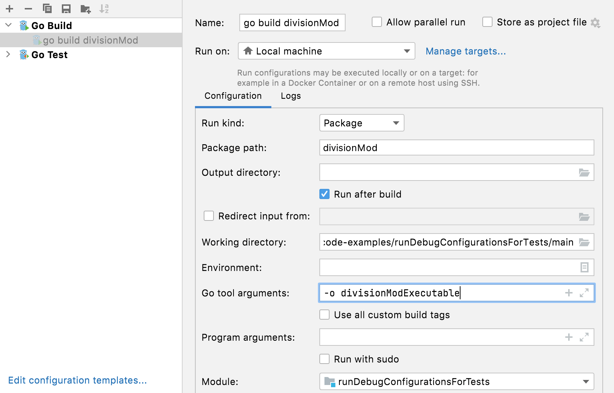
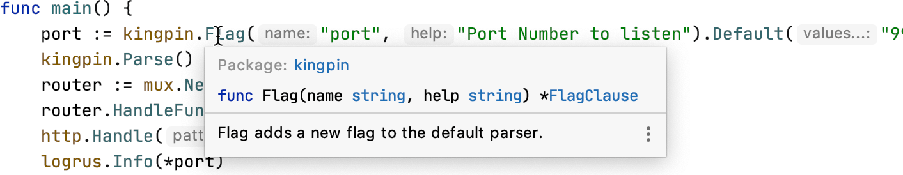
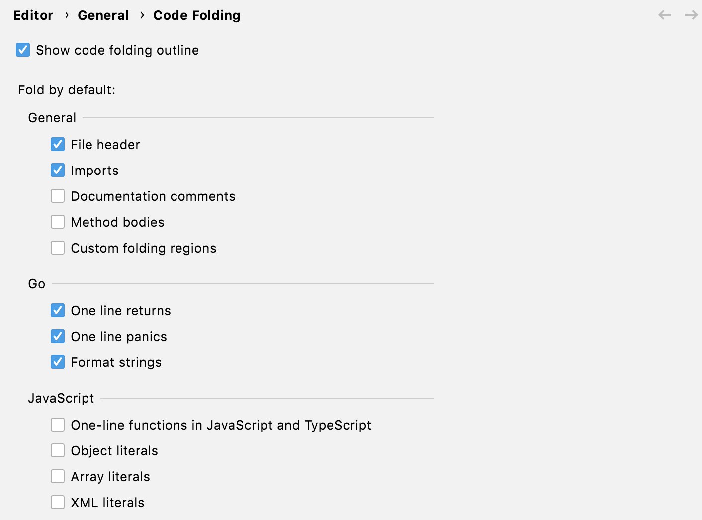

+++
title = "关于 GoLand 的常见问题"
weight = 70
date = 2023-06-14T17:20:58+08:00
description = ""
isCJKLanguage = true
draft = false

+++
# FAQ about GoLand - 关于 GoLand 的常见问题解答

https://www.jetbrains.com/help/go/faq-about-goland.html

Last modified: 16 January 2023

上次修改日期：2023年1月16日

## 常见问题

### 是否有 GoLand 社区版？

​	没有，因为无法将 GoLand 的功能分为免费和付费版本。您仍然可以尝试使用 [免费的30天试用版](https://www.jetbrains.com/go/download/) 或提前访问程序（预发布）版本，只要它们可用。

### 什么是提前访问程序（EAP）和每夜构建？

#### 什么是提前访问程序（EAP）？

​	提前访问程序让您试用正在为下一个 GoLand 版本发布开发的功能和增强功能。事实上，这些 EAP 功能通常还处于开发中。

​	EAP 构建未经完全测试，可能不稳定。通过在实际项目和场景中使用 EAP 构建及其新功能，您可以帮助我们在发布之前对其进行完善，并帮助我们和用户避免任何不愉快的意外。 

- EAP 让您试用最新可用的功能。
- EAP 构建不需要有效的订阅，每个版本从发布日期起免费使用30天。
- EAP 构建可以从网站、ToolBox 应用程序、IDE 直接下载以及作为 snap 包（适用于 Ubuntu）提供。
- 我们提供 EAP 构建，直到稳定的发布候选版准备就绪。
- 在每个发布周期中，我们会向最活跃的评估者奖励一年免费的 GoLand 订阅和品牌商品。

#### 什么是每夜构建？

​	每夜构建是提前访问程序的一个特殊子类，几乎每天发布一次。它们包含最近的更改，但尚未进行任何测试。 

- 每夜构建的质量通常低于我们官方 EAP 构建的标准。
- 每夜构建不提供发行说明或博客文章公告。
- 在 EAP 期间，每夜构建对每个人免费使用30天。一旦 EAP 结束，您需要具有有效的 GoLand 许可证才能使用它们。
- 每夜构建仅通过 [ToolBox 应用程序](https://www.jetbrains.com/help/go/installation-guide.html#toolbox) 提供。

### 如何免费或以折扣价格获取 GoLand？

​	如果您想免费或以折扣价格获取 GoLand 许可证，请查看以下页面上的优惠：[Toolbox 订阅 - 特别优惠](https://www.jetbrains.com/go/buy/#discounts)。如果您有任何问题，请联系我们的 [销售支持团队](https://www.jetbrains.com/support/sales/)。

​	学生、教职员工和开源项目核心贡献者可以获得免费的个人许可证。

#### 有用的链接 

- [学生和教职员工的免费个人许可证](https://www.jetbrains.com/student/)：查看谁可以申请免费许可证以及如何申请。
- [免费开源许可证](https://www.jetbrains.com/community/opensource/)：查看申请条款、许可证条款和限制。

### GoLand 是否作为 JetBrains Toolbox 的一部分包含在 All Products Pack 中？

​	是的，它既作为独立的 IDE，也作为 All Products Pack 的一部分提供。

### GoLand 和 IntelliJ IDEA Ultimate 的 Go 插件有什么区别

​	尽管主要功能相同，但仍然存在一些区别：

|                                                              | GoLand                                                       | IntelliJ IDEA Ultimate                                       |
| ------------------------------------------------------------ | ------------------------------------------------------------ | ------------------------------------------------------------ |
| Go 设置的位置                                                | 设置页面的顶级位置。 | 位于“语言与框架”菜单项中。 |
| Plugins 插件                                                 | 部分插件已经捆绑用于 Go 开发（例如，[Go Template 插件](https://plugins.jetbrains.com/plugin/10581-go-template)） | 某些用于 Go 开发的插件未捆绑，您需要手动安装它们             |
| 某些插件在 GoLand 和 IntelliJ IDEA Ultimate 之间不兼容（例如，[GoLand 帮助插件](https://plugins.jetbrains.com/plugin/10490-goland-help)）。 |                                                              |                                                              |
| Project management项目管理                                   | 若要附加一个文件夹，您需要导航到“文件打开”，然后单击“附加”。您可以在“项目结构”菜单中管理项目结构。有关使用项目结构的更多信息，请参见 [内容根](https://www.jetbrains.com/help/go/content-root.html)。 | 要附加一个文件夹，您需要将其添加为模块。有关 IntelliJ IDEA Ultimate 中模块的更多信息，请参见 [IntelliJ IDEA 文档中的模块主题](https://www.jetbrains.com/help/idea/creating-and-managing-modules.html)。 |
| Go SDK 的预构建索引位置                                      | 随 GoLand 一起提供                                           | 不随附                                                       |
| IML 文件的位置                                               | GoLand 将所有设置文件存储在 **.idea** 目录中。               | 在 IntelliJ IDEA 中创建 Go 项目时，您可以指定 **.iml** 文件的目录。默认情况下，它是项目的根目录。有关更改 **.iml** 文件目录的详细信息，请参见 [更改 IntelliJ IDEA 中 Go 项目的 IML 文件位置](https://www.jetbrains.com/help/go/creating-and-managing-projects.html#change-the-iml-file-location-for-go-projects-in-intellij-idea)。 |

### GoLand 是否支持数据库？

​	是的。GoLand 中的数据库管理功能由 Database 工具和 SQL 插件支持。Database 工具和 SQL 插件支持 DataGrip 中可用的所有功能，DataGrip 是为开发人员提供的独立数据库管理环境。使用该插件，您可以查询、创建和管理数据库。数据库可以在本地、服务器或云中工作。该插件支持 MySQL、PostgreSQL、Microsoft SQL Server、SQLite、MariaDB、Oracle、Apache Cassandra 等。请在 [连接到数据库](https://www.jetbrains.com/help/go/connecting-to-a-database.html) 中查看支持的供应商完整列表。

### 除了 Go，GoLand 还支持哪些 Web 技术？ 

​	除了核心的 Go 开发工具，GoLand 还支持 JavaScript、TypeScript、Node.js、SQL、数据库、Docker、Kubernetes、Terraform 和其他技术。

### 如何提供反馈或提交错误？

​	[支持和帮助](https://www.jetbrains.com/help/go/getting-help.html) 主题介绍了如何提供反馈、报告错误或提交功能请求。

#### 有用的链接

- [GoLand 的 YouTrack 问题](https://youtrack.jetbrains.com/issues/GO)：登录 JetBrains 帐户，然后单击“New issue”。
- [JetBrains 支持中心的请求](https://intellij-support.jetbrains.com/hc/en-us)：单击主页顶部的“提交请求”按钮。
- [Twitter](https://twitter.com/)：在推特上向我们提问。在推文中提及 @GoLandIDE。
- [goland-support@jetbrains.com](mailto:goland-support@jetbrains.com)：通过电子邮件向我们的团队提问。描述您的问题，并附上可加快故障排除的所有可用材料（代码示例、截图、日志、动画、视频和其他材料）。

## 配置 Go 开发环境

### 开始之前需要进行哪些配置？

​	在开始编码之前，您需要安装 Go SDK。在大多数情况下，GOROOT 和 GOPATH 变量会自动设置。

​	如果已安装 Go SDK，GoLand 会自动检测并使用它。

​	如果未检测到 Go SDK，您可以直接从 GoLand 下载 Go SDK，或导航到 Go SDK 目录。您可以在创建新项目或设置中执行此操作。

​	GOROOT 会自动设置为 Go SDK 的安装目录。安装目录必须包含 `bin` 和 `src` 目录。

​	GOPATH 在 Unix 和 macOS 上自动设置为 **$HOME/go**，在 Windows 上设置为 **%USERPROFILE%/go**。您可以在设置中配置全局、项目和模块的 GOPATH 变量（按 (Ctrl+Alt+S) 并导航到 Go | GOPATH）。

#### 有用的链接

- [快速入门指南](https://www.jetbrains.com/help/go/quick-start-guide-goland.html)：关于如何开始使用 GoLand 进行编码的逐步教程。
- [配置 GOROOT 和 GOPATH](https://www.jetbrains.com/help/go/configuring-goroot-and-gopath.html)：一个帮助页面，展示如何在 GoLand 中设置 GOROOT 和 GOPATH。
- [设置 GOPATH](https://github.com/golang/go/wiki/SettingGOPATH)：关于 GOPATH 的帮助页面，位于 GitHub 上的 golang 代码库中。

### 如何在保存时运行 gofmt/goimports/golang-ci？

​	对于单个文件，您可以使用内置的导入管理和代码格式化工具。导入会实时进行管理。要自定义导入管理，按下 Ctrl+Alt+S 打开设置，然后导航到 Go | Imports。

​	要重新格式化代码，按下 Ctrl+Alt+L。与 gofmt 相比，GoLand 的代码格式化工具可以处理语法上不正确的代码，并且可以在任意块上调用。还有其他功能，例如自动插入分号、包装参数和参数以及其他功能。

​	此外，您可以使用 On code reformat 选项（Editor | Code Style | Go，单击 Other 选项卡）。此选项允许您按下 Ctrl+Alt+L 来同时调用两个格式化工具。

​	或者，使用 Actions on Save 中的 Reformat code 选项。此操作在 GoLand 中默认启用。按下 Ctrl+S 触发时，IDE 将运行内置的 GoLand 格式化工具和 gofmt。

#### 有用的链接

- [自动保存](https://www.jetbrains.com/help/go/saving-and-reverting-changes.html)：有关自动保存功能的更多信息。
- [文件监视器](https://www.jetbrains.com/help/go/using-file-watchers.html)：关于如何创建和使用文件监视器的主题。

### 如何在编辑器中查看静态分析工具的结果？

​	静态分析工具的结果将显示在运行工具窗口的 Output 选项卡中。

​	您可以使用内置的或外部（如 golang-ci）静态分析工具。

### 如何更改应用程序二进制文件的输出目录（go build -o）？

​	导航到 Run | Edit Configurations，单击用于运行应用程序的运行/调试配置。在 Output directory 字段中，指定要用作应用程序二进制文件的输出目录的路径。

​	或者，打开运行/调试配置，并在 Go tool arguments 字段中指定 `-o directory_path`。

#### 有用的链接

- [运行/调试配置](https://www.jetbrains.com/help/go/run-debug-configuration.html)：了解有关运行/调试配置及其使用方法的更多信息。

### 如何为`go build`和`go test`命令提供s实参？

​	导航至“Run | Edit Configurations”，单击用于运行应用程序或运行测试的运行/调试配置。在“Go tool arguments”字段中，输入以空格分隔的参数列表，用于指定要与`go build`或`go test`一起使用的参数。

​	如果需要设置构建约束，请按下Ctrl+Alt+S打开设置，然后导航到Go | Build Tags & Vendoring。有关可能的构建约束的更多信息，请参阅golang.org上的[Build Constraints](https://golang.org/pkg/go/build/#hdr-Build_Constraints)。

#### 有用的链接

- [Build Constraints](https://golang.org/pkg/go/build/#hdr-Build_Constraints)：了解有关Go中构建约束的信息。
- [Run/debug configurations](https://www.jetbrains.com/help/go/run-debug-configuration.html)：阅读有关运行/调试配置以及如何使用它们的更多信息。
- [Run/debug configuration templates for tests](https://www.jetbrains.com/help/go/run-debug-configuration.html#run-debug-configuration-templates-for-tests)：了解如何为测试创建运行/调试配置。

### 如何添加像`-race`、`-failfast`、`-short`等测试标志？ 

​	导航至“Run | Edit Configurations”，单击用于运行应用程序或运行测试的运行/调试配置。在“Go tool arguments”字段中，指定要使用的标志： 

- `-race`：启用数据竞争检测。仅支持`linux/amd64`、`freebsd/amd64`、`darwin/amd64`、`windows/amd64`、`linux/ppc64le`和`linux/arm64`（仅适用于48位VMA）。
- `-test.failfast`：在第一个测试失败后停止运行新的测试。
- `-test.short`：缩短长时间运行的测试的运行时间。
- `-test.benchmem`：打印基准测试的内存分配统计信息。

​	在[pkg.go.dev的Go文档](https://pkg.go.dev/cmd/go)中查看其他标志。

### 如何更改编译二进制文件的名称？

​	导航至“Run | Edit Configurations”，单击用于运行应用程序或运行测试的运行/调试配置。在“Go tool arguments”字段中，指定`-o customExecutableName`。

## Working with projects

### 如何在GoLand中打开VSCode项目？ 

​	导航至“File | Open”，选择要添加的文件夹，然后单击“Open”。

### 工作区和项目之间有什么区别？

​	主要区别在于工作区可以包含多个项目。在Visual Studio Code中，您可以将多个项目作为根项目添加到工作区中（请参阅Visual Studio Code文档中的[Multi-root Workspaces](https://code.visualstudio.com/docs/editor/multi-root-workspaces)）。

​	GoLand不使用工作区的概念。要在GoLand中具有多个根结构，您需要定义要添加为内容根的项目（请参阅[如何在GoLand中同时打开多个项目？](https://www.jetbrains.com/help/go/faq-about-goland.html#how-can-i-open-several-projects-in-goland-simultaneously)）。

​	如果您的工作区中只有一个项目，则这两个概念没有区别。

#### 有用的链接

- [内容根](https://www.jetbrains.com/help/go/content-root.html)：了解如何在多个没有共同直接父级的目录中处理文件。
- [管理目录](https://www.jetbrains.com/help/go/working-with-user-files.html)：查看如何附加和分离目录。

### 如何在GoLand中同时打开多个项目？ 

​	您可以添加任意数量的目录作为内容根。要添加内容根，请按下Ctrl+Alt+S打开设置，然后导航到Project structure | Add Content Root。

​	另一种方法是单击“File | Open”，选择要添加的项目文件夹，然后单击“Open”。在弹出窗口中，选择“Attach”。

#### 有用的链接

- [内容根](https://www.jetbrains.com/help/go/content-root.html)：了解如何在多个没有共同直接父级的目录中处理文件。
- [管理目录](https://www.jetbrains.com/help/go/working-with-user-files.html)：查看如何附加和分离目录。

### 如何更改项目的Go SDK？

​	您可以从官方存储库下载Go SDK，或者导航到本地副本。

​	按下Ctrl+Alt+S打开设置，然后导航到Go | GOROOT。单击“Add”按钮。要导航到本地Go SDK副本，请选择“Local”。要下载Go SDK，请单击“Download”。

#### 有用的链接

- [配置GOROOT和GOPATH](https://www.jetbrains.com/help/go/configuring-goroot-and-gopath.html#configuring-goroot)：了解如何在GoLand中设置GOROOT和GOPATH。

### 如何更改项目的GOPATH变量？

​	按下Ctrl+Alt+S打开设置，然后导航到Go | GOPATH。根据要应用的范围，选择相应的部分（Global GOPATH、Project GOPATH、Module GOPATH），然后单击“Add”按钮。导航到要关联到GOPATH的目录。

​	您可以为以下范围配置GOPATH：全局、项目和模块。如果指定了所有三个范围，GoLand首先选择最狭窄的范围。

#### 有用的链接

- [配置GOROOT和GOPATH](https://www.jetbrains.com/help/go/configuring-goroot-and-gopath.html#configuring-goroot)：了解如何在GoLand中设置GOROOT和GOPATH。

### 如何运行或调试我的应用程序？

​	要运行或调试应用程序，可以使用以下方法：

- 在编辑器的左侧沟槽中，单击“Run application”图标 然后选择“Run <method_name> in <file_name>”或“Debug <method_name> in <file_name>”。
- 右键单击编辑器中打开的文件或方法，然后选择“Run <method_name> in <file_name>”（Ctrl+Shift+F10）或“Debug <method_name> in <file_name>”（Shift+F9）。
- 创建运行/调试配置。有关运行/调试配置的更多信息，请参阅[创建运行/调试配置](https://www.jetbrains.com/help/go/run-debug-configuration.html#createExplicitly)。

#### 有用的链接

- [创建运行/调试配置](https://www.jetbrains.com/help/go/run-debug-configuration.html#createExplicitly)：了解如何创建运行/调试配置。
- [运行应用程序](https://www.jetbrains.com/help/go/running-applications.html)：了解有关运行应用程序的更多信息。
- [调试](https://www.jetbrains.com/help/go/debugging-code.html)：了解如何启动调试会话，检查挂起的程序。

### 如何在同一个窗口中查看项目的依赖项？

​	您可以创建一个包含项目中所有依赖项的图表。右键单击项目中的**go.mod**文件，然后选择“Diagrams | Show Diagram”。

​	要确保在项目中启用了Go模块，请按下Ctrl+Alt+S打开设置，然后导航到Go | Go modules。确保选中“Enable Go modules integration”复选框。

#### 有用的链接

- [创建依赖项图表](https://www.jetbrains.com/help/go/create-a-project-with-go-modules-integration.html#create-a-diagram-of-dependencies)：查看动画，了解如何创建依赖项图表。

### 如何关闭项目？

​	点击“File | Close Project”。

### 如何开始使用版本控制系统（VCS）集成？

​	VCS集成会自动启用。

​	要手动启用VCS集成，请单击“VCS | Enable Version Control Integration”。在“Enable Version Control Integration”对话框中，选择要使用的VCS，然后单击“OK”。

#### 有用的链接

- [版本控制](https://www.jetbrains.com/help/go/version-control-integration.html)：了解如何在GoLand中使用VCS。Git和Mercurial的支持已集成。要启用其他VCS的支持，请安装相应的VCS插件。有关插件管理的更多信息，请参阅[插件](https://www.jetbrains.com/help/go/managing-plugins.html)。

## 使用代码编辑器

### 可以在GoLand中使用VSCode的键绑定吗？

​	安装VS Code Keymap插件。

​	要安装VS Code Keymap插件，可以使用以下方法之一： 

- 您可以通过以下链接从plugins.jetbrains.com下载插件：https://plugins.jetbrains.com/plugin/12062-vs-code-keymap/。
- 按下Ctrl+Alt+S打开设置，然后导航到Plugins。在搜索框中，键入“VS Code Keymap”。找到JetBrains的VS Code Keymap，然后点击“Install”。

### 如何在鼠标悬停时查看文档？

​	将鼠标悬停在代码元素上，以查看其文档。

### GoLand中的代码补全是如何工作的？

​	默认情况下，GoLand会在您输入时自动显示代码补全弹出窗口。或者，您可以按下Ctrl+Space或从主菜单中选择Code | Completion | Basic。

#### 有用的链接

- [代码补全](https://www.jetbrains.com/help/go/auto-completing-code.html)：了解其他类型的代码补全以及如何使用它们的更多信息。

### 如何使用多个插入符/光标？

​	要添加或删除多个插入符，按住Shift+Alt并在插入符的下一个位置单击。

​	另外，要添加多个插入符，您可以按两次Ctrl键，然后在不释放的情况下按上箭头或下箭头键。您还可以按住Ctrl键并拖动插入符来进行多重选择。

#### 有用的链接

- [多个插入符和选择范围](https://www.jetbrains.com/help/go/multicursor.html)：了解其他多个插入符使用情况。

### 如何同时选择和重命名多个元素？

​	在编辑器中，选择要重命名的元素，然后按Shift+F6。或者，从主菜单中选择Refactor | Rename。

​	使用重命名重构来更改符号、文件和所有对它们的引用的名称。

#### 有用的链接

- [重命名重构](https://www.jetbrains.com/help/go/rename-refactorings.html)：查看有关重命名重构的更多功能的主题。

### 有哪些可用的自动代码重构工具？

​	当前上下文的重构列表在Refactor菜单项下可用。 

- Change Signature更改方法或函数名称；添加、删除和重新排序参数；为新的非可变参数分配默认值。
- Extract重构将可以分组的代码片段提取出来。您可以提取常量、变量、方法和接口。
- Inline重构将提取出的代码片段移动到调用代码中。与Extract重构相反。
- Copy重构将文件、目录或包复制到不同的目录或包中。
- Move重构将源代码部分移动到另一个包或文件中。例如，您可以使用Move重构将方法移动到另一个包中。

#### 有用的链接

- [代码重构](https://www.jetbrains.com/help/go/refactoring-source-code.html)：查看有关所提到的重构的更多功能的部分。

### 在GoLand中有任何特殊的代码分析功能吗？

​	GoLand支持gotest、gocheck和gobench。通过使用这些包，您可以确保代码的行为是正确和预期的。

​	您可以使用性能分析工具对测试和基准进行性能分析。在性能分析期间，您可以查看CPU和内存使用情况、函数和方法调用的频率和持续时间。有关性能分析的更多信息，请参见[测试的性能分析](https://www.jetbrains.com/help/go/profiling-tests-and-benchmarks.html)。

#### 有用的链接

- [测试](https://www.jetbrains.com/help/go/testing.html)：了解有关创建测试配置和运行测试的更多信息。
- [测试的性能分析](https://www.jetbrains.com/help/go/profiling-tests-and-benchmarks.html)：了解有关对测试和基准进行性能分析的工具。

### 如何禁用一行返回/恐慌和格式化字符串的代码折叠？ 

​	按下Ctrl+Alt+S打开设置，然后导航到Editor | General | Code Folding。在Go部分，清除部分或全部切换代码折叠的复选框。

## 使用插件

### 如何找到我需要的插件？

​	按下Ctrl+Alt+S打开设置，然后导航到Plugins。在搜索框中，键入插件或技术名称。按Enter开始搜索。

​	或者，您可以在[plugins.jetbrains.com](https://plugins.jetbrains.com/)上搜索插件并[手动安装插件](https://www.jetbrains.com/help/go/faq-about-goland.html#how-do-i-install-the-plugin-that-i-have-available-on-my-computer)。

### 如何安装我计算机上已有的插件？

​	在设置对话框中（Ctrl+Alt+S），选择Plugins，然后点击Install Plugin from Disk。选择插件的存档文件，然后点击OK。如果需要，重新启动IDE。

### 我想编写一个GoLand的插件，有没有相关的说明？

​	您可以使用任何版本的GoLand来开发插件。它提供了一个开放的API、专用的SDK、模块和运行/调试配置来帮助您。

​	建议的工作流程是使用Gradle。更多信息请参见[IntelliJ平台SDK开发人员指南](http://www.jetbrains.org/intellij/sdk/docs/)。

### 我可以在GoLand中使用Visual Studio Code插件吗？

​	不可以，但是您可以在插件市场中找到类似的插件。有关详细信息，请参见[如何找到我需要的插件？](https://www.jetbrains.com/help/go/faq-about-goland.html#how-do-i-find-the-plugin-that-i-need)。