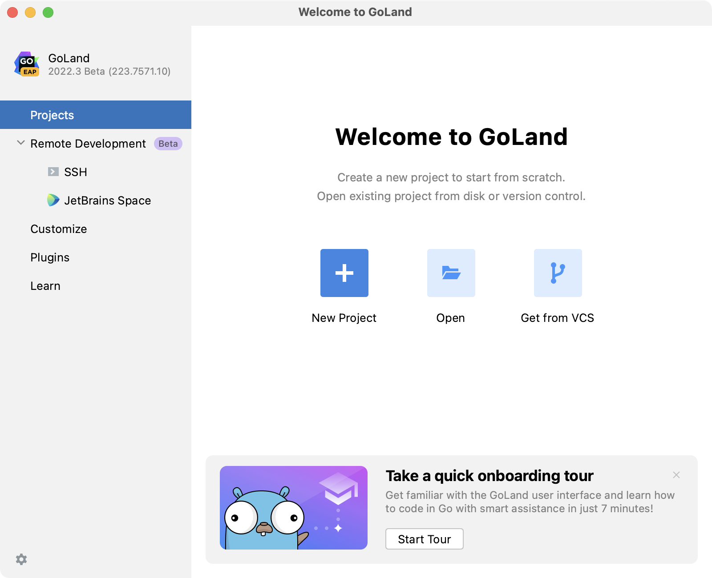
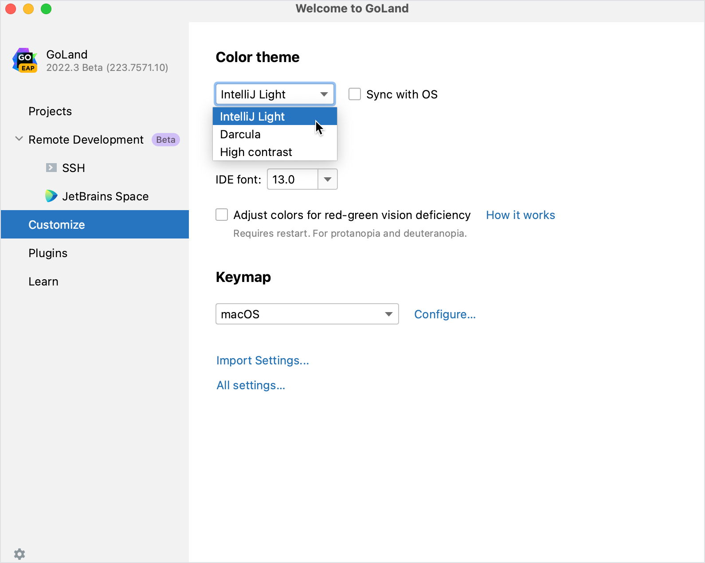
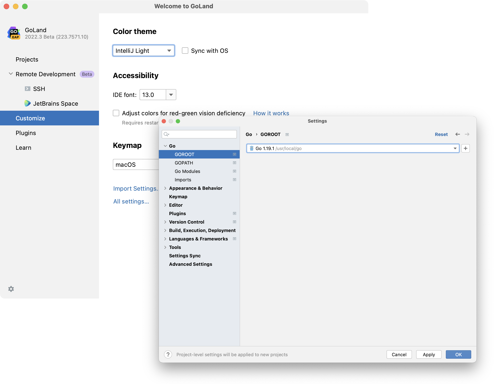
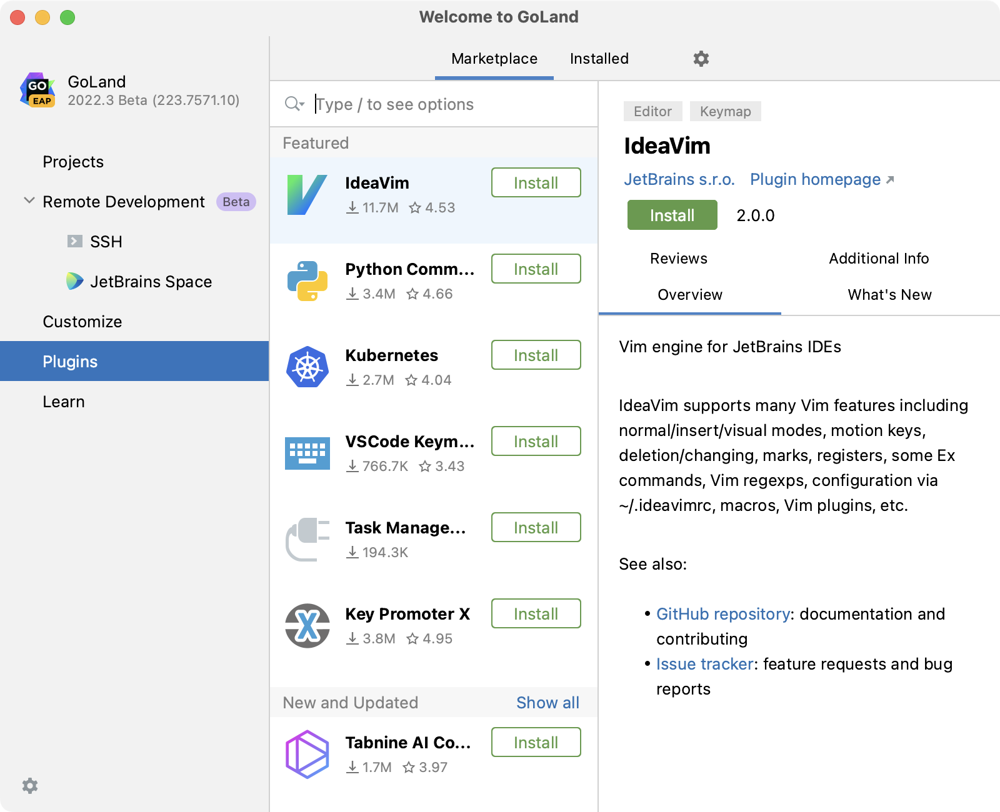
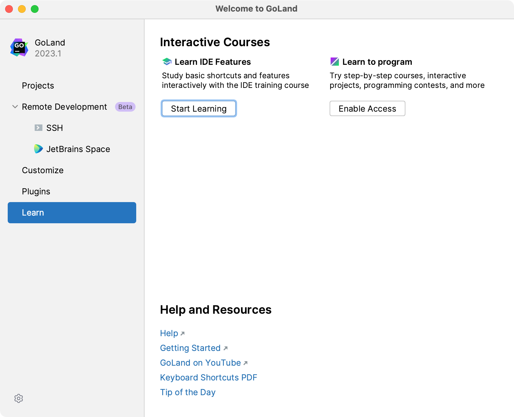
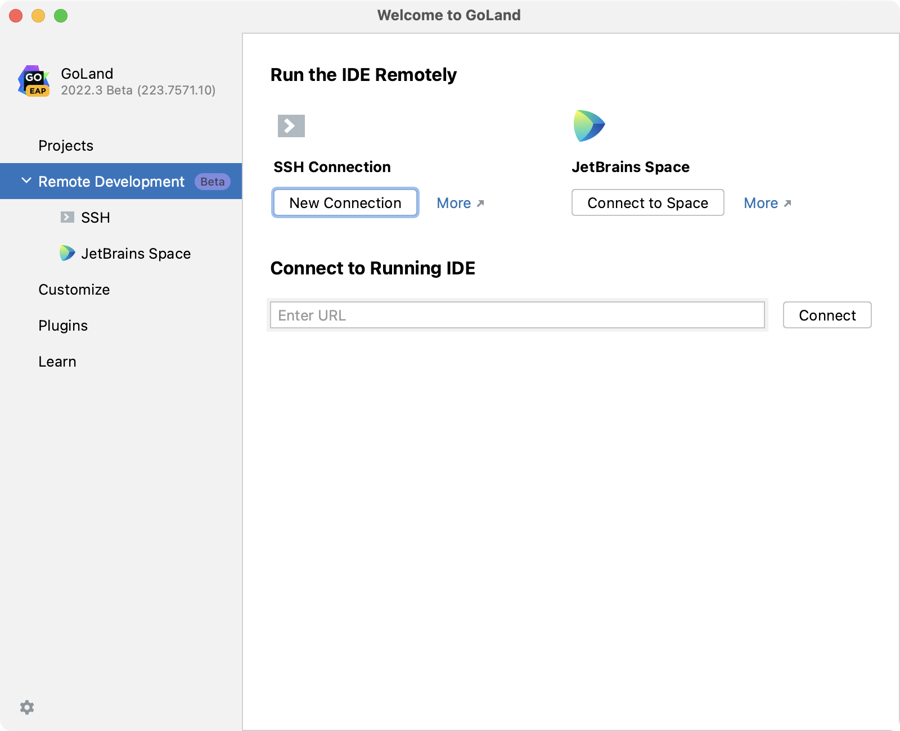

# Run GoLand for the first time

https://www.jetbrains.com/help/go/run-for-the-first-time.html#start-project

Last modified: 22 March 2023

You can use the [Toolbox App](https://www.jetbrains.com/help/go/installation-guide.html#toolbox) to run any JetBrains product. In case of a [standalone installation](https://www.jetbrains.com/help/go/installation-guide.html#standalone), running GoLand depends on the operating system:

Windows

macOS

Linux

To run GoLand, find it in the Windows Start menu or use the desktop shortcut. You can also run the launcher batch script or executable in the installation directory under **bin**.

Once you launch GoLand, you will see the Welcome screen, the starting point to your work with the IDE, and configuring its settings. This screen also appears when you close all opened projects. Use the tabs on the left side to switch to the specific welcome dialog.

If you are a new user who has not yet created any projects, GoLand will advise you to go through an onboarding tour.

## Customize the IDE appearance

Click Customize and select another [color theme](https://www.jetbrains.com/help/go/user-interface-themes.html) or select the Sync with OS checkbox to use your system default theme. Here you can also configure [accessibility settings](https://www.jetbrains.com/help/go/accessibility.html#red_green_deficiency) or select another [keymap](https://www.jetbrains.com/help/go/configuring-keyboard-and-mouse-shortcuts.html).

> ### 
>
> 
>
> Try the new GoLand [user interface](https://www.jetbrains.com/help/go/new-ui.html).

## Configure the default settings

Click Customize and select Import Settings if you already have a [copy of the required settings](https://www.jetbrains.com/help/go/sharing-your-ide-settings.html#import-export-settings) that you want to apply.

Alternatively, click All settings to open the settings dialog. The settings that you modify at this moment will become the new default configuration for your projects and the IDE.

## Install additional plugins

Click Plugins in the left-hand pane and download and install additional plugins from the [GoLand plugins repository](https://plugins.jetbrains.com/go).

## Learn GoLand

Click Learn to get more familiar with the shortcuts, features, and workflows that the IDE has to offer. For more information, refer to [Learn IDE features](https://www.jetbrains.com/help/go/learn-ide-features-go.html).

## Develop your applications remotely

Click Remote Development to configure an entry point to connect to a remote server and code, run, debug, and deploy your projects remotely. For more information, refer to [Connect to a remote server from GoLand](https://www.jetbrains.com/help/go/remote-development-starting-page.html).

## Start a project in GoLand

From the Welcome to GoLand dialog, you can do the following:

- [Create a new project](https://www.jetbrains.com/help/go/create-new-go-project.html)
- [Open an existing project](https://www.jetbrains.com/help/go/quick-start-guide-goland.html#open-project)
- [Get a project from a version control system](https://www.jetbrains.com/help/go/quick-start-guide-goland.html#checkout-from-vcs)