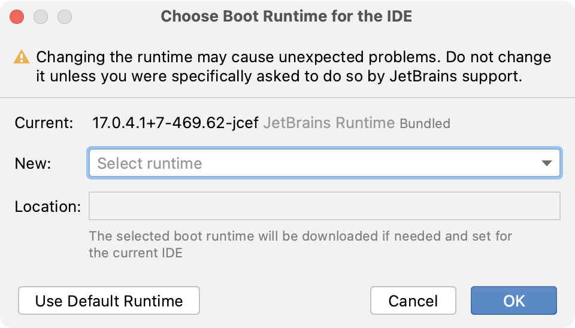

+++
title = "Change the boot Java runtime of the IDE"
weight = 20
date = 2023-06-17T19:06:58+08:00
description = ""
isCJKLanguage = true
draft = false
+++
# Change the boot Java runtime of the IDE

Last modified: 10 March 2023

As a Java application, GoLand requires a Java runtime environment (JRE). By default, GoLand uses [JetBrains Runtime](https://github.com/JetBrains/JetBrainsRuntime) (a fork of [OpenJDK](https://github.com/openjdk/jdk)), which is included with the IDE. JetBrains Runtime fixes various known OpenJDK and Oracle JDK bugs, and provides better performance and stability. However, in some cases you may be required to use another Java runtime or a specific version of JetBrains Runtime.

> ### 
>
> 
>
> Changing the boot Java runtime may cause unexpected problems. Do not change it unless you were specifically asked to do so by [JetBrains support](https://www.jetbrains.com/support/).

> ### 
>
> 
>
> The runtime for GoLand is not the same runtime used for your applications. Define an SDK for each of your projects, which includes the necessary development and runtime environment.

### Switch the Java runtime used to run GoLand

1. From the main menu, select Help | Find Action or press Ctrl+Shift+A.

2. Find and select the Choose Boot Java Runtime for the IDE action.

3. Select the new desired runtime and click OK.

   If necessary, you can change the location where GoLand will download the selected runtime.

4. Wait for GoLand to restart with the new runtime.

When you open the Choose Boot Runtime for the IDE dialog for the first time, it may take a while to load the list of JetBrains Runtime builds from the server.

To use a different Java runtime available on your computer, select Add Custom Runtime… under Advanced in the New field. GoLand lists all the JDKs and JREs that it was able to detect. Select one or click Add JDK to specify the location of the desired Java home directory.

To reset back to the default runtime that the IDE initially used, click Use Default Runtime.

> ### 
>
> 
>
> When using a non-default Java runtime for GoLand, it will not update with the IDE and may not be compatible with the new version. Reset back to the default runtime when updating GoLand to get the latest compatible version of JetBrains Runtime.

The path to the selected runtime is stored in the **goland.jdk** or **goland64.jdk** file in the GoLand [configuration directory](https://www.jetbrains.com/help/go/directories-used-by-the-ide-to-store-settings-caches-plugins-and-logs.html#config-directory). If there are problems with the selected runtime, you can delete this file to revert to the default runtime.

You can also override the runtime used for GoLand by adding the `GOLAND_JDK` environment variable with the path to the desired JDK home directory.