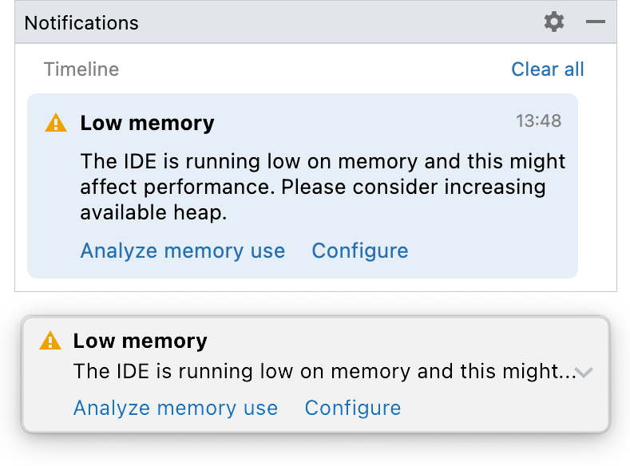
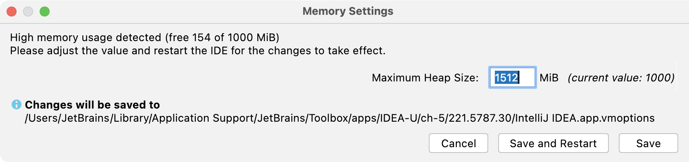

+++
title = "Notifications"
weight = 30
date = 2023-06-17T19:06:58+08:00
description = ""
isCJKLanguage = true
draft = false
+++
# Increase the memory heap of the IDE

https://www.jetbrains.com/help/go/increasing-memory-heap.html#toolbox

Last modified: 11 April 2023

Help | Change Memory Settings

The Java Virtual Machine (JVM) running GoLand allocates some predefined amount of memory. The default value depends on the platform. If you are experiencing slowdowns, you may want to increase the memory heap.

1. From the main menu, select Help | Change Memory Settings.
2. Set the necessary amount of memory that you want to allocate and click Save and Restart.

This action changes the value of the `-Xmx` option used by the JVM to run GoLand. Restart GoLand for the new setting to take effect.

> ### 
>
> 
>
> The Change Memory Settings action is available starting from GoLand version 2019.2. For previous versions or if the IDE crashes, you can change the value of the `-Xmx` option manually as described in [JVM options](https://www.jetbrains.com/help/go/tuning-the-ide.html#configure-jvm-options).

GoLand also warns you if the amount of free heap memory after a garbage collection is less than 5% of the maximum heap size:

Click Configure to increase the amount of memory allocated by the JVM. If you are not sure what would be a good value, use the one suggested by GoLand.

Click Save and Restart and wait for GoLand to restart with the new memory heap setting.

### Enable the memory indicator

GoLand can show you the amount of used memory in the [status bar](https://www.jetbrains.com/help/go/guided-tour-around-the-user-interface.html#status-bar). Use it to judge how much memory to allocate.

- Right-click the status bar and select Memory Indicator.

## Toolbox App

If you are using the Toolbox App, you can change the maximum allocated heap size for a specific IDE instance without starting it.

1. Open the Toolbox App, click the settings icon next to the relevant IDE instance, and select Settings.

   

2. On the instance settings tab, expand Configuration and specify the heap size in the Maximum heap size field.

If the IDE instance is currently running, the new settings will take effect only after you restart it.

If you are using a standalone instance not managed by the Toolbox App, and you can't start it, it is possible to manually change the `-Xmx` option that controls the amount of allocated memory. Create a copy of the default [JVM options](https://www.jetbrains.com/help/go/tuning-the-ide.html#configure-jvm-options) file and change the value of the `-Xmx` option in it.