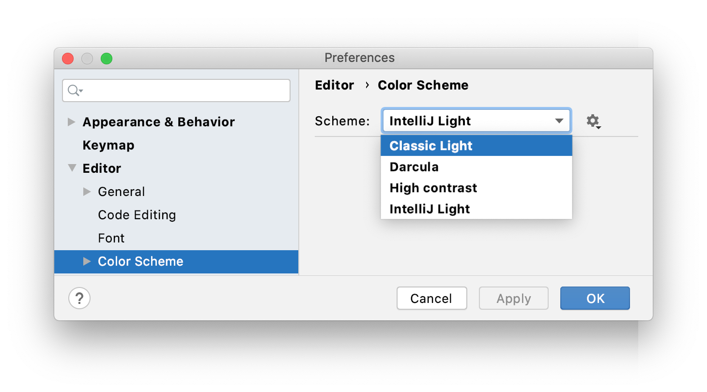
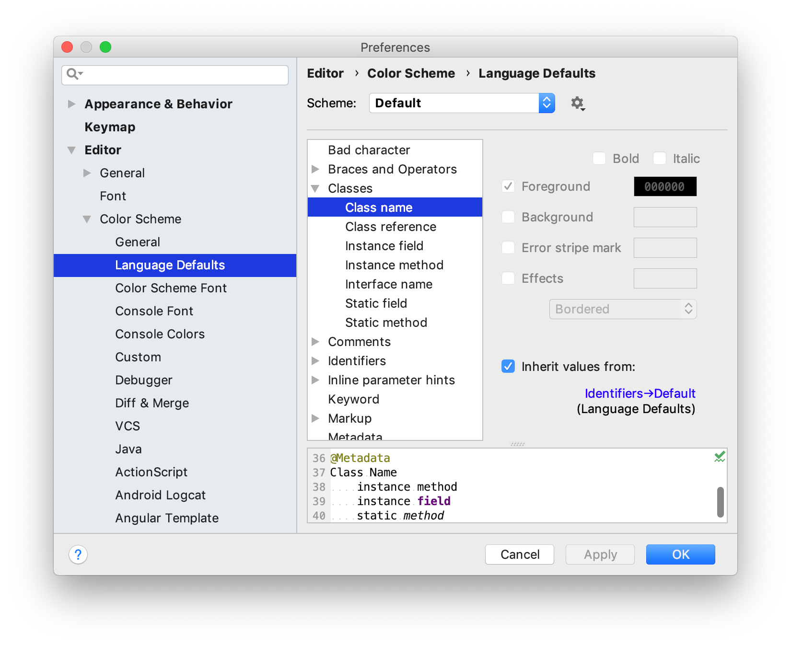

+++
title = "颜色和字体"
weight = 20
date = 2023-06-17T19:06:58+08:00
description = ""
isCJKLanguage = true
draft = false
+++
# Colors and fonts - 颜色和字体

https://www.jetbrains.com/help/go/configuring-colors-and-fonts.html

Last modified: 17 March 2023

最后修改日期：2023年3月17日

As a developer, you work with a lot of text resources: the source code in the editor, search results, debugger information, console input and output, and so on. Colors and font styles are used to format this text and help you better understand it at a glance.

作为开发人员，您会使用许多文本资源：编辑器中的源代码、搜索结果、调试器信息、控制台输入和输出等。颜色和字体样式用于格式化这些文本，并帮助您一目了然地理解它们。

GoLand lets you choose between configurable color schemes that define colors and fonts used in IDE text.

GoLand允许您选择可配置的颜色方案，定义IDE文本中使用的颜色和字体。

You can use a predefined color scheme or customize it to your liking. It is also possible to share schemes.

您可以使用预定义的颜色方案或根据自己的喜好进行自定义。还可以共享方案。

### 选择颜色方案 Select a color scheme

1. Press Ctrl+Alt+S to open the IDE settings and select Editor | Color Scheme.

2. 按Ctrl+Alt+S打开IDE设置，然后选择Editor | Color Scheme。

3. 使用方案列表选择一个颜色方案。

4. Use the Scheme list to select a color scheme.

   

By default, there are the following predefined color schemes:

默认情况下，有以下预定义的颜色方案： 

- Classic Light: designed for the macOS Light and Windows 10 Light interface themes
- 经典亮色：为macOS亮色和Windows 10亮色界面主题设计
- Darcula: designed for the Darcula interface theme
- Darcula：为Darcula界面主题设计
- High contrast: designed for the High contrast interface theme (recommended for users with sight deficiency)
- 高对比度：为高对比度界面主题设计（推荐给视力有缺陷的用户）
- IntelliJ Light: designed for the IntelliJ Light interface theme
- IntelliJ亮色：为IntelliJ亮色界面主题设计

> If you install a plugin with a color scheme, that scheme will be added to the list of predefined schemes. For more information, see [Share color schemes](https://www.jetbrains.com/help/go/configuring-colors-and-fonts.html#share-color-scheme).
>
> ​	如果安装了带有颜色方案的插件，该方案将添加到预定义方案列表中。有关更多信息，请参阅[共享颜色方案](https://www.jetbrains.com/help/go/configuring-colors-and-fonts.html#share-color-scheme)。

## 自定义颜色方案 Customize a color scheme

You can customize a predefined color scheme, but it is recommended to create a duplicate for your custom color and font settings:

您可以自定义预定义的颜色方案，但建议为您的自定义颜色和字体设置创建副本：

### 复制颜色方案 Duplicate a color scheme

1. Press Ctrl+Alt+S to open the IDE settings and select Editor | Color Scheme.
2. 按Ctrl+Alt+S打开IDE设置，然后选择Editor | Color Scheme。
3. Select a color scheme, click 选择一个颜色方案，点击, and then click Duplicate.然后点击Duplicate。
4. (Optional) To rename your custom scheme, click （可选）要重命名自定义方案，点击 and select Rename.，然后选择Rename。

> Predefined color schemes are listed in bold font. If you customize a predefined color scheme, it will be displayed in blue. To restore a predefined color scheme to default settings, click 预定义颜色方案以粗体字显示。如果您自定义了预定义的颜色方案，它将以蓝色显示。要将预定义颜色方案恢复为默认设置，请点击 and select Restore Defaults. You cannot remove predefined color schemes.，然后选择Restore Defaults。您无法删除预定义颜色方案。
>

To define color and font settings, open the Editor | Color Scheme page of the IDE settings Ctrl+Alt+S. The settings under Editor | Color Scheme are separated into sections. For example, the General section defines basic editor colors, such as the gutter, line numbers, errors, warnings, popups, hints, and so on. The Language Defaults section contains common syntax highlighting settings, which are applied to all supported programming languages by default. In most cases, it is sufficient to configure Language Defaults and make adjustments for specific languages if necessary. To change inherited color settings for an element, clear the Inherit values from checkbox.

要定义颜色和字体设置，请打开IDE设置的Editor | Color Scheme页面，按Ctrl+Alt+S。Editor | Color Scheme下的设置被分为多个部分。例如，General部分定义基本的编辑器颜色，如装订线、行号、错误、警告、弹出窗口、提示等等。Language Defaults部分包含常见的语法高亮设置，默认应用于所有支持的编程语言。在大多数情况下，只需配置Language Defaults并根据需要对特定语言进行调整即可。要更改元素的继承颜色设置，清除Inherit values from复选框。

## 语义高亮 Semantic highlighting

By default, the color scheme defines syntax highlighting for reserved words and other symbols in your source code: operators, keywords, suggestions, string literals, and so on. If you have a function or method with many parameters and local variables, it may be hard to distinguish them from one another at a glance. You can use semantic highlighting to assign a different color to each parameter and local variable.

默认情况下，颜色方案为源代码中的保留字和其他符号定义语法高亮显示：运算符、关键字、建议、字符串字面量等等。如果您有一个带有许多参数和局部变量的函数或方法，在一瞥之间很难区分它们。您可以使用语义高亮将不同的颜色分配给每个参数和局部变量。

### 启用语义高亮 Enable semantic highlighting

1. Press Ctrl+Alt+S to open the IDE settings and select Editor | Color Scheme | Language Defaults | Semantic highlighting.
2. 按Ctrl+Alt+S打开IDE设置，然后选择Editor | Color Scheme | Language Defaults | Semantic highlighting。
3. Select the Semantic highlighting checkbox and customize the color ranges if necessary.
4. 选择语义高亮复选框，并在需要时自定义颜色范围。

## 共享颜色方案 Share color schemes

If you are used to a specific color scheme, you can export it from one installation and import it to another one. You can also share color schemes with other developers.

如果您习惯使用特定的颜色方案，可以将其导出到另一个安装程序中进行导入。您还可以与其他开发人员共享颜色方案。

### 将颜色方案导出为XML Export a color scheme as XML

GoLand can save your color scheme settings as an XML file with the **.icls** extension. You can then import the file to another installation.

GoLand可以将您的颜色方案设置保存为具有**.icls**扩展名的XML文件。然后，您可以将该文件导入到另一个安装程序中。 

1. Press Ctrl+Alt+S to open the IDE settings and select Editor | Color Scheme.
2. 按Ctrl+Alt+S打开IDE设置，然后选择Editor | Color Scheme。
3. From the Scheme list, select a color scheme, click 从方案列表中选择一个颜色方案，点击, then click Export and select IntelliJ IDEA color scheme (.icls).，然后点击Export，选择IntelliJ IDEA color scheme (.icls)。
4. Specify the name and location of the file and save it.
5. 指定文件的名称和位置，然后保存。

### 将颜色方案导出为插件 Export a color scheme as a plugin

The plugin can be uploaded to the [plugin repository](https://www.jetbrains.com/help/go/managing-plugins.html#install_plugin_from_repo) for others to install. This format has several benefits over an XML file, including metadata, feedback, download statistics, and versioning (when you upload a new version of the plugin, users will be notified about it).

该插件可以上传到[插件仓库](https://www.jetbrains.com/help/go/managing-plugins.html#install_plugin_from_repo)，供其他人安装使用。与XML文件相比，此格式具有几个优点，包括元数据、反馈、下载统计信息和版本控制（当您上传插件的新版本时，用户将收到通知）。

1. Press Ctrl+Alt+S to open the IDE settings and select Editor | Color Scheme.
2. 按Ctrl+Alt+S打开IDE设置，然后选择Editor | Color Scheme。
3. From the Scheme list, select a color scheme, click 从方案列表中选择一个颜色方案，点击, then click Export and select Color scheme plugin .jar.，然后点击Export，选择Color scheme plugin .jar。
4. In the Create Color Scheme Plugin dialog, specify the version details and vendor information. Then click OK.
5. 在创建Color Scheme Plugin对话框中，指定版本详细信息和供应商信息，然后点击OK。

> When you install a plugin with a color scheme, that scheme will be added to the list of predefined schemes.
>
> 安装带有颜色方案的插件后，该方案将添加到预定义方案列表中。

### 导入颜色方案 Import a color scheme

1. Press Ctrl+Alt+S to open the IDE settings and select Editor | Color Scheme.
2. 按Ctrl+Alt+S打开IDE设置，然后选择Editor | Color Scheme。
3. From the Scheme list, select a color scheme, click 从方案列表中选择一个颜色方案，点击, then click Import Scheme.，然后点击Import Scheme。

## 字体 Fonts

To customize the default font used in the editor, open the Editor | Font page of the IDE settings Ctrl+Alt+S. This font is used and inherited in all color schemes by default. For more information, see [Font](https://www.jetbrains.com/help/go/settings-editor-font.html).

要自定义编辑器中使用的默认字体，请按Ctrl+Alt+S打开IDE设置，然后选择Editor | Font。默认情况下，此字体在所有颜色方案中使用和继承。有关更多信息，请参阅[Font](https://www.jetbrains.com/help/go/settings-editor-font.html)。

> To configure the font used in the GoLand interface (tool windows, toolbars, menus, and so on), open the IDE settings Ctrl+Alt+S, and go to Appearance & Behavior | Appearance. From the Use custom font list, select a font and specify the font size in the Size field.
>
> 要配置GoLand界面（工具窗口、工具栏、菜单等）使用的字体，请打开IDE设置Ctrl+Alt+S，然后转到Appearance & Behavior | Appearance。从“Use custom font”列表中选择字体，并在“Size”字段中指定字体大小。

### 自定义颜色方案字体 Customize the color scheme font

You can set a different font for your current scheme.

您可以为当前方案设置不同的字体。

> This is not recommended if you are planning to share your scheme or use it on other platforms that may not support the selected font. In such cases, use the default global font settings.
>
> ​	如果您打算共享您的方案或在可能不支持所选字体的其他平台上使用它，不建议这样做。在这种情况下，请使用默认的全局字体设置。 

1. Press Ctrl+Alt+S to open the IDE settings and select Editor | Color Scheme | Color Scheme Font.
2. 按Ctrl+Alt+S打开IDE设置，然后选择Editor | Color Scheme | Color Scheme Font。
3. Select the Use color scheme font instead of the default checkbox.
4. 选择“Use color scheme font instead of the default”复选框。

### 自定义控制台字体 Customize the console font

By default, text in the console uses the same font as the color scheme. To use a different font in the console:

​	默认情况下，控制台中的文本使用与颜色方案相同的字体。要在控制台中使用不同的字体： 

1. Press Ctrl+Alt+S to open the IDE settings and select Editor | Color Scheme | Console Font.
2. 按Ctrl+Alt+S打开IDE设置，然后选择Editor | Color Scheme | Console Font。
3. Select the Use console font instead of the default checkbox.
4. 选择“Use console font instead of the default”复选框。

### 安装新的自定义字体 Install a new custom font

GoLand can use any font that is available in your operating system or in the [Java runtime](https://www.jetbrains.com/help/go/switching-boot-jdk.html) that is used to run GoLand. If you want to add another font, you need to install it in your OS, and GoLand will discover it after a restart.

​	GoLand可以使用操作系统或用于运行GoLand的[Java运行时](https://www.jetbrains.com/help/go/switching-boot-jdk.html)中可用的任何字体。如果您想添加其他字体，需要在操作系统中安装它，并在重新启动后，GoLand将会发现它。

1. Download the desired TTF font package and unzip it to extract font files (**.ttf** ). For the font to work correctly, it should have at least 4 files: Normal, Bold, Italic, and Bold Italic.

2. 下载所需的TTF字体包并解压缩以提取字体文件（**.ttf**）。为了使字体正常工作，它应该至少有4个文件：Normal、Bold、Italic和Bold Italic。

   Windows

   macOS

   Linux

   

   

   Install

3. Restart GoLand and then select the installed font on the Editor | Font page of the IDE settings Ctrl+Alt+S.

4. 重新启动GoLand，然后在IDE设置Ctrl+Alt+S的Editor | Font页面上选择已安装的字体。

## 提高效率的提示 Productivity tips

### 查看当前符号的颜色方案设置  See the color scheme settings for the current symbol

- Put the caret at the necessary symbol, press Ctrl+Shift+A, find the Jump to Colors and Fonts action, and execute it.
- 将插入符号放置在必要的符号上，按Ctrl+Shift+A，在Jump to Colors and Fonts操作中搜索并执行它。

This will open the relevant color scheme settings for the symbol under the caret.

这将打开与插入符号下的相关颜色方案设置。

### 查看编辑器当前使用的字体 See which fonts are currently used in the editor

- Press Ctrl+Shift+A, find the Show Fonts Used by Editor action, and execute it.
- 按Ctrl+Shift+A，在Show Fonts Used by Editor操作中搜索并执行它。

This will open the Fonts Used in Editor dialog with a list of fonts.

这将打开“编辑器字体”对话框，显示当前在编辑器中使用的字体。

### 使用快速切换器 Use the quick switcher

1. Press Ctrl+` or select View | Quick Switch Scheme form the menu.
2. 按下Ctrl+`键，或从菜单中选择View | Quick Switch Scheme。
3. In the Switch popup, select Editor Color Scheme, and then select the desired color scheme.
4. 在切换弹出窗口中，选择Editor Color Scheme，然后选择所需的颜色方案。

> Both the Jump to Colors and Fonts and the Show Fonts Used by Editor actions do not have a default shortcut. To assign a shortcut for an action, select it in the Find Action popup and press Alt+Enter.
>
> ​	Jump to Colors and Fonts和Show Fonts Used by Editor这两个操作都没有默认的快捷键。要为一个操作分配快捷键，选择它在查找操作弹出窗口中，然后按Alt+Enter键。