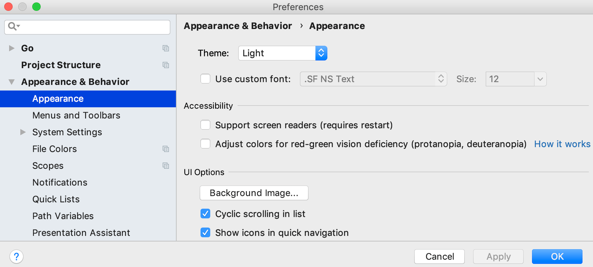
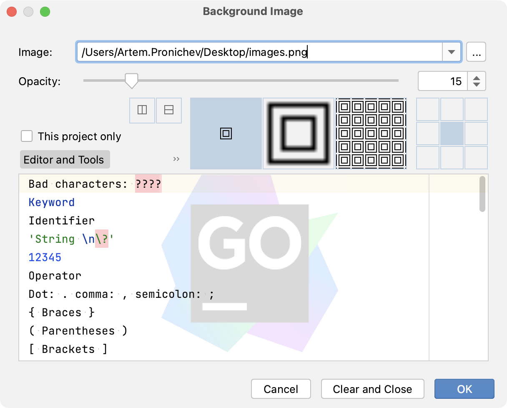

+++
title = "背景图片"
weight = 60
date = 2023-06-17T19:06:58+08:00
description = ""
isCJKLanguage = true
draft = false
+++
# Background image

https://www.jetbrains.com/help/go/setting-background-image.html

Last modified: 26 January 2023

You can set any image as a custom background for the editor and all tool windows in GoLand.

### Configure a custom background image

1. Press Ctrl+Alt+S to open the IDE settings and select Appearance & Behavior | Appearance.

2. Click the Background Image button.

   

   > ### 
   >
   > 
   >
   > Alternatively, if the image is in your project, right-click it in the editor or in the Project tool window and select Set Background Image from the context menu. You can also press Ctrl+Shift+A, find and select the Set Background Image action.

3. In the Background Image dialog, specify the image you want to use as the background and click OK to apply the changes.

   

   For more information about the options, see [Background image settings](https://www.jetbrains.com/help/go/setting-background-image.html#background_image_settings).

## Background image settings

The Background Image dialog has the following options:

| Image             | Either specify a local path to an image in your file system or a URL to an image on a remote server. |
| ----------------- | ------------------------------------------------------------ |
| Opacity           | Specify the relative opacity of the image, where 100 is completely opaque and 0 is completely transparent. |
| Placement options | Use the icons to select where to place the image:Mirror the image vertically or horizontallySelect whether to place one copy of the image at its original size, scale the image to fit the entire width, or fill the entire width with copies of the image at its original sizeIf you choose to keep the original size, select where to put the image: in the center, on a side, or in a corner. |
| This project only | Select if you want to use this custom image as a background only in the current project. |
| Editor and tools  | Configure an image to be used as the background of the editor and tool windows. |
| Empty frame       | Configure an image to be used as the background when no files are open in the editor. |
| Clear and Close   | Clear the background image and use the default background.   |