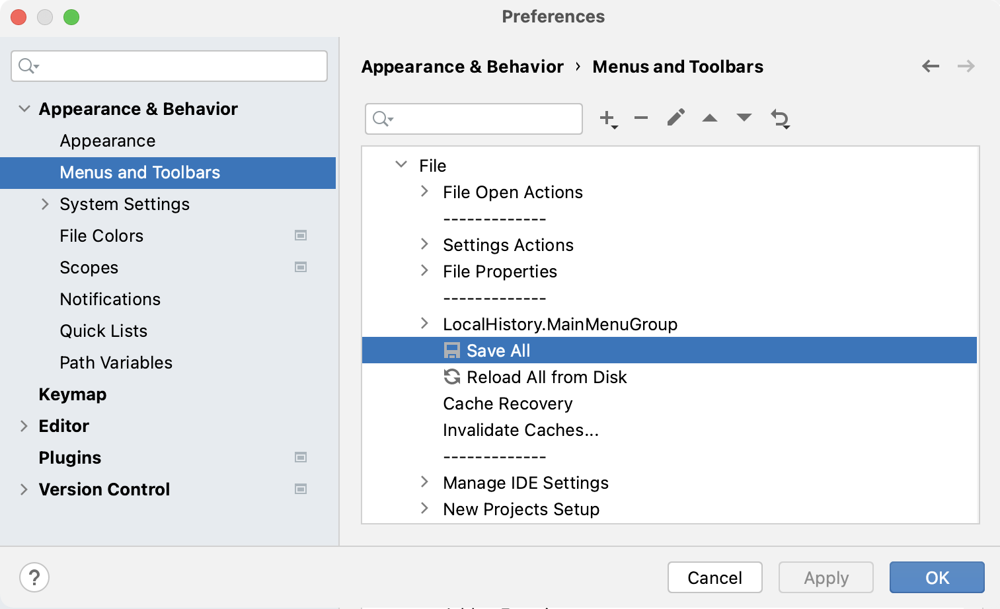
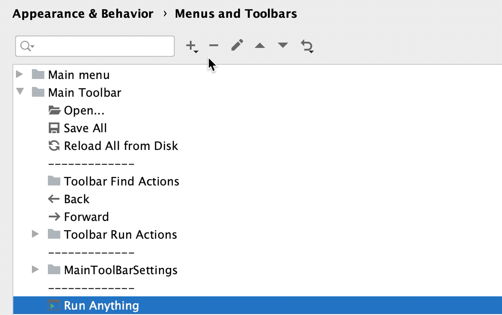
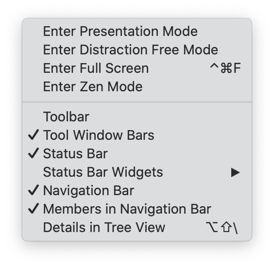
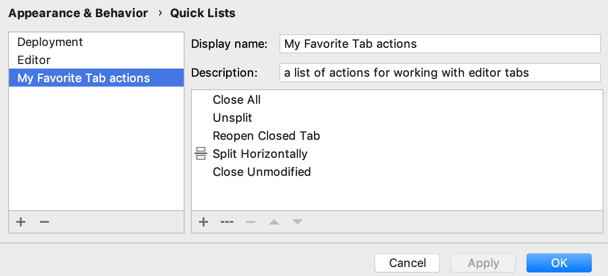
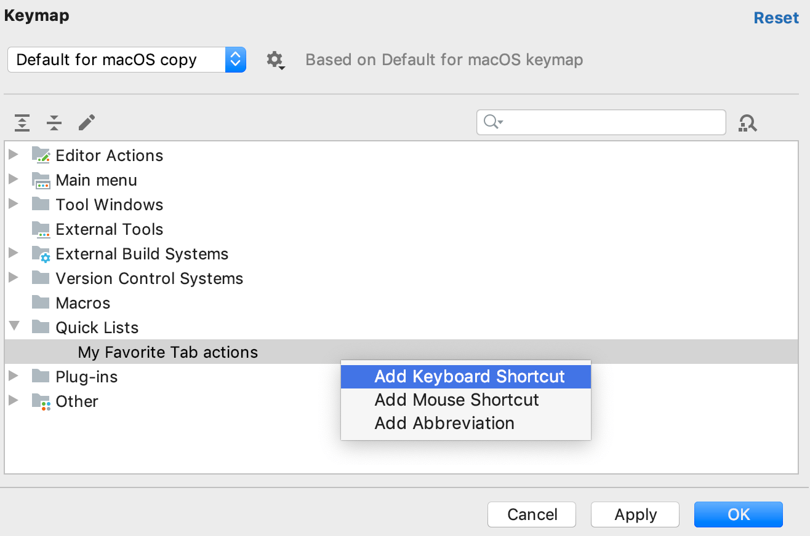
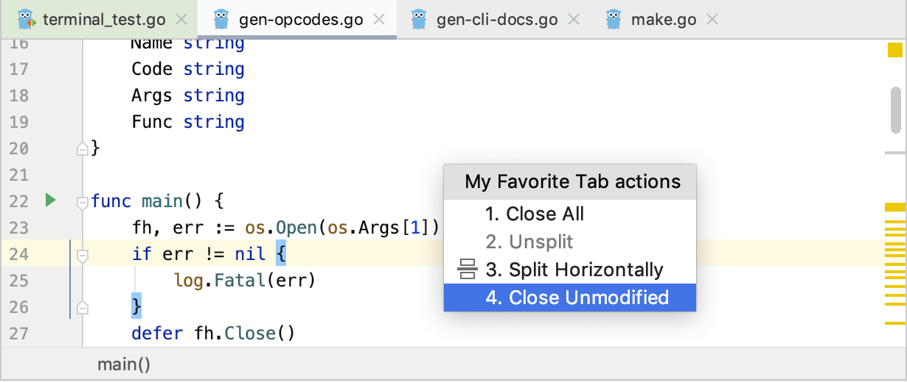
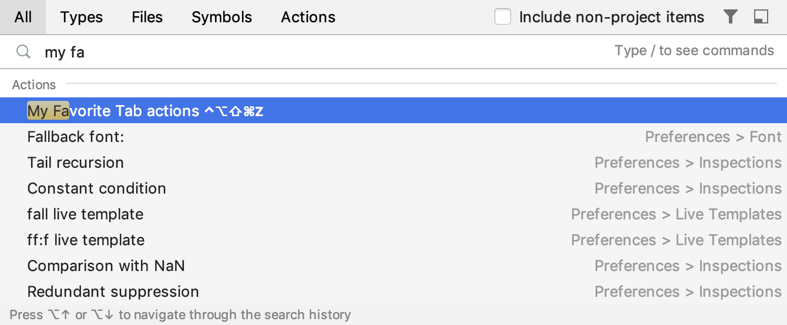

+++
title = "菜单和工具栏"
weight = 30
date = 2023-06-17T19:06:58+08:00
description = ""
isCJKLanguage = true
draft = false
+++
# Menus and toolbars

https://www.jetbrains.com/help/go/customize-actions-menus-and-toolbars.html#quick-list-shortcut

Last modified: 16 January 2023

As you work with the IDE, you perform some actions more often than the others. To maximize your productivity, [learn the default shortcuts](https://www.jetbrains.com/help/go/mastering-keyboard-shortcuts.html) for your favorite actions or [assign shortcuts](https://www.jetbrains.com/help/go/configuring-keyboard-and-mouse-shortcuts.html) for them. You can also customize the menus and toolbars to only contain the actions that you need, regroup them, and configure their icons.

### Customize menus and toolbars

1. Press Ctrl+Alt+S to open the IDE settings and select Appearance & Behavior | Menus and Toolbars.

   

2. In the list of available menus and toolbars, expand the node you want to customize and select the desired item.

   - Click  to add an action or a separator under the selected item.
   - Click  to remove the selected item.
   - Click  to [add or change the icon](https://www.jetbrains.com/help/go/customize-actions-menus-and-toolbars.html#custom-icons-menu) for the selected action.
   - Click  or  to move the selected item up or down.
   - Click  to restore the selected action or all actions to default settings.

   

3. Click OK to save your changes.

### Configure custom icons for menu options

1. Press Ctrl+Alt+S to open the IDE settings and select Appearance & Behavior | Menus and Toolbars.

2. Select the menu option for which you want to change or add an icon and click .

3. Click the  button to select an icon from the list or click  to upload your own icon.

   You can use only PNG or SVG files as icons. The [GoLand Community Edition repository](https://github.com/JetBrains/intellij-community/tree/master/platform/icons/src) contains most of the icons used in the IDE.

## Show and hide UI elements

If you have a small monitor, you can hide some of the UI elements that you never use. These elements are described in [User interface](https://www.jetbrains.com/help/go/guided-tour-around-the-user-interface.html).

- From the main menu, select View | Appearance and enable or disable the necessary elements.

  

- Toolbar: Located at the top of the window, this is the main toolbar with buttons for opening files, undo and redo actions.

- Tool Window Bars: Located on the edges of the window, these bars contain buttons for showing, hiding, and arranging the tool windows. See [Tool window bars and buttons](https://www.jetbrains.com/help/go/tool-windows.html#bars_and_buttons).

- Status Bar: Located at the bottom of the window, it shows event messages, indicates the overall project and IDE status, and provides quick access to some settings via widgets. See [Status bar](https://www.jetbrains.com/help/go/guided-tour-around-the-user-interface.html#status-bar).

- Status Bar Widgets: Located in the right part of the status bar. You can also right-click the status bar to show and hide widgets.

- Navigation Bar: Located at the top of the window, where you can navigate the directories and files of your project with Alt+Home as an alternative to the Project tool window. See [Navigation bar](https://www.jetbrains.com/help/go/guided-tour-around-the-user-interface.html#navigation-bar).

- Members in Navigation Bar: Show the fields and methods in the navigation bar.

- Main Menu: On Windows and Linux, hide the standard menu bar of the application window with File, Edit, View, and other menus. You can't hide it on macOS or on Linux if you are using the [Linux native menu](https://www.jetbrains.com/help/go/linux-native-menu.html).

  > ### 
  >
  > 
  >
  > If you hide the main menu, you can still access it with the corresponding action: press Ctrl+Shift+A and search for main menu.

- Details in Tree View: Show the last modification date and size of files in the Project tool window

## Quick lists with your favorite actions

A quick list is a popup that contains a custom set of GoLand actions. Think of it as a custom menu or toolbar, for which you can assign a shortcut for quick access. You can create as many quick lists as necessary. Each action in a quick list is identified by a number from 0 through 9.

There are a number of predefined quick lists, but note that they are not configurable:

- Refactor this Ctrl+Alt+Shift+T
- VCS Operations Alt+`

For example, you can create a list of actions that do not have shortcuts assigned to them and refer to that list by one shortcut followed by the number associated with a specific action.

### Create a quick list

1. Press Ctrl+Alt+S to open the IDE settings and select Appearance & Behavior | Quick Lists.

2. Click  or press Alt+Insert on the left pane to create a new quick list.

3. In the Display name field, specify the name of the quick list. Optionally, provide the quick list description.

4. On the right pane, add and arrange the actions on the quick list:

   - Click  to add an action to the list.
   - Click  to add a separator line.
   - Click  to remove the selected action from the list.
   - Click  or  to move the selected item up or down.

   

5. Click OK to save the changes.

### Assign a shortcut to a quick list

1. Press Ctrl+Alt+S to open the IDE settings and select Keymap.

2. Expand the Quick Lists node and select your quick list. Add a keyboard shortcut and save the changes.

   

   

   For more information, see [Keyboard shortcuts](https://www.jetbrains.com/help/go/configuring-keyboard-and-mouse-shortcuts.html).

3. Click OK to save the changes.

In the editor, access the quick list by the associated shortcut.

If you don't remember the shortcut, you can search for your quick list by its name. Press Shift twice and type the name of the quick list.

