+++
title = "新的UI"
weight = 10
date = 2023-06-17T19:06:58+08:00
description = ""
isCJKLanguage = true
draft = false
+++
# New UI - 新用户界面

https://www.jetbrains.com/help/go/new-ui.html#compact-mode

Last modified: 24 April 2023

最后修改日期：2023年4月24日

​	新的用户界面（UI）是GoLand的全新重新设计外观。它旨在减少视觉复杂性，提供对基本功能的便捷访问，并根据需要逐步揭示复杂功能，从而呈现出更清晰的外观和感觉。

​	主要变化包括简化的主工具栏、新的[工具窗口布局](https://www.jetbrains.com/help/go/new-ui.html#tool_windows)、新的主题和更新的图标。

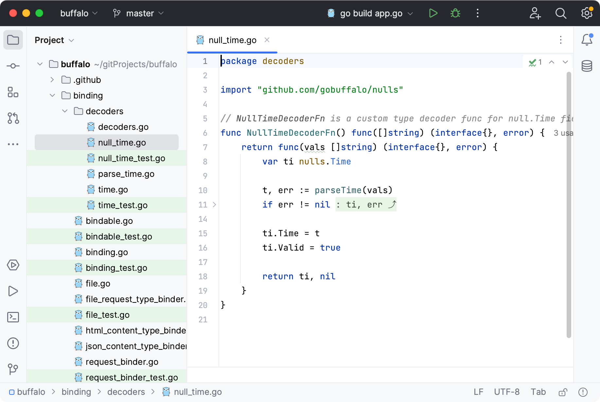

### 启用新的用户界面

1. 按下Ctrl+Alt+S打开IDE设置，选择"Appearance&Behavior | New UI"。
4. 选择"Enable new UI"复选框并应用更改。重新启动IDE。

## 主要变化

### 主题、图标、字体

- 新的浅色和深色[主题](https://www.jetbrains.com/help/go/user-interface-themes.html)具有改进的对比度和一致的配色方案。

  

  

  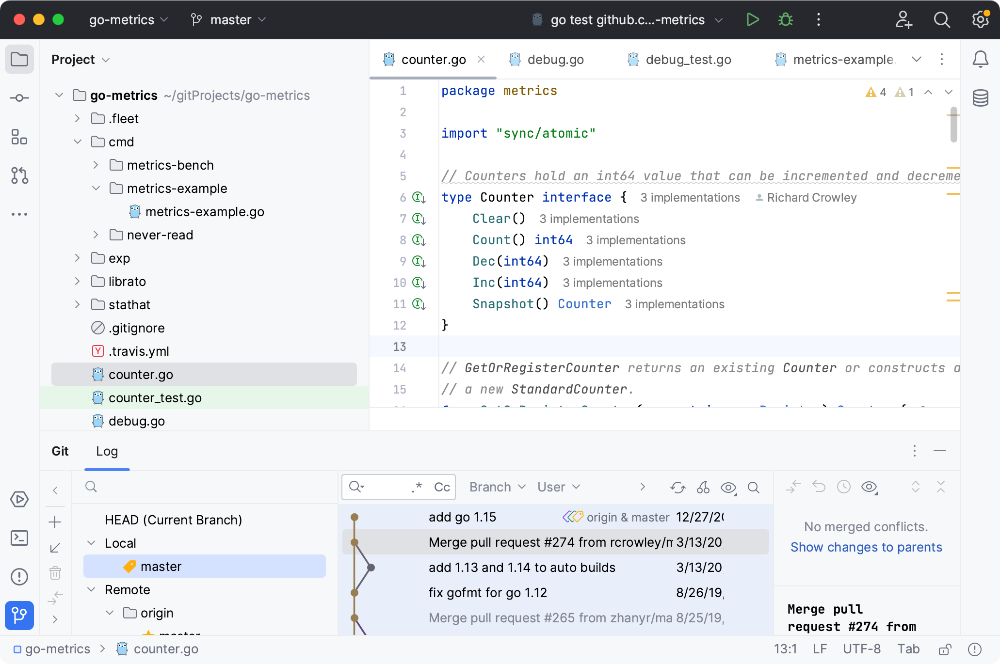

  

  

  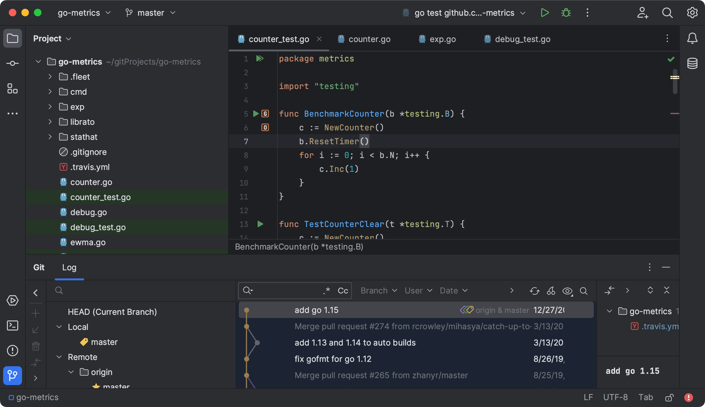

  

  

- UI使用Inter字体在所有支持的操作系统上进行显示。

- 新的图标集具有更明显的形状和颜色，设计用于提高可读性和视觉平衡。

### 窗口标题栏

​	主窗口标题栏中有几个新的小部件。从左到右：

1. 主菜单（仅适用于Windows和Linux）

   主菜单现在位于汉堡菜单图标下方。您可以使用Alt+\快捷键打开它。

   您可以恢复完整菜单：转到"Settings | Appearance & Behavior | New UI"，启用"Show main menu in separate toolbar"选项。

2. 项目小部件

   该小部件显示当前项目的名称，允许在最近的项目之间切换、创建新项目并打开现有项目。

3. 版本控制小部件

   该小部件显示当前分支，允许在分支之间切换，并提供最流行的[VCS操作](https://www.jetbrains.com/help/go/version-control-integration.html)，如更新项目、提交和推送更改。

   它取代了之前位于主窗口底部状态栏的分支小部件，以及之前位于右上角导航栏的VCS操作图标。

4. 运行小部件

   该小部件允许您启动[运行/调试配置](https://www.jetbrains.com/help/go/run-debug-configuration.html)，选择其他配置运行，更改当前配置的模式（运行或调试），以及编辑或删除当前配置。

   它显示进程的当前状态。当进程正在运行时，您可以使用该小部件重新启动或停止进程。

​	在主工具栏中提供更多功能的同时，新的窗口标题栏小部件将操作隐藏在下拉菜单中，以简化布局。

### 工具窗口

​	工具窗口具有新的布局和行为：

- 工具窗口栏使用大图标，以便更容易进行视觉导航，并呈现出更清晰的外观。您可以选择在[紧凑模式](https://www.jetbrains.com/help/go/new-ui.html#compact-mode)中使用较小的图标。要查看工具窗口的名称，请将鼠标悬停在其图标上以显示工具提示。

  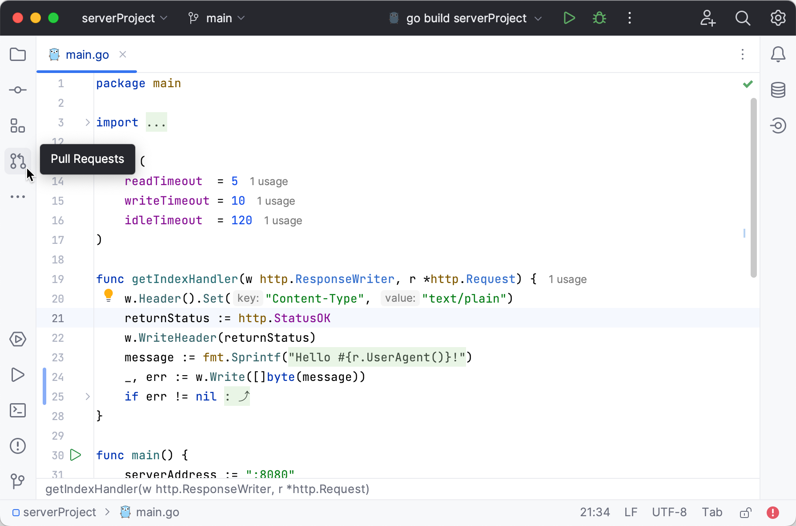

- 左侧和右侧栏上部的工具窗口图标会在IDE窗口的左侧和右侧打开垂直工具窗口。

  底部栏中的图标会在IDE窗口底部打开水平工具窗口。		

- 使用垂直和水平拆分来排列工具窗口：将工具窗口图标沿侧边栏拖动并将其放在分隔符下方进行垂直拆分，或放在另一个侧边栏上进行水平拆分。

  

  

  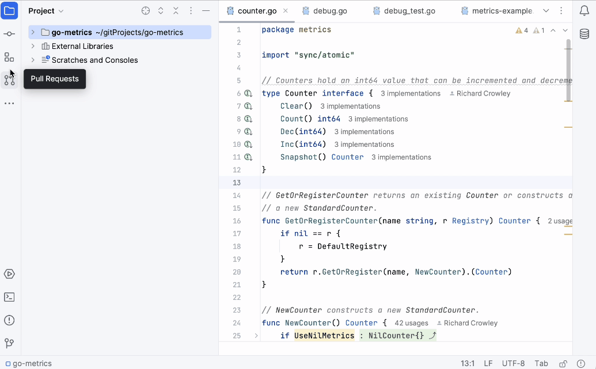

  

  

  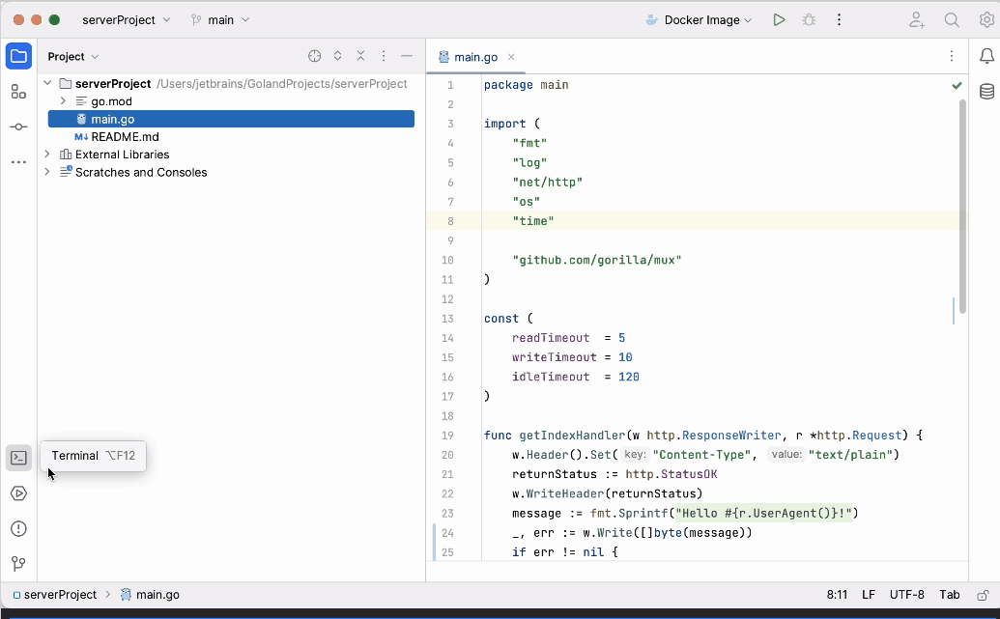

  

  

  

- "More tool windows"按钮显示尚未出现在任何工具窗口条上的工具窗口。当选择工具窗口时，它会打开，并在该工具窗口的默认条上显示其按钮。

  > ​	拖动工具窗口图标或使用上下文菜单将其移动到IDE窗口的其他位置。

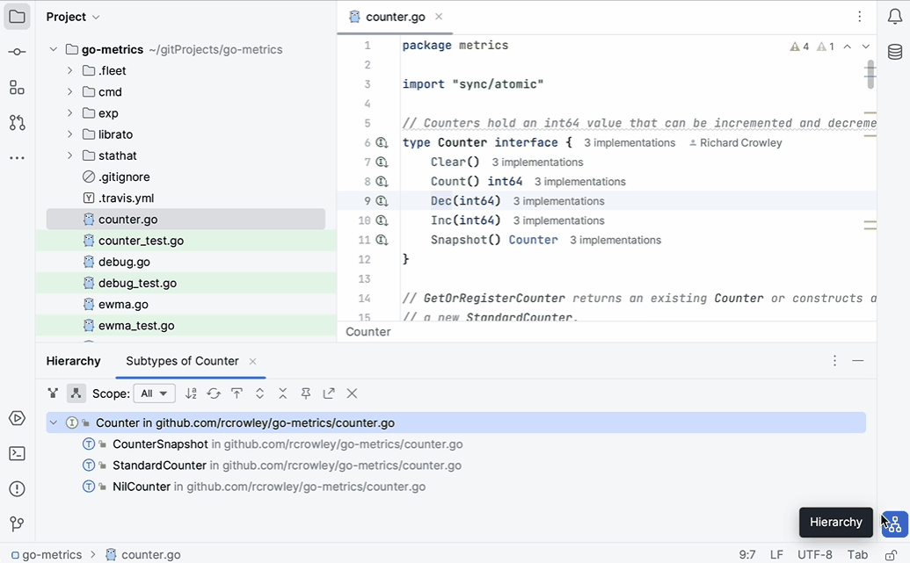

### 编辑器选项卡

- 选项卡使用更多空间和更大的字体以提高可读性。
- 现在更方便地处理多个编辑器选项卡：如果选项卡无法适应屏幕，您可以选择使用滚动条或将选项卡挤压以将它们全部放在屏幕上。转到"Settings | Editor | General | Editor Tabs | Show tabs in"并选择所需的选项。
- 编辑器选项卡的[文件颜色](https://www.jetbrains.com/help/go/configuring-scopes-and-file-colors.html#associate-file-color-with-a-scope)暂时关闭，因为我们正在改进文件颜色的呈现方式。如果需要，您可以在"Settings | Appearance & Behavior | File Colors | Use in editor tabs"中恢复以前的文件颜色设置。

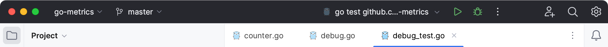

### 沟槽

- 默认情况下，断点现在放置在行号上，以节省水平空间。

  您可以将断点放置在行号附近：按下Ctrl+Shift+A，输入"Breakpoints Over Line Numbers"，然后禁用该选项。

  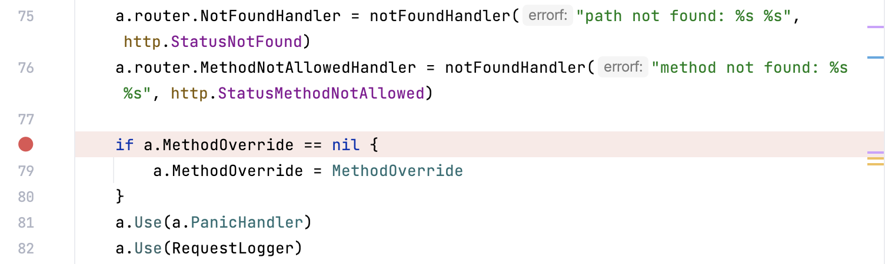

- 折叠图标已进行更新。展开区域的图标会在鼠标悬停时显示，以减少混乱感。

  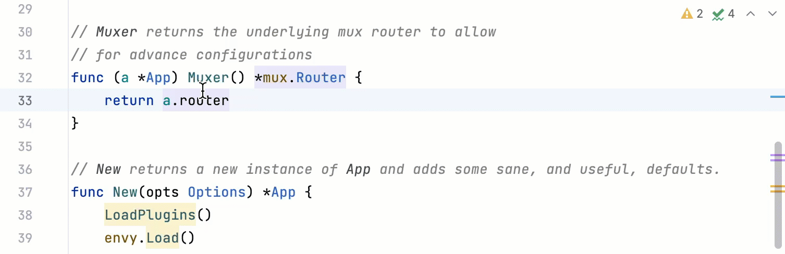

  

- 注释（Annotations） （Git Blame）具有更新的颜色方案，以帮助您更快地查看最近的更改。

  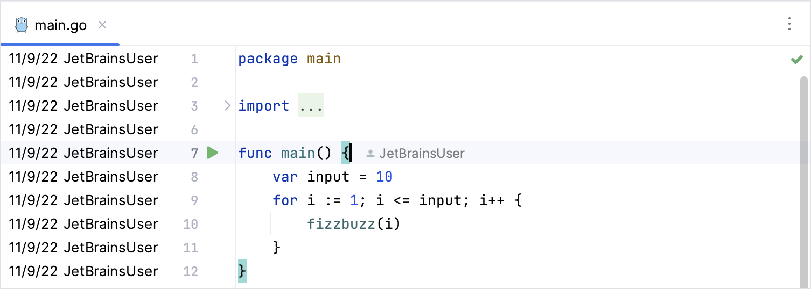

### 调试工具窗口

Two separate toolbars with the main debug actions were streamlined and moved to a single toolbar near the tool window tabs for better screen space management.

​	主要调试操作的两个单独工具栏已优化并移动到了与工具窗口选项卡相邻的单个工具栏，以更好地管理屏幕空间。

Tabs for switching between the Threads & Variables view and Console now also appear in the tool window tabs when there is a single running configuration.

​	当只有一个正在运行的配置时，切换线程和变量视图以及控制台的选项卡也会出现在工具窗口选项卡中。

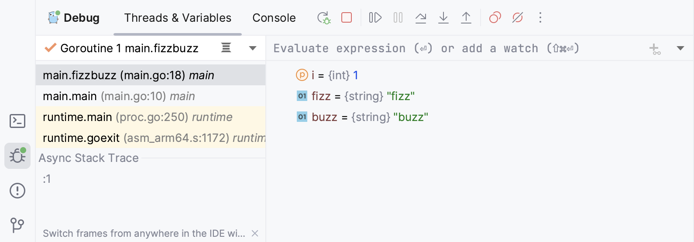

### 运行工具窗口

​	运行操作的工具栏也已移动到了工具窗口选项卡中，以与[调试工具窗口](https://www.jetbrains.com/help/go/new-ui.html#debug_tool_window)保持一致。

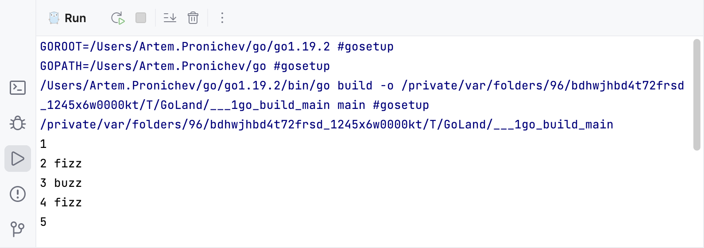

### 导航栏

​	导航栏现在位于主窗口底部的状态栏中。

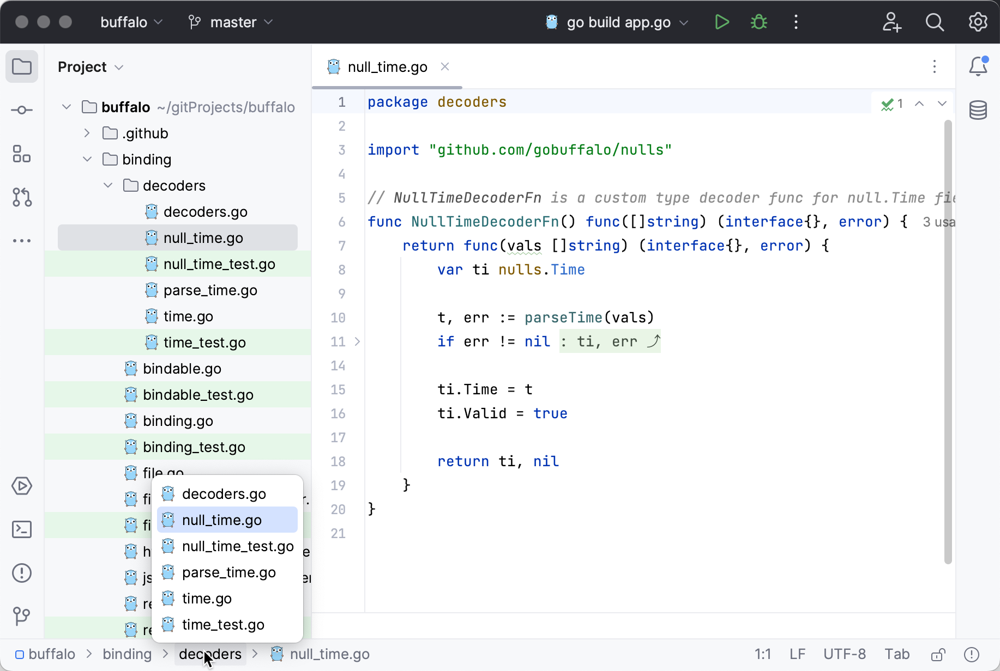

​	如果您更喜欢以前的位置，您可以将其移回顶部，甚至完全关闭它。要这样做，请转到主菜单，选择"View | Appearance | Navigation Bar"。

### 紧凑模式

​	如果您使用较小的屏幕，可以启用紧凑模式。在此模式下，IDE的工具栏和工具窗口标题的高度减小，间距和填充缩小，并且图标和按钮更小。

### 启用紧凑模式

- 从主菜单中，选择"View | Appearance | Compact Mode"。
- 按下Ctrl+Alt+S打开IDE设置，选择"Appearance and Behaviour | New UI"，并启用"Compact mode"选项。





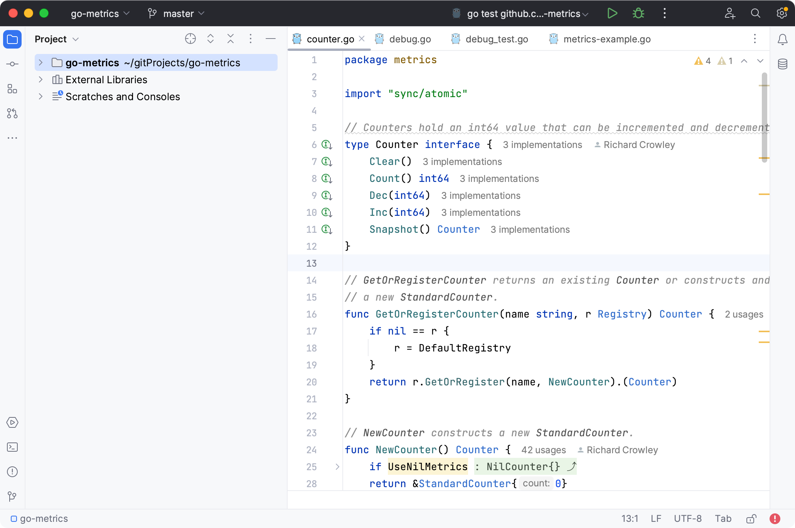





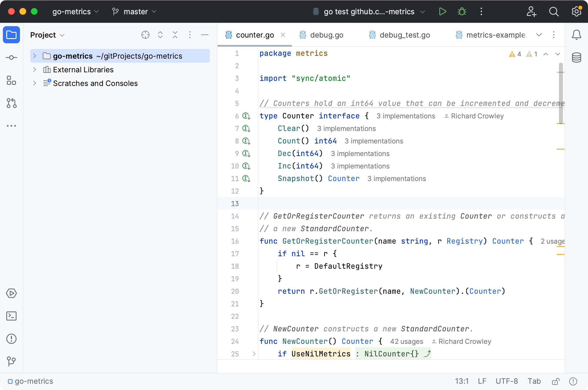





