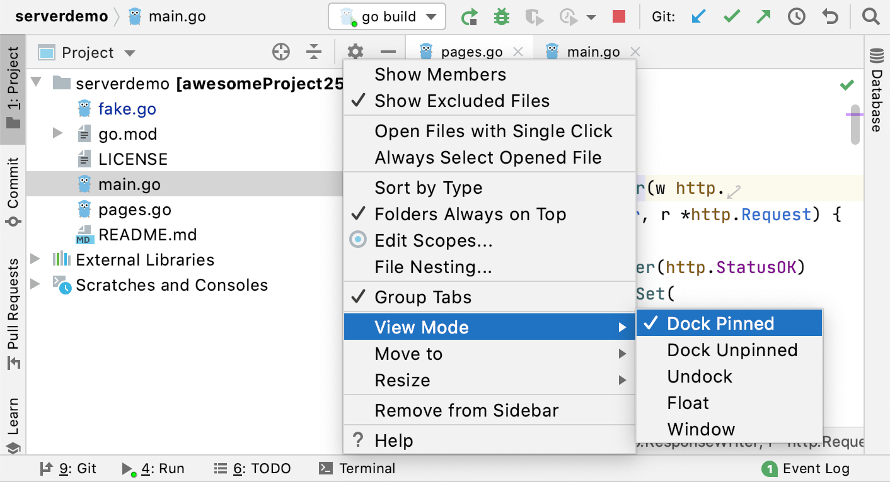
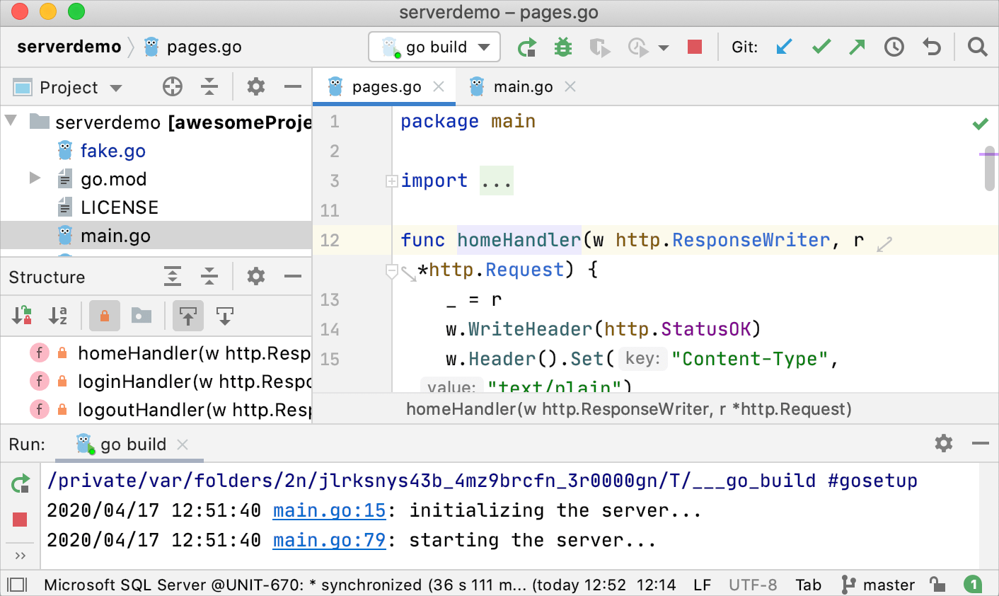
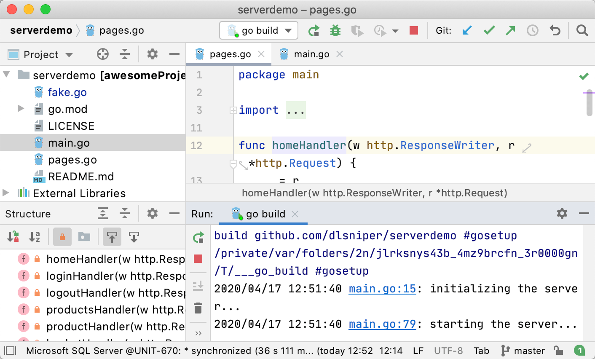
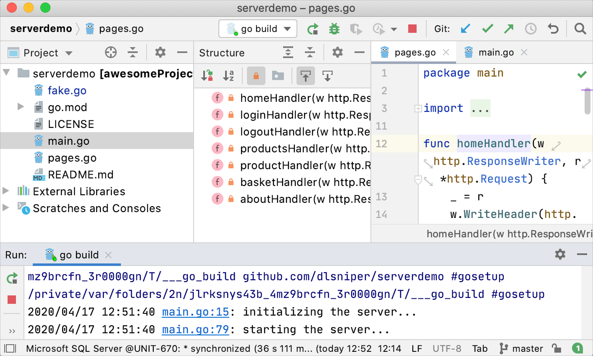

+++
title = "Arrange tool windows"
weight = 20
date = 2023-06-17T19:06:58+08:00
description = ""
isCJKLanguage = true
draft = false
+++
# Arrange tool windows - 整理工具窗口

https://www.jetbrains.com/help/go/manipulating-the-tool-windows.html#lay_out_container

Last modified: 18 April 2023

最后修改：2023年4月18日

By default, [tool windows](https://www.jetbrains.com/help/go/tool-windows.html) are attached to the edges of the main window. You can detach them to use as separate windows, as described in [Tool window view modes](https://www.jetbrains.com/help/go/viewing-modes.html).

默认情况下，[工具窗口](https://www.jetbrains.com/help/go/tool-windows.html)附加在主窗口的边缘。您可以将它们分离出来作为独立窗口使用，方法如[工具窗口查看模式](https://www.jetbrains.com/help/go/viewing-modes.html)中所述。

## 移动工具窗口 Move tool windows

1. Click and drag the tool window button on the [tool window bar](https://www.jetbrains.com/help/go/tool-windows.html#bars_and_buttons).

2. 单击并拖动[工具窗口栏](https://www.jetbrains.com/help/go/tool-windows.html#bars_and_buttons)上的工具窗口按钮。

3. Alternatively, you can click the tool window options menu 或者，您可以单击工具窗口的选项菜单 or right-click the [tool window title bar](https://www.jetbrains.com/help/go/tool-windows.html#general-tool-windows-layout) and select where to attach the tool window under Move to.，或右键单击[工具窗口标题栏](https://www.jetbrains.com/help/go/tool-windows.html#general-tool-windows-layout)，然后在“移动到”下选择要附加工具窗口的位置。

   

> You can save the current location of the tool windows and their custom sizes as a [layout](https://www.jetbrains.com/help/go/tool-window-layouts.html).
>
> 您可以将工具窗口的当前位置和自定义大小保存为[布局](https://www.jetbrains.com/help/go/tool-window-layouts.html)。

## 调整工具窗口大小 Resize tool windows

### 调整工具窗口的大小 Resize a tool window

- Click and drag the border of a tool window.
- To resize the active tool window, press Ctrl+Alt+Shift+Left,Ctrl+Alt+Shift+Right, Ctrl+Alt+Shift+Up, Ctrl+Alt+Shift+Down or use the main menu actions under Window | Active Tool Window | Resize.
- To stretch the tool window to the maximum width or height, press Ctrl+Shift+Quote or select Window | Active Tool Window | Resize | Maximize Tool Window from the main menu.
- 单击并拖动工具窗口的边框。
- 要调整活动工具窗口的大小，按Ctrl+Alt+Shift+Left，Ctrl+Alt+Shift+Right，Ctrl+Alt+Shift+Up，Ctrl+Alt+Shift+Down或使用主菜单中的"窗口 | 活动工具窗口 | 调整大小"。
- 要将工具窗口拉伸到最大宽度或高度，按Ctrl+Shift+Quote或从主菜单中选择"窗口 | 活动工具窗口 | 调整大小 | 最大化工具窗口"。

### 保存自定义工具窗口大小 Save custom tool window sizes

If you prefer to adjust the size of each tool window individually, you can configure the IDE to remember your custom layout.

如果您更喜欢单独调整每个工具窗口的大小，可以配置IDE以记住您的自定义布局。

1. Press Ctrl+Alt+S to open the IDE settings and select Appearance & Behaviour | Appearance.

2. In the Tool Windows section, select the Remember size for each tool window option.

   When this option is disabled, tool windows have the unified default width, and their sizes remain constant when you switch between them.

3. Apply the changes and close the dialog.

4. 按Ctrl+Alt+S打开IDE设置，选择"外观和行为 | 外观"。

5. 在工具窗口部分，选择"为每个工具窗口记住大小"选项。

   当禁用此选项时，工具窗口具有统一的默认宽度，并且在切换工具窗口时它们的大小保持不变。

6. 应用更改并关闭对话框。

## 优化宽屏显示器 Optimize for wide-screen monitors

GoLand provides several options to optimize the positioning of tool windows on wide-screen monitors.

GoLand提供了几个选项来优化宽屏显示器上工具窗口的位置。

1. In the Settings dialog (Ctrl+Alt+S), select Appearance & Behavior | Appearance.

2. 在设置对话框中（Ctrl+Alt+S），选择"外观和行为 | 外观"。

3. Under Tool Windows, configure the following:

4. 在工具窗口下，配置以下内容：

   - Widescreen tool window layout: Maximize the height of vertical tool windows by limiting the width of horizontal tool windows.

   - 宽屏工具窗口布局：通过限制水平工具窗口的宽度，使垂直工具窗口的高度最大化。

     

     

     

     

     

     

     

     

   - Side-by-side layout on the left and Side-by-side layout on the right: Display vertical tool windows that are attached to the top and bottom edges in two columns instead of stacked on top of each other.

   - 左侧并排布局和右侧并排布局：在顶部和底部附加的垂直工具窗口中，以两列而不是重叠的方式显示。

     

     

     

     

     

     
     
     
     
     

5. Click OK to apply the changes.

6. 点击OK应用更改。

## 将工具窗口移动到单独的框架 Move tool windows to a separate frame

You can freely drag tool window and editor tabs to a separate frame and arrange the layout you need. For example, you can have only editor on one screen and tools in a separate IDE window on the second screen.

您可以自由拖动工具窗口和编辑器选项卡到单独的框架，并排列您需要的布局。例如，您可以在一个屏幕上只有编辑器，在第二个屏幕上有一个独立的IDE窗口中的工具。

### 在单独的框架中排列工具窗口 Arrange tool windows in separate frame

- Click and drag the tool window button on the [tool window bar](https://www.jetbrains.com/help/go/tool-windows.html#bars_and_buttons) to a screen you need.

- 单击并拖动[工具窗口栏](https://www.jetbrains.com/help/go/tool-windows.html#bars_and_buttons)上的工具窗口按钮到您需要的屏幕上。

  If you have the already detached tab in a separate frame, you can drag tool window buttons and attach them to the tool window bars.
  
  如果您已经将选项卡分离到单独的框架中，您可以拖动工具窗口按钮并将其附加到工具窗口栏。