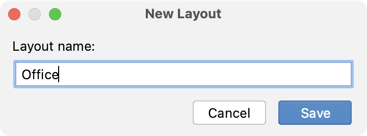
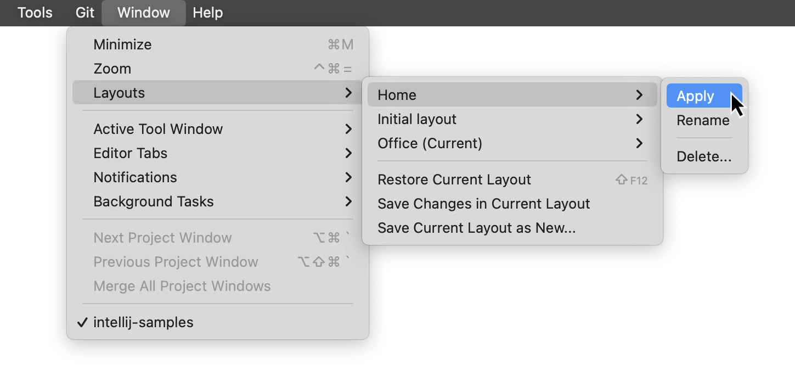

+++
title = "布局"
weight = 40
date = 2023-06-17T19:06:58+08:00
description = ""
isCJKLanguage = true
draft = false

+++
# Layouts 布局

https://www.jetbrains.com/help/go/tool-window-layouts.html#restore

Last modified: 18 April 2023

最后修改：2023年4月18日

Window | Layouts

GoLand lets you [move tool windows](https://www.jetbrains.com/help/go/manipulating-the-tool-windows.html#move-tool-windows), [change their view modes](https://www.jetbrains.com/help/go/viewing-modes.html), [resize them](https://www.jetbrains.com/help/go/manipulating-the-tool-windows.html#resize-tool-windows), and save these settings as layouts. You can have several tool window layouts and switch between them when needed.

​	GoLand允许您[移动工具窗口](https://www.jetbrains.com/help/go/manipulating-the-tool-windows.html#move-tool-windows)，[更改其视图模式](https://www.jetbrains.com/help/go/viewing-modes.html)，[调整其大小](https://www.jetbrains.com/help/go/manipulating-the-tool-windows.html#resize-tool-windows)并将这些设置保存为布局。您可以拥有多个工具窗口布局，并在需要时进行切换。

When you start working with the IDE, there is one exising `Custom` layout with factory settings. You can modify it or create new layouts for your preferred tool window arrangement.

​	当您开始使用IDE时，有一个名为`Custom`的现有布局具有出厂设置。您可以修改它或为您偏好的工具窗口排列创建新的布局。

### 保存工具窗口的排列 Save the arrangement of tool windows

Once you [move](https://www.jetbrains.com/help/go/manipulating-the-tool-windows.html#move-tool-windows), [resize](https://www.jetbrains.com/help/go/manipulating-the-tool-windows.html#resize-tool-windows) your tool windows or [change their view mode](https://www.jetbrains.com/help/go/viewing-modes.html), you can either update the currently used setup or save these changes as a new layout.

一旦您[移动](https://www.jetbrains.com/help/go/manipulating-the-tool-windows.html#move-tool-windows)、[调整大小](https://www.jetbrains.com/help/go/manipulating-the-tool-windows.html#resize-tool-windows)工具窗口或[更改其视图模式](https://www.jetbrains.com/help/go/viewing-modes.html)，您可以更新当前使用的设置，或将这些更改保存为新的布局。

1. From the main menu, select Window | Layouts.

2. 从主菜单中选择"窗口 | 布局"。

3. Select one of the following options:

4. 选择以下选项之一：

   - Save Changes in Current Layout: update your current layout.
   - 在当前布局中保存更改：更新当前布局。
   - Save Current Layout as New: save the arrangement as a new layout. Name the new layout in the dialog that opens.
   - 将当前布局另存为新布局：将排列保存为新布局。在打开的对话框中为新布局命名。

   

### 在布局之间切换 Switch between layouts

- From the main menu, select Window | Layouts, point to the required layout and select Apply.

- 从主菜单中选择"窗口 | 布局"，指向所需布局，然后选择"应用"。

  Your currently selected layout is marked with `(Current)`.

  当前选定的布局将标有"(当前)"。

  

- Use the quick switcher: press Ctrl+` (View | Quick Switch Scheme), click Layout, and select the name of the layout that you want to apply.

- 使用快速切换器：按下Ctrl+`（View | Quick Switch Scheme），单击"Layout"，然后选择要应用的布局的名称。

### 恢复工具窗口的排列 Restore the arrangement of tool windows

You can reset changes in your current layout.

您可以重置当前布局中的更改。 

- From the main menu, select Window | Layouts | Restore Current Layout or press Shift+F12.
- 从主菜单中选择"窗口 | 布局 | 恢复当前布局"或按下Shift+F12。

All recent changes will be reset to the last saved layout state.

所有最近的更改将被重置为上次保存的布局状态。

### 编辑布局 Edit a layout

- From the main menu, select Window | Layouts, point to the required layout and select Rename or Delete.

- 从主菜单中选择"窗口 | 布局"，指向所需布局，然后选择"重命名"或"删除"。

  You cannot delete your current layout.
  
  您不能删除当前布局。