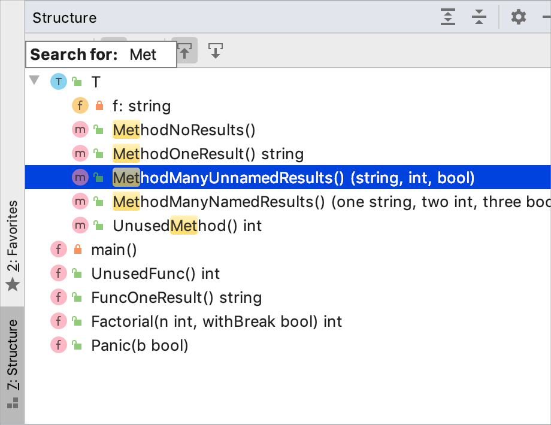

+++
title = "工具窗口中的快速搜索"
weight = 50
date = 2023-06-17T19:06:58+08:00
description = ""
isCJKLanguage = true
draft = false

+++
# Speed search in tool windows 工具窗口中的快速搜索

https://www.jetbrains.com/help/go/speed-search-in-the-tool-windows.html

Last modified: 03 May 2023

最后修改：2023年5月3日

Speed search helps you quickly find an item in a tool window: a file or a folder in the Project tool window, a member in the Structure tool window, a changelist in the Commit tool window Alt+0, an item in the TODO list, and so on.

快速搜索帮助您快速在工具窗口中查找项目：在项目工具窗口中查找文件或文件夹，在结构工具窗口中查找成员，在提交工具窗口中查找变更列表（Alt+0），在TODO列表中查找项目等等。

1. Select a tool window, a tree, a list, or a popup.

2. Start typing the item name, for example, the name of a file, class, or field. As you type, a field appears over the tool window showing the entered characters, and the selection moves to the first item that matches the specified string. The matching part of the string is highlighted.

3. 选择一个工具窗口、树形结构、列表或弹出窗口。

4. 开始输入项目名称，例如文件、类或字段的名称。当您输入时，工具窗口上方会显示一个字段，显示已输入的字符，并且选择将移动到与指定字符串匹配的第一项。字符串的匹配部分会被突出显示。

   

5. If several items match the pattern, use the Up and Down keys to move between them. Press Enter to open the selected item. Press Escape to hide the search field.

6. 如果有多个项与模式匹配，请使用向上和向下箭头键在它们之间移动。按Enter键打开所选项。按Esc键隐藏搜索字段。

> Speed search works only for expanded nodes. It will not highlight matching items in collapsed nodes.
>
> 快速搜索仅适用于展开的节点。它不会突出显示折叠节点中的匹配项。