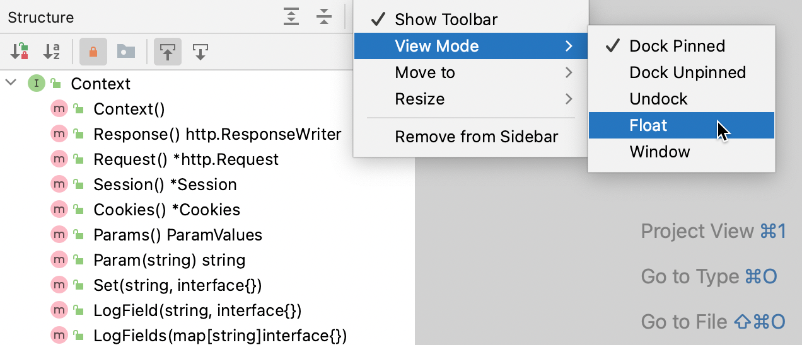

+++
title = "Tool window view modes"
weight = 30
date = 2023-06-17T19:06:58+08:00
description = ""
isCJKLanguage = true
draft = false
+++
# Tool window view modes - 工具窗口视图模式

https://www.jetbrains.com/help/go/viewing-modes.html

Last modified: 11 January 2023

最后修改：2023年1月11日

Window | Active Tool Window | View Mode

By default, tool windows are attached to the edges of the main window and are always visible. You can change the view mode of a specific tool window, for example, to make it visible only when active or to detach it from the tool window bar.

默认情况下，工具窗口附加在主窗口的边缘，并始终可见。您可以更改特定工具窗口的视图模式，例如，使其仅在活动时可见，或将其从工具窗口栏中分离出来。

### 更改工具窗口的视图模式 Change the view mode of a tool window

- From the main menu, select Window | Active Tool Window | View Mode and then choose the view mode.

- 从主菜单中选择"窗口 | 活动工具窗口 | 视图模式"，然后选择视图模式。

- Alternatively, on the [title bar](https://www.jetbrains.com/help/go/tool-windows.html#general-tool-windows-layout) of a tool window, click 或者，在工具窗口的[标题栏](https://www.jetbrains.com/help/go/tool-windows.html#general-tool-windows-layout)上，单击, select View Mode and then choose the view mode. ，选择"视图模式"，然后选择视图模式。

  

The following tool window view modes are available:

以下工具窗口视图模式可用：

- Dock Pinned: This is the default view mode when the tool window is attached to the tool window bar and is always visible along with the editor and other pinned tool windows.

- 固定停靠：当工具窗口附加到工具窗口栏时，默认视图模式，始终与编辑器和其他固定的工具窗口一起可见。

  

  

  

  

  

  

- Dock Unpinned: The tool window is attached to the tool window bar but is visible only when it is active. It does not obstruct the editor or other tool windows when it loses focus.

- 非固定停靠：工具窗口附加到工具窗口栏，但仅在活动时可见。当失去焦点时，它不会遮挡编辑器或其他工具窗口。

  

  

  

  

  

- Undock: The tool window is attached to the tool window bar and covers a part of the editor or other tool windows when active. It is not visible when another tool window is active.

- 取消停靠：工具窗口附加到工具窗口栏，当活动时会覆盖部分编辑器或其他工具窗口。当另一个工具窗口处于活动状态时，它不可见。

  

  

  

  

  

- Float: The tool window is detached from the tool window bar, floating on top of the main window. It is visible only together with the main project window. You can move it to a different monitor or desktop if necessary.

- 浮动：工具窗口从工具窗口栏中分离，浮动在主窗口之上。它仅与主项目窗口一起可见。如果需要，您可以将其移动到不同的监视器或桌面。

  

  

  

  

- Window: The tool window acts as a separate application window. You can view it independently of the main project window and move it to a different monitor or desktop.

- 窗口：工具窗口充当独立的应用程序窗口。您可以独立于主项目窗口查看它，并将其移动到不同的监视器或桌面。

  

  

  

