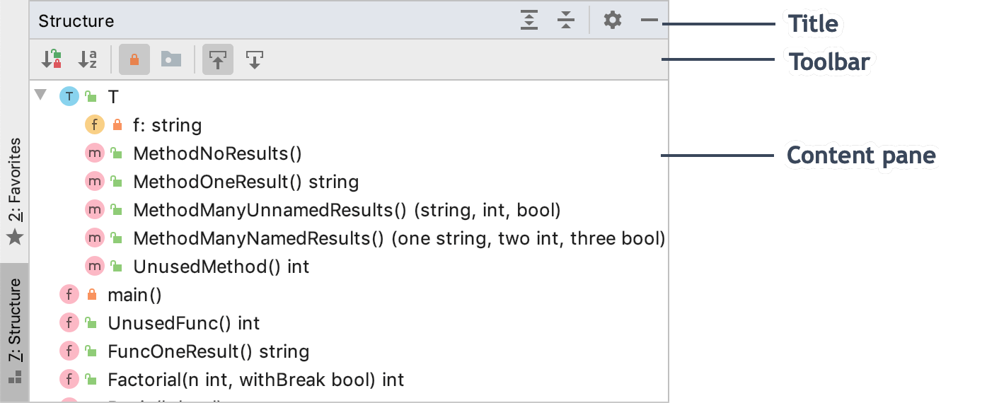

+++
title = "Tool windows"
weight = 20
date = 2023-06-17T19:06:58+08:00
description = ""
isCJKLanguage = true
draft = false
+++
# Tool windows - 工具窗口

https://www.jetbrains.com/help/go/tool-windows.html#general-tool-windows-layout

Last modified: 15 November 2022

最后修改日期：2022年11月15日

View | Tool Windows

Tool windows provide access to development tasks: viewing your project structure, running and debugging your application, integration with version control systems and other external tools, code analysis, search, navigation, and so on. By default, tool windows are attached to the bottom and sides of the main window. However, you can rearrange and even detach them to use as separate windows, for example, on another monitor.

工具窗口提供对开发任务的访问：查看项目结构、运行和调试应用程序、与版本控制系统和其他外部工具集成、代码分析、搜索、导航等等。默认情况下，工具窗口附加在主窗口的底部和侧边。但是，您可以重新排列甚至将其分离为独立的窗口，例如在另一个监视器上使用。

1. Project tool window
2. Structure tool window
3. Run tool window
4. Database tool window
5. 项目工具窗口
6. 结构工具窗口
7. 运行工具窗口
8. 数据库工具窗口

Some tool windows are always available some are activated when a specific plugin is enabled, and some appear only when you perform a certain action (for example, Run, Debug, and Find).

某些工具窗口始终可用，某些在特定插件启用时激活，某些仅在执行特定操作时出现（例如运行、调试和查找）。

### 打开工具窗口 Open a tool window

To show or hide a tool window, do one of the following:

要显示或隐藏工具窗口，请执行以下操作之一：

- From the main menu, select a tool window under View | Tool Windows.

- Use the corresponding shortcut, for example, Alt+1 to open the Project tool window. If there is no shortcut for a tool window, you can assign it as described in [Keyboard shortcuts](https://www.jetbrains.com/help/go/configuring-keyboard-and-mouse-shortcuts.html).

- Click the corresponding tool window button on the [tool window bar](https://www.jetbrains.com/help/go/tool-windows.html#bars_and_buttons).

- 从主菜单中，选择"视图 | 工具窗口"下的工具窗口。

- 使用相应的快捷键，例如Alt+1打开项目工具窗口。如果没有工具窗口的快捷键，您可以按照[键盘快捷键](https://www.jetbrains.com/help/go/configuring-keyboard-and-mouse-shortcuts.html)中的说明分配快捷键。

- 单击[工具窗口栏](https://www.jetbrains.com/help/go/tool-windows.html#bars_and_buttons)上的相应工具窗口按钮。

  

- Hover the mouse pointer over the quick access button 将鼠标指针悬停在主窗口左下角的快速访问按钮 /  in the lower left corner of the main window and select a tool window.上，并选择一个工具窗口。

  

### 隐藏当前活动的工具窗口 Hide the active tool window

- Press Shift+Escape or select Window | Active Tool Window | Hide Active Tool Window from the main menu.

- 按下Shift+Escape或从主菜单中选择"窗口 | 当前工具窗口 | 隐藏当前工具窗口"。

  To show the hidden tool window, use the shortcut assigned to it (go to View | Tool Windows to see the full list of tool windows with shortcuts).
  
  要显示隐藏的工具窗口，请使用分配给它的快捷键（转到"视图 | 工具窗口"以查看带有快捷键的工具窗口的完整列表）。

To focus your attention on the editor, you can hide all tool windows and then when necessary, quickly restore all windows that were open when you've hidden them.

为了将注意力集中在编辑器上，您可以隐藏所有工具窗口，然后在需要时快速恢复所有已隐藏的窗口。

### 隐藏或恢复所有工具窗口 Hide or restore all tool windows

- Press Ctrl+Shift+F12.
- 按下Ctrl+Shift+F12。
- Double-click the editor tab that you want to maximize. This will only work if Perform 'Hide All Tool Windows' / 'Restore Windows' with double-click on editor tab is enabled on the Advanced Settings page of the IDE settings Ctrl+Alt+S.
- 双击要最大化的编辑器选项卡。只有在IDE设置（Ctrl+Alt+S）的"高级设置"页面上启用了"使用双击编辑器选项卡执行'隐藏所有工具窗口'/'恢复窗口'"选项时，此功能才可用。
- Select Window | Active Tool Window | Hide All Windows/Restore Windows from the main menu.
- 从主菜单中选择"窗口 | 当前工具窗口 | 隐藏所有窗口/恢复窗口"。

### 在编辑器和工具窗口之间导航 Navigate between the editor and a tool window

- To change focus from a tool window to the last caret location in the editor, press Escape.
- If you selected a code item in a tool window, for example, a search result, [a code issue](https://www.jetbrains.com/help/go/problems-tool-window.html), or [a bookmark](https://www.jetbrains.com/help/go/bookmarks.html), press F4 to open the corresponding file and locate this item in the editor.
- To change focus from the editor back to the last active tool window, press F12 or select Window | Active Tool Window | Jump to Last Tool Window from the main menu.
- 要从工具窗口切换焦点到编辑器中的上一个光标位置，请按Escape。
- 如果在工具窗口中选择了一个代码项，例如搜索结果、[代码问题](https://www.jetbrains.com/help/go/problems-tool-window.html)或[书签](https://www.jetbrains.com/help/go/bookmarks.html)，请按F4打开对应的文件并在编辑器中定位该项。
- 要从编辑器切换焦点回到上一个活动的工具窗口，请按F12或从主菜单中选择"窗口 | 当前工具窗口 | 跳转到上一个工具窗口"。

## 工具窗口栏和按钮 Tool window bars and buttons

Tool window bars on the edges of the main window contain buttons to show and hide tool windows. Right-click a tool window button to open its context menu, where you can change the viewing mode and move the tool window. You can also drag tool window buttons to rearrange tool windows on the bars.

主窗口边缘的工具窗口栏包含显示和隐藏工具窗口的按钮。右键单击工具窗口按钮可打开其上下文菜单，您可以在其中更改查看模式和移动工具窗口。您还可以拖动工具窗口按钮以重新排列工具窗口在栏中的位置。

### 显示或隐藏工具窗口栏 Show or hide tool window bars

- Click the quick access button  单击主窗口左下角的快速访问按钮 in the lower left corner of the main window to hide the tool window bars. The button changes to 以隐藏工具窗口栏。按钮会变为 and you can click it to show the tool window bars.，您可以单击它以显示工具窗口栏。
- Alternatively, select or clear Tool Window Bars from the main menu under View | Appearance.
- 或者，从主菜单中选择"视图 | 外观"下的"工具窗口栏"选项。

When the tool window bars are hidden, you can double-press and hold Alt to show hidden tool window bars.

当工具窗口栏被隐藏时，您可以双击并按住Alt键以显示隐藏的工具窗口栏。

## 工具窗口组件 Tool window components

Generally, all tool windows have a title bar, a toolbar, and a content pane.

通常，所有工具窗口都有标题栏、工具栏和内容窗格。

Some tool windows are also separated using tabs or a dropdown selector in the title bar, based on the functionality that it covers. Select Window | Active Tool Window | Group Tabs to show tabs. Disable this option to show a dropdown menu.

某些工具窗口还使用选项卡或标题栏中的下拉选择器进行分隔，根据其涵盖的功能。选择"窗口 | 当前工具窗口 | 分组选项卡"以显示选项卡。取消此选项以显示下拉菜单。

The title bar contains the tool window options menu 标题栏包含工具窗口选项菜单 for changing the viewing mode and the position of the tool window. You can also access these options by right-clicking the title bar or the tool window button. Some tool windows can have other options in this menu, depending on the functionality (for example, to sort, filter, and group items listed in a tool window).，用于更改查看模式和工具窗口的位置。您还可以通过右键单击标题栏或工具窗口按钮来访问这些选项。某些工具窗口的此菜单中可能还有其他选项，具体取决于功能（例如，对于在工具窗口中列出的项进行排序、筛选和分组)。

Click 单击 to hide the tool window and use other buttons that may be on the title bar, for example:以隐藏工具窗口，并使用标题栏上可能存在的其他按钮，例如：

 

- and 和 to expand and collapse the contents of the tool window 用于展开和折叠工具窗口的内容
-  to locate and select the file from the editor in the tool window 以在工具窗口中查找和选择编辑器中的文件

Actions from the tool window toolbar are usually also available in the main menu and context menus. Some of them can also be executed with a default shortcut. You can assign shortcuts for actions as described in [Keyboard shortcuts](https://www.jetbrains.com/help/go/configuring-keyboard-and-mouse-shortcuts.html).

工具窗口工具栏上的操作通常也可以在主菜单和上下文菜单中使用。其中一些操作也可以使用默认快捷键执行。您可以根据[键盘快捷键](https://www.jetbrains.com/help/go/configuring-keyboard-and-mouse-shortcuts.html)中的说明为操作分配快捷键。

For all tool windows that display tree-like structures (for example, Project tool window) you can display vertical lines that mark indent levels in tree views and help you better understand the hierarchy of the components in your project. To display these lines, enable Show tree indent guides on the Appearance and Behavior | Appearance page of the IDE settings Ctrl+Alt+S.

对于显示树形结构的所有工具窗口（例如，项目工具窗口），您可以显示标记树视图中缩进级别的垂直线，以更好地了解项目中组件的层次结构。要显示这些线条，请在IDE设置（Ctrl+Alt+S）的"外观和行为 | 外观"页面上启用"显示树缩进指南"选项。

You can use the following shortcuts to manage GoLand's tool windows:

您可以使用以下快捷键管理GoLand的工具窗口：

|                                                              |                      |
| ------------------------------------------------------------ | -------------------- |
| Hide Active Tool Window                                      | Shift+Escape         |
| Hide All Tool Windows                                        | Ctrl+Shift+F12       |
| Jump to Last Tool Window                                     | F12                  |
| [Stretch to Left](https://www.jetbrains.com/help/go/manipulating-the-tool-windows.html) | Ctrl+Alt+Shift+Left  |
| [Stretch to Right](https://www.jetbrains.com/help/go/manipulating-the-tool-windows.html) | Ctrl+Alt+Shift+Right |
| [Stretch to Top](https://www.jetbrains.com/help/go/manipulating-the-tool-windows.html) | Ctrl+Alt+Shift+Up    |
| [Stretch to Bottom](https://www.jetbrains.com/help/go/manipulating-the-tool-windows.html) | Ctrl+Alt+Shift+Down  |
| [Show Project window](https://www.jetbrains.com/help/go/project-tool-window.html) | Alt+1                |
| [Show Bookmarks window](https://www.jetbrains.com/help/go/bookmarks.html) | Alt+2                |
| [Show Find window](https://www.jetbrains.com/help/go/find-tool-window.html) | Alt+3                |
| [Show Run window](https://www.jetbrains.com/help/go/run-tool-window.html) | Alt+4                |
| [Show Debug window](https://www.jetbrains.com/help/go/debug-tool-window.html) | Alt+5                |
| [Show Problems window](https://www.jetbrains.com/help/go/problems-tool-window.html) | Alt+6                |
| [Show Structure window](https://www.jetbrains.com/help/go/viewing-structure-of-a-source-file.html) | Alt+7                |
| [Show Services window](https://www.jetbrains.com/help/go/services-tool-window.html) | Alt+8                |
| [Show Version Control window](https://www.jetbrains.com/help/go/version-control-integration.html) | Alt+9                |
| [Show Commit window](https://www.jetbrains.com/help/go/commit-and-push-changes.html) | Alt+0                |
| Show Terminal window                                         | Alt+F12              |

|                                                              |                      |
| ------------------------------------------------------------ | -------------------- |
| 隐藏当前工具窗口                                             | Shift+Escape         |
| 隐藏所有工具窗口                                             | Ctrl+Shift+F12       |
| 跳转到上一个工具窗口                                         | F12                  |
| [向左拉伸](https://www.jetbrains.com/help/go/manipulating-the-tool-windows.html) | Ctrl+Alt+Shift+Left  |
| [向右拉伸](https://www.jetbrains.com/help/go/manipulating-the-tool-windows.html) | Ctrl+Alt+Shift+Right |
| [向上拉伸](https://www.jetbrains.com/help/go/manipulating-the-tool-windows.html) | Ctrl+Alt+Shift+Up    |
| [向下拉伸](https://www.jetbrains.com/help/go/manipulating-the-tool-windows.html) | Ctrl+Alt+Shift+Down  |
| [显示项目窗口](https://www.jetbrains.com/help/go/project-tool-window.html) | Alt+1                |
| [显示书签窗口](https://www.jetbrains.com/help/go/bookmarks.html) | Alt+2                |
| [显示查找窗口](https://www.jetbrains.com/help/go/find-tool-window.html) | Alt+3                |
| [显示运行窗口](https://www.jetbrains.com/help/go/run-tool-window.html) | Alt+4                |
| [显示调试窗口](https://www.jetbrains.com/help/go/debug-tool-window.html) | Alt+5                |
| [显示版本控制窗口](https://www.jetbrains.com/help/go/version-control-tool-window.html) | Alt+9                |
| [显示终端窗口](https://www.jetbrains.com/help/go/terminal-tool-window.html) | Alt+F12              |

这些快捷键适用于Windows和Linux操作系统。在macOS上，将所有Alt键组合替换为Option键。