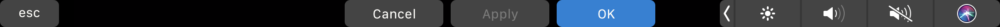

+++
title = "Touch bar support"
weight = 70
date = 2023-06-17T19:06:58+08:00
description = ""
isCJKLanguage = true
draft = false
+++
# Touch bar support

https://www.jetbrains.com/help/go/touch-bar-support.html

Last modified: 20 May 2022

The Touch Bar is located above the keyboard on supported Apple MacBook Pro models. It provides additional controls for quick access based on the current context.

The Control Strip in the right part of the Touch Bar includes controls for system-level tasks that are usually accessed with function keys on classic keyboards. The app region to the left of the Control Strip contains controls that are specific to GoLand and the current context. One more system button is located in the left part of the Touch Bar; this is usually the Escape key, but it can be something else depending on the context.

GoLand provides the following contexts:

- Default context is used most of the time.

  It includes controls for running, building, and debugging the application with the ability to quickly select or create a new [run/debug configuration](https://www.jetbrains.com/help/go/run-debug-configuration.html). It also provides VCS controls for updating your project and committing changes, which can be replaced in some contexts .

  For more controls, you can use modifier keys: Ctrl, Alt, Shift, and ⌥+⌘.

- Debugger context is used when focus is on the [Debug window](https://www.jetbrains.com/help/go/debug-tool-window.html).

  It includes controls to stop, pause, resume the debugger, as well as stepping and evaluating expressions.

  

  For more controls, hold down the Alt key.

- When focus is on a dialog, confirmation controls are displayed (for example, Cancel, Apply, OK, or other relevant buttons).

  

- When you start typing inside a popup with a list of actions, the actions are filtered according to what you type (for example, in the Project tool window, when you press Alt+Insert, you can filter the types of files you would like to create). When the popup is active, the touch bar contains the same list of items, and it is filtered accordingly as you type.

### Customize the Touch Bar

You can configure the controls displayed on the Touch Bar in the default and debugger context.

1. In the Settings dialog (Ctrl+Alt+S), go to Appearance & Behavior | Menus and Toolbars.

2. Expand the Touch Bar node and configure the controls for corresponding contexts and modifier keys.

   > ### 
   >
   > 
   >
   > The Touch Bar node is available only if you are using an Apple MacBook Pro with the Touch Bar.

3. Apply changes when finished.

To show the function keys (F1, F2, and so on) on the Touch Bar, hold down the Fn key. You can also make function keys display permanently for selected applications, as described in the following [Apple support article](https://support.apple.com/en-us/HT207240).

GoLand provides an option to always show function keys without the need to change system settings:

1. In the Settings dialog (Ctrl+Alt+S), go to Keymap.
2. Select Show F1, F2, etc. keys on the Touch Bar at the bottom.