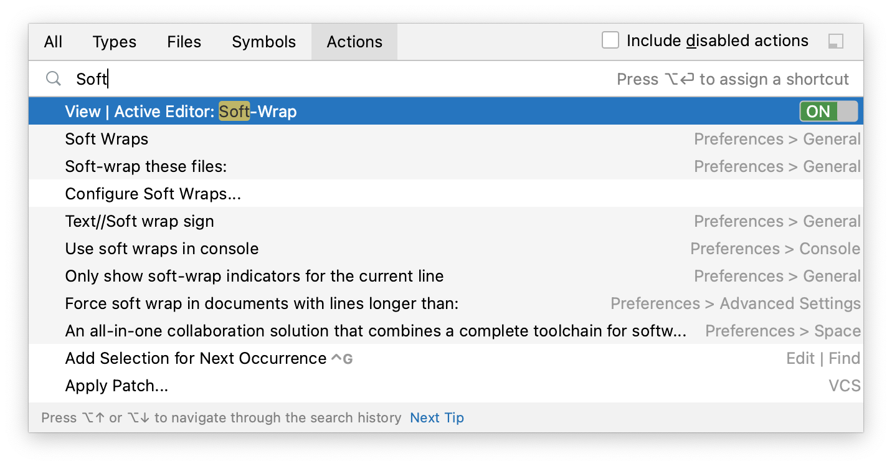

+++
title = "Keyboard shortcuts"
weight = 30
date = 2023-06-17T19:06:58+08:00
description = ""
isCJKLanguage = true
draft = false
+++
# Keyboard shortcuts

https://www.jetbrains.com/help/go/mastering-keyboard-shortcuts.html#advanced-features

Last modified: 27 April 2023

Printable version of shortcuts in PDF: [default keymap reference card (57 KB)](https://resources.jetbrains.com/storage/products/goland/docs/GoLand_ReferenceCard.pdf)

Keymap configuration: open the Settings dialog Ctrl+Alt+S and select Keymap

GoLand has keyboard shortcuts for most of its commands related to editing, navigation, refactoring, debugging, and other tasks. Memorizing these hotkeys can help you stay more productive by keeping your hands on the keyboard. All default shortcuts are [configurable](https://www.jetbrains.com/help/go/configuring-keyboard-and-mouse-shortcuts.html) and you can also assign shortcuts to any action that does not have them by default.

> If your keyboard does not have an English layout, GoLand may not detect all the shortcuts correctly.

The following table lists some of the most useful shortcuts to learn:

| Shortcut           | Action                                                       |
| ------------------ | ------------------------------------------------------------ |
| Double Shift       | [Search Everywhere](https://www.jetbrains.com/help/go/searching-everywhere.html)Quickly find any file, action, type, symbol, tool window, or setting in GoLand, in your project, and in the current Git repository. |
| Ctrl+Shift+A       | [Find Action](https://www.jetbrains.com/help/go/searching-everywhere.html#find_action)Find a command and execute it, open a tool window, or search for a setting. |
| Alt+Enter          | [Show Context Actions](https://www.jetbrains.com/help/go/intention-actions.html)Quick-fixes for highlighted errors and warnings, intention actions for improving and optimizing your code. |
| F2Shift+F2         | [Navigate between code issues](https://www.jetbrains.com/help/go/navigating-through-the-source-code.html#navigate-errors-warnings)Jump to the next or previous highlighted error. |
| Ctrl+E             | [View recent files](https://www.jetbrains.com/help/go/navigating-through-the-source-code.html#recent_files)Select a recently opened file from the list. |
| Ctrl+WCtrl+Shift+W | [Extend or shrink selection](https://www.jetbrains.com/help/go/working-with-source-code.html)Increase or decrease the scope of selection according to specific code constructs. |
| Ctrl+/Ctrl+Shift+/ | [Add/remove line or block comment](https://www.jetbrains.com/help/go/working-with-source-code.html#editor_lines_code_blocks)Comment out a line or block of code. |
| Alt+F7             | [Find Usages](https://www.jetbrains.com/help/go/find-highlight-usages.html#find-usages)Show all places where a code element is used across your project.When you press (Alt+F7), GoLand looks for usages of interface methods. To find usages of the current method, press Ctrl+Alt+Shift+F7. |

## Choose the right keymap

To view the keymap configuration, open the Settings dialog Ctrl+Alt+S and select Keymap.

> Enable function keys and check for [possible conflicts](https://www.jetbrains.com/help/go/configuring-keyboard-and-mouse-shortcuts.html#conflicts) with global OS shortcuts.

### Use a predefined keymap

GoLand automatically suggests a predefined keymap based on your environment. Make sure that it matches the OS you are using or select the one that matches shortcuts from another IDE or editor you are used to (for example, Emacs or Sublime).

When consulting this page and other pages in GoLand documentation, you can see keyboard shortcuts for the keymap that you use in the IDE — choose it using the selector at the top of a page.

### Install a keymap from a plugin

Besides the default set of keymaps, you can install keymaps from plugins (such as, keymaps for GNOME and KDE): open the Settings dialog Ctrl+Alt+S, select Plugins, switch to the Marketplace tab and search for keymap.

### Tune your keymap

You can modify a copy of any predefined keymap to [assign your own shortcuts](https://www.jetbrains.com/help/go/configuring-keyboard-and-mouse-shortcuts.html#add-keyboard-shortcut) for commands that you use frequently.

### Import custom keymap

If you have a customized keymap that you are used to, you can [transfer it to your installation](https://www.jetbrains.com/help/go/configuring-keyboard-and-mouse-shortcuts.html#custom_keymap_location).

> If your keymap stopped working after an update, it is likely that the keymap is not available by default in the new version of GoLand. Find this keymap as a plugin and install it on the [Plugins page](https://www.jetbrains.com/help/go/plugins-settings.html) as described in[Plugins](https://www.jetbrains.com/help/go/managing-plugins.html).

## Learn shortcuts as you work

GoLand provides several possibilities to learn shortcuts:

- [Find Action](https://www.jetbrains.com/help/go/searching-everywhere.html) lets you search for commands and settings across all menus and tools.

  Press Ctrl+Shift+A and start typing to get a list of suggested actions. Then select the necessary action and press Enter to execute it.

  

  > To add or change the shortcut for any action, press Alt+Enter when it is selected in the list.

- [Key Promoter X](https://plugins.jetbrains.com/plugin/9792-key-promoter-x) is a plugin that shows a popup notification with the corresponding keyboard shortcut whenever a command is executed using the mouse. It also suggests creating a shortcut for commands that are executed frequently.

- If you are using one of the predefined keymaps, you can print the [default keymap reference card](https://resources.jetbrains.com/storage/products/goland/docs/GoLand_ReferenceCard.pdf) and keep it on your desk to consult it if necessary. This cheat sheet is also available under Help | Keyboard Shortcuts PDF.

- To print a non-default or customized keymap, use the [Keymap exporter plugin](https://plugins.jetbrains.com/plugin/7066-keymap-exporter).

## Use advanced features

You can further improve your productivity with the following useful features:

