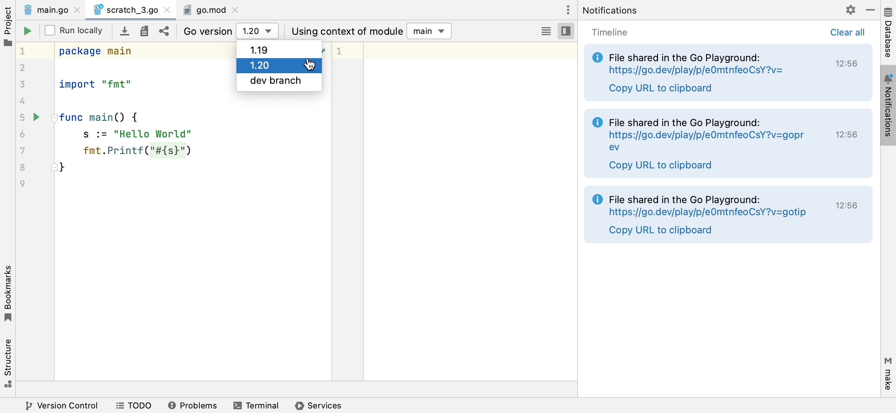
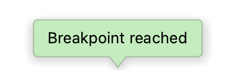
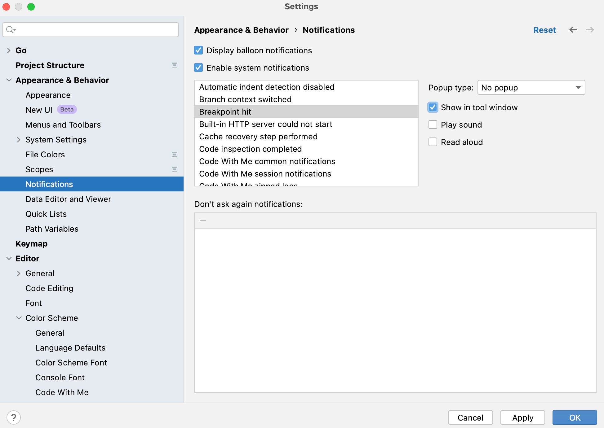
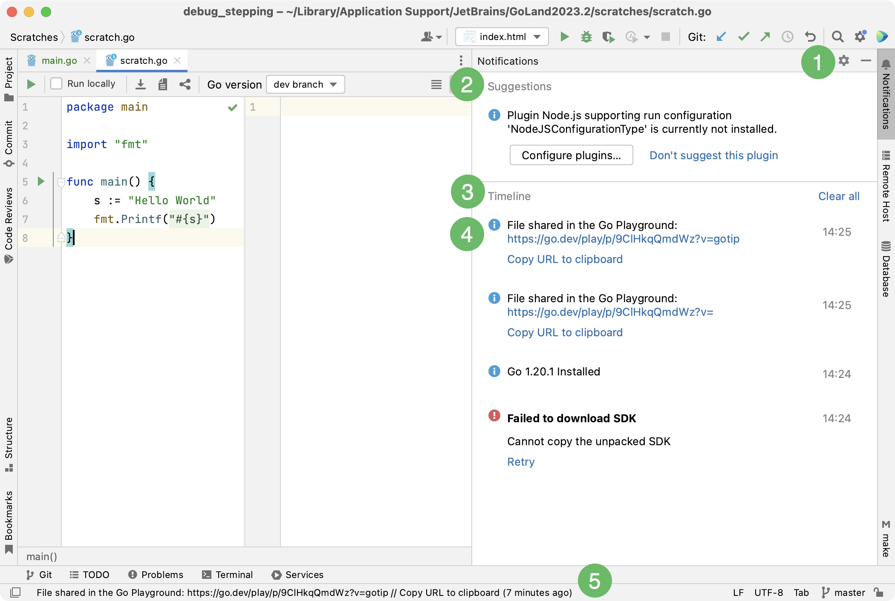
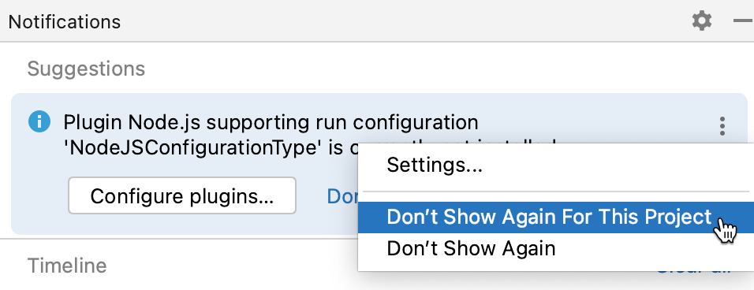
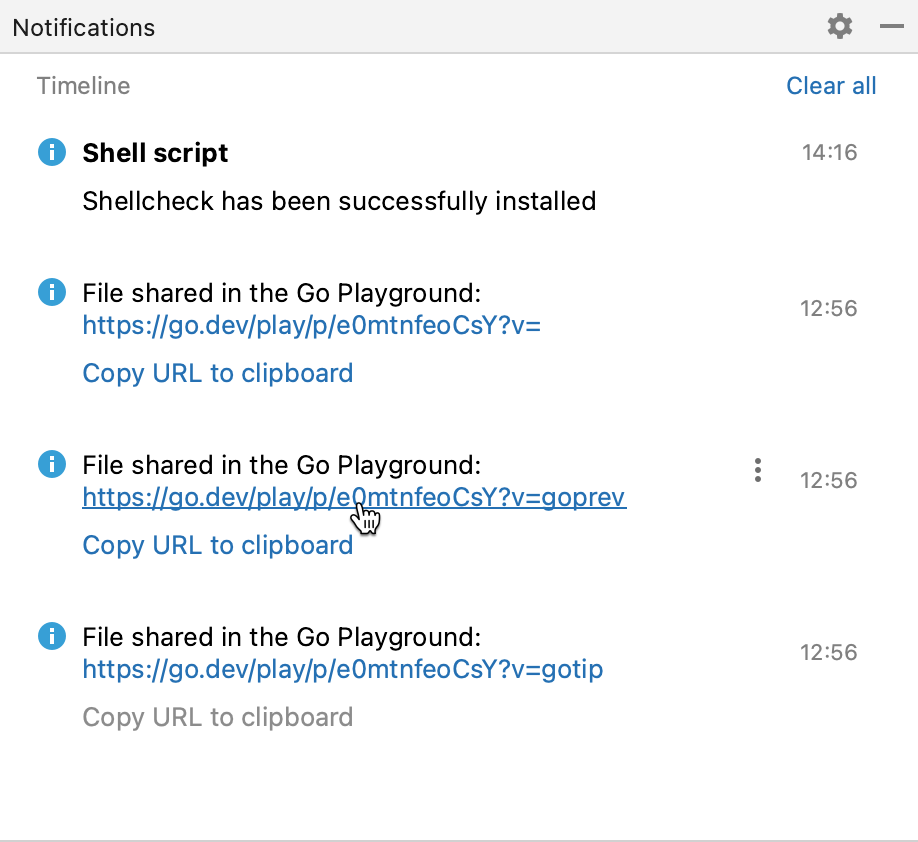

+++
title = "通知"
weight = 30
date = 2023-06-17T19:06:58+08:00
description = ""
isCJKLanguage = true
draft = false

+++
# Notifications - 通知

https://www.jetbrains.com/help/go/notifications.html#notifications_tool_window

Last modified: 23 February 2023

最后修改日期：2023年2月23日

通知工具窗口栏

View | Tool Windows | Notifications

Whenever there is an important event or a suggestion in the IDE, you will see a notification balloon that pops up in the bottom right corner of GoLand. You can also access all notifications and events in the [Notifications](https://www.jetbrains.com/help/go/notifications.html#notifications_tool_window) tool window.

每当在IDE中出现重要事件或建议时，您将在GoLand的右下角看到一个弹出通知气球。您还可以在[通知](https://www.jetbrains.com/help/go/notifications.html#notifications_tool_window)工具窗口中查看所有通知和事件。

GoLand allows you to configure notification settings for every group of events individually. For example, you can disable all VCS notifications or enable sound notifications to inform you that your application has been built.

GoLand允许您针对每个事件组单独配置通知设置。例如，您可以禁用所有版本控制系统（VCS）通知，或启用声音通知以告知您的应用程序已构建完成。

### 配置每个事件组的通知 Configure notifications per event group

1. Press Ctrl+Alt+S to open the IDE settings and select Appearance & Behavior | Notifications.

2. 按下Ctrl+Alt+S打开IDE设置，选择外观与行为 | 通知。

   To quickly navigate to the settings from the notification, click 要从通知中快速导航到设置，请点击 or click the  或点击 icon and select Settings. 图标，然后选择设置。

3. Select the event group for which you want to configure notification settings.

4. 选择要配置通知设置的事件组。

5. From the Popup type list, select one of the following options for balloon notifications:

6. 在弹出类型列表中，为气球通知选择以下选项之一：

   - Balloon: notification balloons appear on the screen for a short period of time and then disappear automatically.

   - 气球：通知气球会在屏幕上短暂显示，然后自动消失。

   - Tool window balloon: notifications appear in popups. This type of notifications is available only for those event groups for which there is a corresponding tool window.

   - 工具窗口气球：通知以弹出窗口的形式显示。这种类型的通知仅适用于具有相应工具窗口的事件组。

     For example, notifications on reached breakpoints are related to the Debug tool window.

     例如，达到断点的通知与调试工具窗口相关联。

     

   - Sticky balloon: notification balloons stay on the screen until you close them.

   - 固定气球：通知气球会一直停留在屏幕上，直到您关闭它们。

   - No popup: balloon notifications do not appear.

   - 不弹出：不显示气球通知。

7. Enable the Show in tool window option to display notifications for the selected event group in the [Notifications tool window](https://www.jetbrains.com/help/go/notifications.html#notifications_tool_window).

8. 启用“在工具窗口中显示”选项，以在[通知工具窗口](https://www.jetbrains.com/help/go/notifications.html#notifications_tool_window)中显示所选事件组的通知。

9. Select Play sound to enable sound notifications or select Read aloud (macOS only) to generate voice notifications from notification text.

10. 选择“播放声音”以启用声音通知，或选择“朗读”（仅适用于macOS）以从通知文本生成语音通知。

   

## 通知气球 Notification balloons

Balloon notifications show up in the bottom right corner of the IDE and inform you about important events and suggestions.

通知气球出现在IDE的右下角，通知您重要事件和建议。

If you prefer to work without distractions, you can disable all balloon notifications at once.

如果您希望无干扰地工作，可以一次性禁用所有通知气球。

### 禁用所有通知气球 Disable all balloon notifications

1. Press Ctrl+Alt+S to open the IDE settings and select Appearance & Behavior | Notifications.
2. 按下Ctrl+Alt+S打开IDE设置，选择外观与行为 | 通知。
3. Disable the Display balloon notifications option.
4. 禁用“显示通知气球”选项。

You can also configure or completely disable balloon notifications for specific event groups using the [Popup type](https://www.jetbrains.com/help/go/notifications.html#popup_type) list.

您还可以使用[弹出类型](https://www.jetbrains.com/help/go/notifications.html#popup_type)列表为特定事件组配置或完全禁用通知气球。

## 通知工具窗口 Notifications tool window

> Notifications tool window has replaced Event Log that existed in earlier versions of the IDE.
>
> 通知工具窗口已取代先前版本的IDE中存在的事件日志。

You can open the tool window by clicking the corresponding [tool window bar](https://www.jetbrains.com/help/go/notifications.html#bar) or by selecting View | Tool Windows | Notifications from the main menu.

您可以通过点击相应的[工具窗口栏](https://www.jetbrains.com/help/go/notifications.html#bar)或选择视图 | 工具窗口 | 通知来打开工具窗口。

The tool window can also open messages that you can see in the [status bar](https://www.jetbrains.com/help/go/guided-tour-around-the-user-interface.html#status-bar): click a message to view it in the tool window.

该工具窗口还可以打开您在[状态栏](https://www.jetbrains.com/help/go/guided-tour-around-the-user-interface.html#status-bar)中看到的消息：点击消息以在工具窗口中查看。

1. The Notifications tool window bar. Click it to quickly open the tool window.

2. 通知工具窗口栏。点击它可以快速打开工具窗口。

   The indicator next to the tool window title marks new notifications and their importance: a blue dot 工具窗口标题旁边的指示器标记了新通知及其重要性：蓝色圆点 marks regular events and unimportant suggestions. A red dot 标记普通事件和不重要的建议。红色圆点 marks errors and important suggestions.  标记错误和重要建议。

3. The area with important suggestions. For more information, see [Suggestions](https://www.jetbrains.com/help/go/notifications.html#suggestions).

4. 重要建议区域。有关详细信息，请参阅[建议](https://www.jetbrains.com/help/go/notifications.html#suggestions)。

5. Regular events and notifications. For more information, see [Timeline](https://www.jetbrains.com/help/go/notifications.html#timeline).

6. 普通事件和通知。有关详细信息，请参阅[时间线](https://www.jetbrains.com/help/go/notifications.html#timeline)。

7. New notifications. They have a blue background in the tool window.

8. 新通知。在工具窗口中以蓝色背景显示。

9. A status bar message. Click a message to view it in the tool window.

10. 状态栏消息。点击消息以在工具窗口中查看。

Notifications remain in the tool window until you manually clear them or until you reopen your project.

通知会一直显示在工具窗口中，直到您手动清除它们或重新打开项目。

> You can [disable and enable tool window notifications](https://www.jetbrains.com/help/go/notifications.html#show_in_tool_window_step) for specific event groups.
>
> ​	您可以为特定事件组[禁用和启用工具窗口通知](https://www.jetbrains.com/help/go/notifications.html#show_in_tool_window_step)。

### 建议 Suggestions

Suggestions help you optimize your work with the IDE. They inform you about missing components, plugins, and disabled options and prompt you to change the configuration accordingly.

建议帮助您优化与IDE的工作。它们通知您有关缺少的组件、插件和禁用的选项，并提示您相应更改配置。

### 不显示建议 Don't show suggestions

If a suggestion is not relevant, you can hide it:

如果一个建议不相关，您可以隐藏它：

- 点击要隐藏的建议中的 Click  in the suggestion that you want to hide and select Don't show again or Don't show again for this project.，然后选择“不再显示”或“不再针对此项目显示”。

  

### 恢复隐藏的建议 Restore hidden suggestions

If you change your mind, you can restore the disabled suggestions in the settings:

如果改变主意，您可以在设置中恢复禁用的建议： 

1. Press Ctrl+Alt+S to open the IDE settings and select Appearance & Behavior | Notifications.
2. 按下Ctrl+Alt+S打开IDE设置，选择外观与行为 | 通知。
3. In the Don't ask again notifications table, locate the required suggestion and click 在“不再询问的通知”表中，找到需要的建议，然后点击.

### 时间线 Timeline

The Timeline area lists notifications and events that take place in GoLand in sequential order.

时间线区域按顺序列出了在GoLand中发生的通知和事件。

When an error occurs, its description is provided with a link that opens another dialog or a tool window in which you can examine the problem in detail.

当出现错误时，提供其描述并提供一个链接，点击链接可以打开另一个对话框或工具窗口，您可以在其中详细查看问题。

