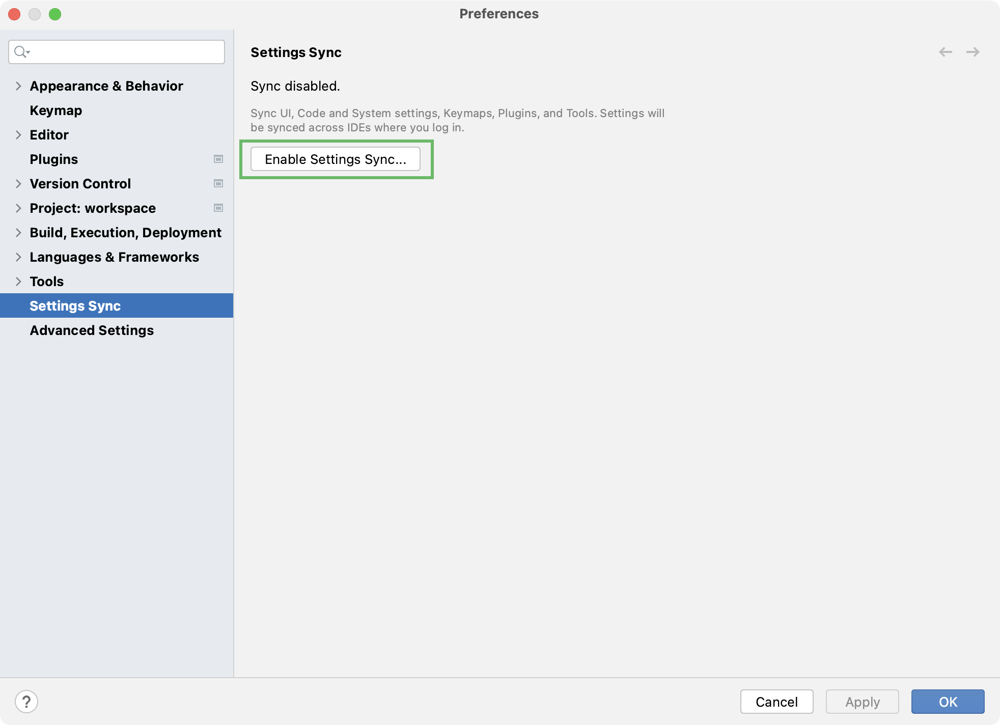
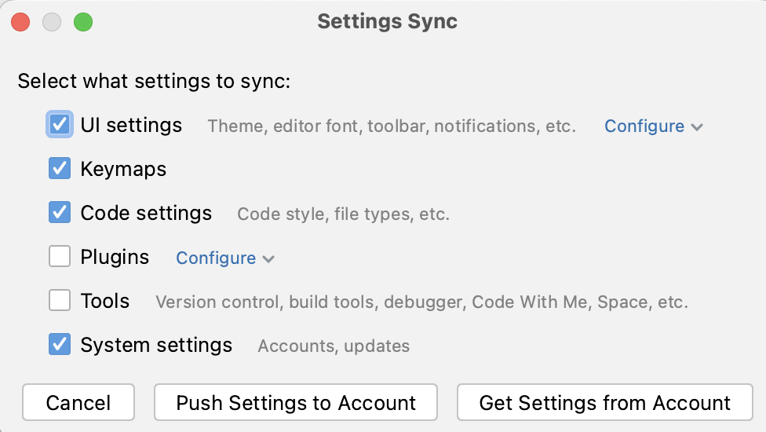
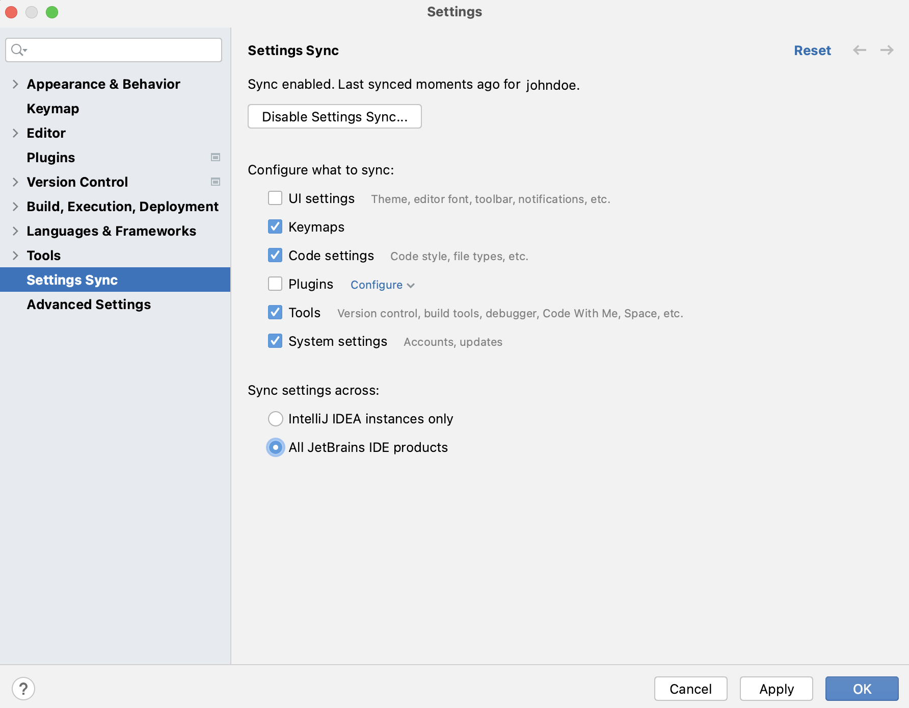
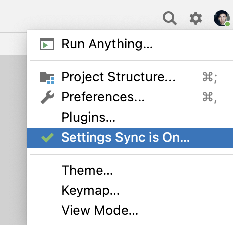

+++
title = "分享IDE设置"
weight = 50
date = 2023-06-17T19:06:58+08:00
description = ""
isCJKLanguage = true
draft = false
+++
# Share IDE settings - 分享IDE设置

https://www.jetbrains.com/help/go/sharing-your-ide-settings.html#faq

Last modified: 25 April 2023

GoLand lets you share your IDE settings between different instances of the product, or among your team members. This helps you recreate a comfy working environment if you are working from different computers and spare the annoyance of things looking or behaving differently from what you are used to, or enforce the same standards throughout your team.

GoLand允许您在产品的不同实例之间或团队成员之间共享IDE设置。这可以帮助您在使用不同计算机工作时重新创建舒适的工作环境，并避免出现外观或行为与您习惯不同的问题，或者在整个团队中强制执行相同的标准。

> For information on how to share settings related to specific projects, see [Share project settings through VCS](https://www.jetbrains.com/help/go/creating-and-managing-projects.html#share-project-through-vcs).
>
> 有关如何通过版本控制系统共享与特定项目相关的设置的信息，请参见[通过VCS共享项目设置](https://www.jetbrains.com/help/go/creating-and-managing-projects.html#share-project-through-vcs)。

You can share your IDE settings by using one of the following:

您可以使用以下方法之一来共享您的IDE设置：

- [Settings Sync](https://www.jetbrains.com/help/go/sharing-your-ide-settings.html#IDE_settings_sync): it utilizes the JetBrains server, so no additional configuration is required. Synced settings are linked to your [JetBrains Account](https://sales.jetbrains.com/hc/en-gb/articles/208459005-What-is-JetBrains-Account-) and are available in all IDEs where you log in using this account.

- [Settings Sync（设置同步）](https://www.jetbrains.com/help/go/sharing-your-ide-settings.html#IDE_settings_sync)：它利用JetBrains服务器，因此不需要额外的配置。同步的设置与您的[JetBrains帐户](https://sales.jetbrains.com/hc/en-gb/articles/208459005-What-is-JetBrains-Account-)相关联，并在使用此帐户登录的所有IDE中可用。

  The settings you can sync include: IDE themes, keymaps, color schemes, system settings, UI settings, menus and toolbar settings, project view settings, editor settings, code completion settings, parameter name hints, live templates, code styles, and the list of enabled and disabled plugins.

  您可以同步的设置包括：IDE主题、按键映射、颜色方案、系统设置、UI设置、菜单和工具栏设置、项目视图设置、编辑器设置、代码完成设置、参数名称提示、代码模板、代码样式以及已启用和已禁用的插件列表。

- Settings Repository: it allows you to sync any configurable components (except for the list of enabled and disabled plugins) but requires setting up a Git repository with the settings you want to share.

- 设置存储库：它允许您同步任何可配置组件（除了已启用和已禁用的插件列表），但需要设置一个带有要共享的设置的Git存储库。

  This option is useful if you want to implement the same settings among your team-members or to use you use your custom settings storage.

  如果您想在团队成员之间实现相同的设置，或者使用自定义的设置存储，这个选项很有用。

  > 
  >
  > Starting from version 2022.3, the Settings Repository plugin is not bundled with GoLand. It is still available for installation in JetBrains Marketplace. For information on how to set up Settings Repository, refer to [version 2022.2 of GoLand documentation](https://www.jetbrains.com/help/go/2022.2/sharing-your-ide-settings.html#settings-repository).
  >
  > 从2022.3版本开始，Settings Repository（设置存储库）插件不再与GoLand捆绑在一起。它仍然可以在JetBrains Marketplace中安装。有关如何设置Settings Repository的信息，请参阅[GoLand 2022.2文档](https://www.jetbrains.com/help/go/2022.2/sharing-your-ide-settings.html#settings-repository)。

- [Exporting](https://www.jetbrains.com/help/go/sharing-your-ide-settings.html#import-export-settings) the settings you want to share as a ZIP archive and then importing them to a different IDE installation. You can export your code style settings, Git settings, including registered GitHub accounts, the Debugger settings, Registry keys, look and feel, and more.

- [导出](https://www.jetbrains.com/help/go/sharing-your-ide-settings.html#import-export-settings)要共享的设置为ZIP存档，然后将其导入到不同的IDE安装中。您可以导出代码样式设置、Git设置（包括注册的GitHub帐户）、调试器设置、注册表键、外观等。

## 通过Settings Sync共享设置 Share settings through Settings Sync

The IDE Settings Sync plugin was deprecated in GoLand 2022.3. Instead, a new plugin, Settings Sync, is available and bundled in GoLand 2022.3. The most notable changes include:

GoLand 2022.3中已弃用IDE Settings Sync插件。相反，一个名为Settings Sync的新插件可用，并且已捆绑在GoLand 2022.3中。最显着的变化包括：

- The new plugin supports synchronization across all JetBrains IDEs.
- Settings Sync synchronizes the settings of plugins, including those of third-party plugins (plugin developers should [enable it](https://plugins.jetbrains.com/docs/intellij/persisting-state-of-components.html#settings-sync-plugin) if they want the settings of their plugin to be synchronized by Settings Sync).
- 新插件支持所有JetBrains IDE的同步。
- Settings Sync同步插件的设置，包括第三方插件的设置（如果插件开发者希望其插件的设置被Settings Sync同步，则需要[启用它](https://plugins.jetbrains.com/docs/intellij/persisting-state-of-components.html#settings-sync-plugin)）。

> If you have enabled Settings Repository, you cannot share your settings through [Settings Sync](https://www.jetbrains.com/help/go/sharing-your-ide-settings.html#IDE_settings_sync).
>
> 如果您已启用Settings Repository，则无法通过[Settings Sync](https://www.jetbrains.com/help/go/sharing-your-ide-settings.html#IDE_settings_sync)共享您的设置。

### 在IDE实例之间同步设置 Sync settings between IDE instances

1. On the computer with the IDE instance containing the settings you want to share, sign in to either of the following:

2. 在包含要共享设置的IDE实例的计算机上，登录以下任一选项：

   - Your IDE: from the main menu choose Help | Register, choose to activate your license with the [JetBrains Account](https://sales.jetbrains.com/hc/en-gb/articles/208459005-What-is-JetBrains-Account-) and enter your credentials.
   - 您的IDE：从主菜单选择Help | Register，选择使用[JetBrains帐户](https://sales.jetbrains.com/hc/en-gb/articles/208459005-What-is-JetBrains-Account-)激活您的许可证，并输入您的凭据。
   - [Toolbox App](https://www.jetbrains.com/toolbox/app/): click the gear icon [Toolbox App](https://www.jetbrains.com/toolbox/app/)：单击应用程序右上角的齿轮图标 in the top right corner of the application, select Settings and click Log in. Note that by signing in to Toolbox App, you automatically sign in to all JetBrains products that you run.，选择Settings，然后点击Log in。请注意，通过登录到Toolbox App，您自动登录到所有运行的JetBrains产品。
   - If, instead of the JetBrains account, you use an activation code or a license server [to activate your GoLand](https://www.jetbrains.com/help/go/register.html#activate-license), press Ctrl+Alt+S to open the IDE settings and select Settings Sync | Log in with JetBrains account to sign in to your JetBrains account.
   - 如果您使用激活码或许可证服务器[激活GoLand](https://www.jetbrains.com/help/go/register.html#activate-license)，而不是JetBrains帐户，请按Ctrl+Alt+S打开IDE设置，然后选择Settings Sync | Log in with JetBrains account以登录到您的JetBrains帐户。

3. Press Ctrl+Alt+S to open Settings, go to Settings Sync, and then click Enable Settings Sync.

4. 按Ctrl+Alt+S打开设置，转到Settings Sync，然后点击Enable Settings Sync。

   

   > You can also enable and disable Settings Sync or access its settings by right-clicking the gear icon 您还可以通过右键单击GoLand窗口右上角的齿轮图标 in the upper-right corner of the GoLand window.来启用或禁用Settings Sync，或访问其设置。

5. In the Settings Sync window that opens, select the setting categories that you want to share.

6. 在打开的Settings Sync窗口中，选择要共享的设置类别。

   > You can exclude some settings from synchronization by clicking Configure next to the settings. For example, you can exclude specific plugins if you do not want to sync them. Or you may want to keep local fonts for the editor instead of synchronizing them if your IDEs are installed on different operating systems where some fonts can be missing.
   >
   > 您可以通过单击设置旁边的Configure来排除某些设置的同步。例如，如果您不希望同步特定插件，可以排除它们。或者，如果您的IDE安装在不同操作系统上，某些字体可能会丢失，您可能希望保留本地字体以供编辑器使用，而不进行同步。

7. The following step depends on whether there are synced settings linked to your [JetBrains Account](https://sales.jetbrains.com/hc/en-gb/articles/208459005-What-is-JetBrains-Account-).

8. 下一步取决于是否有与您的[JetBrains帐户](https://sales.jetbrains.com/hc/en-gb/articles/208459005-What-is-JetBrains-Account-)关联的同步设置。

   Synced settings available

   No synced settings

   

   

   

   Click Push Settings to Account to override the settings stored on the JetBrains server with your local settings and use them as the shared ones.

   点击Push Settings to Account以使用本地设置覆盖JetBrains服务器上存储的设置，并将其用作共享设置。

9. In a different IDE instance where you want these settings to be applied, click the gear button 在要应用这些设置的另一个IDE实例中，单击齿轮按钮 and select Settings Sync is Off. On the Settings Sync page that opens, click Enable Settings Sync.，然后选择Settings Sync is Off。在打开的Settings Sync页面上，点击Enable Settings Sync。

10. In the Settings Sync window that opens, select Get Settings from Account.

11. 在打开的Settings Sync窗口中，选择Get Settings from Account。

Your local settings will be automatically synchronized with the settings stored on the JetBrains server each time you modify a setting and each time the JetBrains server receives setting updates from another IDE.

每次修改设置或JetBrains服务器从另一个IDE接收设置更新时，您的本地设置将自动与JetBrains服务器上存储的设置同步。

### 在不同的IDE产品之间启用设置同步 Enable settings synchronization across different IDE products

By default, your settings are synchronized across instances of the same IDE product only, for example, across your GoLand instances. You can enable synchronization of settings across any IntelliJ-based IDE products where the Settings Sync plugin is enabled and where you log in using the same JetBrains account.

默认情况下，您的设置仅在相同IDE产品的实例之间同步，例如，在您的GoLand实例之间同步。您可以启用跨任何启用了Settings Sync插件并使用相同JetBrains帐户登录的基于IntelliJ的IDE产品的设置同步。

1. Open the Settings dialog (Ctrl+Alt+S) and go to Settings Sync.

2. 打开设置对话框（Ctrl+Alt+S），然后转到Settings Sync。

3. In the Sync settings across list select All JetBrains IDE products.

4. 在Sync settings across列表中选择All JetBrains IDE products。

   

### 禁用设置同步 Disable settings synchronization

You can either disable settings synchronization for a single IDE or completely remove all settings from the JetBrains cloud server and disable synchronization for all IDEs connected to your JetBrains account.

您可以为单个IDE禁用设置同步，或完全从JetBrains云服务器中删除所有设置，并禁用与您的JetBrains帐户连接的所有IDE的同步。

1. In the upper-right corner of the GoLand window, click the gear icon 在GoLand窗口右上角点击齿轮图标 and select Settings Sync is On.，然后选择Settings Sync is On。

   

2. On the Settings Sync page that opens, click Disable Settings Sync.

3. 在打开的Settings Sync页面上，点击Disable Settings Sync。

4. Confirm disabling settings synchronization. To disable synchronization on all of your IDEs, select Remove data from JB account and disable for all IDEs.

5. 确认禁用设置同步。要在所有IDE上禁用同步，选择Remove data from JB account and disable for all IDEs。

## 导出您的设置 Export your settings

### 将设置导出为ZIP存档 Export settings to a ZIP archive

1. Call File | Manage IDE Settings | Export Settings from the main menu.
2. 从主菜单中选择File | Manage IDE Settings | Export Settings。
3. Select the settings you want to export and specify the path to the target archive.
4. 选择要导出的设置，并指定目标存档的路径。

### 从ZIP存档中导入设置 Import settings from a ZIP archive

1. Call File | Manage IDE Settings | Import Settings from the main menu.
2. 从主菜单中选择File | Manage IDE Settings | Import Settings。
3. Select the ZIP archive that contains your settings in the dialog that opens.
4. 在打开的对话框中选择包含设置的ZIP存档。
5. Select the settings you want to apply in the Select Components to Import dialog that opens and click OK.
6. 在打开的Select Components to Import对话框中选择要应用的设置，然后点击OK。

## 常见问题 Frequently Asked Questions

This section attempts to answer questions that you may have while using setting synchronization after the upgrade from GoLand 2022.2 (or earlier) to GoLand 2022.3.

本节试图回答在从GoLand 2022.2（或更早版本）升级到GoLand 2022.3后使用设置同步时可能遇到的问题。

