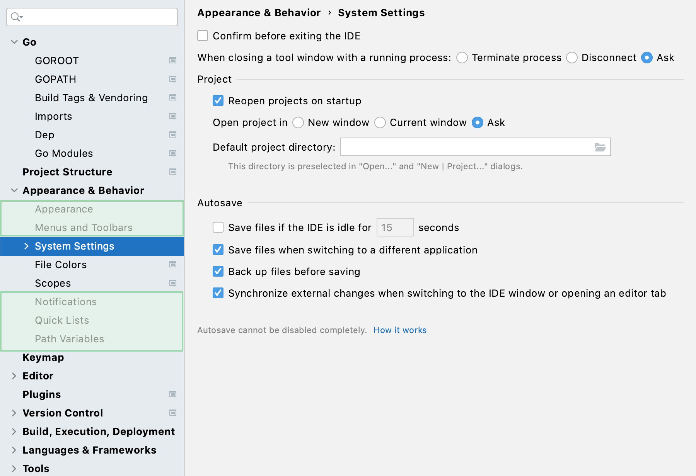

+++
title = "IDE配置"
weight = 20
date = 2023-06-17T19:06:58+08:00
description = ""
isCJKLanguage = true
draft = false
+++

# IDE configuration - IDE配置

https://www.jetbrains.com/help/go/configuring-project-and-ide-settings.html

Last modified: 17 January 2023

最后修改日期：2023年1月17日

In GoLand, you can configure the settings on two levels: the [project](https://www.jetbrains.com/help/go/configure-project-settings.html) level and globally.

在GoLand中，您可以在两个级别上配置设置：[项目](https://www.jetbrains.com/help/go/configure-project-settings.html)级别和全局级别。

Global settings apply to all projects that you open with a specific installation or version of GoLand. Such settings include IDE appearance (themes, color schemes, menus and toolbars), notification settings, the set of the installed and enabled plugins, debugger settings, code completion, and so on.

全局设置适用于使用特定安装或GoLand版本打开的所有项目。此类设置包括IDE外观（主题、颜色方案、菜单和工具栏）、通知设置、已安装和已启用插件集、调试器设置、代码完成等等。

To configure your IDE, select GoLand | Settings for macOS or File | Settings for Windows and Linux. Alternatively, press Ctrl+Alt+S or click 要配置您的IDE，请选择GoLand | macOS下的Settings或Windows和Linux下的File | Settings。或者，按Ctrl+Alt+S或单击工具栏上的 on the toolbar.

在设置对话框中未标记为 Settings that are NOT marked with the  icon in the Settings dialog are global and apply to all existing projects of the current GoLand version.图标的设置是全局设置，适用于当前GoLand版本的所有现有项目。

## 恢复IDE设置 Restore IDE settings

When you restore the default IDE settings, GoLand backs up your configuration to another directory. You can always restore your settings from that backup.

当您恢复默认IDE设置时，GoLand会将您的配置备份到另一个目录。您始终可以从该备份中恢复您的设置。

### 备份您的设置并恢复默认设置 Back up your settings and restore the defaults

1. From the main menu, select File | Manage IDE Settings | Restore Default Settings.

2. 从主菜单中选择File | Manage IDE Settings | Restore Default Settings。

   Alternatively, press Shift twice and type `Restore default settings`.

   或者，按两次Shift键并键入"Restore default settings"。

3. Click Restore and Restart. The IDE will be restarted with the default configuration.

4. 点击Restore and Restart。IDE将以默认配置重新启动。

   

When GoLand restores the default IDE settings, it creates a backup directory with your configuration in:

​	当GoLand恢复默认IDE设置时，它会在以下目录中创建一个备份目录，其中包含您的配置：





Syntax

**%APPDATA%\JetBrains\<product><version>-backup**

Example

**C:\Users\JohnS\AppData\Roaming\JetBrains\GoLand2023.1-backup**





Syntax

**~/Library/Application Support/JetBrains/<product><version>-backup**

Example

**~/Library/Application Support/JetBrains/GoLand2023.1-backup**





Syntax

**~/.config/JetBrains/<product><version>-backup**

Example

**~/.config/JetBrains/GoLand2023.1-backup**





### 从备份应用IDE设置 Apply the IDE settings from a backup

1. From the main menu, select File | Manage IDE Settings | Import Settings.

2. 从主菜单中选择File | Manage IDE Settings | Import Settings。

3. In the dialog that opens, specify the [path](https://www.jetbrains.com/help/go/configuring-project-and-ide-settings.html#backup-dir) to the backup directory and click Open.

4. 在打开的对话框中，指定备份目录的[路径](https://www.jetbrains.com/help/go/configuring-project-and-ide-settings.html#backup-dir)，然后点击Open。

   GoLand shows a confirmation popup. Note that after you apply the settings from the backup, these settings will be overwritten with your current IDE configuration.

   GoLand会显示一个确认弹出窗口。请注意，在应用来自备份的设置后，这些设置将被当前IDE配置覆盖。

   Apart from the backup configuration directory, you can select the configuration directory from another GoLand version or a **.zip** file with the previously [exported settings](https://www.jetbrains.com/help/go/sharing-your-ide-settings.html#import-export-settings).

   除了备份配置目录，您还可以选择来自另一个GoLand版本或以前[导出的设置](https://www.jetbrains.com/help/go/sharing-your-ide-settings.html#import-export-settings)的**.zip**文件的配置目录。

5. Click Restart to apply the settings from the backup and restart the IDE.

6. 点击Restart以应用来自备份的设置并重新启动IDE。