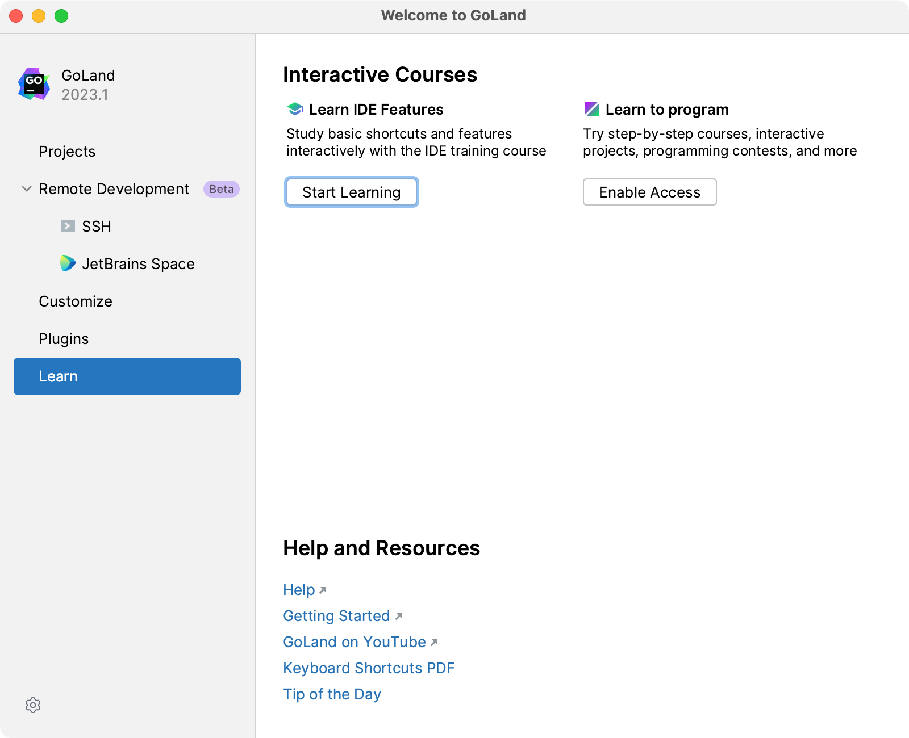
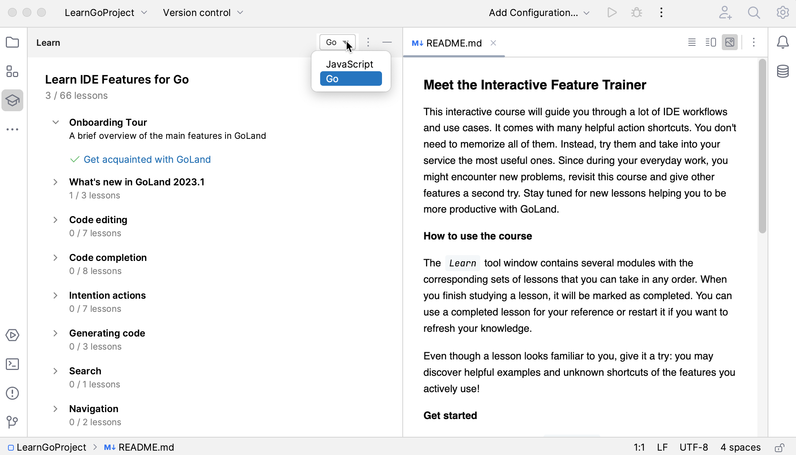
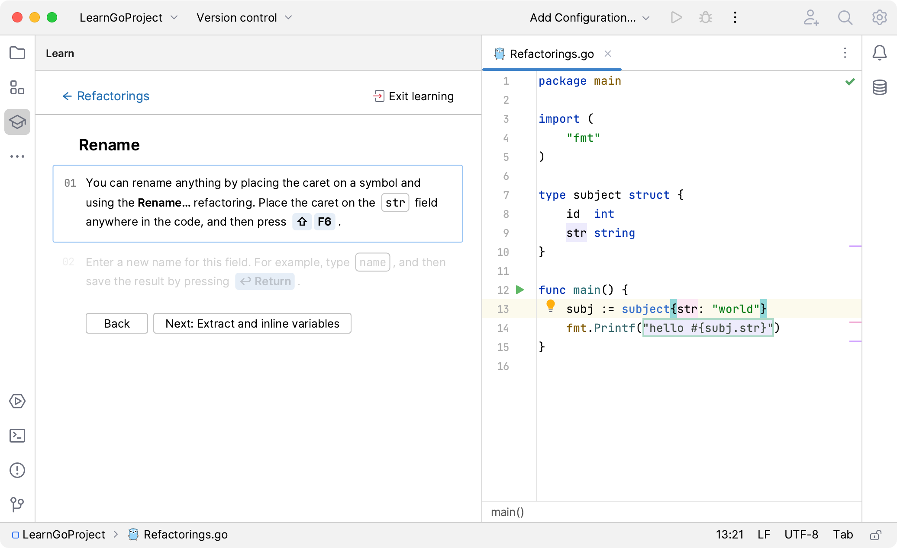

+++
title = "Features Trainer"
weight = 30
date = 2023-06-14T17:20:58+08:00
type = "docs"
description = ""
isCJKLanguage = true
draft = false
+++
# Features Trainer

https://www.jetbrains.com/help/go/feature-trainer.html

Last modified: 17 April 2023

Features Trainer works only in the [new UI](https://www.jetbrains.com/help/go/new-ui.html).

GoLand includes a built-in Features Trainer. This interactive training course on IDE basics can help you learn how to do some common tasks, such as refactoring code, navigating through projects, and more.

The course is divided into several tutorials, each with a number of lessons that teach you how to do a specific task. You can start the course or a specific tutorial [from the Welcome screen](https://www.jetbrains.com/help/go/feature-trainer.html#start-a-lesson-from-the-welcome-screen) or [from the Learn tool window](https://www.jetbrains.com/help/go/feature-trainer.html#start-a-lesson-from-the-learn-tool-window).

To complete a lesson, you need to finish all the tasks in it. However, there is no need to go through all the lessons and tutorials – you can choose to do only the ones you find most relevant, see [Start the learning course](https://www.jetbrains.com/help/go/feature-trainer.html#start-a-lesson-from-the-welcome-screen) and [Switch between lessons and tutorials](https://www.jetbrains.com/help/go/feature-trainer.html#switching_between_lessons_and_tutorials).

### Before you start

- Make sure the IDE Features Trainer bundled plugin is enabled in the Installed tab of the Settings | Plugins page as described in [Plugins](https://www.jetbrains.com/help/go/managing-plugins.html).
- Make sure that you are using the [new UI](https://www.jetbrains.com/help/go/new-ui.html).

### Start the learning course

1. On the Welcome screen, click Learn in the left-hand pane.

2. In the right-hand pane, click Start Learning under Learn IDE Features.

   

   GoLand generates a learning project and opens the context that corresponds to the first lesson of the selected tutorial.

   

### Start a tutorial from the Learn tool window

1. Open the Learn tool window - select View | Tool Windows | Learn or Help | Learn IDE Features from the main menu. The tool window lists the available tutorials.
2. Click the tutorial you want to complete, and then click Open in the Open a Learning Project dialog.
3. In the Open Project dialog, select whether to open the tutorial in a new GoLand window or in the same, click This Window.

### Switch between lessons and tutorials

You can choose to do only those tutorials and lessons that you find most relevant and easily skip lessons, switch between tutorials, and drop them.

- To pass to the next lesson, open the Learn tool window, scroll to the bottom of it, and click Next: <The name of the next lesson> or click another lesson link.

  

- To switch to another tutorial without losing the progress for the current one, click the link with its name at the top of the Learn tool window.

  Then click the tutorial you are interested in and select the lesson you want to complete.

- To abandon a tutorial without saving the progress in it, open the Settings dialog (Ctrl+Alt+S), go to Tools | Features Trainer, and click Reset lessons progress.

  When you click OK, you return to the Learn tool window that shows a list of all the available tutorials instead of the information about the tutorial you canceled.

### Reset your progress

If you would like to start learning from the beginning, you can reset your progress:

1. Press Ctrl+Alt+S to open the IDE settings and select Tools | Features Trainer.
2. Click Restart Lessons Progress, apply the changes, and close the dialog.

### Configure Features Trainer options

1. Press Ctrl+Alt+S to open the IDE settings and select Tools | Features Trainer.

2. From the Learning main programming language list, select the default programming language for the lessons.

   You can always select another language right in your [learning project](https://www.jetbrains.com/help/go/feature-trainer.html#learning-project-created).

3. Select the Show notifications on new lessons option to get notified when a new lesson becomes available.